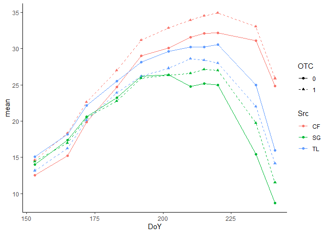
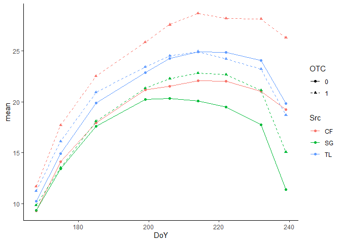
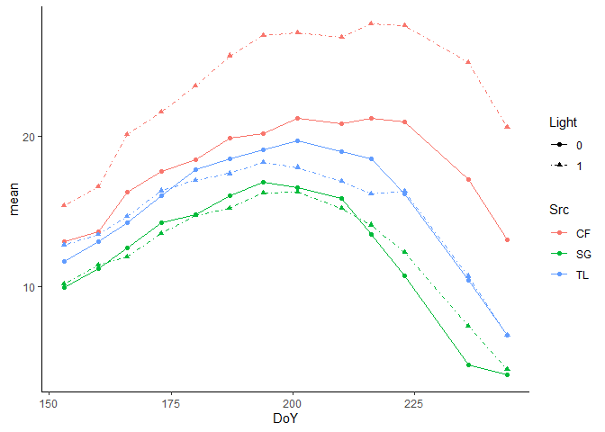
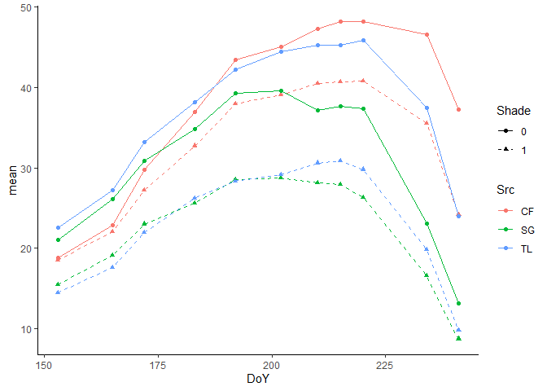
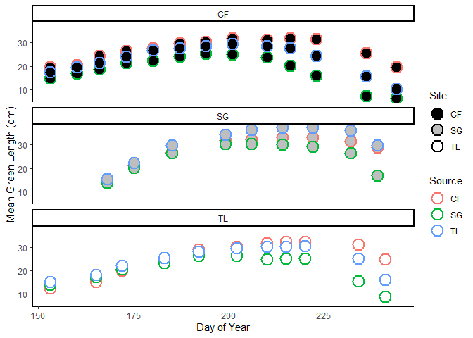

Total Green Length Graphs
================
Bjorn Larson
2022-10-07

Reading in data

``` r
green_data <- read.csv("Total Green Length.csv")%>%
  mutate(across(1:9, as.factor))
```

Graph of Toolik OTC Effect

``` r
TL_OTC_test <- green_data%>%
  filter(Loc == "TL")%>%
  filter(Shade == 0)%>%
  group_by(Src, DoY, OTC)%>%
  summarise(mean = mean(tot_Gr)/3)%>%
  mutate(OTC = as.factor(OTC))%>%
  filter(DoY != 207)%>%
  filter(DoY != 229)
ggplot(TL_OTC_test, aes(x = DoY, y = mean, color = Src, shape = OTC, linetype = OTC))+
  geom_point() + geom_line()+
  scale_linetype_manual(values = c("solid", "dashed"))+
  scale_shape_manual(values = c("circle", "triangle"))+
  theme_classic()
```

<!-- -->

Graph of Sagwon OTC Effect

``` r
TL_OTC_test <- green_data%>%
  filter(Loc == "SG")%>%
  filter(Shade == 0)%>%
  group_by(Src, DoY, OTC)%>%
  summarise(mean = mean(tot_Gr)/3)%>%
  mutate(OTC = as.factor(OTC))%>%
  filter(DoY != 207)%>%
  filter(DoY != 229)
ggplot(TL_OTC_test, aes(x = DoY, y = mean, color = Src, shape = OTC, linetype = OTC))+
  geom_point() + geom_line()+
  scale_linetype_manual(values = c("solid", "dashed"))+
  scale_shape_manual(values = c("circle", "triangle"))+
  theme_classic()
```

<!-- -->

Graph of Coldfoot Light Effect

``` r
CF_Lights_test <- green_data%>%
  filter(Loc == "CF")%>%
  group_by(Src, DoY, Light)%>%
  summarise(mean = mean(tot_Gr)/3)
ggplot(CF_Lights_test, aes(x = DoY, y = mean, color = Src, shape = Light, linetype = Light))+
  geom_point() + geom_line()+
  scale_linetype_manual(values = c("solid", "dotdash"))+
  scale_shape_manual(values = c("circle", "triangle"))+
  theme_classic()
```

<!-- -->

Graph of Toolik Shade Effect

``` r
TL_Shades_test <- green_data%>%
  filter(Loc == "TL")%>%
  filter(OTC == 0)%>%
  group_by(Src, DoY, Shade)%>%
  summarise(mean = mean(tot_Gr)/2)%>%
  filter(DoY != 207, DoY != 229)
ggplot(TL_Shades_test, aes(x = DoY, y = mean, color = Src, shape = Shade, linetype = Shade))+
  geom_point() + geom_line()+
  scale_linetype_manual(values = c("solid", "dashed"))+
  scale_shape_manual(values = c("circle", "triangle"))+
  theme_classic()
```

<!-- -->

Graph of controls from all three sites

``` r
to_graph <- green_data%>%
  filter(Shade == 0, Light == 0, OTC == 0)%>%
  group_by(Loc, Src, DoY, Shade)%>%
  summarise(mean = ifelse(Loc == "TL", mean(tot_Gr)/3, mean(tot_Gr)/2))%>%
  filter(DoY != 207, DoY != 229)

ggplot(to_graph, aes(x = DoY, y = mean, color = Src, fill = Loc))+
  geom_point(shape = 21, size = 5, stroke = 1.3)+
  scale_fill_manual(values = c("black", "grey", "white"), name = "Site")+
  scale_color_discrete( name = "Source")+
  theme_classic()+
  labs(x = "Day of Year", y = "Mean Green Length (cm)")+
  facet_wrap(~Loc, ncol = 1)
```

<!-- -->
