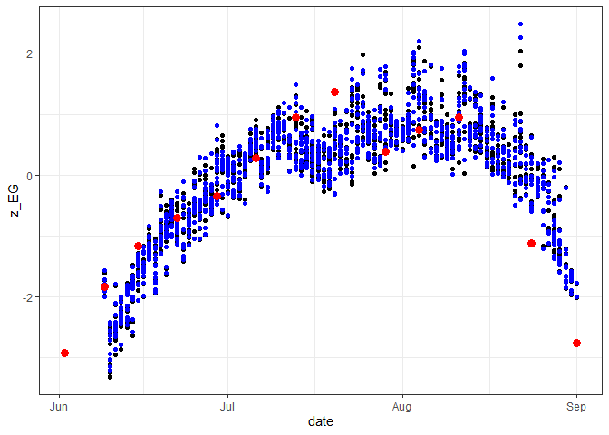
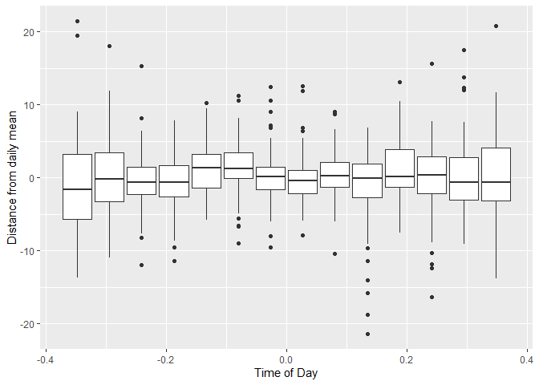

```r
library(tidyverse)
```

```
## ── Attaching packages ─────────────────────────────────────── tidyverse 1.3.2 ──
## ✔ ggplot2 3.3.6      ✔ purrr   0.3.5 
## ✔ tibble  3.1.8      ✔ dplyr   1.0.10
## ✔ tidyr   1.2.1      ✔ stringr 1.4.1 
## ✔ readr   2.1.3      ✔ forcats 0.5.2 
## ── Conflicts ────────────────────────────────────────── tidyverse_conflicts() ──
## ✖ dplyr::filter() masks stats::filter()
## ✖ dplyr::lag()    masks stats::lag()
```

```r
library(lubridate)
```

```
## 
## Attaching package: 'lubridate'
## 
## The following objects are masked from 'package:base':
## 
##     date, intersect, setdiff, union
```

```r
library(plotly)
```

```
## 
## Attaching package: 'plotly'
## 
## The following object is masked from 'package:ggplot2':
## 
##     last_plot
## 
## The following object is masked from 'package:stats':
## 
##     filter
## 
## The following object is masked from 'package:graphics':
## 
##     layout
```

```r
library(hms)
```

```
## 
## Attaching package: 'hms'
## 
## The following object is masked from 'package:lubridate':
## 
##     hms
```


```r
d <- read.csv("E:/Phenocam_Analysis/CF_CF_9-dates.csv")%>%
  select(1,2,6,8)%>%
  mutate(datetime = ymd_hms(substr(img, 1, 19)),
         date = date(datetime),
         time = parse_hms(str_replace_all(substr(img, 12, 19), " ", ":")))%>%
  select('datetime', 'date', 'time', 'idx_label', 'RGB.2G_RBi', "RGB.pctG")
```


```r
d_rem<- read.csv("C:/Users/ecotypes/Downloads/takeout.csv")
d1 = d%>%
  filter(!idx_label %in% d_rem$Index)
```


```r
d2<-d1%>%
  group_by(date)%>%
  summarize(median = median(RGB.2G_RBi))
d3 <- d1 %>%
  right_join(d2, d1, by = 'date')%>%
  mutate(resid = RGB.2G_RBi - median)
```


```r
d4 = d3%>%
  filter(resid < 10)%>%
  filter(resid > -10)
#  filter(time > hms(00,00,07))
```


```r
plot_ly(d3, x = ~datetime, y = ~(RGB.2G_RBi-mean(RGB.2G_RBi, na.rm = TRUE)), hoverinfo = "text", hovertext = paste("Date: ", d3$datetime, "<br>2G_RBi: ", d3$RGB.2G_RBi, "<br>Index: ", d3$idx_label), type = "scatter", mode = "lines+markers")%>%
  layout(xaxis=list(title = "Date"), yaxis = list(title = "2G_RBi"))
```

```{=html}
<div id="htmlwidget-43e1991c6f694455fa0b" style="width:672px;height:480px;" class="plotly html-widget"></div>
<script type="application/json" data-for="htmlwidget-43e1991c6f694455fa0b">{"x":{"visdat":{"48e03555a7e":["function () ","plotlyVisDat"]},"cur_data":"48e03555a7e","attrs":{"48e03555a7e":{"x":{},"y":{},"hoverinfo":"text","hovertext":["Date:  2022-06-09 14:58:49 <br>2G_RBi:  5.989094 <br>Index:  1","Date:  2022-06-09 15:58:48 <br>2G_RBi:  6.06614 <br>Index:  2","Date:  2022-06-09 16:58:49 <br>2G_RBi:  8.657116 <br>Index:  3","Date:  2022-06-09 17:58:48 <br>2G_RBi:  9.840684 <br>Index:  4","Date:  2022-06-09 18:58:48 <br>2G_RBi:  11.596238 <br>Index:  5","Date:  2022-06-10 05:00:00 <br>2G_RBi:  -2.978363 <br>Index:  6","Date:  2022-06-10 06:00:01 <br>2G_RBi:  -0.569327 <br>Index:  7","Date:  2022-06-10 07:00:00 <br>2G_RBi:  -1.247339 <br>Index:  8","Date:  2022-06-10 08:00:00 <br>2G_RBi:  -2.842011 <br>Index:  9","Date:  2022-06-10 09:00:01 <br>2G_RBi:  -4.074861 <br>Index:  10","Date:  2022-06-10 10:00:00 <br>2G_RBi:  -5.209913 <br>Index:  11","Date:  2022-06-10 11:00:00 <br>2G_RBi:  -5.134442 <br>Index:  12","Date:  2022-06-10 12:00:00 <br>2G_RBi:  -10.015348 <br>Index:  13","Date:  2022-06-10 13:00:00 <br>2G_RBi:  -10.318753 <br>Index:  14","Date:  2022-06-10 14:00:01 <br>2G_RBi:  -11.927877 <br>Index:  15","Date:  2022-06-10 15:00:00 <br>2G_RBi:  -12.971612 <br>Index:  16","Date:  2022-06-10 16:00:00 <br>2G_RBi:  -8.761919 <br>Index:  17","Date:  2022-06-10 17:00:00 <br>2G_RBi:  -12.777048 <br>Index:  18","Date:  2022-06-10 18:00:00 <br>2G_RBi:  -12.798939 <br>Index:  19","Date:  2022-06-11 05:00:01 <br>2G_RBi:  -3.953832 <br>Index:  20","Date:  2022-06-11 06:00:00 <br>2G_RBi:  4.405058 <br>Index:  21","Date:  2022-06-11 07:00:00 <br>2G_RBi:  -7.745538 <br>Index:  22","Date:  2022-06-11 08:00:01 <br>2G_RBi:  -1.693169 <br>Index:  23","Date:  2022-06-11 09:00:00 <br>2G_RBi:  1.339772 <br>Index:  24","Date:  2022-06-11 10:00:00 <br>2G_RBi:  -1.60242 <br>Index:  25","Date:  2022-06-11 11:00:00 <br>2G_RBi:  -0.63887 <br>Index:  26","Date:  2022-06-11 12:00:00 <br>2G_RBi:  -1.369559 <br>Index:  27","Date:  2022-06-11 13:00:01 <br>2G_RBi:  4.0092 <br>Index:  28","Date:  2022-06-11 14:00:00 <br>2G_RBi:  -2.724394 <br>Index:  29","Date:  2022-06-11 15:00:00 <br>2G_RBi:  -1.345759 <br>Index:  30","Date:  2022-06-11 16:00:01 <br>2G_RBi:  -2.244257 <br>Index:  31","Date:  2022-06-11 17:00:00 <br>2G_RBi:  -4.261778 <br>Index:  32","Date:  2022-06-11 18:00:01 <br>2G_RBi:  8.542616 <br>Index:  33","Date:  2022-06-12 05:00:00 <br>2G_RBi:  -6.3813 <br>Index:  34","Date:  2022-06-12 06:00:00 <br>2G_RBi:  -1.011025 <br>Index:  35","Date:  2022-06-12 07:00:01 <br>2G_RBi:  0.228042 <br>Index:  36","Date:  2022-06-12 08:00:00 <br>2G_RBi:  0.247078 <br>Index:  37","Date:  2022-06-12 09:00:00 <br>2G_RBi:  -0.665621 <br>Index:  38","Date:  2022-06-12 10:00:01 <br>2G_RBi:  0.955584 <br>Index:  39","Date:  2022-06-12 11:00:00 <br>2G_RBi:  2.837327 <br>Index:  40","Date:  2022-06-12 12:00:00 <br>2G_RBi:  -0.088017 <br>Index:  41","Date:  2022-06-12 13:00:00 <br>2G_RBi:  1.956616 <br>Index:  42","Date:  2022-06-12 14:00:00 <br>2G_RBi:  3.172099 <br>Index:  43","Date:  2022-06-12 15:00:01 <br>2G_RBi:  5.89461 <br>Index:  44","Date:  2022-06-12 16:00:00 <br>2G_RBi:  5.309508 <br>Index:  45","Date:  2022-06-12 17:00:00 <br>2G_RBi:  4.351086 <br>Index:  46","Date:  2022-06-12 18:00:01 <br>2G_RBi:  0.843885 <br>Index:  47","Date:  2022-06-13 05:00:00 <br>2G_RBi:  -1.429084 <br>Index:  48","Date:  2022-06-13 06:00:00 <br>2G_RBi:  -0.120477 <br>Index:  49","Date:  2022-06-13 07:00:00 <br>2G_RBi:  0.6418 <br>Index:  50","Date:  2022-06-13 08:00:00 <br>2G_RBi:  7.369879 <br>Index:  51","Date:  2022-06-13 09:00:01 <br>2G_RBi:  9.106841 <br>Index:  52","Date:  2022-06-13 10:00:00 <br>2G_RBi:  7.936459 <br>Index:  53","Date:  2022-06-13 11:00:00 <br>2G_RBi:  6.700641 <br>Index:  54","Date:  2022-06-13 12:00:01 <br>2G_RBi:  2.589745 <br>Index:  55","Date:  2022-06-13 13:00:00 <br>2G_RBi:  3.520328 <br>Index:  56","Date:  2022-06-13 14:00:00 <br>2G_RBi:  7.845394 <br>Index:  57","Date:  2022-06-13 15:00:00 <br>2G_RBi:  6.26464 <br>Index:  58","Date:  2022-06-13 16:00:00 <br>2G_RBi:  8.421326 <br>Index:  59","Date:  2022-06-13 17:00:01 <br>2G_RBi:  0.230464 <br>Index:  60","Date:  2022-06-13 18:00:00 <br>2G_RBi:  0.279392 <br>Index:  61","Date:  2022-06-14 05:00:00 <br>2G_RBi:  -3.150388 <br>Index:  62","Date:  2022-06-14 06:00:01 <br>2G_RBi:  0.057256 <br>Index:  63","Date:  2022-06-14 07:00:00 <br>2G_RBi:  8.015711 <br>Index:  64","Date:  2022-06-14 08:00:00 <br>2G_RBi:  11.17834 <br>Index:  65","Date:  2022-06-14 09:00:01 <br>2G_RBi:  10.969268 <br>Index:  66","Date:  2022-06-14 10:00:00 <br>2G_RBi:  10.030033 <br>Index:  67","Date:  2022-06-14 11:00:01 <br>2G_RBi:  9.570351 <br>Index:  68","Date:  2022-06-14 12:00:00 <br>2G_RBi:  9.280811 <br>Index:  69","Date:  2022-06-14 13:00:00 <br>2G_RBi:  13.389083 <br>Index:  70","Date:  2022-06-14 14:00:01 <br>2G_RBi:  13.170645 <br>Index:  71","Date:  2022-06-14 15:00:00 <br>2G_RBi:  4.912885 <br>Index:  72","Date:  2022-06-14 16:00:00 <br>2G_RBi:  8.659314 <br>Index:  73","Date:  2022-06-14 17:00:00 <br>2G_RBi:  5.465429 <br>Index:  74","Date:  2022-06-14 18:00:00 <br>2G_RBi:  5.667023 <br>Index:  75","Date:  2022-06-15 05:00:00 <br>2G_RBi:  5.035623 <br>Index:  76","Date:  2022-06-15 06:00:07 <br>2G_RBi:  9.384949 <br>Index:  77","Date:  2022-06-15 07:00:07 <br>2G_RBi:  12.382766 <br>Index:  78","Date:  2022-06-15 08:00:08 <br>2G_RBi:  12.36081 <br>Index:  79","Date:  2022-06-15 09:00:07 <br>2G_RBi:  14.776139 <br>Index:  80","Date:  2022-06-15 10:00:07 <br>2G_RBi:  11.336621 <br>Index:  81","Date:  2022-06-15 10:19:15 <br>2G_RBi:  7.497827 <br>Index:  82","Date:  2022-06-15 11:19:15 <br>2G_RBi:  12.084799 <br>Index:  83","Date:  2022-06-15 12:19:14 <br>2G_RBi:  13.433575 <br>Index:  84","Date:  2022-06-15 13:19:14 <br>2G_RBi:  16.114245 <br>Index:  85","Date:  2022-06-15 14:19:15 <br>2G_RBi:  14.893647 <br>Index:  86","Date:  2022-06-15 15:19:14 <br>2G_RBi:  15.03822 <br>Index:  87","Date:  2022-06-15 16:19:14 <br>2G_RBi:  14.37054 <br>Index:  88","Date:  2022-06-15 17:19:14 <br>2G_RBi:  14.236795 <br>Index:  89","Date:  2022-06-15 18:19:14 <br>2G_RBi:  10.731311 <br>Index:  90","Date:  2022-06-16 05:00:01 <br>2G_RBi:  5.99155 <br>Index:  91","Date:  2022-06-16 06:00:00 <br>2G_RBi:  13.775105 <br>Index:  92","Date:  2022-06-16 07:00:00 <br>2G_RBi:  13.452128 <br>Index:  93","Date:  2022-06-16 08:00:01 <br>2G_RBi:  13.15567 <br>Index:  94","Date:  2022-06-16 09:00:00 <br>2G_RBi:  17.95562 <br>Index:  95","Date:  2022-06-16 10:00:01 <br>2G_RBi:  14.688968 <br>Index:  96","Date:  2022-06-16 11:00:00 <br>2G_RBi:  13.308431 <br>Index:  97","Date:  2022-06-16 12:00:00 <br>2G_RBi:  10.716245 <br>Index:  98","Date:  2022-06-16 13:00:01 <br>2G_RBi:  13.378076 <br>Index:  99","Date:  2022-06-16 14:00:00 <br>2G_RBi:  11.887771 <br>Index:  100","Date:  2022-06-16 15:00:00 <br>2G_RBi:  17.836404 <br>Index:  101","Date:  2022-06-16 16:00:00 <br>2G_RBi:  16.714732 <br>Index:  102","Date:  2022-06-16 17:00:00 <br>2G_RBi:  8.861946 <br>Index:  103","Date:  2022-06-16 18:00:01 <br>2G_RBi:  11.958648 <br>Index:  104","Date:  2022-06-17 05:00:00 <br>2G_RBi:  19.168593 <br>Index:  105","Date:  2022-06-17 06:00:00 <br>2G_RBi:  20.656379 <br>Index:  106","Date:  2022-06-17 07:00:01 <br>2G_RBi:  15.964107 <br>Index:  107","Date:  2022-06-17 08:00:00 <br>2G_RBi:  16.366585 <br>Index:  108","Date:  2022-06-17 09:00:00 <br>2G_RBi:  21.998008 <br>Index:  109","Date:  2022-06-17 10:00:01 <br>2G_RBi:  17.464267 <br>Index:  110","Date:  2022-06-17 11:00:00 <br>2G_RBi:  16.396688 <br>Index:  111","Date:  2022-06-17 12:00:01 <br>2G_RBi:  16.526925 <br>Index:  112","Date:  2022-06-17 13:00:00 <br>2G_RBi:  18.303676 <br>Index:  113","Date:  2022-06-17 14:00:00 <br>2G_RBi:  17.546778 <br>Index:  114","Date:  2022-06-17 15:00:01 <br>2G_RBi:  16.483543 <br>Index:  115","Date:  2022-06-17 16:00:00 <br>2G_RBi:  20.62932 <br>Index:  116","Date:  2022-06-17 17:00:01 <br>2G_RBi:  15.748654 <br>Index:  117","Date:  2022-06-17 18:00:00 <br>2G_RBi:  22.234125 <br>Index:  118","Date:  2022-06-18 05:00:00 <br>2G_RBi:  6.858983 <br>Index:  119","Date:  2022-06-18 06:00:00 <br>2G_RBi:  9.132543 <br>Index:  120","Date:  2022-06-18 07:00:00 <br>2G_RBi:  13.411226 <br>Index:  121","Date:  2022-06-18 08:00:00 <br>2G_RBi:  10.255171 <br>Index:  122","Date:  2022-06-18 09:00:01 <br>2G_RBi:  7.387717 <br>Index:  123","Date:  2022-06-18 10:00:00 <br>2G_RBi:  13.687529 <br>Index:  124","Date:  2022-06-18 11:00:00 <br>2G_RBi:  16.161851 <br>Index:  125","Date:  2022-06-18 12:00:01 <br>2G_RBi:  11.481963 <br>Index:  126","Date:  2022-06-18 13:00:00 <br>2G_RBi:  14.854927 <br>Index:  127","Date:  2022-06-18 14:00:01 <br>2G_RBi:  18.156836 <br>Index:  128","Date:  2022-06-18 15:00:00 <br>2G_RBi:  17.661411 <br>Index:  129","Date:  2022-06-18 16:00:00 <br>2G_RBi:  19.594324 <br>Index:  130","Date:  2022-06-18 17:00:01 <br>2G_RBi:  11.351075 <br>Index:  131","Date:  2022-06-18 18:00:00 <br>2G_RBi:  9.371399 <br>Index:  132","Date:  2022-06-19 05:00:00 <br>2G_RBi:  19.800937 <br>Index:  133","Date:  2022-06-19 06:00:01 <br>2G_RBi:  20.916394 <br>Index:  134","Date:  2022-06-19 07:00:00 <br>2G_RBi:  17.909116 <br>Index:  135","Date:  2022-06-19 08:00:00 <br>2G_RBi:  16.790041 <br>Index:  136","Date:  2022-06-19 09:00:01 <br>2G_RBi:  24.150258 <br>Index:  137","Date:  2022-06-19 10:00:00 <br>2G_RBi:  21.035804 <br>Index:  138","Date:  2022-06-19 11:00:00 <br>2G_RBi:  18.580113 <br>Index:  139","Date:  2022-06-19 12:00:00 <br>2G_RBi:  18.878662 <br>Index:  140","Date:  2022-06-19 13:00:00 <br>2G_RBi:  22.206046 <br>Index:  141","Date:  2022-06-19 14:00:01 <br>2G_RBi:  22.776588 <br>Index:  142","Date:  2022-06-19 15:00:00 <br>2G_RBi:  23.640948 <br>Index:  143","Date:  2022-06-19 16:00:00 <br>2G_RBi:  22.068571 <br>Index:  144","Date:  2022-06-19 17:00:01 <br>2G_RBi:  26.453001 <br>Index:  145","Date:  2022-06-19 18:00:00 <br>2G_RBi:  29.918433 <br>Index:  146","Date:  2022-06-20 05:00:00 <br>2G_RBi:  26.078488 <br>Index:  147","Date:  2022-06-20 06:00:01 <br>2G_RBi:  27.517546 <br>Index:  148","Date:  2022-06-20 07:00:00 <br>2G_RBi:  22.752453 <br>Index:  149","Date:  2022-06-20 08:00:01 <br>2G_RBi:  18.876217 <br>Index:  150","Date:  2022-06-20 09:00:00 <br>2G_RBi:  21.516028 <br>Index:  151","Date:  2022-06-20 10:00:00 <br>2G_RBi:  23.236071 <br>Index:  152","Date:  2022-06-20 11:00:01 <br>2G_RBi:  21.814334 <br>Index:  153","Date:  2022-06-20 12:00:00 <br>2G_RBi:  20.429222 <br>Index:  154","Date:  2022-06-20 13:00:00 <br>2G_RBi:  25.223177 <br>Index:  155","Date:  2022-06-20 14:00:00 <br>2G_RBi:  25.887674 <br>Index:  156","Date:  2022-06-20 15:00:00 <br>2G_RBi:  20.070727 <br>Index:  157","Date:  2022-06-20 16:00:01 <br>2G_RBi:  20.810966 <br>Index:  158","Date:  2022-06-20 17:00:00 <br>2G_RBi:  12.541214 <br>Index:  159","Date:  2022-06-20 18:00:00 <br>2G_RBi:  11.170764 <br>Index:  160","Date:  2022-06-21 05:00:01 <br>2G_RBi:  28.491405 <br>Index:  161","Date:  2022-06-21 06:00:00 <br>2G_RBi:  25.577111 <br>Index:  162","Date:  2022-06-21 07:00:00 <br>2G_RBi:  22.435387 <br>Index:  163","Date:  2022-06-21 08:00:01 <br>2G_RBi:  23.486305 <br>Index:  164","Date:  2022-06-21 09:00:00 <br>2G_RBi:  28.856802 <br>Index:  165","Date:  2022-06-21 10:00:00 <br>2G_RBi:  25.044608 <br>Index:  166","Date:  2022-06-21 11:00:00 <br>2G_RBi:  20.408474 <br>Index:  167","Date:  2022-06-21 12:00:00 <br>2G_RBi:  23.863711 <br>Index:  168","Date:  2022-06-21 13:00:01 <br>2G_RBi:  26.19294 <br>Index:  169","Date:  2022-06-21 14:00:00 <br>2G_RBi:  27.166744 <br>Index:  170","Date:  2022-06-21 15:00:00 <br>2G_RBi:  27.041826 <br>Index:  171","Date:  2022-06-21 16:00:01 <br>2G_RBi:  25.956966 <br>Index:  172","Date:  2022-06-21 17:00:00 <br>2G_RBi:  23.920886 <br>Index:  173","Date:  2022-06-21 18:00:01 <br>2G_RBi:  27.697595 <br>Index:  174","Date:  2022-06-22 05:00:01 <br>2G_RBi:  18.517776 <br>Index:  175","Date:  2022-06-22 06:00:00 <br>2G_RBi:  25.020654 <br>Index:  176","Date:  2022-06-22 07:00:00 <br>2G_RBi:  26.350121 <br>Index:  177","Date:  2022-06-22 08:00:01 <br>2G_RBi:  22.670091 <br>Index:  178","Date:  2022-06-22 09:00:00 <br>2G_RBi:  20.252883 <br>Index:  179","Date:  2022-06-22 10:00:01 <br>2G_RBi:  22.529891 <br>Index:  180","Date:  2022-06-22 11:00:00 <br>2G_RBi:  19.593698 <br>Index:  181","Date:  2022-06-22 11:18:44 <br>2G_RBi:  18.817861 <br>Index:  182","Date:  2022-06-22 11:27:57 <br>2G_RBi:  21.702953 <br>Index:  183","Date:  2022-06-22 12:27:57 <br>2G_RBi:  20.522466 <br>Index:  184","Date:  2022-06-22 13:27:57 <br>2G_RBi:  20.783953 <br>Index:  185","Date:  2022-06-22 14:27:58 <br>2G_RBi:  21.419339 <br>Index:  186","Date:  2022-06-22 15:27:57 <br>2G_RBi:  21.067979 <br>Index:  187","Date:  2022-06-22 16:27:58 <br>2G_RBi:  28.053222 <br>Index:  188","Date:  2022-06-22 17:27:57 <br>2G_RBi:  21.711876 <br>Index:  189","Date:  2022-06-22 18:27:57 <br>2G_RBi:  27.458253 <br>Index:  190","Date:  2022-06-23 05:00:00 <br>2G_RBi:  18.436952 <br>Index:  191","Date:  2022-06-23 06:00:00 <br>2G_RBi:  14.708486 <br>Index:  192","Date:  2022-06-23 07:00:01 <br>2G_RBi:  15.369572 <br>Index:  193","Date:  2022-06-23 08:00:00 <br>2G_RBi:  14.353226 <br>Index:  194","Date:  2022-06-23 09:00:00 <br>2G_RBi:  15.105329 <br>Index:  195","Date:  2022-06-23 10:00:01 <br>2G_RBi:  16.957007 <br>Index:  196","Date:  2022-06-23 11:00:00 <br>2G_RBi:  18.161917 <br>Index:  197","Date:  2022-06-23 12:00:00 <br>2G_RBi:  24.482998 <br>Index:  198","Date:  2022-06-23 13:00:01 <br>2G_RBi:  28.757373 <br>Index:  199","Date:  2022-06-23 14:00:00 <br>2G_RBi:  21.067031 <br>Index:  200","Date:  2022-06-23 15:00:01 <br>2G_RBi:  26.889832 <br>Index:  201","Date:  2022-06-23 16:00:00 <br>2G_RBi:  26.840694 <br>Index:  202","Date:  2022-06-23 17:00:00 <br>2G_RBi:  25.523494 <br>Index:  203","Date:  2022-06-23 18:00:01 <br>2G_RBi:  30.27792 <br>Index:  204","Date:  2022-06-24 05:00:00 <br>2G_RBi:  25.539979 <br>Index:  205","Date:  2022-06-24 06:00:00 <br>2G_RBi:  18.593679 <br>Index:  206","Date:  2022-06-24 07:00:01 <br>2G_RBi:  23.078188 <br>Index:  207","Date:  2022-06-24 08:00:00 <br>2G_RBi:  21.692764 <br>Index:  208","Date:  2022-06-24 09:00:00 <br>2G_RBi:  23.99058 <br>Index:  209","Date:  2022-06-24 10:00:01 <br>2G_RBi:  27.989167 <br>Index:  210","Date:  2022-06-24 11:00:00 <br>2G_RBi:  22.765522 <br>Index:  211","Date:  2022-06-24 12:00:00 <br>2G_RBi:  19.899084 <br>Index:  212","Date:  2022-06-24 13:00:00 <br>2G_RBi:  24.871042 <br>Index:  213","Date:  2022-06-24 14:00:00 <br>2G_RBi:  22.86132 <br>Index:  214","Date:  2022-06-24 15:00:01 <br>2G_RBi:  22.523148 <br>Index:  215","Date:  2022-06-24 16:00:00 <br>2G_RBi:  23.717185 <br>Index:  216","Date:  2022-06-24 17:00:00 <br>2G_RBi:  20.645372 <br>Index:  217","Date:  2022-06-24 18:00:01 <br>2G_RBi:  25.238115 <br>Index:  218","Date:  2022-06-25 05:00:00 <br>2G_RBi:  21.378076 <br>Index:  219","Date:  2022-06-25 06:00:00 <br>2G_RBi:  31.665242 <br>Index:  220","Date:  2022-06-25 07:00:01 <br>2G_RBi:  26.177271 <br>Index:  221","Date:  2022-06-25 08:00:00 <br>2G_RBi:  27.401111 <br>Index:  222","Date:  2022-06-25 09:00:00 <br>2G_RBi:  36.041596 <br>Index:  223","Date:  2022-06-25 10:00:00 <br>2G_RBi:  35.206766 <br>Index:  224","Date:  2022-06-25 11:00:00 <br>2G_RBi:  32.438965 <br>Index:  225","Date:  2022-06-25 12:00:01 <br>2G_RBi:  26.700192 <br>Index:  226","Date:  2022-06-25 13:00:00 <br>2G_RBi:  25.992803 <br>Index:  227","Date:  2022-06-25 14:00:00 <br>2G_RBi:  26.342665 <br>Index:  228","Date:  2022-06-25 15:00:01 <br>2G_RBi:  28.119888 <br>Index:  229","Date:  2022-06-25 16:00:00 <br>2G_RBi:  28.581802 <br>Index:  230","Date:  2022-06-25 17:00:01 <br>2G_RBi:  25.104856 <br>Index:  231","Date:  2022-06-25 18:00:00 <br>2G_RBi:  26.076441 <br>Index:  232","Date:  2022-06-26 05:00:00 <br>2G_RBi:  19.485517 <br>Index:  233","Date:  2022-06-26 06:00:00 <br>2G_RBi:  24.166531 <br>Index:  234","Date:  2022-06-26 07:00:00 <br>2G_RBi:  27.072508 <br>Index:  235","Date:  2022-06-26 08:00:00 <br>2G_RBi:  24.821927 <br>Index:  236","Date:  2022-06-26 09:00:01 <br>2G_RBi:  27.655411 <br>Index:  237","Date:  2022-06-26 10:00:00 <br>2G_RBi:  27.315469 <br>Index:  238","Date:  2022-06-26 11:00:00 <br>2G_RBi:  26.545183 <br>Index:  239","Date:  2022-06-26 12:00:01 <br>2G_RBi:  21.897212 <br>Index:  240","Date:  2022-06-26 13:00:00 <br>2G_RBi:  24.406107 <br>Index:  241","Date:  2022-06-26 14:00:01 <br>2G_RBi:  27.919831 <br>Index:  242","Date:  2022-06-26 15:00:00 <br>2G_RBi:  26.754664 <br>Index:  243","Date:  2022-06-26 16:00:00 <br>2G_RBi:  33.619783 <br>Index:  244","Date:  2022-06-26 17:00:01 <br>2G_RBi:  25.973527 <br>Index:  245","Date:  2022-06-26 18:00:00 <br>2G_RBi:  34.79161 <br>Index:  246","Date:  2022-06-27 05:00:00 <br>2G_RBi:  20.444538 <br>Index:  247","Date:  2022-06-27 06:00:01 <br>2G_RBi:  26.518588 <br>Index:  248","Date:  2022-06-27 07:00:00 <br>2G_RBi:  22.222607 <br>Index:  249","Date:  2022-06-27 08:00:00 <br>2G_RBi:  29.433329 <br>Index:  250","Date:  2022-06-27 09:00:01 <br>2G_RBi:  28.307667 <br>Index:  251","Date:  2022-06-27 10:00:00 <br>2G_RBi:  33.761116 <br>Index:  252","Date:  2022-06-27 11:00:01 <br>2G_RBi:  29.588339 <br>Index:  253","Date:  2022-06-27 12:00:00 <br>2G_RBi:  27.690323 <br>Index:  254","Date:  2022-06-27 13:00:00 <br>2G_RBi:  30.835385 <br>Index:  255","Date:  2022-06-27 14:00:01 <br>2G_RBi:  34.645433 <br>Index:  256","Date:  2022-06-27 15:00:00 <br>2G_RBi:  29.801137 <br>Index:  257","Date:  2022-06-27 16:00:01 <br>2G_RBi:  36.836097 <br>Index:  258","Date:  2022-06-27 17:00:00 <br>2G_RBi:  28.840342 <br>Index:  259","Date:  2022-06-27 18:00:00 <br>2G_RBi:  23.995369 <br>Index:  260","Date:  2022-06-28 05:00:00 <br>2G_RBi:  32.004246 <br>Index:  261","Date:  2022-06-28 06:00:01 <br>2G_RBi:  28.227592 <br>Index:  262","Date:  2022-06-28 07:00:00 <br>2G_RBi:  26.752618 <br>Index:  263","Date:  2022-06-28 08:00:01 <br>2G_RBi:  25.403749 <br>Index:  264","Date:  2022-06-28 09:00:00 <br>2G_RBi:  25.424651 <br>Index:  265","Date:  2022-06-28 10:00:00 <br>2G_RBi:  28.42158 <br>Index:  266","Date:  2022-06-28 11:00:01 <br>2G_RBi:  27.299396 <br>Index:  267","Date:  2022-06-28 12:00:00 <br>2G_RBi:  27.476039 <br>Index:  268","Date:  2022-06-28 13:00:00 <br>2G_RBi:  26.630817 <br>Index:  269","Date:  2022-06-28 14:00:00 <br>2G_RBi:  30.707203 <br>Index:  270","Date:  2022-06-28 15:00:00 <br>2G_RBi:  30.016747 <br>Index:  271","Date:  2022-06-28 16:00:01 <br>2G_RBi:  27.557152 <br>Index:  272","Date:  2022-06-28 17:00:00 <br>2G_RBi:  28.082684 <br>Index:  273","Date:  2022-06-28 18:00:00 <br>2G_RBi:  36.335859 <br>Index:  274","Date:  2022-06-29 05:00:01 <br>2G_RBi:  40.696648 <br>Index:  275","Date:  2022-06-29 06:00:00 <br>2G_RBi:  35.830131 <br>Index:  276","Date:  2022-06-29 07:00:00 <br>2G_RBi:  31.227288 <br>Index:  277","Date:  2022-06-29 08:00:01 <br>2G_RBi:  28.846675 <br>Index:  278","Date:  2022-06-29 09:00:00 <br>2G_RBi:  39.93723 <br>Index:  279","Date:  2022-06-29 10:00:00 <br>2G_RBi:  40.100324 <br>Index:  280","Date:  2022-06-29 11:05:12 <br>2G_RBi:  32.675112 <br>Index:  282","Date:  2022-06-29 12:05:12 <br>2G_RBi:  32.424119 <br>Index:  283","Date:  2022-06-29 13:05:13 <br>2G_RBi:  35.408699 <br>Index:  284","Date:  2022-06-29 14:05:12 <br>2G_RBi:  38.371497 <br>Index:  285","Date:  2022-06-29 15:05:12 <br>2G_RBi:  35.248364 <br>Index:  286","Date:  2022-06-29 16:05:13 <br>2G_RBi:  39.607015 <br>Index:  287","Date:  2022-06-29 17:05:12 <br>2G_RBi:  40.618958 <br>Index:  288","Date:  2022-06-29 18:05:12 <br>2G_RBi:  43.058548 <br>Index:  289","Date:  2022-06-30 05:00:01 <br>2G_RBi:  41.332095 <br>Index:  290","Date:  2022-06-30 06:00:00 <br>2G_RBi:  43.982233 <br>Index:  291","Date:  2022-06-30 07:00:00 <br>2G_RBi:  35.522969 <br>Index:  292","Date:  2022-06-30 08:00:00 <br>2G_RBi:  36.581919 <br>Index:  293","Date:  2022-06-30 09:00:00 <br>2G_RBi:  42.690028 <br>Index:  294","Date:  2022-06-30 10:00:01 <br>2G_RBi:  41.151106 <br>Index:  295","Date:  2022-06-30 11:00:00 <br>2G_RBi:  36.533072 <br>Index:  296","Date:  2022-06-30 12:00:00 <br>2G_RBi:  36.619416 <br>Index:  297","Date:  2022-06-30 13:00:01 <br>2G_RBi:  37.603383 <br>Index:  298","Date:  2022-06-30 14:00:00 <br>2G_RBi:  37.226106 <br>Index:  299","Date:  2022-06-30 15:00:01 <br>2G_RBi:  36.185786 <br>Index:  300","Date:  2022-06-30 16:00:00 <br>2G_RBi:  35.28061 <br>Index:  301","Date:  2022-06-30 17:00:00 <br>2G_RBi:  29.258151 <br>Index:  302","Date:  2022-06-30 18:00:01 <br>2G_RBi:  25.843757 <br>Index:  303","Date:  2022-07-01 05:00:00 <br>2G_RBi:  31.612984 <br>Index:  304","Date:  2022-07-01 06:00:00 <br>2G_RBi:  30.686697 <br>Index:  305","Date:  2022-07-01 07:00:01 <br>2G_RBi:  39.094295 <br>Index:  306","Date:  2022-07-01 08:00:00 <br>2G_RBi:  35.073728 <br>Index:  307","Date:  2022-07-01 09:00:00 <br>2G_RBi:  38.249139 <br>Index:  308","Date:  2022-07-01 10:00:01 <br>2G_RBi:  37.411515 <br>Index:  309","Date:  2022-07-01 11:00:00 <br>2G_RBi:  36.766589 <br>Index:  310","Date:  2022-07-01 12:00:01 <br>2G_RBi:  37.20862 <br>Index:  311","Date:  2022-07-01 13:00:00 <br>2G_RBi:  34.579724 <br>Index:  312","Date:  2022-07-01 14:00:00 <br>2G_RBi:  34.934715 <br>Index:  313","Date:  2022-07-01 15:00:01 <br>2G_RBi:  32.456127 <br>Index:  314","Date:  2022-07-01 16:00:00 <br>2G_RBi:  34.680973 <br>Index:  315","Date:  2022-07-01 17:00:01 <br>2G_RBi:  31.564986 <br>Index:  316","Date:  2022-07-01 18:00:00 <br>2G_RBi:  24.645685 <br>Index:  317","Date:  2022-07-02 05:00:00 <br>2G_RBi:  29.21679 <br>Index:  318","Date:  2022-07-02 06:00:00 <br>2G_RBi:  29.908454 <br>Index:  319","Date:  2022-07-02 07:00:00 <br>2G_RBi:  39.254034 <br>Index:  320","Date:  2022-07-02 08:00:00 <br>2G_RBi:  32.842774 <br>Index:  321","Date:  2022-07-02 09:00:01 <br>2G_RBi:  35.767802 <br>Index:  322","Date:  2022-07-02 10:00:00 <br>2G_RBi:  33.86892 <br>Index:  323","Date:  2022-07-02 11:00:00 <br>2G_RBi:  34.984005 <br>Index:  324","Date:  2022-07-02 12:00:01 <br>2G_RBi:  36.583193 <br>Index:  325","Date:  2022-07-02 13:00:00 <br>2G_RBi:  33.902999 <br>Index:  326","Date:  2022-07-02 14:00:00 <br>2G_RBi:  37.401695 <br>Index:  327","Date:  2022-07-02 15:00:00 <br>2G_RBi:  39.349078 <br>Index:  328","Date:  2022-07-02 16:00:00 <br>2G_RBi:  35.524327 <br>Index:  329","Date:  2022-07-02 17:00:01 <br>2G_RBi:  30.436124 <br>Index:  330","Date:  2022-07-02 18:00:00 <br>2G_RBi:  29.777588 <br>Index:  331","Date:  2022-07-03 05:00:00 <br>2G_RBi:  30.963692 <br>Index:  332","Date:  2022-07-03 06:00:01 <br>2G_RBi:  32.303495 <br>Index:  333","Date:  2022-07-03 07:00:00 <br>2G_RBi:  31.421013 <br>Index:  334","Date:  2022-07-03 08:00:00 <br>2G_RBi:  39.789311 <br>Index:  335","Date:  2022-07-03 09:00:01 <br>2G_RBi:  39.267444 <br>Index:  336","Date:  2022-07-03 10:00:00 <br>2G_RBi:  39.932126 <br>Index:  337","Date:  2022-07-03 11:00:00 <br>2G_RBi:  33.788078 <br>Index:  338","Date:  2022-07-03 12:00:01 <br>2G_RBi:  28.979149 <br>Index:  339","Date:  2022-07-03 13:00:00 <br>2G_RBi:  31.828819 <br>Index:  340","Date:  2022-07-03 14:00:01 <br>2G_RBi:  30.663046 <br>Index:  341","Date:  2022-07-03 15:00:00 <br>2G_RBi:  29.010246 <br>Index:  342","Date:  2022-07-03 16:00:00 <br>2G_RBi:  37.074463 <br>Index:  343","Date:  2022-07-03 17:00:01 <br>2G_RBi:  32.107171 <br>Index:  344","Date:  2022-07-03 18:00:00 <br>2G_RBi:  31.53293 <br>Index:  345","Date:  2022-07-04 05:00:00 <br>2G_RBi:  28.751473 <br>Index:  346","Date:  2022-07-04 06:00:01 <br>2G_RBi:  35.917843 <br>Index:  347","Date:  2022-07-04 07:00:00 <br>2G_RBi:  38.076695 <br>Index:  348","Date:  2022-07-04 08:00:00 <br>2G_RBi:  39.715429 <br>Index:  349","Date:  2022-07-04 09:00:01 <br>2G_RBi:  39.372214 <br>Index:  350","Date:  2022-07-04 10:00:00 <br>2G_RBi:  38.019274 <br>Index:  351","Date:  2022-07-04 11:00:01 <br>2G_RBi:  39.054753 <br>Index:  352","Date:  2022-07-04 12:00:00 <br>2G_RBi:  37.238 <br>Index:  353","Date:  2022-07-04 13:00:00 <br>2G_RBi:  36.959844 <br>Index:  354","Date:  2022-07-04 14:00:01 <br>2G_RBi:  39.141459 <br>Index:  355","Date:  2022-07-04 15:00:00 <br>2G_RBi:  35.399194 <br>Index:  356","Date:  2022-07-04 16:00:00 <br>2G_RBi:  38.498682 <br>Index:  357","Date:  2022-07-04 17:00:00 <br>2G_RBi:  38.705752 <br>Index:  358","Date:  2022-07-04 18:00:00 <br>2G_RBi:  34.051199 <br>Index:  359","Date:  2022-07-05 05:00:00 <br>2G_RBi:  38.695277 <br>Index:  360","Date:  2022-07-05 06:00:01 <br>2G_RBi:  41.55995 <br>Index:  361","Date:  2022-07-05 07:00:00 <br>2G_RBi:  43.126371 <br>Index:  362","Date:  2022-07-05 08:00:01 <br>2G_RBi:  42.187414 <br>Index:  363","Date:  2022-07-05 09:00:00 <br>2G_RBi:  42.128148 <br>Index:  364","Date:  2022-07-05 10:00:00 <br>2G_RBi:  42.182509 <br>Index:  365","Date:  2022-07-05 11:00:01 <br>2G_RBi:  39.9823 <br>Index:  366","Date:  2022-07-05 12:00:00 <br>2G_RBi:  40.220894 <br>Index:  367","Date:  2022-07-05 13:00:00 <br>2G_RBi:  44.404314 <br>Index:  368","Date:  2022-07-05 14:00:00 <br>2G_RBi:  39.326613 <br>Index:  369","Date:  2022-07-05 15:00:00 <br>2G_RBi:  37.999544 <br>Index:  370","Date:  2022-07-05 16:00:01 <br>2G_RBi:  41.279716 <br>Index:  371","Date:  2022-07-05 17:00:00 <br>2G_RBi:  40.285833 <br>Index:  372","Date:  2022-07-05 18:00:00 <br>2G_RBi:  40.071625 <br>Index:  373","Date:  2022-07-06 05:00:01 <br>2G_RBi:  42.526643 <br>Index:  374","Date:  2022-07-06 06:00:00 <br>2G_RBi:  47.63865 <br>Index:  375","Date:  2022-07-06 07:00:00 <br>2G_RBi:  45.081259 <br>Index:  376","Date:  2022-07-06 08:00:01 <br>2G_RBi:  43.142743 <br>Index:  377","Date:  2022-07-06 09:00:00 <br>2G_RBi:  46.220232 <br>Index:  378","Date:  2022-07-06 10:00:01 <br>2G_RBi:  45.887072 <br>Index:  379","Date:  2022-07-06 11:00:00 <br>2G_RBi:  44.246498 <br>Index:  380","Date:  2022-07-06 12:00:00 <br>2G_RBi:  40.460353 <br>Index:  381","Date:  2022-07-06 13:00:01 <br>2G_RBi:  43.04159 <br>Index:  382","Date:  2022-07-06 14:00:00 <br>2G_RBi:  40.72784 <br>Index:  383","Date:  2022-07-06 15:00:00 <br>2G_RBi:  40.224281 <br>Index:  384","Date:  2022-07-06 16:00:00 <br>2G_RBi:  40.553567 <br>Index:  385","Date:  2022-07-06 17:00:00 <br>2G_RBi:  39.316174 <br>Index:  386","Date:  2022-07-06 18:00:01 <br>2G_RBi:  39.644464 <br>Index:  387","Date:  2022-07-07 05:00:00 <br>2G_RBi:  44.560404 <br>Index:  388","Date:  2022-07-07 06:00:00 <br>2G_RBi:  37.973498 <br>Index:  389","Date:  2022-07-07 07:00:01 <br>2G_RBi:  38.28286 <br>Index:  390","Date:  2022-07-07 08:00:00 <br>2G_RBi:  34.021338 <br>Index:  391","Date:  2022-07-07 09:00:00 <br>2G_RBi:  35.53929 <br>Index:  392","Date:  2022-07-07 10:00:01 <br>2G_RBi:  32.494325 <br>Index:  393","Date:  2022-07-07 11:00:00 <br>2G_RBi:  35.814764 <br>Index:  394","Date:  2022-07-07 12:00:00 <br>2G_RBi:  36.285516 <br>Index:  395","Date:  2022-07-07 13:00:01 <br>2G_RBi:  34.682922 <br>Index:  396","Date:  2022-07-07 14:00:00 <br>2G_RBi:  32.117006 <br>Index:  397","Date:  2022-07-07 15:00:01 <br>2G_RBi:  40.823104 <br>Index:  398","Date:  2022-07-07 16:00:00 <br>2G_RBi:  36.619694 <br>Index:  399","Date:  2022-07-07 17:00:00 <br>2G_RBi:  35.035144 <br>Index:  400","Date:  2022-07-07 18:00:01 <br>2G_RBi:  38.332935 <br>Index:  401","Date:  2022-07-08 05:00:00 <br>2G_RBi:  31.540256 <br>Index:  402","Date:  2022-07-08 06:00:00 <br>2G_RBi:  43.804503 <br>Index:  403","Date:  2022-07-08 07:00:01 <br>2G_RBi:  31.765291 <br>Index:  404","Date:  2022-07-08 08:00:00 <br>2G_RBi:  41.633606 <br>Index:  405","Date:  2022-07-08 09:00:00 <br>2G_RBi:  38.728002 <br>Index:  406","Date:  2022-07-08 10:00:01 <br>2G_RBi:  45.612365 <br>Index:  407","Date:  2022-07-08 11:00:00 <br>2G_RBi:  41.347134 <br>Index:  408","Date:  2022-07-08 12:00:01 <br>2G_RBi:  42.508222 <br>Index:  409","Date:  2022-07-08 13:00:00 <br>2G_RBi:  43.570675 <br>Index:  410","Date:  2022-07-08 14:00:00 <br>2G_RBi:  36.698373 <br>Index:  411","Date:  2022-07-08 15:00:01 <br>2G_RBi:  41.835406 <br>Index:  412","Date:  2022-07-08 16:00:00 <br>2G_RBi:  37.663546 <br>Index:  413","Date:  2022-07-08 17:00:00 <br>2G_RBi:  35.175914 <br>Index:  414","Date:  2022-07-08 18:00:00 <br>2G_RBi:  36.163892 <br>Index:  415","Date:  2022-07-09 05:00:00 <br>2G_RBi:  45.949426 <br>Index:  416","Date:  2022-07-09 06:00:00 <br>2G_RBi:  46.580398 <br>Index:  417","Date:  2022-07-09 07:00:01 <br>2G_RBi:  43.468136 <br>Index:  418","Date:  2022-07-09 08:00:00 <br>2G_RBi:  48.393138 <br>Index:  419","Date:  2022-07-09 09:00:01 <br>2G_RBi:  47.741139 <br>Index:  420","Date:  2022-07-09 10:00:00 <br>2G_RBi:  48.728715 <br>Index:  421","Date:  2022-07-09 11:00:00 <br>2G_RBi:  43.834336 <br>Index:  422","Date:  2022-07-09 12:00:01 <br>2G_RBi:  45.540756 <br>Index:  423","Date:  2022-07-09 13:00:00 <br>2G_RBi:  43.827963 <br>Index:  424","Date:  2022-07-09 14:00:01 <br>2G_RBi:  43.052728 <br>Index:  425","Date:  2022-07-09 15:00:00 <br>2G_RBi:  45.1026 <br>Index:  426","Date:  2022-07-09 16:00:00 <br>2G_RBi:  46.14025 <br>Index:  427","Date:  2022-07-09 17:00:01 <br>2G_RBi:  42.347537 <br>Index:  428","Date:  2022-07-09 18:00:00 <br>2G_RBi:  40.502239 <br>Index:  429","Date:  2022-07-10 05:00:00 <br>2G_RBi:  39.271249 <br>Index:  430","Date:  2022-07-10 06:00:01 <br>2G_RBi:  45.215396 <br>Index:  431","Date:  2022-07-10 07:00:00 <br>2G_RBi:  47.240307 <br>Index:  432","Date:  2022-07-10 08:00:00 <br>2G_RBi:  50.568432 <br>Index:  433","Date:  2022-07-10 09:00:01 <br>2G_RBi:  50.655413 <br>Index:  434","Date:  2022-07-10 10:00:00 <br>2G_RBi:  48.015805 <br>Index:  435","Date:  2022-07-10 11:00:01 <br>2G_RBi:  46.429616 <br>Index:  436","Date:  2022-07-10 12:00:00 <br>2G_RBi:  45.775395 <br>Index:  437","Date:  2022-07-10 13:00:00 <br>2G_RBi:  44.809904 <br>Index:  438","Date:  2022-07-10 14:00:01 <br>2G_RBi:  43.479667 <br>Index:  439","Date:  2022-07-10 15:00:00 <br>2G_RBi:  43.081806 <br>Index:  440","Date:  2022-07-10 16:00:01 <br>2G_RBi:  38.756568 <br>Index:  441","Date:  2022-07-10 17:00:00 <br>2G_RBi:  42.858613 <br>Index:  442","Date:  2022-07-10 18:00:00 <br>2G_RBi:  40.444002 <br>Index:  443","Date:  2022-07-11 05:00:00 <br>2G_RBi:  45.094905 <br>Index:  444","Date:  2022-07-11 06:00:01 <br>2G_RBi:  46.812776 <br>Index:  445","Date:  2022-07-11 07:00:00 <br>2G_RBi:  45.714152 <br>Index:  446","Date:  2022-07-11 08:00:01 <br>2G_RBi:  42.614133 <br>Index:  447","Date:  2022-07-11 09:00:00 <br>2G_RBi:  47.261195 <br>Index:  448","Date:  2022-07-11 10:00:00 <br>2G_RBi:  46.85294 <br>Index:  449","Date:  2022-07-11 11:00:01 <br>2G_RBi:  46.236834 <br>Index:  450","Date:  2022-07-11 12:00:00 <br>2G_RBi:  45.625772 <br>Index:  451","Date:  2022-07-11 13:00:00 <br>2G_RBi:  46.126812 <br>Index:  452","Date:  2022-07-11 14:00:00 <br>2G_RBi:  42.607919 <br>Index:  453","Date:  2022-07-11 15:00:00 <br>2G_RBi:  46.86603 <br>Index:  454","Date:  2022-07-11 16:00:01 <br>2G_RBi:  43.364265 <br>Index:  455","Date:  2022-07-11 17:00:00 <br>2G_RBi:  49.092915 <br>Index:  456","Date:  2022-07-11 18:00:00 <br>2G_RBi:  43.261694 <br>Index:  457","Date:  2022-07-12 05:00:01 <br>2G_RBi:  35.68561 <br>Index:  458","Date:  2022-07-12 06:00:00 <br>2G_RBi:  40.862989 <br>Index:  459","Date:  2022-07-12 07:00:00 <br>2G_RBi:  39.369781 <br>Index:  460","Date:  2022-07-12 08:00:01 <br>2G_RBi:  42.176667 <br>Index:  461","Date:  2022-07-12 09:00:00 <br>2G_RBi:  39.397067 <br>Index:  462","Date:  2022-07-12 10:00:00 <br>2G_RBi:  41.320136 <br>Index:  463","Date:  2022-07-12 11:00:00 <br>2G_RBi:  38.822162 <br>Index:  464","Date:  2022-07-12 12:00:00 <br>2G_RBi:  43.320971 <br>Index:  465","Date:  2022-07-12 13:00:01 <br>2G_RBi:  41.898546 <br>Index:  466","Date:  2022-07-12 14:00:00 <br>2G_RBi:  41.284836 <br>Index:  467","Date:  2022-07-12 15:00:00 <br>2G_RBi:  42.608416 <br>Index:  468","Date:  2022-07-12 16:00:01 <br>2G_RBi:  41.109197 <br>Index:  469","Date:  2022-07-12 17:00:00 <br>2G_RBi:  48.115647 <br>Index:  470","Date:  2022-07-12 18:00:01 <br>2G_RBi:  40.982963 <br>Index:  471","Date:  2022-07-13 05:00:01 <br>2G_RBi:  36.276557 <br>Index:  472","Date:  2022-07-13 06:00:00 <br>2G_RBi:  36.612283 <br>Index:  473","Date:  2022-07-13 07:00:00 <br>2G_RBi:  46.056279 <br>Index:  474","Date:  2022-07-13 08:00:00 <br>2G_RBi:  38.197254 <br>Index:  475","Date:  2022-07-13 09:00:00 <br>2G_RBi:  40.779521 <br>Index:  476","Date:  2022-07-13 10:00:01 <br>2G_RBi:  39.361576 <br>Index:  477","Date:  2022-07-13 10:09:14 <br>2G_RBi:  47.000265 <br>Index:  478","Date:  2022-07-13 11:09:13 <br>2G_RBi:  35.960623 <br>Index:  479","Date:  2022-07-13 12:09:13 <br>2G_RBi:  37.685541 <br>Index:  480","Date:  2022-07-13 13:09:14 <br>2G_RBi:  38.390742 <br>Index:  481","Date:  2022-07-13 14:09:13 <br>2G_RBi:  39.712826 <br>Index:  482","Date:  2022-07-13 15:09:13 <br>2G_RBi:  46.825082 <br>Index:  483","Date:  2022-07-13 16:09:14 <br>2G_RBi:  45.684833 <br>Index:  484","Date:  2022-07-13 17:09:13 <br>2G_RBi:  53.463829 <br>Index:  485","Date:  2022-07-13 18:09:14 <br>2G_RBi:  51.262851 <br>Index:  486","Date:  2022-07-14 05:00:00 <br>2G_RBi:  46.665126 <br>Index:  487","Date:  2022-07-14 06:00:00 <br>2G_RBi:  41.904239 <br>Index:  488","Date:  2022-07-14 07:00:01 <br>2G_RBi:  44.703024 <br>Index:  489","Date:  2022-07-14 08:00:00 <br>2G_RBi:  37.511421 <br>Index:  490","Date:  2022-07-14 09:00:00 <br>2G_RBi:  43.551302 <br>Index:  491","Date:  2022-07-14 10:00:01 <br>2G_RBi:  43.771904 <br>Index:  492","Date:  2022-07-14 11:00:00 <br>2G_RBi:  43.363138 <br>Index:  493","Date:  2022-07-14 12:00:01 <br>2G_RBi:  34.684506 <br>Index:  494","Date:  2022-07-14 13:00:00 <br>2G_RBi:  37.981787 <br>Index:  495","Date:  2022-07-14 14:00:00 <br>2G_RBi:  35.72904 <br>Index:  496","Date:  2022-07-14 15:00:01 <br>2G_RBi:  36.696846 <br>Index:  497","Date:  2022-07-14 16:00:00 <br>2G_RBi:  39.837204 <br>Index:  498","Date:  2022-07-14 17:00:00 <br>2G_RBi:  48.234007 <br>Index:  499","Date:  2022-07-14 18:00:01 <br>2G_RBi:  43.563292 <br>Index:  500","Date:  2022-07-15 05:00:00 <br>2G_RBi:  37.695078 <br>Index:  501","Date:  2022-07-15 06:00:00 <br>2G_RBi:  36.324076 <br>Index:  502","Date:  2022-07-15 07:00:01 <br>2G_RBi:  43.641181 <br>Index:  503","Date:  2022-07-15 08:00:00 <br>2G_RBi:  45.954693 <br>Index:  504","Date:  2022-07-15 09:00:00 <br>2G_RBi:  49.743469 <br>Index:  505","Date:  2022-07-15 10:00:00 <br>2G_RBi:  43.676315 <br>Index:  506","Date:  2022-07-15 11:00:00 <br>2G_RBi:  38.755718 <br>Index:  507","Date:  2022-07-15 12:00:01 <br>2G_RBi:  42.690131 <br>Index:  508","Date:  2022-07-15 13:00:00 <br>2G_RBi:  38.193992 <br>Index:  509","Date:  2022-07-15 14:00:00 <br>2G_RBi:  43.092148 <br>Index:  510","Date:  2022-07-15 15:00:01 <br>2G_RBi:  39.959139 <br>Index:  511","Date:  2022-07-15 16:00:00 <br>2G_RBi:  40.665019 <br>Index:  512","Date:  2022-07-15 17:00:01 <br>2G_RBi:  38.965143 <br>Index:  513","Date:  2022-07-15 18:00:00 <br>2G_RBi:  37.512834 <br>Index:  514","Date:  2022-07-16 05:00:00 <br>2G_RBi:  48.112831 <br>Index:  515","Date:  2022-07-16 06:00:00 <br>2G_RBi:  41.384812 <br>Index:  516","Date:  2022-07-16 07:00:01 <br>2G_RBi:  38.668029 <br>Index:  517","Date:  2022-07-16 08:00:00 <br>2G_RBi:  46.536896 <br>Index:  518","Date:  2022-07-16 09:00:01 <br>2G_RBi:  45.173501 <br>Index:  519","Date:  2022-07-16 10:00:00 <br>2G_RBi:  41.278423 <br>Index:  520","Date:  2022-07-16 11:00:00 <br>2G_RBi:  47.444577 <br>Index:  521","Date:  2022-07-16 12:00:01 <br>2G_RBi:  42.00053 <br>Index:  522","Date:  2022-07-16 13:00:00 <br>2G_RBi:  34.561908 <br>Index:  523","Date:  2022-07-16 14:00:00 <br>2G_RBi:  34.310704 <br>Index:  524","Date:  2022-07-16 15:00:01 <br>2G_RBi:  33.040378 <br>Index:  525","Date:  2022-07-16 16:00:00 <br>2G_RBi:  39.963514 <br>Index:  526","Date:  2022-07-16 17:00:01 <br>2G_RBi:  37.597106 <br>Index:  527","Date:  2022-07-16 18:00:00 <br>2G_RBi:  36.688123 <br>Index:  528","Date:  2022-07-17 05:00:00 <br>2G_RBi:  39.670993 <br>Index:  529","Date:  2022-07-17 06:00:00 <br>2G_RBi:  41.684111 <br>Index:  530","Date:  2022-07-17 07:00:00 <br>2G_RBi:  33.839223 <br>Index:  531","Date:  2022-07-17 08:00:00 <br>2G_RBi:  35.665858 <br>Index:  532","Date:  2022-07-17 09:00:01 <br>2G_RBi:  34.342625 <br>Index:  533","Date:  2022-07-17 10:00:00 <br>2G_RBi:  38.440613 <br>Index:  534","Date:  2022-07-17 11:00:00 <br>2G_RBi:  40.027889 <br>Index:  535","Date:  2022-07-17 12:00:01 <br>2G_RBi:  37.310066 <br>Index:  536","Date:  2022-07-17 13:00:00 <br>2G_RBi:  37.512399 <br>Index:  537","Date:  2022-07-17 14:00:00 <br>2G_RBi:  41.388872 <br>Index:  538","Date:  2022-07-17 15:00:00 <br>2G_RBi:  38.273913 <br>Index:  539","Date:  2022-07-17 16:00:00 <br>2G_RBi:  36.612321 <br>Index:  540","Date:  2022-07-17 17:00:01 <br>2G_RBi:  39.086982 <br>Index:  541","Date:  2022-07-17 18:00:00 <br>2G_RBi:  36.653582 <br>Index:  542","Date:  2022-07-18 05:00:00 <br>2G_RBi:  35.869114 <br>Index:  543","Date:  2022-07-18 06:00:01 <br>2G_RBi:  35.58653 <br>Index:  544","Date:  2022-07-18 07:00:00 <br>2G_RBi:  38.698581 <br>Index:  545","Date:  2022-07-18 08:00:00 <br>2G_RBi:  40.135246 <br>Index:  546","Date:  2022-07-18 09:00:01 <br>2G_RBi:  33.177655 <br>Index:  547","Date:  2022-07-18 10:00:00 <br>2G_RBi:  40.636094 <br>Index:  548","Date:  2022-07-18 11:00:00 <br>2G_RBi:  41.166827 <br>Index:  549","Date:  2022-07-18 12:00:01 <br>2G_RBi:  43.950892 <br>Index:  550","Date:  2022-07-18 13:00:00 <br>2G_RBi:  38.99551 <br>Index:  551","Date:  2022-07-18 14:00:01 <br>2G_RBi:  33.361707 <br>Index:  552","Date:  2022-07-18 15:00:00 <br>2G_RBi:  33.373095 <br>Index:  553","Date:  2022-07-18 16:00:00 <br>2G_RBi:  32.914586 <br>Index:  554","Date:  2022-07-18 17:00:01 <br>2G_RBi:  38.398171 <br>Index:  555","Date:  2022-07-18 18:00:00 <br>2G_RBi:  30.631625 <br>Index:  556","Date:  2022-07-19 05:00:00 <br>2G_RBi:  34.316262 <br>Index:  557","Date:  2022-07-19 06:00:01 <br>2G_RBi:  34.633446 <br>Index:  558","Date:  2022-07-19 07:00:00 <br>2G_RBi:  38.920688 <br>Index:  559","Date:  2022-07-19 08:00:01 <br>2G_RBi:  34.531626 <br>Index:  560","Date:  2022-07-19 09:00:00 <br>2G_RBi:  38.36596 <br>Index:  561","Date:  2022-07-19 10:00:00 <br>2G_RBi:  39.526592 <br>Index:  562","Date:  2022-07-19 11:00:01 <br>2G_RBi:  35.054447 <br>Index:  563","Date:  2022-07-19 12:00:00 <br>2G_RBi:  31.484748 <br>Index:  564","Date:  2022-07-19 13:00:00 <br>2G_RBi:  33.139115 <br>Index:  565","Date:  2022-07-19 14:00:01 <br>2G_RBi:  31.283804 <br>Index:  566","Date:  2022-07-19 15:00:00 <br>2G_RBi:  38.023196 <br>Index:  567","Date:  2022-07-19 16:00:01 <br>2G_RBi:  35.491143 <br>Index:  568","Date:  2022-07-19 17:00:00 <br>2G_RBi:  31.920279 <br>Index:  569","Date:  2022-07-19 18:00:00 <br>2G_RBi:  44.010582 <br>Index:  570","Date:  2022-07-20 05:00:01 <br>2G_RBi:  30.145334 <br>Index:  571","Date:  2022-07-20 06:00:00 <br>2G_RBi:  33.683465 <br>Index:  572","Date:  2022-07-20 07:00:00 <br>2G_RBi:  30.169825 <br>Index:  573","Date:  2022-07-20 08:00:01 <br>2G_RBi:  39.495552 <br>Index:  574","Date:  2022-07-20 09:00:00 <br>2G_RBi:  44.341791 <br>Index:  575","Date:  2022-07-20 10:00:01 <br>2G_RBi:  49.238228 <br>Index:  576","Date:  2022-07-20 11:00:00 <br>2G_RBi:  41.360077 <br>Index:  577","Date:  2022-07-20 12:00:00 <br>2G_RBi:  44.62617 <br>Index:  578","Date:  2022-07-20 13:00:01 <br>2G_RBi:  44.961751 <br>Index:  579","Date:  2022-07-20 14:00:00 <br>2G_RBi:  46.088903 <br>Index:  580","Date:  2022-07-20 15:00:00 <br>2G_RBi:  49.059404 <br>Index:  581","Date:  2022-07-20 16:00:00 <br>2G_RBi:  42.966397 <br>Index:  582","Date:  2022-07-20 17:00:00 <br>2G_RBi:  41.37124 <br>Index:  583","Date:  2022-07-20 18:00:01 <br>2G_RBi:  40.735177 <br>Index:  584","Date:  2022-07-21 05:00:01 <br>2G_RBi:  38.186131 <br>Index:  585","Date:  2022-07-21 06:00:00 <br>2G_RBi:  38.00018 <br>Index:  586","Date:  2022-07-21 07:00:01 <br>2G_RBi:  36.070084 <br>Index:  587","Date:  2022-07-21 08:00:00 <br>2G_RBi:  37.609521 <br>Index:  588","Date:  2022-07-21 09:00:00 <br>2G_RBi:  42.085523 <br>Index:  589","Date:  2022-07-21 10:00:01 <br>2G_RBi:  40.28677 <br>Index:  590","Date:  2022-07-21 11:00:00 <br>2G_RBi:  42.149599 <br>Index:  591","Date:  2022-07-21 12:00:00 <br>2G_RBi:  37.620342 <br>Index:  592","Date:  2022-07-21 13:00:01 <br>2G_RBi:  40.453305 <br>Index:  593","Date:  2022-07-21 14:00:00 <br>2G_RBi:  46.551403 <br>Index:  594","Date:  2022-07-21 15:00:01 <br>2G_RBi:  39.086296 <br>Index:  595","Date:  2022-07-21 16:00:00 <br>2G_RBi:  43.201813 <br>Index:  596","Date:  2022-07-21 17:00:00 <br>2G_RBi:  42.600275 <br>Index:  597","Date:  2022-07-21 18:00:01 <br>2G_RBi:  39.045841 <br>Index:  598","Date:  2022-07-22 06:00:00 <br>2G_RBi:  36.10381 <br>Index:  600","Date:  2022-07-22 07:00:01 <br>2G_RBi:  35.324135 <br>Index:  601","Date:  2022-07-22 08:00:00 <br>2G_RBi:  35.891114 <br>Index:  602","Date:  2022-07-22 09:00:00 <br>2G_RBi:  45.483803 <br>Index:  603","Date:  2022-07-22 10:00:00 <br>2G_RBi:  46.559899 <br>Index:  604","Date:  2022-07-22 11:00:00 <br>2G_RBi:  49.752739 <br>Index:  605","Date:  2022-07-22 12:00:01 <br>2G_RBi:  40.745533 <br>Index:  606","Date:  2022-07-22 13:00:00 <br>2G_RBi:  49.466308 <br>Index:  607","Date:  2022-07-22 14:00:00 <br>2G_RBi:  41.118078 <br>Index:  608","Date:  2022-07-22 15:00:01 <br>2G_RBi:  35.838764 <br>Index:  609","Date:  2022-07-22 16:00:00 <br>2G_RBi:  44.932261 <br>Index:  610","Date:  2022-07-22 17:00:01 <br>2G_RBi:  37.093358 <br>Index:  611","Date:  2022-07-22 18:00:00 <br>2G_RBi:  38.37712 <br>Index:  612","Date:  2022-07-23 05:00:00 <br>2G_RBi:  35.16842 <br>Index:  613","Date:  2022-07-23 06:00:00 <br>2G_RBi:  38.925196 <br>Index:  614","Date:  2022-07-23 07:00:00 <br>2G_RBi:  46.931933 <br>Index:  615","Date:  2022-07-23 08:00:00 <br>2G_RBi:  39.346358 <br>Index:  616","Date:  2022-07-23 09:00:01 <br>2G_RBi:  48.932359 <br>Index:  617","Date:  2022-07-23 10:00:00 <br>2G_RBi:  54.443865 <br>Index:  618","Date:  2022-07-23 11:00:00 <br>2G_RBi:  53.428669 <br>Index:  619","Date:  2022-07-23 12:00:01 <br>2G_RBi:  51.848493 <br>Index:  620","Date:  2022-07-23 13:00:00 <br>2G_RBi:  50.950958 <br>Index:  621","Date:  2022-07-23 14:00:01 <br>2G_RBi:  33.012021 <br>Index:  622","Date:  2022-07-23 15:00:00 <br>2G_RBi:  48.745549 <br>Index:  623","Date:  2022-07-23 16:00:00 <br>2G_RBi:  32.479959 <br>Index:  624","Date:  2022-07-23 17:00:01 <br>2G_RBi:  54.21378 <br>Index:  625","Date:  2022-07-23 18:00:00 <br>2G_RBi:  55.382787 <br>Index:  626","Date:  2022-07-24 05:00:00 <br>2G_RBi:  45.010365 <br>Index:  627","Date:  2022-07-24 06:00:00 <br>2G_RBi:  42.744119 <br>Index:  628","Date:  2022-07-24 07:00:00 <br>2G_RBi:  42.700749 <br>Index:  629","Date:  2022-07-24 08:00:01 <br>2G_RBi:  42.038153 <br>Index:  630","Date:  2022-07-24 09:00:00 <br>2G_RBi:  46.050307 <br>Index:  631","Date:  2022-07-24 10:00:00 <br>2G_RBi:  55.320624 <br>Index:  632","Date:  2022-07-24 11:00:01 <br>2G_RBi:  54.672766 <br>Index:  633","Date:  2022-07-24 12:00:07 <br>2G_RBi:  49.451142 <br>Index:  634","Date:  2022-07-24 13:00:07 <br>2G_RBi:  42.537251 <br>Index:  635","Date:  2022-07-24 14:00:07 <br>2G_RBi:  43.108498 <br>Index:  636","Date:  2022-07-24 15:00:07 <br>2G_RBi:  51.633019 <br>Index:  637","Date:  2022-07-24 16:00:08 <br>2G_RBi:  40.831224 <br>Index:  638","Date:  2022-07-24 17:00:07 <br>2G_RBi:  43.136032 <br>Index:  639","Date:  2022-07-24 18:00:07 <br>2G_RBi:  48.180137 <br>Index:  640","Date:  2022-07-25 05:00:01 <br>2G_RBi:  44.919302 <br>Index:  641","Date:  2022-07-25 06:00:00 <br>2G_RBi:  43.55566 <br>Index:  642","Date:  2022-07-25 07:00:00 <br>2G_RBi:  46.456786 <br>Index:  643","Date:  2022-07-25 08:00:01 <br>2G_RBi:  46.428655 <br>Index:  644","Date:  2022-07-25 09:00:00 <br>2G_RBi:  45.484043 <br>Index:  645","Date:  2022-07-25 10:00:00 <br>2G_RBi:  47.462753 <br>Index:  646","Date:  2022-07-25 11:00:01 <br>2G_RBi:  47.371485 <br>Index:  647","Date:  2022-07-25 12:00:00 <br>2G_RBi:  59.258343 <br>Index:  648","Date:  2022-07-25 13:00:01 <br>2G_RBi:  43.012451 <br>Index:  649","Date:  2022-07-25 14:00:00 <br>2G_RBi:  50.806588 <br>Index:  650","Date:  2022-07-25 15:00:00 <br>2G_RBi:  51.970002 <br>Index:  651","Date:  2022-07-25 16:00:01 <br>2G_RBi:  63.0266 <br>Index:  652","Date:  2022-07-25 17:00:00 <br>2G_RBi:  53.183283 <br>Index:  653","Date:  2022-07-25 18:00:00 <br>2G_RBi:  51.501249 <br>Index:  654","Date:  2022-07-26 05:00:01 <br>2G_RBi:  49.543206 <br>Index:  655","Date:  2022-07-26 06:00:00 <br>2G_RBi:  46.305938 <br>Index:  656","Date:  2022-07-26 07:00:00 <br>2G_RBi:  44.624002 <br>Index:  657","Date:  2022-07-26 08:00:00 <br>2G_RBi:  47.688499 <br>Index:  658","Date:  2022-07-26 09:00:00 <br>2G_RBi:  38.901657 <br>Index:  659","Date:  2022-07-26 10:00:01 <br>2G_RBi:  38.131572 <br>Index:  660","Date:  2022-07-26 11:00:00 <br>2G_RBi:  42.023512 <br>Index:  661","Date:  2022-07-26 12:00:00 <br>2G_RBi:  38.792344 <br>Index:  662","Date:  2022-07-26 13:00:01 <br>2G_RBi:  46.974071 <br>Index:  663","Date:  2022-07-26 14:00:00 <br>2G_RBi:  44.841449 <br>Index:  664","Date:  2022-07-26 15:00:01 <br>2G_RBi:  43.288371 <br>Index:  665","Date:  2022-07-26 16:00:00 <br>2G_RBi:  44.91502 <br>Index:  666","Date:  2022-07-26 17:00:00 <br>2G_RBi:  43.781796 <br>Index:  667","Date:  2022-07-26 18:00:01 <br>2G_RBi:  46.15726 <br>Index:  668","Date:  2022-07-27 05:00:00 <br>2G_RBi:  40.881374 <br>Index:  669","Date:  2022-07-27 06:00:00 <br>2G_RBi:  38.373305 <br>Index:  670","Date:  2022-07-27 07:00:01 <br>2G_RBi:  43.235402 <br>Index:  671","Date:  2022-07-27 08:00:00 <br>2G_RBi:  44.231364 <br>Index:  672","Date:  2022-07-27 09:00:00 <br>2G_RBi:  46.34784 <br>Index:  673","Date:  2022-07-27 10:00:00 <br>2G_RBi:  47.9728 <br>Index:  674","Date:  2022-07-27 11:00:00 <br>2G_RBi:  34.924722 <br>Index:  675","Date:  2022-07-27 12:00:01 <br>2G_RBi:  39.443825 <br>Index:  676","Date:  2022-07-27 13:00:00 <br>2G_RBi:  37.494929 <br>Index:  677","Date:  2022-07-27 14:00:00 <br>2G_RBi:  42.995693 <br>Index:  678","Date:  2022-07-27 15:00:01 <br>2G_RBi:  42.753894 <br>Index:  679","Date:  2022-07-27 16:00:00 <br>2G_RBi:  41.449599 <br>Index:  680","Date:  2022-07-27 17:00:01 <br>2G_RBi:  43.121113 <br>Index:  681","Date:  2022-07-27 18:00:00 <br>2G_RBi:  43.806539 <br>Index:  682","Date:  2022-07-28 05:00:00 <br>2G_RBi:  37.372617 <br>Index:  683","Date:  2022-07-28 06:00:01 <br>2G_RBi:  37.159273 <br>Index:  684","Date:  2022-07-28 07:00:00 <br>2G_RBi:  38.746697 <br>Index:  685","Date:  2022-07-28 08:00:00 <br>2G_RBi:  38.097008 <br>Index:  686","Date:  2022-07-28 09:00:01 <br>2G_RBi:  44.528969 <br>Index:  687","Date:  2022-07-28 10:00:00 <br>2G_RBi:  47.441493 <br>Index:  688","Date:  2022-07-28 11:00:00 <br>2G_RBi:  50.854611 <br>Index:  689","Date:  2022-07-28 12:00:00 <br>2G_RBi:  39.004328 <br>Index:  690","Date:  2022-07-28 13:00:00 <br>2G_RBi:  50.355278 <br>Index:  691","Date:  2022-07-28 14:00:01 <br>2G_RBi:  42.73788 <br>Index:  692","Date:  2022-07-28 15:00:00 <br>2G_RBi:  47.482098 <br>Index:  693","Date:  2022-07-28 16:00:00 <br>2G_RBi:  42.923312 <br>Index:  694","Date:  2022-07-28 17:00:01 <br>2G_RBi:  56.026209 <br>Index:  695","Date:  2022-07-28 18:00:00 <br>2G_RBi:  55.324673 <br>Index:  696","Date:  2022-07-29 05:00:00 <br>2G_RBi:  58.950242 <br>Index:  697","Date:  2022-07-29 06:00:00 <br>2G_RBi:  47.76054 <br>Index:  698","Date:  2022-07-29 07:00:00 <br>2G_RBi:  47.527951 <br>Index:  699","Date:  2022-07-29 08:00:01 <br>2G_RBi:  41.930407 <br>Index:  700","Date:  2022-07-29 09:00:00 <br>2G_RBi:  48.910244 <br>Index:  701","Date:  2022-07-29 10:00:00 <br>2G_RBi:  57.054833 <br>Index:  702","Date:  2022-07-29 12:00:00 <br>2G_RBi:  49.947564 <br>Index:  704","Date:  2022-07-29 13:00:00 <br>2G_RBi:  54.714512 <br>Index:  705","Date:  2022-07-29 14:00:01 <br>2G_RBi:  35.873495 <br>Index:  706","Date:  2022-07-29 15:00:00 <br>2G_RBi:  56.867085 <br>Index:  707","Date:  2022-07-29 16:00:01 <br>2G_RBi:  37.569321 <br>Index:  708","Date:  2022-07-29 17:00:00 <br>2G_RBi:  53.865459 <br>Index:  709","Date:  2022-07-29 18:00:00 <br>2G_RBi:  58.218568 <br>Index:  710","Date:  2022-07-30 05:00:01 <br>2G_RBi:  50.252196 <br>Index:  711","Date:  2022-07-30 06:00:00 <br>2G_RBi:  44.49002 <br>Index:  712","Date:  2022-07-30 07:00:00 <br>2G_RBi:  50.195589 <br>Index:  713","Date:  2022-07-30 08:00:01 <br>2G_RBi:  42.961373 <br>Index:  714","Date:  2022-07-30 09:00:00 <br>2G_RBi:  53.87788 <br>Index:  715","Date:  2022-07-30 10:00:01 <br>2G_RBi:  49.804823 <br>Index:  716","Date:  2022-07-30 11:00:00 <br>2G_RBi:  45.117848 <br>Index:  717","Date:  2022-07-30 12:00:00 <br>2G_RBi:  42.953755 <br>Index:  718","Date:  2022-07-30 13:00:01 <br>2G_RBi:  46.403777 <br>Index:  719","Date:  2022-07-30 14:00:00 <br>2G_RBi:  47.305365 <br>Index:  720","Date:  2022-07-30 15:00:00 <br>2G_RBi:  47.905468 <br>Index:  721","Date:  2022-07-30 16:00:00 <br>2G_RBi:  48.606391 <br>Index:  722","Date:  2022-07-30 17:00:00 <br>2G_RBi:  45.289086 <br>Index:  723","Date:  2022-07-30 18:00:01 <br>2G_RBi:  44.026675 <br>Index:  724","Date:  2022-07-31 05:00:00 <br>2G_RBi:  41.645393 <br>Index:  725","Date:  2022-07-31 06:00:00 <br>2G_RBi:  44.455324 <br>Index:  726","Date:  2022-07-31 07:00:01 <br>2G_RBi:  42.61432 <br>Index:  727","Date:  2022-07-31 08:00:00 <br>2G_RBi:  46.308767 <br>Index:  728","Date:  2022-07-31 09:00:00 <br>2G_RBi:  46.582489 <br>Index:  729","Date:  2022-07-31 10:00:01 <br>2G_RBi:  44.978465 <br>Index:  730","Date:  2022-07-31 11:00:00 <br>2G_RBi:  47.228856 <br>Index:  731","Date:  2022-07-31 12:00:00 <br>2G_RBi:  44.434777 <br>Index:  732","Date:  2022-07-31 13:00:00 <br>2G_RBi:  46.159757 <br>Index:  733","Date:  2022-07-31 14:00:00 <br>2G_RBi:  44.415584 <br>Index:  734","Date:  2022-07-31 15:00:01 <br>2G_RBi:  45.185532 <br>Index:  735","Date:  2022-07-31 16:00:00 <br>2G_RBi:  47.115745 <br>Index:  736","Date:  2022-07-31 17:00:00 <br>2G_RBi:  44.433013 <br>Index:  737","Date:  2022-07-31 18:00:01 <br>2G_RBi:  45.017925 <br>Index:  738","Date:  2022-08-01 05:00:00 <br>2G_RBi:  45.519955 <br>Index:  739","Date:  2022-08-01 06:00:00 <br>2G_RBi:  46.031281 <br>Index:  740","Date:  2022-08-01 07:00:01 <br>2G_RBi:  43.315963 <br>Index:  741","Date:  2022-08-01 08:00:00 <br>2G_RBi:  43.230463 <br>Index:  742","Date:  2022-08-01 09:00:00 <br>2G_RBi:  45.184075 <br>Index:  743","Date:  2022-08-01 10:00:01 <br>2G_RBi:  40.747306 <br>Index:  744","Date:  2022-08-01 11:00:00 <br>2G_RBi:  45.854752 <br>Index:  745","Date:  2022-08-01 12:00:01 <br>2G_RBi:  44.422452 <br>Index:  746","Date:  2022-08-01 13:00:00 <br>2G_RBi:  45.61581 <br>Index:  747","Date:  2022-08-01 14:00:00 <br>2G_RBi:  42.597939 <br>Index:  748","Date:  2022-08-01 15:00:01 <br>2G_RBi:  43.796044 <br>Index:  749","Date:  2022-08-01 16:00:00 <br>2G_RBi:  47.635885 <br>Index:  750","Date:  2022-08-01 17:00:00 <br>2G_RBi:  45.434228 <br>Index:  751","Date:  2022-08-01 18:00:00 <br>2G_RBi:  43.79175 <br>Index:  752","Date:  2022-08-02 06:00:00 <br>2G_RBi:  55.007431 <br>Index:  754","Date:  2022-08-02 07:00:00 <br>2G_RBi:  55.19668 <br>Index:  755","Date:  2022-08-02 08:00:00 <br>2G_RBi:  43.372164 <br>Index:  756","Date:  2022-08-02 09:00:01 <br>2G_RBi:  46.950468 <br>Index:  757","Date:  2022-08-02 10:00:00 <br>2G_RBi:  48.284729 <br>Index:  758","Date:  2022-08-02 11:00:00 <br>2G_RBi:  43.397082 <br>Index:  759","Date:  2022-08-02 12:00:01 <br>2G_RBi:  46.542496 <br>Index:  760","Date:  2022-08-02 13:00:00 <br>2G_RBi:  47.134386 <br>Index:  761","Date:  2022-08-02 14:00:00 <br>2G_RBi:  49.803137 <br>Index:  762","Date:  2022-08-02 15:00:00 <br>2G_RBi:  47.068849 <br>Index:  763","Date:  2022-08-02 16:00:00 <br>2G_RBi:  42.58996 <br>Index:  764","Date:  2022-08-02 17:00:01 <br>2G_RBi:  44.741978 <br>Index:  765","Date:  2022-08-02 18:00:00 <br>2G_RBi:  47.436785 <br>Index:  766","Date:  2022-08-03 07:00:00 <br>2G_RBi:  54.675788 <br>Index:  769","Date:  2022-08-03 08:00:00 <br>2G_RBi:  46.75708 <br>Index:  770","Date:  2022-08-03 09:00:00 <br>2G_RBi:  55.358222 <br>Index:  771","Date:  2022-08-03 10:00:00 <br>2G_RBi:  56.472289 <br>Index:  772","Date:  2022-08-03 11:00:01 <br>2G_RBi:  55.518098 <br>Index:  773","Date:  2022-08-03 12:00:00 <br>2G_RBi:  54.192147 <br>Index:  774","Date:  2022-08-03 13:00:00 <br>2G_RBi:  58.110182 <br>Index:  775","Date:  2022-08-03 14:00:01 <br>2G_RBi:  36.689504 <br>Index:  776","Date:  2022-08-03 15:00:00 <br>2G_RBi:  60.721229 <br>Index:  777","Date:  2022-08-03 16:00:01 <br>2G_RBi:  43.531483 <br>Index:  778","Date:  2022-08-03 17:00:00 <br>2G_RBi:  61.748219 <br>Index:  779","Date:  2022-08-03 18:00:00 <br>2G_RBi:  61.567673 <br>Index:  780","Date:  2022-08-04 06:00:00 <br>2G_RBi:  57.165731 <br>Index:  782","Date:  2022-08-04 07:00:00 <br>2G_RBi:  52.889182 <br>Index:  783","Date:  2022-08-04 08:00:01 <br>2G_RBi:  50.603741 <br>Index:  784","Date:  2022-08-04 09:00:00 <br>2G_RBi:  55.24308 <br>Index:  785","Date:  2022-08-04 10:00:01 <br>2G_RBi:  59.020631 <br>Index:  786","Date:  2022-08-04 11:00:00 <br>2G_RBi:  51.394291 <br>Index:  787","Date:  2022-08-04 12:00:00 <br>2G_RBi:  53.710676 <br>Index:  788","Date:  2022-08-04 13:00:01 <br>2G_RBi:  51.508485 <br>Index:  789","Date:  2022-08-04 14:00:00 <br>2G_RBi:  44.032704 <br>Index:  790","Date:  2022-08-04 15:00:00 <br>2G_RBi:  53.17835 <br>Index:  791","Date:  2022-08-04 16:00:00 <br>2G_RBi:  55.106809 <br>Index:  792","Date:  2022-08-04 17:00:00 <br>2G_RBi:  46.3546 <br>Index:  793","Date:  2022-08-04 18:00:01 <br>2G_RBi:  64.812071 <br>Index:  794","Date:  2022-08-05 06:00:00 <br>2G_RBi:  61.533501 <br>Index:  796","Date:  2022-08-05 07:00:01 <br>2G_RBi:  53.83702 <br>Index:  797","Date:  2022-08-05 08:00:00 <br>2G_RBi:  52.854526 <br>Index:  798","Date:  2022-08-05 09:00:00 <br>2G_RBi:  53.131425 <br>Index:  799","Date:  2022-08-05 10:00:01 <br>2G_RBi:  49.638729 <br>Index:  800","Date:  2022-08-05 11:00:00 <br>2G_RBi:  45.229695 <br>Index:  801","Date:  2022-08-05 12:00:00 <br>2G_RBi:  44.525348 <br>Index:  802","Date:  2022-08-05 13:00:01 <br>2G_RBi:  39.219521 <br>Index:  803","Date:  2022-08-05 14:00:00 <br>2G_RBi:  41.816654 <br>Index:  804","Date:  2022-08-05 15:00:01 <br>2G_RBi:  52.894015 <br>Index:  805","Date:  2022-08-05 16:00:00 <br>2G_RBi:  51.549463 <br>Index:  806","Date:  2022-08-05 17:00:00 <br>2G_RBi:  47.766065 <br>Index:  807","Date:  2022-08-05 18:00:01 <br>2G_RBi:  42.795879 <br>Index:  808","Date:  2022-08-06 05:00:00 <br>2G_RBi:  50.124476 <br>Index:  809","Date:  2022-08-06 06:00:00 <br>2G_RBi:  49.764496 <br>Index:  810","Date:  2022-08-06 07:00:01 <br>2G_RBi:  48.84805 <br>Index:  811","Date:  2022-08-06 08:00:00 <br>2G_RBi:  40.919989 <br>Index:  812","Date:  2022-08-06 09:00:00 <br>2G_RBi:  44.517822 <br>Index:  813","Date:  2022-08-06 10:00:01 <br>2G_RBi:  40.993458 <br>Index:  814","Date:  2022-08-06 11:00:00 <br>2G_RBi:  44.159988 <br>Index:  815","Date:  2022-08-06 12:00:01 <br>2G_RBi:  60.305173 <br>Index:  816","Date:  2022-08-06 13:00:00 <br>2G_RBi:  51.761163 <br>Index:  817","Date:  2022-08-06 14:00:00 <br>2G_RBi:  45.268851 <br>Index:  818","Date:  2022-08-06 15:00:01 <br>2G_RBi:  51.515326 <br>Index:  819","Date:  2022-08-06 16:00:00 <br>2G_RBi:  47.516198 <br>Index:  820","Date:  2022-08-06 17:00:00 <br>2G_RBi:  47.9457 <br>Index:  821","Date:  2022-08-06 18:00:00 <br>2G_RBi:  45.554611 <br>Index:  822","Date:  2022-08-07 05:00:00 <br>2G_RBi:  46.41211 <br>Index:  823","Date:  2022-08-07 06:00:00 <br>2G_RBi:  46.654131 <br>Index:  824","Date:  2022-08-07 07:00:00 <br>2G_RBi:  41.617174 <br>Index:  825","Date:  2022-08-07 08:00:00 <br>2G_RBi:  40.93559 <br>Index:  826","Date:  2022-08-07 09:00:01 <br>2G_RBi:  38.382925 <br>Index:  827","Date:  2022-08-07 10:00:00 <br>2G_RBi:  38.422567 <br>Index:  828","Date:  2022-08-07 11:00:00 <br>2G_RBi:  38.743918 <br>Index:  829","Date:  2022-08-07 12:00:01 <br>2G_RBi:  40.965308 <br>Index:  830","Date:  2022-08-07 13:00:00 <br>2G_RBi:  39.340258 <br>Index:  831","Date:  2022-08-07 14:00:01 <br>2G_RBi:  42.948201 <br>Index:  832","Date:  2022-08-07 15:00:00 <br>2G_RBi:  47.398393 <br>Index:  833","Date:  2022-08-07 16:00:00 <br>2G_RBi:  40.593375 <br>Index:  834","Date:  2022-08-07 17:00:01 <br>2G_RBi:  41.531517 <br>Index:  835","Date:  2022-08-07 18:00:00 <br>2G_RBi:  41.722095 <br>Index:  836","Date:  2022-08-08 06:00:01 <br>2G_RBi:  53.53177 <br>Index:  838","Date:  2022-08-08 07:00:00 <br>2G_RBi:  44.756966 <br>Index:  839","Date:  2022-08-08 08:00:00 <br>2G_RBi:  44.98431 <br>Index:  840","Date:  2022-08-08 09:00:00 <br>2G_RBi:  47.248008 <br>Index:  841","Date:  2022-08-08 10:00:00 <br>2G_RBi:  47.447618 <br>Index:  842","Date:  2022-08-08 11:00:01 <br>2G_RBi:  46.076215 <br>Index:  843","Date:  2022-08-08 12:00:00 <br>2G_RBi:  44.548499 <br>Index:  844","Date:  2022-08-08 13:00:00 <br>2G_RBi:  50.887986 <br>Index:  845","Date:  2022-08-08 14:00:01 <br>2G_RBi:  41.832229 <br>Index:  846","Date:  2022-08-08 15:00:00 <br>2G_RBi:  42.432149 <br>Index:  847","Date:  2022-08-08 16:00:00 <br>2G_RBi:  38.762166 <br>Index:  848","Date:  2022-08-08 17:00:00 <br>2G_RBi:  57.02816 <br>Index:  849","Date:  2022-08-08 18:00:00 <br>2G_RBi:  42.654445 <br>Index:  850","Date:  2022-08-09 05:00:01 <br>2G_RBi:  46.652099 <br>Index:  851","Date:  2022-08-09 06:00:00 <br>2G_RBi:  48.831915 <br>Index:  852","Date:  2022-08-09 08:00:01 <br>2G_RBi:  39.113801 <br>Index:  854","Date:  2022-08-09 09:00:00 <br>2G_RBi:  39.143609 <br>Index:  855","Date:  2022-08-09 10:00:01 <br>2G_RBi:  40.114292 <br>Index:  856","Date:  2022-08-09 11:00:00 <br>2G_RBi:  43.595751 <br>Index:  857","Date:  2022-08-09 12:00:00 <br>2G_RBi:  41.713552 <br>Index:  858","Date:  2022-08-09 13:00:01 <br>2G_RBi:  44.403324 <br>Index:  859","Date:  2022-08-09 14:00:00 <br>2G_RBi:  39.017981 <br>Index:  860","Date:  2022-08-09 15:00:00 <br>2G_RBi:  40.761227 <br>Index:  861","Date:  2022-08-09 16:00:01 <br>2G_RBi:  42.874227 <br>Index:  862","Date:  2022-08-09 17:00:00 <br>2G_RBi:  42.604047 <br>Index:  863","Date:  2022-08-09 18:00:01 <br>2G_RBi:  41.527063 <br>Index:  864","Date:  2022-08-10 05:00:00 <br>2G_RBi:  36.103084 <br>Index:  865","Date:  2022-08-10 06:00:00 <br>2G_RBi:  41.907101 <br>Index:  866","Date:  2022-08-10 07:00:01 <br>2G_RBi:  40.687841 <br>Index:  867","Date:  2022-08-10 08:00:00 <br>2G_RBi:  41.072861 <br>Index:  868","Date:  2022-08-10 09:00:00 <br>2G_RBi:  39.558721 <br>Index:  869","Date:  2022-08-10 10:00:01 <br>2G_RBi:  40.321626 <br>Index:  870","Date:  2022-08-10 11:00:00 <br>2G_RBi:  42.108564 <br>Index:  871","Date:  2022-08-10 12:00:00 <br>2G_RBi:  43.053164 <br>Index:  872","Date:  2022-08-10 13:00:00 <br>2G_RBi:  42.228366 <br>Index:  873","Date:  2022-08-10 14:00:00 <br>2G_RBi:  41.599515 <br>Index:  874","Date:  2022-08-10 15:00:01 <br>2G_RBi:  46.336949 <br>Index:  875","Date:  2022-08-10 16:00:00 <br>2G_RBi:  47.548466 <br>Index:  876","Date:  2022-08-10 17:00:00 <br>2G_RBi:  44.736041 <br>Index:  877","Date:  2022-08-10 18:00:01 <br>2G_RBi:  43.300529 <br>Index:  878","Date:  2022-08-11 07:00:00 <br>2G_RBi:  48.025305 <br>Index:  881","Date:  2022-08-11 08:00:00 <br>2G_RBi:  42.762668 <br>Index:  882","Date:  2022-08-11 09:00:01 <br>2G_RBi:  47.113417 <br>Index:  883","Date:  2022-08-11 10:00:00 <br>2G_RBi:  43.277207 <br>Index:  884","Date:  2022-08-11 11:00:00 <br>2G_RBi:  49.652582 <br>Index:  885","Date:  2022-08-11 12:00:01 <br>2G_RBi:  54.068967 <br>Index:  886","Date:  2022-08-11 13:00:00 <br>2G_RBi:  51.001367 <br>Index:  887","Date:  2022-08-11 14:00:01 <br>2G_RBi:  37.472829 <br>Index:  888","Date:  2022-08-11 15:00:00 <br>2G_RBi:  58.020354 <br>Index:  889","Date:  2022-08-11 16:00:00 <br>2G_RBi:  44.552327 <br>Index:  890","Date:  2022-08-11 17:00:01 <br>2G_RBi:  52.755252 <br>Index:  891","Date:  2022-08-11 18:00:00 <br>2G_RBi:  52.909756 <br>Index:  892","Date:  2022-08-12 06:00:00 <br>2G_RBi:  57.581881 <br>Index:  894","Date:  2022-08-12 08:00:01 <br>2G_RBi:  44.923087 <br>Index:  896","Date:  2022-08-12 09:00:00 <br>2G_RBi:  53.724734 <br>Index:  897","Date:  2022-08-12 10:00:00 <br>2G_RBi:  59.698268 <br>Index:  898","Date:  2022-08-12 11:00:01 <br>2G_RBi:  57.574914 <br>Index:  899","Date:  2022-08-12 12:00:00 <br>2G_RBi:  51.434434 <br>Index:  900","Date:  2022-08-12 13:00:01 <br>2G_RBi:  57.21525 <br>Index:  901","Date:  2022-08-12 14:00:00 <br>2G_RBi:  34.997661 <br>Index:  902","Date:  2022-08-12 15:00:00 <br>2G_RBi:  55.50158 <br>Index:  903","Date:  2022-08-12 16:00:01 <br>2G_RBi:  46.08108 <br>Index:  904","Date:  2022-08-12 17:00:00 <br>2G_RBi:  61.069912 <br>Index:  905","Date:  2022-08-12 18:00:01 <br>2G_RBi:  63.234955 <br>Index:  906","Date:  2022-08-13 08:00:00 <br>2G_RBi:  52.629846 <br>Index:  910","Date:  2022-08-13 09:00:00 <br>2G_RBi:  54.973937 <br>Index:  911","Date:  2022-08-13 10:00:01 <br>2G_RBi:  44.350843 <br>Index:  912","Date:  2022-08-13 11:00:00 <br>2G_RBi:  44.082413 <br>Index:  913","Date:  2022-08-13 12:00:00 <br>2G_RBi:  43.887333 <br>Index:  914","Date:  2022-08-13 13:00:01 <br>2G_RBi:  46.279733 <br>Index:  915","Date:  2022-08-13 14:00:00 <br>2G_RBi:  40.512507 <br>Index:  916","Date:  2022-08-13 15:00:01 <br>2G_RBi:  44.753641 <br>Index:  917","Date:  2022-08-13 16:00:00 <br>2G_RBi:  46.662892 <br>Index:  918","Date:  2022-08-13 17:00:00 <br>2G_RBi:  46.712714 <br>Index:  919","Date:  2022-08-13 18:00:01 <br>2G_RBi:  43.400412 <br>Index:  920","Date:  2022-08-14 05:00:00 <br>2G_RBi:  43.645099 <br>Index:  921","Date:  2022-08-14 06:00:00 <br>2G_RBi:  53.572882 <br>Index:  922","Date:  2022-08-14 07:00:01 <br>2G_RBi:  46.73666 <br>Index:  923","Date:  2022-08-14 08:00:00 <br>2G_RBi:  45.926718 <br>Index:  924","Date:  2022-08-14 09:00:00 <br>2G_RBi:  44.262708 <br>Index:  925","Date:  2022-08-14 10:00:01 <br>2G_RBi:  40.053773 <br>Index:  926","Date:  2022-08-14 11:00:00 <br>2G_RBi:  45.058242 <br>Index:  927","Date:  2022-08-14 12:00:01 <br>2G_RBi:  41.493401 <br>Index:  928","Date:  2022-08-14 13:00:00 <br>2G_RBi:  46.555768 <br>Index:  929","Date:  2022-08-14 14:00:00 <br>2G_RBi:  51.234543 <br>Index:  930","Date:  2022-08-14 15:00:01 <br>2G_RBi:  52.540228 <br>Index:  931","Date:  2022-08-14 16:00:00 <br>2G_RBi:  51.027922 <br>Index:  932","Date:  2022-08-14 17:00:00 <br>2G_RBi:  54.205174 <br>Index:  933","Date:  2022-08-14 18:00:00 <br>2G_RBi:  52.840873 <br>Index:  934","Date:  2022-08-15 06:00:00 <br>2G_RBi:  50.07111 <br>Index:  936","Date:  2022-08-15 07:00:00 <br>2G_RBi:  47.2705 <br>Index:  937","Date:  2022-08-15 08:00:00 <br>2G_RBi:  53.619515 <br>Index:  938","Date:  2022-08-15 09:00:01 <br>2G_RBi:  49.950408 <br>Index:  939","Date:  2022-08-15 10:00:00 <br>2G_RBi:  47.294836 <br>Index:  940","Date:  2022-08-15 11:00:00 <br>2G_RBi:  48.075425 <br>Index:  941","Date:  2022-08-15 12:00:01 <br>2G_RBi:  47.47419 <br>Index:  942","Date:  2022-08-15 13:00:00 <br>2G_RBi:  48.999623 <br>Index:  943","Date:  2022-08-15 14:00:00 <br>2G_RBi:  44.355008 <br>Index:  944","Date:  2022-08-15 15:00:00 <br>2G_RBi:  41.299272 <br>Index:  945","Date:  2022-08-15 16:00:00 <br>2G_RBi:  42.761475 <br>Index:  946","Date:  2022-08-15 17:00:01 <br>2G_RBi:  39.89485 <br>Index:  947","Date:  2022-08-15 18:00:00 <br>2G_RBi:  46.262859 <br>Index:  948","Date:  2022-08-16 06:00:01 <br>2G_RBi:  45.862665 <br>Index:  950","Date:  2022-08-16 07:00:00 <br>2G_RBi:  42.808632 <br>Index:  951","Date:  2022-08-16 08:00:00 <br>2G_RBi:  43.795263 <br>Index:  952","Date:  2022-08-16 09:00:00 <br>2G_RBi:  45.332414 <br>Index:  953","Date:  2022-08-16 10:00:00 <br>2G_RBi:  43.209278 <br>Index:  954","Date:  2022-08-16 11:00:01 <br>2G_RBi:  37.044883 <br>Index:  955","Date:  2022-08-16 12:00:00 <br>2G_RBi:  36.40144 <br>Index:  956","Date:  2022-08-16 13:00:00 <br>2G_RBi:  39.824895 <br>Index:  957","Date:  2022-08-16 14:00:01 <br>2G_RBi:  40.106892 <br>Index:  958","Date:  2022-08-16 15:00:00 <br>2G_RBi:  40.741634 <br>Index:  959","Date:  2022-08-16 16:00:01 <br>2G_RBi:  40.692657 <br>Index:  960","Date:  2022-08-16 17:00:00 <br>2G_RBi:  38.730557 <br>Index:  961","Date:  2022-08-16 18:00:00 <br>2G_RBi:  42.27824 <br>Index:  962","Date:  2022-08-17 05:00:01 <br>2G_RBi:  53.023048 <br>Index:  963","Date:  2022-08-17 06:00:00 <br>2G_RBi:  36.595438 <br>Index:  964","Date:  2022-08-17 07:00:00 <br>2G_RBi:  38.94118 <br>Index:  965","Date:  2022-08-17 08:00:01 <br>2G_RBi:  39.442335 <br>Index:  966","Date:  2022-08-17 09:00:00 <br>2G_RBi:  44.445775 <br>Index:  967","Date:  2022-08-17 10:00:00 <br>2G_RBi:  46.094769 <br>Index:  968","Date:  2022-08-17 11:00:00 <br>2G_RBi:  57.425457 <br>Index:  969","Date:  2022-08-17 12:00:00 <br>2G_RBi:  51.400453 <br>Index:  970","Date:  2022-08-17 13:00:01 <br>2G_RBi:  50.732637 <br>Index:  971","Date:  2022-08-17 14:00:00 <br>2G_RBi:  45.543781 <br>Index:  972","Date:  2022-08-17 15:00:00 <br>2G_RBi:  47.268053 <br>Index:  973","Date:  2022-08-17 16:00:01 <br>2G_RBi:  39.097392 <br>Index:  974","Date:  2022-08-17 17:00:00 <br>2G_RBi:  39.986455 <br>Index:  975","Date:  2022-08-17 18:00:01 <br>2G_RBi:  35.598379 <br>Index:  976","Date:  2022-08-18 08:00:00 <br>2G_RBi:  41.642578 <br>Index:  980","Date:  2022-08-18 09:00:00 <br>2G_RBi:  38.056692 <br>Index:  981","Date:  2022-08-18 10:00:01 <br>2G_RBi:  35.586204 <br>Index:  982","Date:  2022-08-18 11:00:00 <br>2G_RBi:  36.76674 <br>Index:  983","Date:  2022-08-18 12:00:00 <br>2G_RBi:  39.758805 <br>Index:  984","Date:  2022-08-18 13:00:00 <br>2G_RBi:  37.131878 <br>Index:  985","Date:  2022-08-18 14:00:00 <br>2G_RBi:  44.0141 <br>Index:  986","Date:  2022-08-18 15:00:01 <br>2G_RBi:  40.728126 <br>Index:  987","Date:  2022-08-18 16:00:00 <br>2G_RBi:  44.244102 <br>Index:  988","Date:  2022-08-18 17:00:00 <br>2G_RBi:  40.507585 <br>Index:  989","Date:  2022-08-18 18:00:01 <br>2G_RBi:  36.935434 <br>Index:  990","Date:  2022-08-19 08:00:00 <br>2G_RBi:  41.406286 <br>Index:  994","Date:  2022-08-19 09:00:01 <br>2G_RBi:  37.426829 <br>Index:  995","Date:  2022-08-19 10:00:00 <br>2G_RBi:  40.990508 <br>Index:  996","Date:  2022-08-19 11:00:00 <br>2G_RBi:  43.574827 <br>Index:  997","Date:  2022-08-19 12:00:01 <br>2G_RBi:  35.577924 <br>Index:  998","Date:  2022-08-19 13:00:00 <br>2G_RBi:  45.532716 <br>Index:  999","Date:  2022-08-19 14:00:00 <br>2G_RBi:  35.018107 <br>Index:  1000","Date:  2022-08-19 15:00:00 <br>2G_RBi:  50.587678 <br>Index:  1001","Date:  2022-08-19 16:00:00 <br>2G_RBi:  38.288619 <br>Index:  1002","Date:  2022-08-19 17:00:01 <br>2G_RBi:  40.38421 <br>Index:  1003","Date:  2022-08-19 18:00:00 <br>2G_RBi:  34.865847 <br>Index:  1004","Date:  2022-08-20 08:00:01 <br>2G_RBi:  34.872808 <br>Index:  1008","Date:  2022-08-20 09:00:00 <br>2G_RBi:  34.011152 <br>Index:  1009","Date:  2022-08-20 10:00:00 <br>2G_RBi:  41.822404 <br>Index:  1010","Date:  2022-08-20 11:00:01 <br>2G_RBi:  36.642371 <br>Index:  1011","Date:  2022-08-20 12:00:00 <br>2G_RBi:  36.731248 <br>Index:  1012","Date:  2022-08-20 13:00:00 <br>2G_RBi:  37.935169 <br>Index:  1013","Date:  2022-08-20 14:00:01 <br>2G_RBi:  37.265854 <br>Index:  1014","Date:  2022-08-20 15:00:00 <br>2G_RBi:  37.513585 <br>Index:  1015","Date:  2022-08-20 16:00:01 <br>2G_RBi:  40.271353 <br>Index:  1016","Date:  2022-08-20 17:00:00 <br>2G_RBi:  35.905989 <br>Index:  1017","Date:  2022-08-21 05:00:01 <br>2G_RBi:  30.167121 <br>Index:  1019","Date:  2022-08-21 06:00:00 <br>2G_RBi:  30.867395 <br>Index:  1020","Date:  2022-08-21 07:00:00 <br>2G_RBi:  34.138811 <br>Index:  1021","Date:  2022-08-21 08:00:01 <br>2G_RBi:  48.939923 <br>Index:  1022","Date:  2022-08-21 09:00:00 <br>2G_RBi:  41.033121 <br>Index:  1023","Date:  2022-08-21 10:00:01 <br>2G_RBi:  43.523172 <br>Index:  1024","Date:  2022-08-21 11:00:00 <br>2G_RBi:  43.213898 <br>Index:  1025","Date:  2022-08-21 12:00:00 <br>2G_RBi:  42.80524 <br>Index:  1026","Date:  2022-08-21 13:00:01 <br>2G_RBi:  46.573255 <br>Index:  1027","Date:  2022-08-21 14:00:00 <br>2G_RBi:  42.614564 <br>Index:  1028","Date:  2022-08-21 15:00:00 <br>2G_RBi:  42.612967 <br>Index:  1029","Date:  2022-08-21 16:00:00 <br>2G_RBi:  36.941571 <br>Index:  1030","Date:  2022-08-21 17:00:00 <br>2G_RBi:  38.625326 <br>Index:  1031","Date:  2022-08-21 18:00:01 <br>2G_RBi:  32.359024 <br>Index:  1032","Date:  2022-08-22 05:00:01 <br>2G_RBi:  63.898186 <br>Index:  1033","Date:  2022-08-22 06:00:00 <br>2G_RBi:  60.528662 <br>Index:  1034","Date:  2022-08-22 07:00:01 <br>2G_RBi:  39.950995 <br>Index:  1035","Date:  2022-08-22 08:00:00 <br>2G_RBi:  44.550651 <br>Index:  1036","Date:  2022-08-22 09:00:00 <br>2G_RBi:  36.709802 <br>Index:  1037","Date:  2022-08-22 10:00:01 <br>2G_RBi:  33.446519 <br>Index:  1038","Date:  2022-08-22 11:00:00 <br>2G_RBi:  32.874676 <br>Index:  1039","Date:  2022-08-22 12:00:01 <br>2G_RBi:  43.46243 <br>Index:  1040","Date:  2022-08-22 13:00:00 <br>2G_RBi:  41.483939 <br>Index:  1041","Date:  2022-08-22 14:00:00 <br>2G_RBi:  47.096384 <br>Index:  1042","Date:  2022-08-22 15:00:01 <br>2G_RBi:  49.207113 <br>Index:  1043","Date:  2022-08-22 16:00:00 <br>2G_RBi:  47.119672 <br>Index:  1044","Date:  2022-08-22 17:00:00 <br>2G_RBi:  34.287937 <br>Index:  1045","Date:  2022-08-22 18:00:00 <br>2G_RBi:  29.167634 <br>Index:  1046","Date:  2022-08-23 08:00:00 <br>2G_RBi:  41.71105 <br>Index:  1050","Date:  2022-08-23 09:00:01 <br>2G_RBi:  39.209582 <br>Index:  1051","Date:  2022-08-23 10:00:00 <br>2G_RBi:  40.656251 <br>Index:  1052","Date:  2022-08-23 11:00:00 <br>2G_RBi:  33.385894 <br>Index:  1053","Date:  2022-08-23 12:00:01 <br>2G_RBi:  36.1682 <br>Index:  1054","Date:  2022-08-23 13:00:00 <br>2G_RBi:  34.125767 <br>Index:  1055","Date:  2022-08-23 14:00:01 <br>2G_RBi:  37.230587 <br>Index:  1056","Date:  2022-08-23 15:00:00 <br>2G_RBi:  33.614704 <br>Index:  1057","Date:  2022-08-23 16:00:00 <br>2G_RBi:  32.485873 <br>Index:  1058","Date:  2022-08-23 17:00:01 <br>2G_RBi:  30.171467 <br>Index:  1059","Date:  2022-08-23 18:00:00 <br>2G_RBi:  34.8444 <br>Index:  1060","Date:  2022-08-24 08:00:01 <br>2G_RBi:  27.871346 <br>Index:  1064","Date:  2022-08-24 09:00:00 <br>2G_RBi:  39.591586 <br>Index:  1065","Date:  2022-08-24 10:00:00 <br>2G_RBi:  43.947605 <br>Index:  1066","Date:  2022-08-24 11:00:01 <br>2G_RBi:  27.343818 <br>Index:  1067","Date:  2022-08-24 12:00:00 <br>2G_RBi:  36.032946 <br>Index:  1068","Date:  2022-08-24 12:14:52 <br>2G_RBi:  32.511355 <br>Index:  1069","Date:  2022-08-24 13:14:51 <br>2G_RBi:  34.574326 <br>Index:  1070","Date:  2022-08-24 14:14:52 <br>2G_RBi:  34.05508 <br>Index:  1071","Date:  2022-08-24 15:14:51 <br>2G_RBi:  33.389177 <br>Index:  1072","Date:  2022-08-24 16:14:52 <br>2G_RBi:  27.443707 <br>Index:  1073","Date:  2022-08-24 17:14:51 <br>2G_RBi:  28.394618 <br>Index:  1074","Date:  2022-08-25 09:00:00 <br>2G_RBi:  31.901869 <br>Index:  1080","Date:  2022-08-25 10:00:01 <br>2G_RBi:  32.011612 <br>Index:  1081","Date:  2022-08-25 11:00:00 <br>2G_RBi:  31.510291 <br>Index:  1082","Date:  2022-08-25 12:00:00 <br>2G_RBi:  29.531051 <br>Index:  1083","Date:  2022-08-25 13:00:01 <br>2G_RBi:  31.050508 <br>Index:  1084","Date:  2022-08-25 14:00:00 <br>2G_RBi:  35.997121 <br>Index:  1085","Date:  2022-08-25 15:00:01 <br>2G_RBi:  30.139651 <br>Index:  1086","Date:  2022-08-25 16:00:00 <br>2G_RBi:  33.691284 <br>Index:  1087","Date:  2022-08-25 17:00:00 <br>2G_RBi:  33.863002 <br>Index:  1088","Date:  2022-08-25 18:00:01 <br>2G_RBi:  36.795227 <br>Index:  1089","Date:  2022-08-26 08:00:00 <br>2G_RBi:  38.48751 <br>Index:  1093","Date:  2022-08-26 09:00:00 <br>2G_RBi:  34.516645 <br>Index:  1094","Date:  2022-08-26 10:00:00 <br>2G_RBi:  32.921028 <br>Index:  1095","Date:  2022-08-26 11:00:00 <br>2G_RBi:  32.932033 <br>Index:  1096","Date:  2022-08-26 12:00:01 <br>2G_RBi:  35.765495 <br>Index:  1097","Date:  2022-08-26 13:00:00 <br>2G_RBi:  31.695695 <br>Index:  1098","Date:  2022-08-26 14:00:00 <br>2G_RBi:  26.079 <br>Index:  1099","Date:  2022-08-26 15:00:01 <br>2G_RBi:  25.977815 <br>Index:  1100","Date:  2022-08-26 16:00:00 <br>2G_RBi:  22.778841 <br>Index:  1101","Date:  2022-08-26 17:00:01 <br>2G_RBi:  26.263403 <br>Index:  1102","Date:  2022-08-26 18:00:00 <br>2G_RBi:  17.910361 <br>Index:  1103","Date:  2022-08-27 08:00:00 <br>2G_RBi:  22.196168 <br>Index:  1107","Date:  2022-08-27 09:00:01 <br>2G_RBi:  31.036722 <br>Index:  1108","Date:  2022-08-27 10:00:00 <br>2G_RBi:  29.398328 <br>Index:  1109","Date:  2022-08-27 11:00:01 <br>2G_RBi:  32.903793 <br>Index:  1110","Date:  2022-08-27 12:00:00 <br>2G_RBi:  26.308841 <br>Index:  1111","Date:  2022-08-27 13:00:00 <br>2G_RBi:  21.973099 <br>Index:  1112","Date:  2022-08-27 14:00:01 <br>2G_RBi:  18.178808 <br>Index:  1113","Date:  2022-08-27 15:00:00 <br>2G_RBi:  38.309035 <br>Index:  1114","Date:  2022-08-27 16:00:00 <br>2G_RBi:  30.72107 <br>Index:  1115","Date:  2022-08-27 17:00:00 <br>2G_RBi:  22.237575 <br>Index:  1116","Date:  2022-08-28 05:00:01 <br>2G_RBi:  16.892122 <br>Index:  1118","Date:  2022-08-28 06:00:00 <br>2G_RBi:  16.399033 <br>Index:  1119","Date:  2022-08-28 07:00:00 <br>2G_RBi:  36.484379 <br>Index:  1120","Date:  2022-08-28 08:00:01 <br>2G_RBi:  21.853305 <br>Index:  1121","Date:  2022-08-28 09:00:00 <br>2G_RBi:  24.441402 <br>Index:  1122","Date:  2022-08-28 10:00:00 <br>2G_RBi:  25.197387 <br>Index:  1123","Date:  2022-08-28 11:00:01 <br>2G_RBi:  21.012333 <br>Index:  1124","Date:  2022-08-28 12:00:00 <br>2G_RBi:  21.438736 <br>Index:  1125","Date:  2022-08-28 13:00:01 <br>2G_RBi:  16.322495 <br>Index:  1126","Date:  2022-08-28 14:00:00 <br>2G_RBi:  18.947894 <br>Index:  1127","Date:  2022-08-28 15:00:00 <br>2G_RBi:  19.784287 <br>Index:  1128","Date:  2022-08-28 16:00:01 <br>2G_RBi:  28.590013 <br>Index:  1129","Date:  2022-08-28 17:00:00 <br>2G_RBi:  38.750399 <br>Index:  1130","Date:  2022-08-28 18:00:01 <br>2G_RBi:  20.611049 <br>Index:  1131","Date:  2022-08-29 05:00:01 <br>2G_RBi:  36.091287 <br>Index:  1132","Date:  2022-08-29 06:00:00 <br>2G_RBi:  11.964961 <br>Index:  1133","Date:  2022-08-29 07:00:01 <br>2G_RBi:  15.101748 <br>Index:  1134","Date:  2022-08-29 08:00:00 <br>2G_RBi:  14.421719 <br>Index:  1135","Date:  2022-08-29 09:00:00 <br>2G_RBi:  13.810723 <br>Index:  1136","Date:  2022-08-29 10:00:01 <br>2G_RBi:  19.034537 <br>Index:  1137","Date:  2022-08-29 11:00:00 <br>2G_RBi:  17.136383 <br>Index:  1138","Date:  2022-08-29 12:00:00 <br>2G_RBi:  18.25637 <br>Index:  1139","Date:  2022-08-29 13:00:00 <br>2G_RBi:  14.464329 <br>Index:  1140","Date:  2022-08-29 14:00:00 <br>2G_RBi:  19.107505 <br>Index:  1141","Date:  2022-08-29 15:00:01 <br>2G_RBi:  29.689726 <br>Index:  1142","Date:  2022-08-29 16:00:00 <br>2G_RBi:  15.922974 <br>Index:  1143","Date:  2022-08-29 17:00:00 <br>2G_RBi:  21.670727 <br>Index:  1144","Date:  2022-08-29 18:00:01 <br>2G_RBi:  16.079584 <br>Index:  1145","Date:  2022-08-30 08:00:00 <br>2G_RBi:  13.540702 <br>Index:  1149","Date:  2022-08-30 09:00:01 <br>2G_RBi:  10.933423 <br>Index:  1150","Date:  2022-08-30 10:00:00 <br>2G_RBi:  10.56907 <br>Index:  1151","Date:  2022-08-30 11:00:00 <br>2G_RBi:  7.949524 <br>Index:  1152","Date:  2022-08-30 12:00:01 <br>2G_RBi:  9.882824 <br>Index:  1153","Date:  2022-08-30 13:00:00 <br>2G_RBi:  9.539974 <br>Index:  1154","Date:  2022-08-30 14:00:01 <br>2G_RBi:  9.49291 <br>Index:  1155","Date:  2022-08-30 15:00:00 <br>2G_RBi:  17.358368 <br>Index:  1156","Date:  2022-08-30 16:00:00 <br>2G_RBi:  12.912049 <br>Index:  1157","Date:  2022-08-30 17:00:01 <br>2G_RBi:  16.098466 <br>Index:  1158","Date:  2022-08-30 18:00:00 <br>2G_RBi:  31.704572 <br>Index:  1159","Date:  2022-08-31 10:00:00 <br>2G_RBi:  12.039318 <br>Index:  1165","Date:  2022-08-31 11:00:01 <br>2G_RBi:  11.061314 <br>Index:  1166","Date:  2022-08-31 12:00:00 <br>2G_RBi:  11.275525 <br>Index:  1167","Date:  2022-08-31 13:00:00 <br>2G_RBi:  9.648559 <br>Index:  1168","Date:  2022-08-31 14:00:01 <br>2G_RBi:  10.326653 <br>Index:  1169","Date:  2022-08-31 15:00:00 <br>2G_RBi:  9.839306 <br>Index:  1170","Date:  2022-08-31 16:00:01 <br>2G_RBi:  7.239166 <br>Index:  1171","Date:  2022-08-31 17:00:00 <br>2G_RBi:  6.374189 <br>Index:  1172","Date:  2022-08-31 18:00:00 <br>2G_RBi:  6.893379 <br>Index:  1173","Date:  2022-09-01 08:00:01 <br>2G_RBi:  5.624809 <br>Index:  1177","Date:  2022-09-01 09:00:00 <br>2G_RBi:  8.987514 <br>Index:  1178"],"mode":"lines+markers","alpha_stroke":1,"sizes":[10,100],"spans":[1,20],"type":"scatter"}},"layout":{"margin":{"b":40,"l":60,"t":25,"r":10},"xaxis":{"domain":[0,1],"automargin":true,"title":"Date"},"yaxis":{"domain":[0,1],"automargin":true,"title":"2G_RBi"},"hovermode":"closest","showlegend":false},"source":"A","config":{"modeBarButtonsToAdd":["hoverclosest","hovercompare"],"showSendToCloud":false},"data":[{"x":["2022-06-09 14:58:49.000000","2022-06-09 15:58:48.000000","2022-06-09 16:58:49.000000","2022-06-09 17:58:48.000000","2022-06-09 18:58:48.000000","2022-06-10 05:00:00.000000","2022-06-10 06:00:01.000000","2022-06-10 07:00:00.000000","2022-06-10 08:00:00.000000","2022-06-10 09:00:01.000000","2022-06-10 10:00:00.000000","2022-06-10 11:00:00.000000","2022-06-10 12:00:00.000000","2022-06-10 13:00:00.000000","2022-06-10 14:00:01.000000","2022-06-10 15:00:00.000000","2022-06-10 16:00:00.000000","2022-06-10 17:00:00.000000","2022-06-10 18:00:00.000000","2022-06-11 05:00:01.000000","2022-06-11 06:00:00.000000","2022-06-11 07:00:00.000000","2022-06-11 08:00:01.000000","2022-06-11 09:00:00.000000","2022-06-11 10:00:00.000000","2022-06-11 11:00:00.000000","2022-06-11 12:00:00.000000","2022-06-11 13:00:01.000000","2022-06-11 14:00:00.000000","2022-06-11 15:00:00.000000","2022-06-11 16:00:01.000000","2022-06-11 17:00:00.000000","2022-06-11 18:00:01.000000","2022-06-12 05:00:00.000000","2022-06-12 06:00:00.000000","2022-06-12 07:00:01.000000","2022-06-12 08:00:00.000000","2022-06-12 09:00:00.000000","2022-06-12 10:00:01.000000","2022-06-12 11:00:00.000000","2022-06-12 12:00:00.000000","2022-06-12 13:00:00.000000","2022-06-12 14:00:00.000000","2022-06-12 15:00:01.000000","2022-06-12 16:00:00.000000","2022-06-12 17:00:00.000000","2022-06-12 18:00:01.000000","2022-06-13 05:00:00.000000","2022-06-13 06:00:00.000000","2022-06-13 07:00:00.000000","2022-06-13 08:00:00.000000","2022-06-13 09:00:01.000000","2022-06-13 10:00:00.000000","2022-06-13 11:00:00.000000","2022-06-13 12:00:01.000000","2022-06-13 13:00:00.000000","2022-06-13 14:00:00.000000","2022-06-13 15:00:00.000000","2022-06-13 16:00:00.000000","2022-06-13 17:00:01.000000","2022-06-13 18:00:00.000000","2022-06-14 05:00:00.000000","2022-06-14 06:00:01.000000","2022-06-14 07:00:00.000000","2022-06-14 08:00:00.000000","2022-06-14 09:00:01.000000","2022-06-14 10:00:00.000000","2022-06-14 11:00:01.000000","2022-06-14 12:00:00.000000","2022-06-14 13:00:00.000000","2022-06-14 14:00:01.000000","2022-06-14 15:00:00.000000","2022-06-14 16:00:00.000000","2022-06-14 17:00:00.000000","2022-06-14 18:00:00.000000","2022-06-15 05:00:00.000000","2022-06-15 06:00:07.000000","2022-06-15 07:00:07.000000","2022-06-15 08:00:08.000000","2022-06-15 09:00:07.000000","2022-06-15 10:00:07.000000","2022-06-15 10:19:15.000000","2022-06-15 11:19:15.000000","2022-06-15 12:19:14.000000","2022-06-15 13:19:14.000000","2022-06-15 14:19:15.000000","2022-06-15 15:19:14.000000","2022-06-15 16:19:14.000000","2022-06-15 17:19:14.000000","2022-06-15 18:19:14.000000","2022-06-16 05:00:01.000000","2022-06-16 06:00:00.000000","2022-06-16 07:00:00.000000","2022-06-16 08:00:01.000000","2022-06-16 09:00:00.000000","2022-06-16 10:00:01.000000","2022-06-16 11:00:00.000000","2022-06-16 12:00:00.000000","2022-06-16 13:00:01.000000","2022-06-16 14:00:00.000000","2022-06-16 15:00:00.000000","2022-06-16 16:00:00.000000","2022-06-16 17:00:00.000000","2022-06-16 18:00:01.000000","2022-06-17 05:00:00.000000","2022-06-17 06:00:00.000000","2022-06-17 07:00:01.000000","2022-06-17 08:00:00.000000","2022-06-17 09:00:00.000000","2022-06-17 10:00:01.000000","2022-06-17 11:00:00.000000","2022-06-17 12:00:01.000000","2022-06-17 13:00:00.000000","2022-06-17 14:00:00.000000","2022-06-17 15:00:01.000000","2022-06-17 16:00:00.000000","2022-06-17 17:00:01.000000","2022-06-17 18:00:00.000000","2022-06-18 05:00:00.000000","2022-06-18 06:00:00.000000","2022-06-18 07:00:00.000000","2022-06-18 08:00:00.000000","2022-06-18 09:00:01.000000","2022-06-18 10:00:00.000000","2022-06-18 11:00:00.000000","2022-06-18 12:00:01.000000","2022-06-18 13:00:00.000000","2022-06-18 14:00:01.000000","2022-06-18 15:00:00.000000","2022-06-18 16:00:00.000000","2022-06-18 17:00:01.000000","2022-06-18 18:00:00.000000","2022-06-19 05:00:00.000000","2022-06-19 06:00:01.000000","2022-06-19 07:00:00.000000","2022-06-19 08:00:00.000000","2022-06-19 09:00:01.000000","2022-06-19 10:00:00.000000","2022-06-19 11:00:00.000000","2022-06-19 12:00:00.000000","2022-06-19 13:00:00.000000","2022-06-19 14:00:01.000000","2022-06-19 15:00:00.000000","2022-06-19 16:00:00.000000","2022-06-19 17:00:01.000000","2022-06-19 18:00:00.000000","2022-06-20 05:00:00.000000","2022-06-20 06:00:01.000000","2022-06-20 07:00:00.000000","2022-06-20 08:00:01.000000","2022-06-20 09:00:00.000000","2022-06-20 10:00:00.000000","2022-06-20 11:00:01.000000","2022-06-20 12:00:00.000000","2022-06-20 13:00:00.000000","2022-06-20 14:00:00.000000","2022-06-20 15:00:00.000000","2022-06-20 16:00:01.000000","2022-06-20 17:00:00.000000","2022-06-20 18:00:00.000000","2022-06-21 05:00:01.000000","2022-06-21 06:00:00.000000","2022-06-21 07:00:00.000000","2022-06-21 08:00:01.000000","2022-06-21 09:00:00.000000","2022-06-21 10:00:00.000000","2022-06-21 11:00:00.000000","2022-06-21 12:00:00.000000","2022-06-21 13:00:01.000000","2022-06-21 14:00:00.000000","2022-06-21 15:00:00.000000","2022-06-21 16:00:01.000000","2022-06-21 17:00:00.000000","2022-06-21 18:00:01.000000","2022-06-22 05:00:01.000000","2022-06-22 06:00:00.000000","2022-06-22 07:00:00.000000","2022-06-22 08:00:01.000000","2022-06-22 09:00:00.000000","2022-06-22 10:00:01.000000","2022-06-22 11:00:00.000000","2022-06-22 11:18:44.000000","2022-06-22 11:27:57.000000","2022-06-22 12:27:57.000000","2022-06-22 13:27:57.000000","2022-06-22 14:27:58.000000","2022-06-22 15:27:57.000000","2022-06-22 16:27:58.000000","2022-06-22 17:27:57.000000","2022-06-22 18:27:57.000000","2022-06-23 05:00:00.000000","2022-06-23 06:00:00.000000","2022-06-23 07:00:01.000000","2022-06-23 08:00:00.000000","2022-06-23 09:00:00.000000","2022-06-23 10:00:01.000000","2022-06-23 11:00:00.000000","2022-06-23 12:00:00.000000","2022-06-23 13:00:01.000000","2022-06-23 14:00:00.000000","2022-06-23 15:00:01.000000","2022-06-23 16:00:00.000000","2022-06-23 17:00:00.000000","2022-06-23 18:00:01.000000","2022-06-24 05:00:00.000000","2022-06-24 06:00:00.000000","2022-06-24 07:00:01.000000","2022-06-24 08:00:00.000000","2022-06-24 09:00:00.000000","2022-06-24 10:00:01.000000","2022-06-24 11:00:00.000000","2022-06-24 12:00:00.000000","2022-06-24 13:00:00.000000","2022-06-24 14:00:00.000000","2022-06-24 15:00:01.000000","2022-06-24 16:00:00.000000","2022-06-24 17:00:00.000000","2022-06-24 18:00:01.000000","2022-06-25 05:00:00.000000","2022-06-25 06:00:00.000000","2022-06-25 07:00:01.000000","2022-06-25 08:00:00.000000","2022-06-25 09:00:00.000000","2022-06-25 10:00:00.000000","2022-06-25 11:00:00.000000","2022-06-25 12:00:01.000000","2022-06-25 13:00:00.000000","2022-06-25 14:00:00.000000","2022-06-25 15:00:01.000000","2022-06-25 16:00:00.000000","2022-06-25 17:00:01.000000","2022-06-25 18:00:00.000000","2022-06-26 05:00:00.000000","2022-06-26 06:00:00.000000","2022-06-26 07:00:00.000000","2022-06-26 08:00:00.000000","2022-06-26 09:00:01.000000","2022-06-26 10:00:00.000000","2022-06-26 11:00:00.000000","2022-06-26 12:00:01.000000","2022-06-26 13:00:00.000000","2022-06-26 14:00:01.000000","2022-06-26 15:00:00.000000","2022-06-26 16:00:00.000000","2022-06-26 17:00:01.000000","2022-06-26 18:00:00.000000","2022-06-27 05:00:00.000000","2022-06-27 06:00:01.000000","2022-06-27 07:00:00.000000","2022-06-27 08:00:00.000000","2022-06-27 09:00:01.000000","2022-06-27 10:00:00.000000","2022-06-27 11:00:01.000000","2022-06-27 12:00:00.000000","2022-06-27 13:00:00.000000","2022-06-27 14:00:01.000000","2022-06-27 15:00:00.000000","2022-06-27 16:00:01.000000","2022-06-27 17:00:00.000000","2022-06-27 18:00:00.000000","2022-06-28 05:00:00.000000","2022-06-28 06:00:01.000000","2022-06-28 07:00:00.000000","2022-06-28 08:00:01.000000","2022-06-28 09:00:00.000000","2022-06-28 10:00:00.000000","2022-06-28 11:00:01.000000","2022-06-28 12:00:00.000000","2022-06-28 13:00:00.000000","2022-06-28 14:00:00.000000","2022-06-28 15:00:00.000000","2022-06-28 16:00:01.000000","2022-06-28 17:00:00.000000","2022-06-28 18:00:00.000000","2022-06-29 05:00:01.000000","2022-06-29 06:00:00.000000","2022-06-29 07:00:00.000000","2022-06-29 08:00:01.000000","2022-06-29 09:00:00.000000","2022-06-29 10:00:00.000000","2022-06-29 11:05:12.000000","2022-06-29 12:05:12.000000","2022-06-29 13:05:13.000000","2022-06-29 14:05:12.000000","2022-06-29 15:05:12.000000","2022-06-29 16:05:13.000000","2022-06-29 17:05:12.000000","2022-06-29 18:05:12.000000","2022-06-30 05:00:01.000000","2022-06-30 06:00:00.000000","2022-06-30 07:00:00.000000","2022-06-30 08:00:00.000000","2022-06-30 09:00:00.000000","2022-06-30 10:00:01.000000","2022-06-30 11:00:00.000000","2022-06-30 12:00:00.000000","2022-06-30 13:00:01.000000","2022-06-30 14:00:00.000000","2022-06-30 15:00:01.000000","2022-06-30 16:00:00.000000","2022-06-30 17:00:00.000000","2022-06-30 18:00:01.000000","2022-07-01 05:00:00.000000","2022-07-01 06:00:00.000000","2022-07-01 07:00:01.000000","2022-07-01 08:00:00.000000","2022-07-01 09:00:00.000000","2022-07-01 10:00:01.000000","2022-07-01 11:00:00.000000","2022-07-01 12:00:01.000000","2022-07-01 13:00:00.000000","2022-07-01 14:00:00.000000","2022-07-01 15:00:01.000000","2022-07-01 16:00:00.000000","2022-07-01 17:00:01.000000","2022-07-01 18:00:00.000000","2022-07-02 05:00:00.000000","2022-07-02 06:00:00.000000","2022-07-02 07:00:00.000000","2022-07-02 08:00:00.000000","2022-07-02 09:00:01.000000","2022-07-02 10:00:00.000000","2022-07-02 11:00:00.000000","2022-07-02 12:00:01.000000","2022-07-02 13:00:00.000000","2022-07-02 14:00:00.000000","2022-07-02 15:00:00.000000","2022-07-02 16:00:00.000000","2022-07-02 17:00:01.000000","2022-07-02 18:00:00.000000","2022-07-03 05:00:00.000000","2022-07-03 06:00:01.000000","2022-07-03 07:00:00.000000","2022-07-03 08:00:00.000000","2022-07-03 09:00:01.000000","2022-07-03 10:00:00.000000","2022-07-03 11:00:00.000000","2022-07-03 12:00:01.000000","2022-07-03 13:00:00.000000","2022-07-03 14:00:01.000000","2022-07-03 15:00:00.000000","2022-07-03 16:00:00.000000","2022-07-03 17:00:01.000000","2022-07-03 18:00:00.000000","2022-07-04 05:00:00.000000","2022-07-04 06:00:01.000000","2022-07-04 07:00:00.000000","2022-07-04 08:00:00.000000","2022-07-04 09:00:01.000000","2022-07-04 10:00:00.000000","2022-07-04 11:00:01.000000","2022-07-04 12:00:00.000000","2022-07-04 13:00:00.000000","2022-07-04 14:00:01.000000","2022-07-04 15:00:00.000000","2022-07-04 16:00:00.000000","2022-07-04 17:00:00.000000","2022-07-04 18:00:00.000000","2022-07-05 05:00:00.000000","2022-07-05 06:00:01.000000","2022-07-05 07:00:00.000000","2022-07-05 08:00:01.000000","2022-07-05 09:00:00.000000","2022-07-05 10:00:00.000000","2022-07-05 11:00:01.000000","2022-07-05 12:00:00.000000","2022-07-05 13:00:00.000000","2022-07-05 14:00:00.000000","2022-07-05 15:00:00.000000","2022-07-05 16:00:01.000000","2022-07-05 17:00:00.000000","2022-07-05 18:00:00.000000","2022-07-06 05:00:01.000000","2022-07-06 06:00:00.000000","2022-07-06 07:00:00.000000","2022-07-06 08:00:01.000000","2022-07-06 09:00:00.000000","2022-07-06 10:00:01.000000","2022-07-06 11:00:00.000000","2022-07-06 12:00:00.000000","2022-07-06 13:00:01.000000","2022-07-06 14:00:00.000000","2022-07-06 15:00:00.000000","2022-07-06 16:00:00.000000","2022-07-06 17:00:00.000000","2022-07-06 18:00:01.000000","2022-07-07 05:00:00.000000","2022-07-07 06:00:00.000000","2022-07-07 07:00:01.000000","2022-07-07 08:00:00.000000","2022-07-07 09:00:00.000000","2022-07-07 10:00:01.000000","2022-07-07 11:00:00.000000","2022-07-07 12:00:00.000000","2022-07-07 13:00:01.000000","2022-07-07 14:00:00.000000","2022-07-07 15:00:01.000000","2022-07-07 16:00:00.000000","2022-07-07 17:00:00.000000","2022-07-07 18:00:01.000000","2022-07-08 05:00:00.000000","2022-07-08 06:00:00.000000","2022-07-08 07:00:01.000000","2022-07-08 08:00:00.000000","2022-07-08 09:00:00.000000","2022-07-08 10:00:01.000000","2022-07-08 11:00:00.000000","2022-07-08 12:00:01.000000","2022-07-08 13:00:00.000000","2022-07-08 14:00:00.000000","2022-07-08 15:00:01.000000","2022-07-08 16:00:00.000000","2022-07-08 17:00:00.000000","2022-07-08 18:00:00.000000","2022-07-09 05:00:00.000000","2022-07-09 06:00:00.000000","2022-07-09 07:00:01.000000","2022-07-09 08:00:00.000000","2022-07-09 09:00:01.000000","2022-07-09 10:00:00.000000","2022-07-09 11:00:00.000000","2022-07-09 12:00:01.000000","2022-07-09 13:00:00.000000","2022-07-09 14:00:01.000000","2022-07-09 15:00:00.000000","2022-07-09 16:00:00.000000","2022-07-09 17:00:01.000000","2022-07-09 18:00:00.000000","2022-07-10 05:00:00.000000","2022-07-10 06:00:01.000000","2022-07-10 07:00:00.000000","2022-07-10 08:00:00.000000","2022-07-10 09:00:01.000000","2022-07-10 10:00:00.000000","2022-07-10 11:00:01.000000","2022-07-10 12:00:00.000000","2022-07-10 13:00:00.000000","2022-07-10 14:00:01.000000","2022-07-10 15:00:00.000000","2022-07-10 16:00:01.000000","2022-07-10 17:00:00.000000","2022-07-10 18:00:00.000000","2022-07-11 05:00:00.000000","2022-07-11 06:00:01.000000","2022-07-11 07:00:00.000000","2022-07-11 08:00:01.000000","2022-07-11 09:00:00.000000","2022-07-11 10:00:00.000000","2022-07-11 11:00:01.000000","2022-07-11 12:00:00.000000","2022-07-11 13:00:00.000000","2022-07-11 14:00:00.000000","2022-07-11 15:00:00.000000","2022-07-11 16:00:01.000000","2022-07-11 17:00:00.000000","2022-07-11 18:00:00.000000","2022-07-12 05:00:01.000000","2022-07-12 06:00:00.000000","2022-07-12 07:00:00.000000","2022-07-12 08:00:01.000000","2022-07-12 09:00:00.000000","2022-07-12 10:00:00.000000","2022-07-12 11:00:00.000000","2022-07-12 12:00:00.000000","2022-07-12 13:00:01.000000","2022-07-12 14:00:00.000000","2022-07-12 15:00:00.000000","2022-07-12 16:00:01.000000","2022-07-12 17:00:00.000000","2022-07-12 18:00:01.000000","2022-07-13 05:00:01.000000","2022-07-13 06:00:00.000000","2022-07-13 07:00:00.000000","2022-07-13 08:00:00.000000","2022-07-13 09:00:00.000000","2022-07-13 10:00:01.000000","2022-07-13 10:09:14.000000","2022-07-13 11:09:13.000000","2022-07-13 12:09:13.000000","2022-07-13 13:09:14.000000","2022-07-13 14:09:13.000000","2022-07-13 15:09:13.000000","2022-07-13 16:09:14.000000","2022-07-13 17:09:13.000000","2022-07-13 18:09:14.000000","2022-07-14 05:00:00.000000","2022-07-14 06:00:00.000000","2022-07-14 07:00:01.000000","2022-07-14 08:00:00.000000","2022-07-14 09:00:00.000000","2022-07-14 10:00:01.000000","2022-07-14 11:00:00.000000","2022-07-14 12:00:01.000000","2022-07-14 13:00:00.000000","2022-07-14 14:00:00.000000","2022-07-14 15:00:01.000000","2022-07-14 16:00:00.000000","2022-07-14 17:00:00.000000","2022-07-14 18:00:01.000000","2022-07-15 05:00:00.000000","2022-07-15 06:00:00.000000","2022-07-15 07:00:01.000000","2022-07-15 08:00:00.000000","2022-07-15 09:00:00.000000","2022-07-15 10:00:00.000000","2022-07-15 11:00:00.000000","2022-07-15 12:00:01.000000","2022-07-15 13:00:00.000000","2022-07-15 14:00:00.000000","2022-07-15 15:00:01.000000","2022-07-15 16:00:00.000000","2022-07-15 17:00:01.000000","2022-07-15 18:00:00.000000","2022-07-16 05:00:00.000000","2022-07-16 06:00:00.000000","2022-07-16 07:00:01.000000","2022-07-16 08:00:00.000000","2022-07-16 09:00:01.000000","2022-07-16 10:00:00.000000","2022-07-16 11:00:00.000000","2022-07-16 12:00:01.000000","2022-07-16 13:00:00.000000","2022-07-16 14:00:00.000000","2022-07-16 15:00:01.000000","2022-07-16 16:00:00.000000","2022-07-16 17:00:01.000000","2022-07-16 18:00:00.000000","2022-07-17 05:00:00.000000","2022-07-17 06:00:00.000000","2022-07-17 07:00:00.000000","2022-07-17 08:00:00.000000","2022-07-17 09:00:01.000000","2022-07-17 10:00:00.000000","2022-07-17 11:00:00.000000","2022-07-17 12:00:01.000000","2022-07-17 13:00:00.000000","2022-07-17 14:00:00.000000","2022-07-17 15:00:00.000000","2022-07-17 16:00:00.000000","2022-07-17 17:00:01.000000","2022-07-17 18:00:00.000000","2022-07-18 05:00:00.000000","2022-07-18 06:00:01.000000","2022-07-18 07:00:00.000000","2022-07-18 08:00:00.000000","2022-07-18 09:00:01.000000","2022-07-18 10:00:00.000000","2022-07-18 11:00:00.000000","2022-07-18 12:00:01.000000","2022-07-18 13:00:00.000000","2022-07-18 14:00:01.000000","2022-07-18 15:00:00.000000","2022-07-18 16:00:00.000000","2022-07-18 17:00:01.000000","2022-07-18 18:00:00.000000","2022-07-19 05:00:00.000000","2022-07-19 06:00:01.000000","2022-07-19 07:00:00.000000","2022-07-19 08:00:01.000000","2022-07-19 09:00:00.000000","2022-07-19 10:00:00.000000","2022-07-19 11:00:01.000000","2022-07-19 12:00:00.000000","2022-07-19 13:00:00.000000","2022-07-19 14:00:01.000000","2022-07-19 15:00:00.000000","2022-07-19 16:00:01.000000","2022-07-19 17:00:00.000000","2022-07-19 18:00:00.000000","2022-07-20 05:00:01.000000","2022-07-20 06:00:00.000000","2022-07-20 07:00:00.000000","2022-07-20 08:00:01.000000","2022-07-20 09:00:00.000000","2022-07-20 10:00:01.000000","2022-07-20 11:00:00.000000","2022-07-20 12:00:00.000000","2022-07-20 13:00:01.000000","2022-07-20 14:00:00.000000","2022-07-20 15:00:00.000000","2022-07-20 16:00:00.000000","2022-07-20 17:00:00.000000","2022-07-20 18:00:01.000000","2022-07-21 05:00:01.000000","2022-07-21 06:00:00.000000","2022-07-21 07:00:01.000000","2022-07-21 08:00:00.000000","2022-07-21 09:00:00.000000","2022-07-21 10:00:01.000000","2022-07-21 11:00:00.000000","2022-07-21 12:00:00.000000","2022-07-21 13:00:01.000000","2022-07-21 14:00:00.000000","2022-07-21 15:00:01.000000","2022-07-21 16:00:00.000000","2022-07-21 17:00:00.000000","2022-07-21 18:00:01.000000","2022-07-22 06:00:00.000000","2022-07-22 07:00:01.000000","2022-07-22 08:00:00.000000","2022-07-22 09:00:00.000000","2022-07-22 10:00:00.000000","2022-07-22 11:00:00.000000","2022-07-22 12:00:01.000000","2022-07-22 13:00:00.000000","2022-07-22 14:00:00.000000","2022-07-22 15:00:01.000000","2022-07-22 16:00:00.000000","2022-07-22 17:00:01.000000","2022-07-22 18:00:00.000000","2022-07-23 05:00:00.000000","2022-07-23 06:00:00.000000","2022-07-23 07:00:00.000000","2022-07-23 08:00:00.000000","2022-07-23 09:00:01.000000","2022-07-23 10:00:00.000000","2022-07-23 11:00:00.000000","2022-07-23 12:00:01.000000","2022-07-23 13:00:00.000000","2022-07-23 14:00:01.000000","2022-07-23 15:00:00.000000","2022-07-23 16:00:00.000000","2022-07-23 17:00:01.000000","2022-07-23 18:00:00.000000","2022-07-24 05:00:00.000000","2022-07-24 06:00:00.000000","2022-07-24 07:00:00.000000","2022-07-24 08:00:01.000000","2022-07-24 09:00:00.000000","2022-07-24 10:00:00.000000","2022-07-24 11:00:01.000000","2022-07-24 12:00:07.000000","2022-07-24 13:00:07.000000","2022-07-24 14:00:07.000000","2022-07-24 15:00:07.000000","2022-07-24 16:00:08.000000","2022-07-24 17:00:07.000000","2022-07-24 18:00:07.000000","2022-07-25 05:00:01.000000","2022-07-25 06:00:00.000000","2022-07-25 07:00:00.000000","2022-07-25 08:00:01.000000","2022-07-25 09:00:00.000000","2022-07-25 10:00:00.000000","2022-07-25 11:00:01.000000","2022-07-25 12:00:00.000000","2022-07-25 13:00:01.000000","2022-07-25 14:00:00.000000","2022-07-25 15:00:00.000000","2022-07-25 16:00:01.000000","2022-07-25 17:00:00.000000","2022-07-25 18:00:00.000000","2022-07-26 05:00:01.000000","2022-07-26 06:00:00.000000","2022-07-26 07:00:00.000000","2022-07-26 08:00:00.000000","2022-07-26 09:00:00.000000","2022-07-26 10:00:01.000000","2022-07-26 11:00:00.000000","2022-07-26 12:00:00.000000","2022-07-26 13:00:01.000000","2022-07-26 14:00:00.000000","2022-07-26 15:00:01.000000","2022-07-26 16:00:00.000000","2022-07-26 17:00:00.000000","2022-07-26 18:00:01.000000","2022-07-27 05:00:00.000000","2022-07-27 06:00:00.000000","2022-07-27 07:00:01.000000","2022-07-27 08:00:00.000000","2022-07-27 09:00:00.000000","2022-07-27 10:00:00.000000","2022-07-27 11:00:00.000000","2022-07-27 12:00:01.000000","2022-07-27 13:00:00.000000","2022-07-27 14:00:00.000000","2022-07-27 15:00:01.000000","2022-07-27 16:00:00.000000","2022-07-27 17:00:01.000000","2022-07-27 18:00:00.000000","2022-07-28 05:00:00.000000","2022-07-28 06:00:01.000000","2022-07-28 07:00:00.000000","2022-07-28 08:00:00.000000","2022-07-28 09:00:01.000000","2022-07-28 10:00:00.000000","2022-07-28 11:00:00.000000","2022-07-28 12:00:00.000000","2022-07-28 13:00:00.000000","2022-07-28 14:00:01.000000","2022-07-28 15:00:00.000000","2022-07-28 16:00:00.000000","2022-07-28 17:00:01.000000","2022-07-28 18:00:00.000000","2022-07-29 05:00:00.000000","2022-07-29 06:00:00.000000","2022-07-29 07:00:00.000000","2022-07-29 08:00:01.000000","2022-07-29 09:00:00.000000","2022-07-29 10:00:00.000000","2022-07-29 12:00:00.000000","2022-07-29 13:00:00.000000","2022-07-29 14:00:01.000000","2022-07-29 15:00:00.000000","2022-07-29 16:00:01.000000","2022-07-29 17:00:00.000000","2022-07-29 18:00:00.000000","2022-07-30 05:00:01.000000","2022-07-30 06:00:00.000000","2022-07-30 07:00:00.000000","2022-07-30 08:00:01.000000","2022-07-30 09:00:00.000000","2022-07-30 10:00:01.000000","2022-07-30 11:00:00.000000","2022-07-30 12:00:00.000000","2022-07-30 13:00:01.000000","2022-07-30 14:00:00.000000","2022-07-30 15:00:00.000000","2022-07-30 16:00:00.000000","2022-07-30 17:00:00.000000","2022-07-30 18:00:01.000000","2022-07-31 05:00:00.000000","2022-07-31 06:00:00.000000","2022-07-31 07:00:01.000000","2022-07-31 08:00:00.000000","2022-07-31 09:00:00.000000","2022-07-31 10:00:01.000000","2022-07-31 11:00:00.000000","2022-07-31 12:00:00.000000","2022-07-31 13:00:00.000000","2022-07-31 14:00:00.000000","2022-07-31 15:00:01.000000","2022-07-31 16:00:00.000000","2022-07-31 17:00:00.000000","2022-07-31 18:00:01.000000","2022-08-01 05:00:00.000000","2022-08-01 06:00:00.000000","2022-08-01 07:00:01.000000","2022-08-01 08:00:00.000000","2022-08-01 09:00:00.000000","2022-08-01 10:00:01.000000","2022-08-01 11:00:00.000000","2022-08-01 12:00:01.000000","2022-08-01 13:00:00.000000","2022-08-01 14:00:00.000000","2022-08-01 15:00:01.000000","2022-08-01 16:00:00.000000","2022-08-01 17:00:00.000000","2022-08-01 18:00:00.000000","2022-08-02 06:00:00.000000","2022-08-02 07:00:00.000000","2022-08-02 08:00:00.000000","2022-08-02 09:00:01.000000","2022-08-02 10:00:00.000000","2022-08-02 11:00:00.000000","2022-08-02 12:00:01.000000","2022-08-02 13:00:00.000000","2022-08-02 14:00:00.000000","2022-08-02 15:00:00.000000","2022-08-02 16:00:00.000000","2022-08-02 17:00:01.000000","2022-08-02 18:00:00.000000","2022-08-03 07:00:00.000000","2022-08-03 08:00:00.000000","2022-08-03 09:00:00.000000","2022-08-03 10:00:00.000000","2022-08-03 11:00:01.000000","2022-08-03 12:00:00.000000","2022-08-03 13:00:00.000000","2022-08-03 14:00:01.000000","2022-08-03 15:00:00.000000","2022-08-03 16:00:01.000000","2022-08-03 17:00:00.000000","2022-08-03 18:00:00.000000","2022-08-04 06:00:00.000000","2022-08-04 07:00:00.000000","2022-08-04 08:00:01.000000","2022-08-04 09:00:00.000000","2022-08-04 10:00:01.000000","2022-08-04 11:00:00.000000","2022-08-04 12:00:00.000000","2022-08-04 13:00:01.000000","2022-08-04 14:00:00.000000","2022-08-04 15:00:00.000000","2022-08-04 16:00:00.000000","2022-08-04 17:00:00.000000","2022-08-04 18:00:01.000000","2022-08-05 06:00:00.000000","2022-08-05 07:00:01.000000","2022-08-05 08:00:00.000000","2022-08-05 09:00:00.000000","2022-08-05 10:00:01.000000","2022-08-05 11:00:00.000000","2022-08-05 12:00:00.000000","2022-08-05 13:00:01.000000","2022-08-05 14:00:00.000000","2022-08-05 15:00:01.000000","2022-08-05 16:00:00.000000","2022-08-05 17:00:00.000000","2022-08-05 18:00:01.000000","2022-08-06 05:00:00.000000","2022-08-06 06:00:00.000000","2022-08-06 07:00:01.000000","2022-08-06 08:00:00.000000","2022-08-06 09:00:00.000000","2022-08-06 10:00:01.000000","2022-08-06 11:00:00.000000","2022-08-06 12:00:01.000000","2022-08-06 13:00:00.000000","2022-08-06 14:00:00.000000","2022-08-06 15:00:01.000000","2022-08-06 16:00:00.000000","2022-08-06 17:00:00.000000","2022-08-06 18:00:00.000000","2022-08-07 05:00:00.000000","2022-08-07 06:00:00.000000","2022-08-07 07:00:00.000000","2022-08-07 08:00:00.000000","2022-08-07 09:00:01.000000","2022-08-07 10:00:00.000000","2022-08-07 11:00:00.000000","2022-08-07 12:00:01.000000","2022-08-07 13:00:00.000000","2022-08-07 14:00:01.000000","2022-08-07 15:00:00.000000","2022-08-07 16:00:00.000000","2022-08-07 17:00:01.000000","2022-08-07 18:00:00.000000","2022-08-08 06:00:01.000000","2022-08-08 07:00:00.000000","2022-08-08 08:00:00.000000","2022-08-08 09:00:00.000000","2022-08-08 10:00:00.000000","2022-08-08 11:00:01.000000","2022-08-08 12:00:00.000000","2022-08-08 13:00:00.000000","2022-08-08 14:00:01.000000","2022-08-08 15:00:00.000000","2022-08-08 16:00:00.000000","2022-08-08 17:00:00.000000","2022-08-08 18:00:00.000000","2022-08-09 05:00:01.000000","2022-08-09 06:00:00.000000","2022-08-09 08:00:01.000000","2022-08-09 09:00:00.000000","2022-08-09 10:00:01.000000","2022-08-09 11:00:00.000000","2022-08-09 12:00:00.000000","2022-08-09 13:00:01.000000","2022-08-09 14:00:00.000000","2022-08-09 15:00:00.000000","2022-08-09 16:00:01.000000","2022-08-09 17:00:00.000000","2022-08-09 18:00:01.000000","2022-08-10 05:00:00.000000","2022-08-10 06:00:00.000000","2022-08-10 07:00:01.000000","2022-08-10 08:00:00.000000","2022-08-10 09:00:00.000000","2022-08-10 10:00:01.000000","2022-08-10 11:00:00.000000","2022-08-10 12:00:00.000000","2022-08-10 13:00:00.000000","2022-08-10 14:00:00.000000","2022-08-10 15:00:01.000000","2022-08-10 16:00:00.000000","2022-08-10 17:00:00.000000","2022-08-10 18:00:01.000000","2022-08-11 07:00:00.000000","2022-08-11 08:00:00.000000","2022-08-11 09:00:01.000000","2022-08-11 10:00:00.000000","2022-08-11 11:00:00.000000","2022-08-11 12:00:01.000000","2022-08-11 13:00:00.000000","2022-08-11 14:00:01.000000","2022-08-11 15:00:00.000000","2022-08-11 16:00:00.000000","2022-08-11 17:00:01.000000","2022-08-11 18:00:00.000000","2022-08-12 06:00:00.000000","2022-08-12 08:00:01.000000","2022-08-12 09:00:00.000000","2022-08-12 10:00:00.000000","2022-08-12 11:00:01.000000","2022-08-12 12:00:00.000000","2022-08-12 13:00:01.000000","2022-08-12 14:00:00.000000","2022-08-12 15:00:00.000000","2022-08-12 16:00:01.000000","2022-08-12 17:00:00.000000","2022-08-12 18:00:01.000000","2022-08-13 08:00:00.000000","2022-08-13 09:00:00.000000","2022-08-13 10:00:01.000000","2022-08-13 11:00:00.000000","2022-08-13 12:00:00.000000","2022-08-13 13:00:01.000000","2022-08-13 14:00:00.000000","2022-08-13 15:00:01.000000","2022-08-13 16:00:00.000000","2022-08-13 17:00:00.000000","2022-08-13 18:00:01.000000","2022-08-14 05:00:00.000000","2022-08-14 06:00:00.000000","2022-08-14 07:00:01.000000","2022-08-14 08:00:00.000000","2022-08-14 09:00:00.000000","2022-08-14 10:00:01.000000","2022-08-14 11:00:00.000000","2022-08-14 12:00:01.000000","2022-08-14 13:00:00.000000","2022-08-14 14:00:00.000000","2022-08-14 15:00:01.000000","2022-08-14 16:00:00.000000","2022-08-14 17:00:00.000000","2022-08-14 18:00:00.000000","2022-08-15 06:00:00.000000","2022-08-15 07:00:00.000000","2022-08-15 08:00:00.000000","2022-08-15 09:00:01.000000","2022-08-15 10:00:00.000000","2022-08-15 11:00:00.000000","2022-08-15 12:00:01.000000","2022-08-15 13:00:00.000000","2022-08-15 14:00:00.000000","2022-08-15 15:00:00.000000","2022-08-15 16:00:00.000000","2022-08-15 17:00:01.000000","2022-08-15 18:00:00.000000","2022-08-16 06:00:01.000000","2022-08-16 07:00:00.000000","2022-08-16 08:00:00.000000","2022-08-16 09:00:00.000000","2022-08-16 10:00:00.000000","2022-08-16 11:00:01.000000","2022-08-16 12:00:00.000000","2022-08-16 13:00:00.000000","2022-08-16 14:00:01.000000","2022-08-16 15:00:00.000000","2022-08-16 16:00:01.000000","2022-08-16 17:00:00.000000","2022-08-16 18:00:00.000000","2022-08-17 05:00:01.000000","2022-08-17 06:00:00.000000","2022-08-17 07:00:00.000000","2022-08-17 08:00:01.000000","2022-08-17 09:00:00.000000","2022-08-17 10:00:00.000000","2022-08-17 11:00:00.000000","2022-08-17 12:00:00.000000","2022-08-17 13:00:01.000000","2022-08-17 14:00:00.000000","2022-08-17 15:00:00.000000","2022-08-17 16:00:01.000000","2022-08-17 17:00:00.000000","2022-08-17 18:00:01.000000","2022-08-18 08:00:00.000000","2022-08-18 09:00:00.000000","2022-08-18 10:00:01.000000","2022-08-18 11:00:00.000000","2022-08-18 12:00:00.000000","2022-08-18 13:00:00.000000","2022-08-18 14:00:00.000000","2022-08-18 15:00:01.000000","2022-08-18 16:00:00.000000","2022-08-18 17:00:00.000000","2022-08-18 18:00:01.000000","2022-08-19 08:00:00.000000","2022-08-19 09:00:01.000000","2022-08-19 10:00:00.000000","2022-08-19 11:00:00.000000","2022-08-19 12:00:01.000000","2022-08-19 13:00:00.000000","2022-08-19 14:00:00.000000","2022-08-19 15:00:00.000000","2022-08-19 16:00:00.000000","2022-08-19 17:00:01.000000","2022-08-19 18:00:00.000000","2022-08-20 08:00:01.000000","2022-08-20 09:00:00.000000","2022-08-20 10:00:00.000000","2022-08-20 11:00:01.000000","2022-08-20 12:00:00.000000","2022-08-20 13:00:00.000000","2022-08-20 14:00:01.000000","2022-08-20 15:00:00.000000","2022-08-20 16:00:01.000000","2022-08-20 17:00:00.000000","2022-08-21 05:00:01.000000","2022-08-21 06:00:00.000000","2022-08-21 07:00:00.000000","2022-08-21 08:00:01.000000","2022-08-21 09:00:00.000000","2022-08-21 10:00:01.000000","2022-08-21 11:00:00.000000","2022-08-21 12:00:00.000000","2022-08-21 13:00:01.000000","2022-08-21 14:00:00.000000","2022-08-21 15:00:00.000000","2022-08-21 16:00:00.000000","2022-08-21 17:00:00.000000","2022-08-21 18:00:01.000000","2022-08-22 05:00:01.000000","2022-08-22 06:00:00.000000","2022-08-22 07:00:01.000000","2022-08-22 08:00:00.000000","2022-08-22 09:00:00.000000","2022-08-22 10:00:01.000000","2022-08-22 11:00:00.000000","2022-08-22 12:00:01.000000","2022-08-22 13:00:00.000000","2022-08-22 14:00:00.000000","2022-08-22 15:00:01.000000","2022-08-22 16:00:00.000000","2022-08-22 17:00:00.000000","2022-08-22 18:00:00.000000","2022-08-23 08:00:00.000000","2022-08-23 09:00:01.000000","2022-08-23 10:00:00.000000","2022-08-23 11:00:00.000000","2022-08-23 12:00:01.000000","2022-08-23 13:00:00.000000","2022-08-23 14:00:01.000000","2022-08-23 15:00:00.000000","2022-08-23 16:00:00.000000","2022-08-23 17:00:01.000000","2022-08-23 18:00:00.000000","2022-08-24 08:00:01.000000","2022-08-24 09:00:00.000000","2022-08-24 10:00:00.000000","2022-08-24 11:00:01.000000","2022-08-24 12:00:00.000000","2022-08-24 12:14:52.000000","2022-08-24 13:14:51.000000","2022-08-24 14:14:52.000000","2022-08-24 15:14:51.000000","2022-08-24 16:14:52.000000","2022-08-24 17:14:51.000000","2022-08-25 09:00:00.000000","2022-08-25 10:00:01.000000","2022-08-25 11:00:00.000000","2022-08-25 12:00:00.000000","2022-08-25 13:00:01.000000","2022-08-25 14:00:00.000000","2022-08-25 15:00:01.000000","2022-08-25 16:00:00.000000","2022-08-25 17:00:00.000000","2022-08-25 18:00:01.000000","2022-08-26 08:00:00.000000","2022-08-26 09:00:00.000000","2022-08-26 10:00:00.000000","2022-08-26 11:00:00.000000","2022-08-26 12:00:01.000000","2022-08-26 13:00:00.000000","2022-08-26 14:00:00.000000","2022-08-26 15:00:01.000000","2022-08-26 16:00:00.000000","2022-08-26 17:00:01.000000","2022-08-26 18:00:00.000000","2022-08-27 08:00:00.000000","2022-08-27 09:00:01.000000","2022-08-27 10:00:00.000000","2022-08-27 11:00:01.000000","2022-08-27 12:00:00.000000","2022-08-27 13:00:00.000000","2022-08-27 14:00:01.000000","2022-08-27 15:00:00.000000","2022-08-27 16:00:00.000000","2022-08-27 17:00:00.000000","2022-08-28 05:00:01.000000","2022-08-28 06:00:00.000000","2022-08-28 07:00:00.000000","2022-08-28 08:00:01.000000","2022-08-28 09:00:00.000000","2022-08-28 10:00:00.000000","2022-08-28 11:00:01.000000","2022-08-28 12:00:00.000000","2022-08-28 13:00:01.000000","2022-08-28 14:00:00.000000","2022-08-28 15:00:00.000000","2022-08-28 16:00:01.000000","2022-08-28 17:00:00.000000","2022-08-28 18:00:01.000000","2022-08-29 05:00:01.000000","2022-08-29 06:00:00.000000","2022-08-29 07:00:01.000000","2022-08-29 08:00:00.000000","2022-08-29 09:00:00.000000","2022-08-29 10:00:01.000000","2022-08-29 11:00:00.000000","2022-08-29 12:00:00.000000","2022-08-29 13:00:00.000000","2022-08-29 14:00:00.000000","2022-08-29 15:00:01.000000","2022-08-29 16:00:00.000000","2022-08-29 17:00:00.000000","2022-08-29 18:00:01.000000","2022-08-30 08:00:00.000000","2022-08-30 09:00:01.000000","2022-08-30 10:00:00.000000","2022-08-30 11:00:00.000000","2022-08-30 12:00:01.000000","2022-08-30 13:00:00.000000","2022-08-30 14:00:01.000000","2022-08-30 15:00:00.000000","2022-08-30 16:00:00.000000","2022-08-30 17:00:01.000000","2022-08-30 18:00:00.000000","2022-08-31 10:00:00.000000","2022-08-31 11:00:01.000000","2022-08-31 12:00:00.000000","2022-08-31 13:00:00.000000","2022-08-31 14:00:01.000000","2022-08-31 15:00:00.000000","2022-08-31 16:00:01.000000","2022-08-31 17:00:00.000000","2022-08-31 18:00:00.000000","2022-09-01 08:00:01.000000","2022-09-01 09:00:00.000000"],"y":[-28.6216944178571,-28.5446484178571,-25.9536724178571,-24.7701044178571,-23.0145504178571,-37.5891514178571,-35.1801154178571,-35.8581274178571,-37.4527994178571,-38.6856494178571,-39.8207014178571,-39.7452304178571,-44.6261364178571,-44.9295414178571,-46.5386654178571,-47.5824004178571,-43.3727074178571,-47.3878364178571,-47.4097274178571,-38.5646204178571,-30.2057304178571,-42.3563264178571,-36.3039574178571,-33.2710164178571,-36.2132084178571,-35.2496584178571,-35.9803474178571,-30.6015884178571,-37.3351824178571,-35.9565474178571,-36.8550454178571,-38.8725664178571,-26.0681724178571,-40.9920884178571,-35.6218134178571,-34.3827464178571,-34.3637104178571,-35.2764094178571,-33.6552044178571,-31.7734614178571,-34.6988054178571,-32.6541724178571,-31.4386894178571,-28.7161784178571,-29.3012804178571,-30.2597024178571,-33.7669034178571,-36.0398724178571,-34.7312654178571,-33.9689884178571,-27.2409094178571,-25.5039474178571,-26.6743294178571,-27.9101474178571,-32.0210434178571,-31.0904604178571,-26.7653944178571,-28.3461484178571,-26.1894624178571,-34.3803244178571,-34.3313964178571,-37.7611764178571,-34.5535324178571,-26.5950774178571,-23.4324484178571,-23.6415204178571,-24.5807554178571,-25.0404374178571,-25.3299774178571,-21.2217054178571,-21.4401434178571,-29.6979034178571,-25.9514744178571,-29.1453594178571,-28.9437654178571,-29.5751654178571,-25.2258394178571,-22.2280224178571,-22.2499784178571,-19.8346494178571,-23.2741674178571,-27.1129614178571,-22.5259894178571,-21.1772134178571,-18.4965434178571,-19.7171414178571,-19.5725684178571,-20.2402484178571,-20.3739934178571,-23.8794774178571,-28.6192384178571,-20.8356834178571,-21.1586604178571,-21.4551184178571,-16.6551684178571,-19.9218204178571,-21.3023574178571,-23.8945434178571,-21.2327124178571,-22.7230174178571,-16.7743844178571,-17.8960564178571,-25.7488424178571,-22.6521404178571,-15.4421954178571,-13.9544094178571,-18.6466814178571,-18.2442034178571,-12.6127804178571,-17.1465214178571,-18.2141004178571,-18.0838634178571,-16.3071124178571,-17.0640104178571,-18.1272454178571,-13.9814684178571,-18.8621344178571,-12.3766634178571,-27.7518054178571,-25.4782454178571,-21.1995624178571,-24.3556174178571,-27.2230714178571,-20.9232594178571,-18.4489374178571,-23.1288254178571,-19.7558614178571,-16.4539524178571,-16.9493774178571,-15.0164644178571,-23.2597134178571,-25.2393894178571,-14.8098514178571,-13.6943944178571,-16.7016724178571,-17.8207474178571,-10.4605304178571,-13.5749844178571,-16.0306754178571,-15.7321264178571,-12.4047424178571,-11.8342004178571,-10.9698404178571,-12.5422174178571,-8.15778741785714,-4.69235541785714,-8.53230041785714,-7.09324241785714,-11.8583354178571,-15.7345714178571,-13.0947604178571,-11.3747174178571,-12.7964544178571,-14.1815664178571,-9.38761141785714,-8.72311441785714,-14.5400614178571,-13.7998224178571,-22.0695744178571,-23.4400244178571,-6.11938341785714,-9.03367741785715,-12.1754014178571,-11.1244834178571,-5.75398641785715,-9.56618041785714,-14.2023144178571,-10.7470774178571,-8.41784841785714,-7.44404441785714,-7.56896241785714,-8.65382241785714,-10.6899024178571,-6.91319341785714,-16.0930124178571,-9.59013441785714,-8.26066741785714,-11.9406974178571,-14.3579054178571,-12.0808974178571,-15.0170904178571,-15.7929274178571,-12.9078354178571,-14.0883224178571,-13.8268354178571,-13.1914494178571,-13.5428094178571,-6.55756641785714,-12.8989124178571,-7.15253541785714,-16.1738364178571,-19.9023024178571,-19.2412164178571,-20.2575624178571,-19.5054594178571,-17.6537814178571,-16.4488714178571,-10.1277904178571,-5.85341541785714,-13.5437574178571,-7.72095641785715,-7.77009441785714,-9.08729441785714,-4.33286841785714,-9.07080941785715,-16.0171094178571,-11.5326004178571,-12.9180244178571,-10.6202084178571,-6.62162141785715,-11.8452664178571,-14.7117044178571,-9.73974641785714,-11.7494684178571,-12.0876404178571,-10.8936034178571,-13.9654164178571,-9.37267341785714,-13.2327124178571,-2.94554641785714,-8.43351741785714,-7.20967741785714,1.43080758214285,0.595977582142858,-2.17182341785714,-7.91059641785714,-8.61798541785715,-8.26812341785714,-6.49090041785714,-6.02898641785714,-9.50593241785714,-8.53434741785714,-15.1252714178571,-10.4442574178571,-7.53828041785714,-9.78886141785715,-6.95537741785714,-7.29531941785714,-8.06560541785714,-12.7135764178571,-10.2046814178571,-6.69095741785715,-7.85612441785715,-0.991005417857146,-8.63726141785714,0.180821582142855,-14.1662504178571,-8.09220041785714,-12.3881814178571,-5.17745941785714,-6.30312141785715,-0.849672417857143,-5.02244941785714,-6.92046541785714,-3.77540341785715,0.0346445821428532,-4.80965141785714,2.22530858214286,-5.77044641785714,-10.6154194178571,-2.60654241785714,-6.38319641785714,-7.85817041785715,-9.20703941785714,-9.18613741785714,-6.18920841785715,-7.31139241785714,-7.13474941785714,-7.97997141785714,-3.90358541785714,-4.59404141785715,-7.05363641785715,-6.52810441785714,1.72507058214286,6.08585958214286,1.21934258214286,-3.38350041785714,-5.76411341785714,5.32644158214286,5.48953558214286,-1.93567641785715,-2.18666941785715,0.797910582142855,3.76070858214285,0.637575582142858,4.99622658214285,6.00816958214286,8.44775958214286,6.72130658214286,9.37144458214286,0.912180582142859,1.97113058214286,8.07923958214285,6.54031758214285,1.92228358214285,2.00862758214286,2.99259458214286,2.61531758214286,1.57499758214286,0.669821582142859,-5.35263741785714,-8.76703141785714,-2.99780441785714,-3.92409141785715,4.48350658214286,0.462939582142859,3.63835058214286,2.80072658214286,2.15580058214286,2.59783158214286,-0.0310644178571451,0.323926582142853,-2.15466141785714,0.0701845821428577,-3.04580241785714,-9.96510341785714,-5.39399841785714,-4.70233441785714,4.64324558214285,-1.76801441785715,1.15701358214286,-0.741868417857141,0.373216582142859,1.97240458214286,-0.707789417857143,2.79090658214285,4.73828958214285,0.913538582142856,-4.17466441785714,-4.83320041785714,-3.64709641785714,-2.30729341785715,-3.18977541785715,5.17852258214285,4.65665558214285,5.32133758214285,-0.822710417857145,-5.63163941785714,-2.78196941785714,-3.94774241785714,-5.60054241785715,2.46367458214286,-2.50361741785714,-3.07785841785714,-5.85931541785714,1.30705458214285,3.46590658214286,5.10464058214286,4.76142558214286,3.40848558214286,4.44396458214285,2.62721158214286,2.34905558214285,4.53067058214285,0.788405582142857,3.88789358214286,4.09496358214285,-0.559589417857147,4.08448858214285,6.94916158214286,8.51558258214286,7.57662558214285,7.51735958214286,7.57172058214286,5.37151158214286,5.61010558214286,9.79352558214286,4.71582458214286,3.38875558214286,6.66892758214286,5.67504458214285,5.46083658214285,7.91585458214286,13.0278615821429,10.4704705821429,8.53195458214286,11.6094435821429,11.2762835821429,9.63570958214286,5.84956458214285,8.43080158214286,6.11705158214286,5.61349258214285,5.94277858214286,4.70538558214285,5.03367558214286,9.94961558214285,3.36270958214286,3.67207158214286,-0.589450417857144,0.928501582142857,-2.11646341785714,1.20397558214285,1.67472758214286,0.0721335821428539,-2.49378241785714,6.21231558214286,2.00890558214286,0.424355582142859,3.72214658214286,-3.07053241785714,9.19371458214285,-2.84549741785714,7.02281758214286,4.11721358214285,11.0015765821429,6.73634558214285,7.89743358214286,8.95988658214286,2.08758458214285,7.22461758214286,3.05275758214285,0.565125582142855,1.55310358214285,11.3386375821429,11.9696095821429,8.85734758214286,13.7823495821429,13.1303505821429,14.1179265821429,9.22354758214286,10.9299675821429,9.21717458214285,8.44193958214286,10.4918115821429,11.5294615821429,7.73674858214286,5.89145058214286,4.66046058214285,10.6046075821429,12.6295185821429,15.9576435821429,16.0446245821429,13.4050165821429,11.8188275821429,11.1646065821429,10.1991155821429,8.86887858214286,8.47101758214286,4.14577958214286,8.24782458214285,5.83321358214285,10.4841165821429,12.2019875821429,11.1033635821429,8.00334458214286,12.6504065821429,12.2421515821429,11.6260455821429,11.0149835821429,11.5160235821429,7.99713058214286,12.2552415821429,8.75347658214286,14.4821265821429,8.65090558214285,1.07482158214285,6.25220058214286,4.75899258214286,7.56587858214286,4.78627858214286,6.70934758214285,4.21137358214285,8.71018258214286,7.28775758214286,6.67404758214285,7.99762758214285,6.49840858214286,13.5048585821429,6.37217458214285,1.66576858214285,2.00149458214285,11.4454905821429,3.58646558214286,6.16873258214286,4.75078758214286,12.3894765821429,1.34983458214285,3.07475258214286,3.77995358214286,5.10203758214286,12.2142935821429,11.0740445821429,18.8530405821429,16.6520625821429,12.0543375821429,7.29345058214285,10.0922355821429,2.90063258214285,8.94051358214286,9.16111558214286,8.75234958214286,0.0737175821428551,3.37099858214285,1.11825158214285,2.08605758214286,5.22641558214286,13.6232185821429,8.95250358214285,3.08428958214286,1.71328758214285,9.03039258214286,11.3439045821429,15.1326805821429,9.06552658214286,4.14492958214286,8.07934258214286,3.58320358214286,8.48135958214286,5.34835058214286,6.05423058214286,4.35435458214285,2.90204558214285,13.5020425821429,6.77402358214285,4.05724058214285,11.9261075821429,10.5627125821429,6.66763458214285,12.8337885821429,7.38974158214285,-0.0488804178571414,-0.300084417857143,-1.57041041785715,5.35272558214286,2.98631758214285,2.07733458214285,5.06020458214286,7.07332258214286,-0.771565417857147,1.05506958214286,-0.268163417857146,3.82982458214286,5.41710058214286,2.69927758214286,2.90161058214286,6.77808358214286,3.66312458214286,2.00153258214286,4.47619358214286,2.04279358214286,1.25832558214286,0.975741582142859,4.08779258214285,5.52445758214286,-1.43313341785714,6.02530558214286,6.55603858214285,9.34010358214286,4.38472158214286,-1.24908141785714,-1.23769341785714,-1.69620241785714,3.78738258214285,-3.97916341785714,-0.294526417857142,0.0226575821428554,4.30989958214285,-0.0791624178571411,3.75517158214286,4.91580358214286,0.443658582142859,-3.12604041785714,-1.47167341785715,-3.32698441785714,3.41240758214285,0.880354582142857,-2.69050941785714,9.39979358214286,-4.46545441785715,-0.927323417857146,-4.44096341785714,4.88476358214286,9.73100258214286,14.6274395821429,6.74928858214285,10.0153815821429,10.3509625821429,11.4781145821429,14.4486155821429,8.35560858214286,6.76045158214286,6.12438858214286,3.57534258214286,3.38939158214286,1.45929558214286,2.99873258214286,7.47473458214286,5.67598158214285,7.53881058214286,3.00955358214286,5.84251658214286,11.9406145821429,4.47550758214285,8.59102458214286,7.98948658214286,4.43505258214286,1.49302158214286,0.713346582142854,1.28032558214286,10.8730145821429,11.9491105821429,15.1419505821429,6.13474458214286,14.8555195821429,6.50728958214285,1.22797558214285,10.3214725821429,2.48256958214286,3.76633158214285,0.557631582142854,4.31440758214286,12.3211445821429,4.73556958214286,14.3215705821429,19.8330765821429,18.8178805821429,17.2377045821429,16.3401695821429,-1.59876741785715,14.1347605821429,-2.13082941785714,19.6029915821429,20.7719985821429,10.3995765821429,8.13333058214285,8.08996058214286,7.42736458214286,11.4395185821429,20.7098355821429,20.0619775821429,14.8403535821429,7.92646258214285,8.49770958214285,17.0222305821429,6.22043558214285,8.52524358214286,13.5693485821429,10.3085135821429,8.94487158214286,11.8459975821429,11.8178665821429,10.8732545821429,12.8519645821429,12.7606965821429,24.6475545821429,8.40166258214285,16.1957995821429,17.3592135821429,28.4158115821429,18.5724945821429,16.8904605821429,14.9324175821429,11.6951495821429,10.0132135821429,13.0777105821429,4.29086858214286,3.52078358214285,7.41272358214285,4.18155558214286,12.3632825821429,10.2306605821429,8.67758258214285,10.3042315821429,9.17100758214286,11.5464715821429,6.27058558214286,3.76251658214286,8.62461358214286,9.62057558214286,11.7370515821429,13.3620115821429,0.313933582142859,4.83303658214285,2.88414058214286,8.38490458214286,8.14310558214286,6.83881058214286,8.51032458214286,9.19575058214286,2.76182858214285,2.54848458214286,4.13590858214285,3.48621958214286,9.91818058214285,12.8307045821429,16.2438225821429,4.39353958214286,15.7444895821429,8.12709158214285,12.8713095821429,8.31252358214286,21.4154205821429,20.7138845821429,24.3394535821429,13.1497515821429,12.9171625821429,7.31961858214286,14.2994555821429,22.4440445821429,15.3367755821429,20.1037235821429,1.26270658214285,22.2562965821429,2.95853258214286,19.2546705821429,23.6077795821429,15.6414075821429,9.87923158214286,15.5848005821429,8.35058458214286,19.2670915821429,15.1940345821429,10.5070595821429,8.34296658214286,11.7929885821429,12.6945765821429,13.2946795821429,13.9956025821429,10.6782975821429,9.41588658214285,7.03460458214285,9.84453558214285,8.00353158214286,11.6979785821429,11.9717005821429,10.3676765821429,12.6180675821429,9.82398858214285,11.5489685821429,9.80479558214286,10.5747435821429,12.5049565821429,9.82222458214286,10.4071365821429,10.9091665821429,11.4204925821429,8.70517458214286,8.61967458214286,10.5732865821429,6.13651758214286,11.2439635821429,9.81166358214286,11.0050215821429,7.98715058214285,9.18525558214286,13.0250965821429,10.8234395821429,9.18096158214286,20.3966425821429,20.5858915821429,8.76137558214285,12.3396795821429,13.6739405821429,8.78629358214285,11.9317075821429,12.5235975821429,15.1923485821429,12.4580605821429,7.97917158214285,10.1311895821429,12.8259965821429,20.0649995821429,12.1462915821429,20.7474335821429,21.8615005821429,20.9073095821429,19.5813585821429,23.4993935821429,2.07871558214286,26.1104405821429,8.92069458214286,27.1374305821429,26.9568845821429,22.5549425821429,18.2783935821429,15.9929525821429,20.6322915821429,24.4098425821429,16.7835025821429,19.0998875821429,16.8976965821429,9.42191558214286,18.5675615821429,20.4960205821429,11.7438115821429,30.2012825821429,26.9227125821429,19.2262315821429,18.2437375821429,18.5206365821429,15.0279405821429,10.6189065821429,9.91455958214286,4.60873258214286,7.20586558214286,18.2832265821429,16.9386745821429,13.1552765821429,8.18509058214286,15.5136875821429,15.1537075821429,14.2372615821429,6.30920058214286,9.90703358214286,6.38266958214285,9.54919958214285,25.6943845821429,17.1503745821429,10.6580625821429,16.9045375821429,12.9054095821429,13.3349115821429,10.9438225821429,11.8013215821429,12.0433425821429,7.00638558214285,6.32480158214285,3.77213658214286,3.81177858214286,4.13312958214286,6.35451958214286,4.72946958214285,8.33741258214285,12.7876045821429,5.98258658214286,6.92072858214286,7.11130658214286,18.9209815821429,10.1461775821429,10.3735215821429,12.6372195821429,12.8368295821429,11.4654265821429,9.93771058214286,16.2771975821429,7.22144058214285,7.82136058214286,4.15137758214286,22.4173715821429,8.04365658214286,12.0413105821429,14.2211265821429,4.50301258214286,4.53282058214285,5.50350358214286,8.98496258214286,7.10276358214286,9.79253558214285,4.40719258214286,6.15043858214285,8.26343858214285,7.99325858214286,6.91627458214285,1.49229558214286,7.29631258214285,6.07705258214285,6.46207258214286,4.94793258214285,5.71083758214286,7.49777558214286,8.44237558214286,7.61757758214286,6.98872658214285,11.7261605821429,12.9376775821429,10.1252525821429,8.68974058214285,13.4145165821429,8.15187958214285,12.5026285821429,8.66641858214285,15.0417935821429,19.4581785821429,16.3905785821429,2.86204058214285,23.4095655821429,9.94153858214285,18.1444635821429,18.2989675821429,22.9710925821429,10.3122985821429,19.1139455821429,25.0874795821429,22.9641255821429,16.8236455821429,22.6044615821429,0.386872582142857,20.8907915821429,11.4702915821429,26.4591235821429,28.6241665821429,18.0190575821429,20.3631485821429,9.74005458214285,9.47162458214286,9.27654458214285,11.6689445821429,5.90171858214286,10.1428525821429,12.0521035821429,12.1019255821429,8.78962358214286,9.03431058214286,18.9620935821429,12.1258715821429,11.3159295821429,9.65191958214286,5.44298458214286,10.4474535821429,6.88261258214285,11.9449795821429,16.6237545821429,17.9294395821429,16.4171335821429,19.5943855821429,18.2300845821429,15.4603215821429,12.6597115821429,19.0087265821429,15.3396195821429,12.6840475821429,13.4646365821429,12.8634015821429,14.3888345821429,9.74421958214285,6.68848358214286,8.15068658214285,5.28406158214285,11.6520705821429,11.2518765821429,8.19784358214286,9.18447458214285,10.7216255821429,8.59848958214285,2.43409458214285,1.79065158214286,5.21410658214285,5.49610358214286,6.13084558214285,6.08186858214285,4.11976858214285,7.66745158214285,18.4122595821429,1.98464958214286,4.33039158214286,4.83154658214286,9.83498658214285,11.4839805821429,22.8146685821429,16.7896645821429,16.1218485821429,10.9329925821429,12.6572645821429,4.48660358214286,5.37566658214286,0.987590582142857,7.03178958214286,3.44590358214285,0.975415582142858,2.15595158214285,5.14801658214286,2.52108958214286,9.40331158214286,6.11733758214286,9.63331358214285,5.89679658214285,2.32464558214286,6.79549758214286,2.81604058214285,6.37971958214285,8.96403858214286,0.967135582142859,10.9219275821429,0.407318582142857,15.9768895821429,3.67783058214285,5.77342158214286,0.255058582142858,0.262019582142855,-0.599636417857141,7.21161558214285,2.03158258214285,2.12045958214286,3.32438058214286,2.65506558214285,2.90279658214286,5.66056458214285,1.29520058214285,-4.44366741785714,-3.74339341785715,-0.471977417857147,14.3291345821429,6.42233258214286,8.91238358214286,8.60310958214286,8.19445158214285,11.9624665821429,8.00377558214286,8.00217858214285,2.33078258214286,4.01453758214286,-2.25176441785715,29.2873975821429,25.9178735821429,5.34020658214286,9.93986258214286,2.09901358214286,-1.16426941785714,-1.73611241785714,8.85164158214285,6.87315058214286,12.4855955821429,14.5963245821429,12.5088835821429,-0.322851417857144,-5.44315441785714,7.10026158214286,4.59879358214285,6.04546258214285,-1.22489441785714,1.55741158214285,-0.485021417857141,2.61979858214286,-0.996084417857141,-2.12491541785715,-4.43932141785714,0.233611582142856,-6.73944241785714,4.98079758214286,9.33681658214286,-7.26697041785715,1.42215758214286,-2.09943341785714,-0.0364624178571447,-0.555708417857147,-1.22161141785715,-7.16708141785714,-6.21617041785714,-2.70891941785714,-2.59917641785714,-3.10049741785715,-5.07973741785714,-3.56028041785714,1.38633258214286,-4.47113741785714,-0.919504417857141,-0.747786417857142,2.18443858214285,3.87672158214286,-0.094143417857147,-1.68976041785714,-1.67875541785715,1.15470658214286,-2.91509341785714,-8.53178841785714,-8.63297341785714,-11.8319474178571,-8.34738541785714,-16.7004274178571,-12.4146204178571,-3.57406641785714,-5.21246041785714,-1.70699541785714,-8.30194741785714,-12.6376894178571,-16.4319804178571,3.69824658214286,-3.88971841785714,-12.3732134178571,-17.7186664178571,-18.2117554178571,1.87359058214285,-12.7574834178571,-10.1693864178571,-9.41340141785714,-13.5984554178571,-13.1720524178571,-18.2882934178571,-15.6628944178571,-14.8265014178571,-6.02077541785714,4.13961058214286,-13.9997394178571,1.48049858214286,-22.6458274178571,-19.5090404178571,-20.1890694178571,-20.8000654178571,-15.5762514178571,-17.4744054178571,-16.3544184178571,-20.1464594178571,-15.5032834178571,-4.92106241785714,-18.6878144178571,-12.9400614178571,-18.5312044178571,-21.0700864178571,-23.6773654178571,-24.0417184178571,-26.6612644178571,-24.7279644178571,-25.0708144178571,-25.1178784178571,-17.2524204178571,-21.6987394178571,-18.5123224178571,-2.90621641785715,-22.5714704178571,-23.5494744178571,-23.3352634178571,-24.9622294178571,-24.2841354178571,-24.7714824178571,-27.3716224178571,-28.2365994178571,-27.7174094178571,-28.9859794178571,-25.6232744178571],"hoverinfo":["text","text","text","text","text","text","text","text","text","text","text","text","text","text","text","text","text","text","text","text","text","text","text","text","text","text","text","text","text","text","text","text","text","text","text","text","text","text","text","text","text","text","text","text","text","text","text","text","text","text","text","text","text","text","text","text","text","text","text","text","text","text","text","text","text","text","text","text","text","text","text","text","text","text","text","text","text","text","text","text","text","text","text","text","text","text","text","text","text","text","text","text","text","text","text","text","text","text","text","text","text","text","text","text","text","text","text","text","text","text","text","text","text","text","text","text","text","text","text","text","text","text","text","text","text","text","text","text","text","text","text","text","text","text","text","text","text","text","text","text","text","text","text","text","text","text","text","text","text","text","text","text","text","text","text","text","text","text","text","text","text","text","text","text","text","text","text","text","text","text","text","text","text","text","text","text","text","text","text","text","text","text","text","text","text","text","text","text","text","text","text","text","text","text","text","text","text","text","text","text","text","text","text","text","text","text","text","text","text","text","text","text","text","text","text","text","text","text","text","text","text","text","text","text","text","text","text","text","text","text","text","text","text","text","text","text","text","text","text","text","text","text","text","text","text","text","text","text","text","text","text","text","text","text","text","text","text","text","text","text","text","text","text","text","text","text","text","text","text","text","text","text","text","text","text","text","text","text","text","text","text","text","text","text","text","text","text","text","text","text","text","text","text","text","text","text","text","text","text","text","text","text","text","text","text","text","text","text","text","text","text","text","text","text","text","text","text","text","text","text","text","text","text","text","text","text","text","text","text","text","text","text","text","text","text","text","text","text","text","text","text","text","text","text","text","text","text","text","text","text","text","text","text","text","text","text","text","text","text","text","text","text","text","text","text","text","text","text","text","text","text","text","text","text","text","text","text","text","text","text","text","text","text","text","text","text","text","text","text","text","text","text","text","text","text","text","text","text","text","text","text","text","text","text","text","text","text","text","text","text","text","text","text","text","text","text","text","text","text","text","text","text","text","text","text","text","text","text","text","text","text","text","text","text","text","text","text","text","text","text","text","text","text","text","text","text","text","text","text","text","text","text","text","text","text","text","text","text","text","text","text","text","text","text","text","text","text","text","text","text","text","text","text","text","text","text","text","text","text","text","text","text","text","text","text","text","text","text","text","text","text","text","text","text","text","text","text","text","text","text","text","text","text","text","text","text","text","text","text","text","text","text","text","text","text","text","text","text","text","text","text","text","text","text","text","text","text","text","text","text","text","text","text","text","text","text","text","text","text","text","text","text","text","text","text","text","text","text","text","text","text","text","text","text","text","text","text","text","text","text","text","text","text","text","text","text","text","text","text","text","text","text","text","text","text","text","text","text","text","text","text","text","text","text","text","text","text","text","text","text","text","text","text","text","text","text","text","text","text","text","text","text","text","text","text","text","text","text","text","text","text","text","text","text","text","text","text","text","text","text","text","text","text","text","text","text","text","text","text","text","text","text","text","text","text","text","text","text","text","text","text","text","text","text","text","text","text","text","text","text","text","text","text","text","text","text","text","text","text","text","text","text","text","text","text","text","text","text","text","text","text","text","text","text","text","text","text","text","text","text","text","text","text","text","text","text","text","text","text","text","text","text","text","text","text","text","text","text","text","text","text","text","text","text","text","text","text","text","text","text","text","text","text","text","text","text","text","text","text","text","text","text","text","text","text","text","text","text","text","text","text","text","text","text","text","text","text","text","text","text","text","text","text","text","text","text","text","text","text","text","text","text","text","text","text","text","text","text","text","text","text","text","text","text","text","text","text","text","text","text","text","text","text","text","text","text","text","text","text","text","text","text","text","text","text","text","text","text","text","text","text","text","text","text","text","text","text","text","text","text","text","text","text","text","text","text","text","text","text","text","text","text","text","text","text","text","text","text","text","text","text","text","text","text","text","text","text","text","text","text","text","text","text","text","text","text","text","text","text","text","text","text","text","text","text","text","text","text","text","text","text","text","text","text","text","text","text","text","text","text","text","text","text","text","text","text","text","text","text","text","text","text","text","text","text","text","text","text","text","text","text","text","text","text","text","text","text","text","text","text","text","text","text","text","text","text","text","text","text","text","text","text","text","text","text","text","text","text","text","text","text","text","text","text","text","text","text","text","text","text","text","text","text","text","text","text","text","text","text","text","text","text","text","text","text","text","text","text","text","text","text","text","text","text","text","text","text","text","text","text","text","text","text","text","text","text","text","text","text","text","text","text","text","text","text","text","text","text","text","text","text","text","text","text","text","text","text","text","text","text","text","text","text","text","text","text","text","text","text","text","text","text","text","text","text","text","text","text","text","text","text","text","text","text","text","text","text","text","text","text","text","text","text","text","text","text","text","text","text","text","text","text","text","text","text","text","text","text","text","text","text","text","text","text","text","text","text","text","text","text","text","text","text","text","text","text","text","text","text","text","text","text","text","text","text","text","text","text","text","text","text","text","text","text","text","text","text","text","text","text","text","text","text","text","text","text","text","text","text","text","text","text","text","text","text","text","text","text","text","text","text","text","text","text","text","text","text","text","text","text","text","text","text","text","text","text","text","text","text","text","text","text","text","text","text","text","text","text","text","text"],"hovertext":["Date:  2022-06-09 14:58:49 <br>2G_RBi:  5.989094 <br>Index:  1","Date:  2022-06-09 15:58:48 <br>2G_RBi:  6.06614 <br>Index:  2","Date:  2022-06-09 16:58:49 <br>2G_RBi:  8.657116 <br>Index:  3","Date:  2022-06-09 17:58:48 <br>2G_RBi:  9.840684 <br>Index:  4","Date:  2022-06-09 18:58:48 <br>2G_RBi:  11.596238 <br>Index:  5","Date:  2022-06-10 05:00:00 <br>2G_RBi:  -2.978363 <br>Index:  6","Date:  2022-06-10 06:00:01 <br>2G_RBi:  -0.569327 <br>Index:  7","Date:  2022-06-10 07:00:00 <br>2G_RBi:  -1.247339 <br>Index:  8","Date:  2022-06-10 08:00:00 <br>2G_RBi:  -2.842011 <br>Index:  9","Date:  2022-06-10 09:00:01 <br>2G_RBi:  -4.074861 <br>Index:  10","Date:  2022-06-10 10:00:00 <br>2G_RBi:  -5.209913 <br>Index:  11","Date:  2022-06-10 11:00:00 <br>2G_RBi:  -5.134442 <br>Index:  12","Date:  2022-06-10 12:00:00 <br>2G_RBi:  -10.015348 <br>Index:  13","Date:  2022-06-10 13:00:00 <br>2G_RBi:  -10.318753 <br>Index:  14","Date:  2022-06-10 14:00:01 <br>2G_RBi:  -11.927877 <br>Index:  15","Date:  2022-06-10 15:00:00 <br>2G_RBi:  -12.971612 <br>Index:  16","Date:  2022-06-10 16:00:00 <br>2G_RBi:  -8.761919 <br>Index:  17","Date:  2022-06-10 17:00:00 <br>2G_RBi:  -12.777048 <br>Index:  18","Date:  2022-06-10 18:00:00 <br>2G_RBi:  -12.798939 <br>Index:  19","Date:  2022-06-11 05:00:01 <br>2G_RBi:  -3.953832 <br>Index:  20","Date:  2022-06-11 06:00:00 <br>2G_RBi:  4.405058 <br>Index:  21","Date:  2022-06-11 07:00:00 <br>2G_RBi:  -7.745538 <br>Index:  22","Date:  2022-06-11 08:00:01 <br>2G_RBi:  -1.693169 <br>Index:  23","Date:  2022-06-11 09:00:00 <br>2G_RBi:  1.339772 <br>Index:  24","Date:  2022-06-11 10:00:00 <br>2G_RBi:  -1.60242 <br>Index:  25","Date:  2022-06-11 11:00:00 <br>2G_RBi:  -0.63887 <br>Index:  26","Date:  2022-06-11 12:00:00 <br>2G_RBi:  -1.369559 <br>Index:  27","Date:  2022-06-11 13:00:01 <br>2G_RBi:  4.0092 <br>Index:  28","Date:  2022-06-11 14:00:00 <br>2G_RBi:  -2.724394 <br>Index:  29","Date:  2022-06-11 15:00:00 <br>2G_RBi:  -1.345759 <br>Index:  30","Date:  2022-06-11 16:00:01 <br>2G_RBi:  -2.244257 <br>Index:  31","Date:  2022-06-11 17:00:00 <br>2G_RBi:  -4.261778 <br>Index:  32","Date:  2022-06-11 18:00:01 <br>2G_RBi:  8.542616 <br>Index:  33","Date:  2022-06-12 05:00:00 <br>2G_RBi:  -6.3813 <br>Index:  34","Date:  2022-06-12 06:00:00 <br>2G_RBi:  -1.011025 <br>Index:  35","Date:  2022-06-12 07:00:01 <br>2G_RBi:  0.228042 <br>Index:  36","Date:  2022-06-12 08:00:00 <br>2G_RBi:  0.247078 <br>Index:  37","Date:  2022-06-12 09:00:00 <br>2G_RBi:  -0.665621 <br>Index:  38","Date:  2022-06-12 10:00:01 <br>2G_RBi:  0.955584 <br>Index:  39","Date:  2022-06-12 11:00:00 <br>2G_RBi:  2.837327 <br>Index:  40","Date:  2022-06-12 12:00:00 <br>2G_RBi:  -0.088017 <br>Index:  41","Date:  2022-06-12 13:00:00 <br>2G_RBi:  1.956616 <br>Index:  42","Date:  2022-06-12 14:00:00 <br>2G_RBi:  3.172099 <br>Index:  43","Date:  2022-06-12 15:00:01 <br>2G_RBi:  5.89461 <br>Index:  44","Date:  2022-06-12 16:00:00 <br>2G_RBi:  5.309508 <br>Index:  45","Date:  2022-06-12 17:00:00 <br>2G_RBi:  4.351086 <br>Index:  46","Date:  2022-06-12 18:00:01 <br>2G_RBi:  0.843885 <br>Index:  47","Date:  2022-06-13 05:00:00 <br>2G_RBi:  -1.429084 <br>Index:  48","Date:  2022-06-13 06:00:00 <br>2G_RBi:  -0.120477 <br>Index:  49","Date:  2022-06-13 07:00:00 <br>2G_RBi:  0.6418 <br>Index:  50","Date:  2022-06-13 08:00:00 <br>2G_RBi:  7.369879 <br>Index:  51","Date:  2022-06-13 09:00:01 <br>2G_RBi:  9.106841 <br>Index:  52","Date:  2022-06-13 10:00:00 <br>2G_RBi:  7.936459 <br>Index:  53","Date:  2022-06-13 11:00:00 <br>2G_RBi:  6.700641 <br>Index:  54","Date:  2022-06-13 12:00:01 <br>2G_RBi:  2.589745 <br>Index:  55","Date:  2022-06-13 13:00:00 <br>2G_RBi:  3.520328 <br>Index:  56","Date:  2022-06-13 14:00:00 <br>2G_RBi:  7.845394 <br>Index:  57","Date:  2022-06-13 15:00:00 <br>2G_RBi:  6.26464 <br>Index:  58","Date:  2022-06-13 16:00:00 <br>2G_RBi:  8.421326 <br>Index:  59","Date:  2022-06-13 17:00:01 <br>2G_RBi:  0.230464 <br>Index:  60","Date:  2022-06-13 18:00:00 <br>2G_RBi:  0.279392 <br>Index:  61","Date:  2022-06-14 05:00:00 <br>2G_RBi:  -3.150388 <br>Index:  62","Date:  2022-06-14 06:00:01 <br>2G_RBi:  0.057256 <br>Index:  63","Date:  2022-06-14 07:00:00 <br>2G_RBi:  8.015711 <br>Index:  64","Date:  2022-06-14 08:00:00 <br>2G_RBi:  11.17834 <br>Index:  65","Date:  2022-06-14 09:00:01 <br>2G_RBi:  10.969268 <br>Index:  66","Date:  2022-06-14 10:00:00 <br>2G_RBi:  10.030033 <br>Index:  67","Date:  2022-06-14 11:00:01 <br>2G_RBi:  9.570351 <br>Index:  68","Date:  2022-06-14 12:00:00 <br>2G_RBi:  9.280811 <br>Index:  69","Date:  2022-06-14 13:00:00 <br>2G_RBi:  13.389083 <br>Index:  70","Date:  2022-06-14 14:00:01 <br>2G_RBi:  13.170645 <br>Index:  71","Date:  2022-06-14 15:00:00 <br>2G_RBi:  4.912885 <br>Index:  72","Date:  2022-06-14 16:00:00 <br>2G_RBi:  8.659314 <br>Index:  73","Date:  2022-06-14 17:00:00 <br>2G_RBi:  5.465429 <br>Index:  74","Date:  2022-06-14 18:00:00 <br>2G_RBi:  5.667023 <br>Index:  75","Date:  2022-06-15 05:00:00 <br>2G_RBi:  5.035623 <br>Index:  76","Date:  2022-06-15 06:00:07 <br>2G_RBi:  9.384949 <br>Index:  77","Date:  2022-06-15 07:00:07 <br>2G_RBi:  12.382766 <br>Index:  78","Date:  2022-06-15 08:00:08 <br>2G_RBi:  12.36081 <br>Index:  79","Date:  2022-06-15 09:00:07 <br>2G_RBi:  14.776139 <br>Index:  80","Date:  2022-06-15 10:00:07 <br>2G_RBi:  11.336621 <br>Index:  81","Date:  2022-06-15 10:19:15 <br>2G_RBi:  7.497827 <br>Index:  82","Date:  2022-06-15 11:19:15 <br>2G_RBi:  12.084799 <br>Index:  83","Date:  2022-06-15 12:19:14 <br>2G_RBi:  13.433575 <br>Index:  84","Date:  2022-06-15 13:19:14 <br>2G_RBi:  16.114245 <br>Index:  85","Date:  2022-06-15 14:19:15 <br>2G_RBi:  14.893647 <br>Index:  86","Date:  2022-06-15 15:19:14 <br>2G_RBi:  15.03822 <br>Index:  87","Date:  2022-06-15 16:19:14 <br>2G_RBi:  14.37054 <br>Index:  88","Date:  2022-06-15 17:19:14 <br>2G_RBi:  14.236795 <br>Index:  89","Date:  2022-06-15 18:19:14 <br>2G_RBi:  10.731311 <br>Index:  90","Date:  2022-06-16 05:00:01 <br>2G_RBi:  5.99155 <br>Index:  91","Date:  2022-06-16 06:00:00 <br>2G_RBi:  13.775105 <br>Index:  92","Date:  2022-06-16 07:00:00 <br>2G_RBi:  13.452128 <br>Index:  93","Date:  2022-06-16 08:00:01 <br>2G_RBi:  13.15567 <br>Index:  94","Date:  2022-06-16 09:00:00 <br>2G_RBi:  17.95562 <br>Index:  95","Date:  2022-06-16 10:00:01 <br>2G_RBi:  14.688968 <br>Index:  96","Date:  2022-06-16 11:00:00 <br>2G_RBi:  13.308431 <br>Index:  97","Date:  2022-06-16 12:00:00 <br>2G_RBi:  10.716245 <br>Index:  98","Date:  2022-06-16 13:00:01 <br>2G_RBi:  13.378076 <br>Index:  99","Date:  2022-06-16 14:00:00 <br>2G_RBi:  11.887771 <br>Index:  100","Date:  2022-06-16 15:00:00 <br>2G_RBi:  17.836404 <br>Index:  101","Date:  2022-06-16 16:00:00 <br>2G_RBi:  16.714732 <br>Index:  102","Date:  2022-06-16 17:00:00 <br>2G_RBi:  8.861946 <br>Index:  103","Date:  2022-06-16 18:00:01 <br>2G_RBi:  11.958648 <br>Index:  104","Date:  2022-06-17 05:00:00 <br>2G_RBi:  19.168593 <br>Index:  105","Date:  2022-06-17 06:00:00 <br>2G_RBi:  20.656379 <br>Index:  106","Date:  2022-06-17 07:00:01 <br>2G_RBi:  15.964107 <br>Index:  107","Date:  2022-06-17 08:00:00 <br>2G_RBi:  16.366585 <br>Index:  108","Date:  2022-06-17 09:00:00 <br>2G_RBi:  21.998008 <br>Index:  109","Date:  2022-06-17 10:00:01 <br>2G_RBi:  17.464267 <br>Index:  110","Date:  2022-06-17 11:00:00 <br>2G_RBi:  16.396688 <br>Index:  111","Date:  2022-06-17 12:00:01 <br>2G_RBi:  16.526925 <br>Index:  112","Date:  2022-06-17 13:00:00 <br>2G_RBi:  18.303676 <br>Index:  113","Date:  2022-06-17 14:00:00 <br>2G_RBi:  17.546778 <br>Index:  114","Date:  2022-06-17 15:00:01 <br>2G_RBi:  16.483543 <br>Index:  115","Date:  2022-06-17 16:00:00 <br>2G_RBi:  20.62932 <br>Index:  116","Date:  2022-06-17 17:00:01 <br>2G_RBi:  15.748654 <br>Index:  117","Date:  2022-06-17 18:00:00 <br>2G_RBi:  22.234125 <br>Index:  118","Date:  2022-06-18 05:00:00 <br>2G_RBi:  6.858983 <br>Index:  119","Date:  2022-06-18 06:00:00 <br>2G_RBi:  9.132543 <br>Index:  120","Date:  2022-06-18 07:00:00 <br>2G_RBi:  13.411226 <br>Index:  121","Date:  2022-06-18 08:00:00 <br>2G_RBi:  10.255171 <br>Index:  122","Date:  2022-06-18 09:00:01 <br>2G_RBi:  7.387717 <br>Index:  123","Date:  2022-06-18 10:00:00 <br>2G_RBi:  13.687529 <br>Index:  124","Date:  2022-06-18 11:00:00 <br>2G_RBi:  16.161851 <br>Index:  125","Date:  2022-06-18 12:00:01 <br>2G_RBi:  11.481963 <br>Index:  126","Date:  2022-06-18 13:00:00 <br>2G_RBi:  14.854927 <br>Index:  127","Date:  2022-06-18 14:00:01 <br>2G_RBi:  18.156836 <br>Index:  128","Date:  2022-06-18 15:00:00 <br>2G_RBi:  17.661411 <br>Index:  129","Date:  2022-06-18 16:00:00 <br>2G_RBi:  19.594324 <br>Index:  130","Date:  2022-06-18 17:00:01 <br>2G_RBi:  11.351075 <br>Index:  131","Date:  2022-06-18 18:00:00 <br>2G_RBi:  9.371399 <br>Index:  132","Date:  2022-06-19 05:00:00 <br>2G_RBi:  19.800937 <br>Index:  133","Date:  2022-06-19 06:00:01 <br>2G_RBi:  20.916394 <br>Index:  134","Date:  2022-06-19 07:00:00 <br>2G_RBi:  17.909116 <br>Index:  135","Date:  2022-06-19 08:00:00 <br>2G_RBi:  16.790041 <br>Index:  136","Date:  2022-06-19 09:00:01 <br>2G_RBi:  24.150258 <br>Index:  137","Date:  2022-06-19 10:00:00 <br>2G_RBi:  21.035804 <br>Index:  138","Date:  2022-06-19 11:00:00 <br>2G_RBi:  18.580113 <br>Index:  139","Date:  2022-06-19 12:00:00 <br>2G_RBi:  18.878662 <br>Index:  140","Date:  2022-06-19 13:00:00 <br>2G_RBi:  22.206046 <br>Index:  141","Date:  2022-06-19 14:00:01 <br>2G_RBi:  22.776588 <br>Index:  142","Date:  2022-06-19 15:00:00 <br>2G_RBi:  23.640948 <br>Index:  143","Date:  2022-06-19 16:00:00 <br>2G_RBi:  22.068571 <br>Index:  144","Date:  2022-06-19 17:00:01 <br>2G_RBi:  26.453001 <br>Index:  145","Date:  2022-06-19 18:00:00 <br>2G_RBi:  29.918433 <br>Index:  146","Date:  2022-06-20 05:00:00 <br>2G_RBi:  26.078488 <br>Index:  147","Date:  2022-06-20 06:00:01 <br>2G_RBi:  27.517546 <br>Index:  148","Date:  2022-06-20 07:00:00 <br>2G_RBi:  22.752453 <br>Index:  149","Date:  2022-06-20 08:00:01 <br>2G_RBi:  18.876217 <br>Index:  150","Date:  2022-06-20 09:00:00 <br>2G_RBi:  21.516028 <br>Index:  151","Date:  2022-06-20 10:00:00 <br>2G_RBi:  23.236071 <br>Index:  152","Date:  2022-06-20 11:00:01 <br>2G_RBi:  21.814334 <br>Index:  153","Date:  2022-06-20 12:00:00 <br>2G_RBi:  20.429222 <br>Index:  154","Date:  2022-06-20 13:00:00 <br>2G_RBi:  25.223177 <br>Index:  155","Date:  2022-06-20 14:00:00 <br>2G_RBi:  25.887674 <br>Index:  156","Date:  2022-06-20 15:00:00 <br>2G_RBi:  20.070727 <br>Index:  157","Date:  2022-06-20 16:00:01 <br>2G_RBi:  20.810966 <br>Index:  158","Date:  2022-06-20 17:00:00 <br>2G_RBi:  12.541214 <br>Index:  159","Date:  2022-06-20 18:00:00 <br>2G_RBi:  11.170764 <br>Index:  160","Date:  2022-06-21 05:00:01 <br>2G_RBi:  28.491405 <br>Index:  161","Date:  2022-06-21 06:00:00 <br>2G_RBi:  25.577111 <br>Index:  162","Date:  2022-06-21 07:00:00 <br>2G_RBi:  22.435387 <br>Index:  163","Date:  2022-06-21 08:00:01 <br>2G_RBi:  23.486305 <br>Index:  164","Date:  2022-06-21 09:00:00 <br>2G_RBi:  28.856802 <br>Index:  165","Date:  2022-06-21 10:00:00 <br>2G_RBi:  25.044608 <br>Index:  166","Date:  2022-06-21 11:00:00 <br>2G_RBi:  20.408474 <br>Index:  167","Date:  2022-06-21 12:00:00 <br>2G_RBi:  23.863711 <br>Index:  168","Date:  2022-06-21 13:00:01 <br>2G_RBi:  26.19294 <br>Index:  169","Date:  2022-06-21 14:00:00 <br>2G_RBi:  27.166744 <br>Index:  170","Date:  2022-06-21 15:00:00 <br>2G_RBi:  27.041826 <br>Index:  171","Date:  2022-06-21 16:00:01 <br>2G_RBi:  25.956966 <br>Index:  172","Date:  2022-06-21 17:00:00 <br>2G_RBi:  23.920886 <br>Index:  173","Date:  2022-06-21 18:00:01 <br>2G_RBi:  27.697595 <br>Index:  174","Date:  2022-06-22 05:00:01 <br>2G_RBi:  18.517776 <br>Index:  175","Date:  2022-06-22 06:00:00 <br>2G_RBi:  25.020654 <br>Index:  176","Date:  2022-06-22 07:00:00 <br>2G_RBi:  26.350121 <br>Index:  177","Date:  2022-06-22 08:00:01 <br>2G_RBi:  22.670091 <br>Index:  178","Date:  2022-06-22 09:00:00 <br>2G_RBi:  20.252883 <br>Index:  179","Date:  2022-06-22 10:00:01 <br>2G_RBi:  22.529891 <br>Index:  180","Date:  2022-06-22 11:00:00 <br>2G_RBi:  19.593698 <br>Index:  181","Date:  2022-06-22 11:18:44 <br>2G_RBi:  18.817861 <br>Index:  182","Date:  2022-06-22 11:27:57 <br>2G_RBi:  21.702953 <br>Index:  183","Date:  2022-06-22 12:27:57 <br>2G_RBi:  20.522466 <br>Index:  184","Date:  2022-06-22 13:27:57 <br>2G_RBi:  20.783953 <br>Index:  185","Date:  2022-06-22 14:27:58 <br>2G_RBi:  21.419339 <br>Index:  186","Date:  2022-06-22 15:27:57 <br>2G_RBi:  21.067979 <br>Index:  187","Date:  2022-06-22 16:27:58 <br>2G_RBi:  28.053222 <br>Index:  188","Date:  2022-06-22 17:27:57 <br>2G_RBi:  21.711876 <br>Index:  189","Date:  2022-06-22 18:27:57 <br>2G_RBi:  27.458253 <br>Index:  190","Date:  2022-06-23 05:00:00 <br>2G_RBi:  18.436952 <br>Index:  191","Date:  2022-06-23 06:00:00 <br>2G_RBi:  14.708486 <br>Index:  192","Date:  2022-06-23 07:00:01 <br>2G_RBi:  15.369572 <br>Index:  193","Date:  2022-06-23 08:00:00 <br>2G_RBi:  14.353226 <br>Index:  194","Date:  2022-06-23 09:00:00 <br>2G_RBi:  15.105329 <br>Index:  195","Date:  2022-06-23 10:00:01 <br>2G_RBi:  16.957007 <br>Index:  196","Date:  2022-06-23 11:00:00 <br>2G_RBi:  18.161917 <br>Index:  197","Date:  2022-06-23 12:00:00 <br>2G_RBi:  24.482998 <br>Index:  198","Date:  2022-06-23 13:00:01 <br>2G_RBi:  28.757373 <br>Index:  199","Date:  2022-06-23 14:00:00 <br>2G_RBi:  21.067031 <br>Index:  200","Date:  2022-06-23 15:00:01 <br>2G_RBi:  26.889832 <br>Index:  201","Date:  2022-06-23 16:00:00 <br>2G_RBi:  26.840694 <br>Index:  202","Date:  2022-06-23 17:00:00 <br>2G_RBi:  25.523494 <br>Index:  203","Date:  2022-06-23 18:00:01 <br>2G_RBi:  30.27792 <br>Index:  204","Date:  2022-06-24 05:00:00 <br>2G_RBi:  25.539979 <br>Index:  205","Date:  2022-06-24 06:00:00 <br>2G_RBi:  18.593679 <br>Index:  206","Date:  2022-06-24 07:00:01 <br>2G_RBi:  23.078188 <br>Index:  207","Date:  2022-06-24 08:00:00 <br>2G_RBi:  21.692764 <br>Index:  208","Date:  2022-06-24 09:00:00 <br>2G_RBi:  23.99058 <br>Index:  209","Date:  2022-06-24 10:00:01 <br>2G_RBi:  27.989167 <br>Index:  210","Date:  2022-06-24 11:00:00 <br>2G_RBi:  22.765522 <br>Index:  211","Date:  2022-06-24 12:00:00 <br>2G_RBi:  19.899084 <br>Index:  212","Date:  2022-06-24 13:00:00 <br>2G_RBi:  24.871042 <br>Index:  213","Date:  2022-06-24 14:00:00 <br>2G_RBi:  22.86132 <br>Index:  214","Date:  2022-06-24 15:00:01 <br>2G_RBi:  22.523148 <br>Index:  215","Date:  2022-06-24 16:00:00 <br>2G_RBi:  23.717185 <br>Index:  216","Date:  2022-06-24 17:00:00 <br>2G_RBi:  20.645372 <br>Index:  217","Date:  2022-06-24 18:00:01 <br>2G_RBi:  25.238115 <br>Index:  218","Date:  2022-06-25 05:00:00 <br>2G_RBi:  21.378076 <br>Index:  219","Date:  2022-06-25 06:00:00 <br>2G_RBi:  31.665242 <br>Index:  220","Date:  2022-06-25 07:00:01 <br>2G_RBi:  26.177271 <br>Index:  221","Date:  2022-06-25 08:00:00 <br>2G_RBi:  27.401111 <br>Index:  222","Date:  2022-06-25 09:00:00 <br>2G_RBi:  36.041596 <br>Index:  223","Date:  2022-06-25 10:00:00 <br>2G_RBi:  35.206766 <br>Index:  224","Date:  2022-06-25 11:00:00 <br>2G_RBi:  32.438965 <br>Index:  225","Date:  2022-06-25 12:00:01 <br>2G_RBi:  26.700192 <br>Index:  226","Date:  2022-06-25 13:00:00 <br>2G_RBi:  25.992803 <br>Index:  227","Date:  2022-06-25 14:00:00 <br>2G_RBi:  26.342665 <br>Index:  228","Date:  2022-06-25 15:00:01 <br>2G_RBi:  28.119888 <br>Index:  229","Date:  2022-06-25 16:00:00 <br>2G_RBi:  28.581802 <br>Index:  230","Date:  2022-06-25 17:00:01 <br>2G_RBi:  25.104856 <br>Index:  231","Date:  2022-06-25 18:00:00 <br>2G_RBi:  26.076441 <br>Index:  232","Date:  2022-06-26 05:00:00 <br>2G_RBi:  19.485517 <br>Index:  233","Date:  2022-06-26 06:00:00 <br>2G_RBi:  24.166531 <br>Index:  234","Date:  2022-06-26 07:00:00 <br>2G_RBi:  27.072508 <br>Index:  235","Date:  2022-06-26 08:00:00 <br>2G_RBi:  24.821927 <br>Index:  236","Date:  2022-06-26 09:00:01 <br>2G_RBi:  27.655411 <br>Index:  237","Date:  2022-06-26 10:00:00 <br>2G_RBi:  27.315469 <br>Index:  238","Date:  2022-06-26 11:00:00 <br>2G_RBi:  26.545183 <br>Index:  239","Date:  2022-06-26 12:00:01 <br>2G_RBi:  21.897212 <br>Index:  240","Date:  2022-06-26 13:00:00 <br>2G_RBi:  24.406107 <br>Index:  241","Date:  2022-06-26 14:00:01 <br>2G_RBi:  27.919831 <br>Index:  242","Date:  2022-06-26 15:00:00 <br>2G_RBi:  26.754664 <br>Index:  243","Date:  2022-06-26 16:00:00 <br>2G_RBi:  33.619783 <br>Index:  244","Date:  2022-06-26 17:00:01 <br>2G_RBi:  25.973527 <br>Index:  245","Date:  2022-06-26 18:00:00 <br>2G_RBi:  34.79161 <br>Index:  246","Date:  2022-06-27 05:00:00 <br>2G_RBi:  20.444538 <br>Index:  247","Date:  2022-06-27 06:00:01 <br>2G_RBi:  26.518588 <br>Index:  248","Date:  2022-06-27 07:00:00 <br>2G_RBi:  22.222607 <br>Index:  249","Date:  2022-06-27 08:00:00 <br>2G_RBi:  29.433329 <br>Index:  250","Date:  2022-06-27 09:00:01 <br>2G_RBi:  28.307667 <br>Index:  251","Date:  2022-06-27 10:00:00 <br>2G_RBi:  33.761116 <br>Index:  252","Date:  2022-06-27 11:00:01 <br>2G_RBi:  29.588339 <br>Index:  253","Date:  2022-06-27 12:00:00 <br>2G_RBi:  27.690323 <br>Index:  254","Date:  2022-06-27 13:00:00 <br>2G_RBi:  30.835385 <br>Index:  255","Date:  2022-06-27 14:00:01 <br>2G_RBi:  34.645433 <br>Index:  256","Date:  2022-06-27 15:00:00 <br>2G_RBi:  29.801137 <br>Index:  257","Date:  2022-06-27 16:00:01 <br>2G_RBi:  36.836097 <br>Index:  258","Date:  2022-06-27 17:00:00 <br>2G_RBi:  28.840342 <br>Index:  259","Date:  2022-06-27 18:00:00 <br>2G_RBi:  23.995369 <br>Index:  260","Date:  2022-06-28 05:00:00 <br>2G_RBi:  32.004246 <br>Index:  261","Date:  2022-06-28 06:00:01 <br>2G_RBi:  28.227592 <br>Index:  262","Date:  2022-06-28 07:00:00 <br>2G_RBi:  26.752618 <br>Index:  263","Date:  2022-06-28 08:00:01 <br>2G_RBi:  25.403749 <br>Index:  264","Date:  2022-06-28 09:00:00 <br>2G_RBi:  25.424651 <br>Index:  265","Date:  2022-06-28 10:00:00 <br>2G_RBi:  28.42158 <br>Index:  266","Date:  2022-06-28 11:00:01 <br>2G_RBi:  27.299396 <br>Index:  267","Date:  2022-06-28 12:00:00 <br>2G_RBi:  27.476039 <br>Index:  268","Date:  2022-06-28 13:00:00 <br>2G_RBi:  26.630817 <br>Index:  269","Date:  2022-06-28 14:00:00 <br>2G_RBi:  30.707203 <br>Index:  270","Date:  2022-06-28 15:00:00 <br>2G_RBi:  30.016747 <br>Index:  271","Date:  2022-06-28 16:00:01 <br>2G_RBi:  27.557152 <br>Index:  272","Date:  2022-06-28 17:00:00 <br>2G_RBi:  28.082684 <br>Index:  273","Date:  2022-06-28 18:00:00 <br>2G_RBi:  36.335859 <br>Index:  274","Date:  2022-06-29 05:00:01 <br>2G_RBi:  40.696648 <br>Index:  275","Date:  2022-06-29 06:00:00 <br>2G_RBi:  35.830131 <br>Index:  276","Date:  2022-06-29 07:00:00 <br>2G_RBi:  31.227288 <br>Index:  277","Date:  2022-06-29 08:00:01 <br>2G_RBi:  28.846675 <br>Index:  278","Date:  2022-06-29 09:00:00 <br>2G_RBi:  39.93723 <br>Index:  279","Date:  2022-06-29 10:00:00 <br>2G_RBi:  40.100324 <br>Index:  280","Date:  2022-06-29 11:05:12 <br>2G_RBi:  32.675112 <br>Index:  282","Date:  2022-06-29 12:05:12 <br>2G_RBi:  32.424119 <br>Index:  283","Date:  2022-06-29 13:05:13 <br>2G_RBi:  35.408699 <br>Index:  284","Date:  2022-06-29 14:05:12 <br>2G_RBi:  38.371497 <br>Index:  285","Date:  2022-06-29 15:05:12 <br>2G_RBi:  35.248364 <br>Index:  286","Date:  2022-06-29 16:05:13 <br>2G_RBi:  39.607015 <br>Index:  287","Date:  2022-06-29 17:05:12 <br>2G_RBi:  40.618958 <br>Index:  288","Date:  2022-06-29 18:05:12 <br>2G_RBi:  43.058548 <br>Index:  289","Date:  2022-06-30 05:00:01 <br>2G_RBi:  41.332095 <br>Index:  290","Date:  2022-06-30 06:00:00 <br>2G_RBi:  43.982233 <br>Index:  291","Date:  2022-06-30 07:00:00 <br>2G_RBi:  35.522969 <br>Index:  292","Date:  2022-06-30 08:00:00 <br>2G_RBi:  36.581919 <br>Index:  293","Date:  2022-06-30 09:00:00 <br>2G_RBi:  42.690028 <br>Index:  294","Date:  2022-06-30 10:00:01 <br>2G_RBi:  41.151106 <br>Index:  295","Date:  2022-06-30 11:00:00 <br>2G_RBi:  36.533072 <br>Index:  296","Date:  2022-06-30 12:00:00 <br>2G_RBi:  36.619416 <br>Index:  297","Date:  2022-06-30 13:00:01 <br>2G_RBi:  37.603383 <br>Index:  298","Date:  2022-06-30 14:00:00 <br>2G_RBi:  37.226106 <br>Index:  299","Date:  2022-06-30 15:00:01 <br>2G_RBi:  36.185786 <br>Index:  300","Date:  2022-06-30 16:00:00 <br>2G_RBi:  35.28061 <br>Index:  301","Date:  2022-06-30 17:00:00 <br>2G_RBi:  29.258151 <br>Index:  302","Date:  2022-06-30 18:00:01 <br>2G_RBi:  25.843757 <br>Index:  303","Date:  2022-07-01 05:00:00 <br>2G_RBi:  31.612984 <br>Index:  304","Date:  2022-07-01 06:00:00 <br>2G_RBi:  30.686697 <br>Index:  305","Date:  2022-07-01 07:00:01 <br>2G_RBi:  39.094295 <br>Index:  306","Date:  2022-07-01 08:00:00 <br>2G_RBi:  35.073728 <br>Index:  307","Date:  2022-07-01 09:00:00 <br>2G_RBi:  38.249139 <br>Index:  308","Date:  2022-07-01 10:00:01 <br>2G_RBi:  37.411515 <br>Index:  309","Date:  2022-07-01 11:00:00 <br>2G_RBi:  36.766589 <br>Index:  310","Date:  2022-07-01 12:00:01 <br>2G_RBi:  37.20862 <br>Index:  311","Date:  2022-07-01 13:00:00 <br>2G_RBi:  34.579724 <br>Index:  312","Date:  2022-07-01 14:00:00 <br>2G_RBi:  34.934715 <br>Index:  313","Date:  2022-07-01 15:00:01 <br>2G_RBi:  32.456127 <br>Index:  314","Date:  2022-07-01 16:00:00 <br>2G_RBi:  34.680973 <br>Index:  315","Date:  2022-07-01 17:00:01 <br>2G_RBi:  31.564986 <br>Index:  316","Date:  2022-07-01 18:00:00 <br>2G_RBi:  24.645685 <br>Index:  317","Date:  2022-07-02 05:00:00 <br>2G_RBi:  29.21679 <br>Index:  318","Date:  2022-07-02 06:00:00 <br>2G_RBi:  29.908454 <br>Index:  319","Date:  2022-07-02 07:00:00 <br>2G_RBi:  39.254034 <br>Index:  320","Date:  2022-07-02 08:00:00 <br>2G_RBi:  32.842774 <br>Index:  321","Date:  2022-07-02 09:00:01 <br>2G_RBi:  35.767802 <br>Index:  322","Date:  2022-07-02 10:00:00 <br>2G_RBi:  33.86892 <br>Index:  323","Date:  2022-07-02 11:00:00 <br>2G_RBi:  34.984005 <br>Index:  324","Date:  2022-07-02 12:00:01 <br>2G_RBi:  36.583193 <br>Index:  325","Date:  2022-07-02 13:00:00 <br>2G_RBi:  33.902999 <br>Index:  326","Date:  2022-07-02 14:00:00 <br>2G_RBi:  37.401695 <br>Index:  327","Date:  2022-07-02 15:00:00 <br>2G_RBi:  39.349078 <br>Index:  328","Date:  2022-07-02 16:00:00 <br>2G_RBi:  35.524327 <br>Index:  329","Date:  2022-07-02 17:00:01 <br>2G_RBi:  30.436124 <br>Index:  330","Date:  2022-07-02 18:00:00 <br>2G_RBi:  29.777588 <br>Index:  331","Date:  2022-07-03 05:00:00 <br>2G_RBi:  30.963692 <br>Index:  332","Date:  2022-07-03 06:00:01 <br>2G_RBi:  32.303495 <br>Index:  333","Date:  2022-07-03 07:00:00 <br>2G_RBi:  31.421013 <br>Index:  334","Date:  2022-07-03 08:00:00 <br>2G_RBi:  39.789311 <br>Index:  335","Date:  2022-07-03 09:00:01 <br>2G_RBi:  39.267444 <br>Index:  336","Date:  2022-07-03 10:00:00 <br>2G_RBi:  39.932126 <br>Index:  337","Date:  2022-07-03 11:00:00 <br>2G_RBi:  33.788078 <br>Index:  338","Date:  2022-07-03 12:00:01 <br>2G_RBi:  28.979149 <br>Index:  339","Date:  2022-07-03 13:00:00 <br>2G_RBi:  31.828819 <br>Index:  340","Date:  2022-07-03 14:00:01 <br>2G_RBi:  30.663046 <br>Index:  341","Date:  2022-07-03 15:00:00 <br>2G_RBi:  29.010246 <br>Index:  342","Date:  2022-07-03 16:00:00 <br>2G_RBi:  37.074463 <br>Index:  343","Date:  2022-07-03 17:00:01 <br>2G_RBi:  32.107171 <br>Index:  344","Date:  2022-07-03 18:00:00 <br>2G_RBi:  31.53293 <br>Index:  345","Date:  2022-07-04 05:00:00 <br>2G_RBi:  28.751473 <br>Index:  346","Date:  2022-07-04 06:00:01 <br>2G_RBi:  35.917843 <br>Index:  347","Date:  2022-07-04 07:00:00 <br>2G_RBi:  38.076695 <br>Index:  348","Date:  2022-07-04 08:00:00 <br>2G_RBi:  39.715429 <br>Index:  349","Date:  2022-07-04 09:00:01 <br>2G_RBi:  39.372214 <br>Index:  350","Date:  2022-07-04 10:00:00 <br>2G_RBi:  38.019274 <br>Index:  351","Date:  2022-07-04 11:00:01 <br>2G_RBi:  39.054753 <br>Index:  352","Date:  2022-07-04 12:00:00 <br>2G_RBi:  37.238 <br>Index:  353","Date:  2022-07-04 13:00:00 <br>2G_RBi:  36.959844 <br>Index:  354","Date:  2022-07-04 14:00:01 <br>2G_RBi:  39.141459 <br>Index:  355","Date:  2022-07-04 15:00:00 <br>2G_RBi:  35.399194 <br>Index:  356","Date:  2022-07-04 16:00:00 <br>2G_RBi:  38.498682 <br>Index:  357","Date:  2022-07-04 17:00:00 <br>2G_RBi:  38.705752 <br>Index:  358","Date:  2022-07-04 18:00:00 <br>2G_RBi:  34.051199 <br>Index:  359","Date:  2022-07-05 05:00:00 <br>2G_RBi:  38.695277 <br>Index:  360","Date:  2022-07-05 06:00:01 <br>2G_RBi:  41.55995 <br>Index:  361","Date:  2022-07-05 07:00:00 <br>2G_RBi:  43.126371 <br>Index:  362","Date:  2022-07-05 08:00:01 <br>2G_RBi:  42.187414 <br>Index:  363","Date:  2022-07-05 09:00:00 <br>2G_RBi:  42.128148 <br>Index:  364","Date:  2022-07-05 10:00:00 <br>2G_RBi:  42.182509 <br>Index:  365","Date:  2022-07-05 11:00:01 <br>2G_RBi:  39.9823 <br>Index:  366","Date:  2022-07-05 12:00:00 <br>2G_RBi:  40.220894 <br>Index:  367","Date:  2022-07-05 13:00:00 <br>2G_RBi:  44.404314 <br>Index:  368","Date:  2022-07-05 14:00:00 <br>2G_RBi:  39.326613 <br>Index:  369","Date:  2022-07-05 15:00:00 <br>2G_RBi:  37.999544 <br>Index:  370","Date:  2022-07-05 16:00:01 <br>2G_RBi:  41.279716 <br>Index:  371","Date:  2022-07-05 17:00:00 <br>2G_RBi:  40.285833 <br>Index:  372","Date:  2022-07-05 18:00:00 <br>2G_RBi:  40.071625 <br>Index:  373","Date:  2022-07-06 05:00:01 <br>2G_RBi:  42.526643 <br>Index:  374","Date:  2022-07-06 06:00:00 <br>2G_RBi:  47.63865 <br>Index:  375","Date:  2022-07-06 07:00:00 <br>2G_RBi:  45.081259 <br>Index:  376","Date:  2022-07-06 08:00:01 <br>2G_RBi:  43.142743 <br>Index:  377","Date:  2022-07-06 09:00:00 <br>2G_RBi:  46.220232 <br>Index:  378","Date:  2022-07-06 10:00:01 <br>2G_RBi:  45.887072 <br>Index:  379","Date:  2022-07-06 11:00:00 <br>2G_RBi:  44.246498 <br>Index:  380","Date:  2022-07-06 12:00:00 <br>2G_RBi:  40.460353 <br>Index:  381","Date:  2022-07-06 13:00:01 <br>2G_RBi:  43.04159 <br>Index:  382","Date:  2022-07-06 14:00:00 <br>2G_RBi:  40.72784 <br>Index:  383","Date:  2022-07-06 15:00:00 <br>2G_RBi:  40.224281 <br>Index:  384","Date:  2022-07-06 16:00:00 <br>2G_RBi:  40.553567 <br>Index:  385","Date:  2022-07-06 17:00:00 <br>2G_RBi:  39.316174 <br>Index:  386","Date:  2022-07-06 18:00:01 <br>2G_RBi:  39.644464 <br>Index:  387","Date:  2022-07-07 05:00:00 <br>2G_RBi:  44.560404 <br>Index:  388","Date:  2022-07-07 06:00:00 <br>2G_RBi:  37.973498 <br>Index:  389","Date:  2022-07-07 07:00:01 <br>2G_RBi:  38.28286 <br>Index:  390","Date:  2022-07-07 08:00:00 <br>2G_RBi:  34.021338 <br>Index:  391","Date:  2022-07-07 09:00:00 <br>2G_RBi:  35.53929 <br>Index:  392","Date:  2022-07-07 10:00:01 <br>2G_RBi:  32.494325 <br>Index:  393","Date:  2022-07-07 11:00:00 <br>2G_RBi:  35.814764 <br>Index:  394","Date:  2022-07-07 12:00:00 <br>2G_RBi:  36.285516 <br>Index:  395","Date:  2022-07-07 13:00:01 <br>2G_RBi:  34.682922 <br>Index:  396","Date:  2022-07-07 14:00:00 <br>2G_RBi:  32.117006 <br>Index:  397","Date:  2022-07-07 15:00:01 <br>2G_RBi:  40.823104 <br>Index:  398","Date:  2022-07-07 16:00:00 <br>2G_RBi:  36.619694 <br>Index:  399","Date:  2022-07-07 17:00:00 <br>2G_RBi:  35.035144 <br>Index:  400","Date:  2022-07-07 18:00:01 <br>2G_RBi:  38.332935 <br>Index:  401","Date:  2022-07-08 05:00:00 <br>2G_RBi:  31.540256 <br>Index:  402","Date:  2022-07-08 06:00:00 <br>2G_RBi:  43.804503 <br>Index:  403","Date:  2022-07-08 07:00:01 <br>2G_RBi:  31.765291 <br>Index:  404","Date:  2022-07-08 08:00:00 <br>2G_RBi:  41.633606 <br>Index:  405","Date:  2022-07-08 09:00:00 <br>2G_RBi:  38.728002 <br>Index:  406","Date:  2022-07-08 10:00:01 <br>2G_RBi:  45.612365 <br>Index:  407","Date:  2022-07-08 11:00:00 <br>2G_RBi:  41.347134 <br>Index:  408","Date:  2022-07-08 12:00:01 <br>2G_RBi:  42.508222 <br>Index:  409","Date:  2022-07-08 13:00:00 <br>2G_RBi:  43.570675 <br>Index:  410","Date:  2022-07-08 14:00:00 <br>2G_RBi:  36.698373 <br>Index:  411","Date:  2022-07-08 15:00:01 <br>2G_RBi:  41.835406 <br>Index:  412","Date:  2022-07-08 16:00:00 <br>2G_RBi:  37.663546 <br>Index:  413","Date:  2022-07-08 17:00:00 <br>2G_RBi:  35.175914 <br>Index:  414","Date:  2022-07-08 18:00:00 <br>2G_RBi:  36.163892 <br>Index:  415","Date:  2022-07-09 05:00:00 <br>2G_RBi:  45.949426 <br>Index:  416","Date:  2022-07-09 06:00:00 <br>2G_RBi:  46.580398 <br>Index:  417","Date:  2022-07-09 07:00:01 <br>2G_RBi:  43.468136 <br>Index:  418","Date:  2022-07-09 08:00:00 <br>2G_RBi:  48.393138 <br>Index:  419","Date:  2022-07-09 09:00:01 <br>2G_RBi:  47.741139 <br>Index:  420","Date:  2022-07-09 10:00:00 <br>2G_RBi:  48.728715 <br>Index:  421","Date:  2022-07-09 11:00:00 <br>2G_RBi:  43.834336 <br>Index:  422","Date:  2022-07-09 12:00:01 <br>2G_RBi:  45.540756 <br>Index:  423","Date:  2022-07-09 13:00:00 <br>2G_RBi:  43.827963 <br>Index:  424","Date:  2022-07-09 14:00:01 <br>2G_RBi:  43.052728 <br>Index:  425","Date:  2022-07-09 15:00:00 <br>2G_RBi:  45.1026 <br>Index:  426","Date:  2022-07-09 16:00:00 <br>2G_RBi:  46.14025 <br>Index:  427","Date:  2022-07-09 17:00:01 <br>2G_RBi:  42.347537 <br>Index:  428","Date:  2022-07-09 18:00:00 <br>2G_RBi:  40.502239 <br>Index:  429","Date:  2022-07-10 05:00:00 <br>2G_RBi:  39.271249 <br>Index:  430","Date:  2022-07-10 06:00:01 <br>2G_RBi:  45.215396 <br>Index:  431","Date:  2022-07-10 07:00:00 <br>2G_RBi:  47.240307 <br>Index:  432","Date:  2022-07-10 08:00:00 <br>2G_RBi:  50.568432 <br>Index:  433","Date:  2022-07-10 09:00:01 <br>2G_RBi:  50.655413 <br>Index:  434","Date:  2022-07-10 10:00:00 <br>2G_RBi:  48.015805 <br>Index:  435","Date:  2022-07-10 11:00:01 <br>2G_RBi:  46.429616 <br>Index:  436","Date:  2022-07-10 12:00:00 <br>2G_RBi:  45.775395 <br>Index:  437","Date:  2022-07-10 13:00:00 <br>2G_RBi:  44.809904 <br>Index:  438","Date:  2022-07-10 14:00:01 <br>2G_RBi:  43.479667 <br>Index:  439","Date:  2022-07-10 15:00:00 <br>2G_RBi:  43.081806 <br>Index:  440","Date:  2022-07-10 16:00:01 <br>2G_RBi:  38.756568 <br>Index:  441","Date:  2022-07-10 17:00:00 <br>2G_RBi:  42.858613 <br>Index:  442","Date:  2022-07-10 18:00:00 <br>2G_RBi:  40.444002 <br>Index:  443","Date:  2022-07-11 05:00:00 <br>2G_RBi:  45.094905 <br>Index:  444","Date:  2022-07-11 06:00:01 <br>2G_RBi:  46.812776 <br>Index:  445","Date:  2022-07-11 07:00:00 <br>2G_RBi:  45.714152 <br>Index:  446","Date:  2022-07-11 08:00:01 <br>2G_RBi:  42.614133 <br>Index:  447","Date:  2022-07-11 09:00:00 <br>2G_RBi:  47.261195 <br>Index:  448","Date:  2022-07-11 10:00:00 <br>2G_RBi:  46.85294 <br>Index:  449","Date:  2022-07-11 11:00:01 <br>2G_RBi:  46.236834 <br>Index:  450","Date:  2022-07-11 12:00:00 <br>2G_RBi:  45.625772 <br>Index:  451","Date:  2022-07-11 13:00:00 <br>2G_RBi:  46.126812 <br>Index:  452","Date:  2022-07-11 14:00:00 <br>2G_RBi:  42.607919 <br>Index:  453","Date:  2022-07-11 15:00:00 <br>2G_RBi:  46.86603 <br>Index:  454","Date:  2022-07-11 16:00:01 <br>2G_RBi:  43.364265 <br>Index:  455","Date:  2022-07-11 17:00:00 <br>2G_RBi:  49.092915 <br>Index:  456","Date:  2022-07-11 18:00:00 <br>2G_RBi:  43.261694 <br>Index:  457","Date:  2022-07-12 05:00:01 <br>2G_RBi:  35.68561 <br>Index:  458","Date:  2022-07-12 06:00:00 <br>2G_RBi:  40.862989 <br>Index:  459","Date:  2022-07-12 07:00:00 <br>2G_RBi:  39.369781 <br>Index:  460","Date:  2022-07-12 08:00:01 <br>2G_RBi:  42.176667 <br>Index:  461","Date:  2022-07-12 09:00:00 <br>2G_RBi:  39.397067 <br>Index:  462","Date:  2022-07-12 10:00:00 <br>2G_RBi:  41.320136 <br>Index:  463","Date:  2022-07-12 11:00:00 <br>2G_RBi:  38.822162 <br>Index:  464","Date:  2022-07-12 12:00:00 <br>2G_RBi:  43.320971 <br>Index:  465","Date:  2022-07-12 13:00:01 <br>2G_RBi:  41.898546 <br>Index:  466","Date:  2022-07-12 14:00:00 <br>2G_RBi:  41.284836 <br>Index:  467","Date:  2022-07-12 15:00:00 <br>2G_RBi:  42.608416 <br>Index:  468","Date:  2022-07-12 16:00:01 <br>2G_RBi:  41.109197 <br>Index:  469","Date:  2022-07-12 17:00:00 <br>2G_RBi:  48.115647 <br>Index:  470","Date:  2022-07-12 18:00:01 <br>2G_RBi:  40.982963 <br>Index:  471","Date:  2022-07-13 05:00:01 <br>2G_RBi:  36.276557 <br>Index:  472","Date:  2022-07-13 06:00:00 <br>2G_RBi:  36.612283 <br>Index:  473","Date:  2022-07-13 07:00:00 <br>2G_RBi:  46.056279 <br>Index:  474","Date:  2022-07-13 08:00:00 <br>2G_RBi:  38.197254 <br>Index:  475","Date:  2022-07-13 09:00:00 <br>2G_RBi:  40.779521 <br>Index:  476","Date:  2022-07-13 10:00:01 <br>2G_RBi:  39.361576 <br>Index:  477","Date:  2022-07-13 10:09:14 <br>2G_RBi:  47.000265 <br>Index:  478","Date:  2022-07-13 11:09:13 <br>2G_RBi:  35.960623 <br>Index:  479","Date:  2022-07-13 12:09:13 <br>2G_RBi:  37.685541 <br>Index:  480","Date:  2022-07-13 13:09:14 <br>2G_RBi:  38.390742 <br>Index:  481","Date:  2022-07-13 14:09:13 <br>2G_RBi:  39.712826 <br>Index:  482","Date:  2022-07-13 15:09:13 <br>2G_RBi:  46.825082 <br>Index:  483","Date:  2022-07-13 16:09:14 <br>2G_RBi:  45.684833 <br>Index:  484","Date:  2022-07-13 17:09:13 <br>2G_RBi:  53.463829 <br>Index:  485","Date:  2022-07-13 18:09:14 <br>2G_RBi:  51.262851 <br>Index:  486","Date:  2022-07-14 05:00:00 <br>2G_RBi:  46.665126 <br>Index:  487","Date:  2022-07-14 06:00:00 <br>2G_RBi:  41.904239 <br>Index:  488","Date:  2022-07-14 07:00:01 <br>2G_RBi:  44.703024 <br>Index:  489","Date:  2022-07-14 08:00:00 <br>2G_RBi:  37.511421 <br>Index:  490","Date:  2022-07-14 09:00:00 <br>2G_RBi:  43.551302 <br>Index:  491","Date:  2022-07-14 10:00:01 <br>2G_RBi:  43.771904 <br>Index:  492","Date:  2022-07-14 11:00:00 <br>2G_RBi:  43.363138 <br>Index:  493","Date:  2022-07-14 12:00:01 <br>2G_RBi:  34.684506 <br>Index:  494","Date:  2022-07-14 13:00:00 <br>2G_RBi:  37.981787 <br>Index:  495","Date:  2022-07-14 14:00:00 <br>2G_RBi:  35.72904 <br>Index:  496","Date:  2022-07-14 15:00:01 <br>2G_RBi:  36.696846 <br>Index:  497","Date:  2022-07-14 16:00:00 <br>2G_RBi:  39.837204 <br>Index:  498","Date:  2022-07-14 17:00:00 <br>2G_RBi:  48.234007 <br>Index:  499","Date:  2022-07-14 18:00:01 <br>2G_RBi:  43.563292 <br>Index:  500","Date:  2022-07-15 05:00:00 <br>2G_RBi:  37.695078 <br>Index:  501","Date:  2022-07-15 06:00:00 <br>2G_RBi:  36.324076 <br>Index:  502","Date:  2022-07-15 07:00:01 <br>2G_RBi:  43.641181 <br>Index:  503","Date:  2022-07-15 08:00:00 <br>2G_RBi:  45.954693 <br>Index:  504","Date:  2022-07-15 09:00:00 <br>2G_RBi:  49.743469 <br>Index:  505","Date:  2022-07-15 10:00:00 <br>2G_RBi:  43.676315 <br>Index:  506","Date:  2022-07-15 11:00:00 <br>2G_RBi:  38.755718 <br>Index:  507","Date:  2022-07-15 12:00:01 <br>2G_RBi:  42.690131 <br>Index:  508","Date:  2022-07-15 13:00:00 <br>2G_RBi:  38.193992 <br>Index:  509","Date:  2022-07-15 14:00:00 <br>2G_RBi:  43.092148 <br>Index:  510","Date:  2022-07-15 15:00:01 <br>2G_RBi:  39.959139 <br>Index:  511","Date:  2022-07-15 16:00:00 <br>2G_RBi:  40.665019 <br>Index:  512","Date:  2022-07-15 17:00:01 <br>2G_RBi:  38.965143 <br>Index:  513","Date:  2022-07-15 18:00:00 <br>2G_RBi:  37.512834 <br>Index:  514","Date:  2022-07-16 05:00:00 <br>2G_RBi:  48.112831 <br>Index:  515","Date:  2022-07-16 06:00:00 <br>2G_RBi:  41.384812 <br>Index:  516","Date:  2022-07-16 07:00:01 <br>2G_RBi:  38.668029 <br>Index:  517","Date:  2022-07-16 08:00:00 <br>2G_RBi:  46.536896 <br>Index:  518","Date:  2022-07-16 09:00:01 <br>2G_RBi:  45.173501 <br>Index:  519","Date:  2022-07-16 10:00:00 <br>2G_RBi:  41.278423 <br>Index:  520","Date:  2022-07-16 11:00:00 <br>2G_RBi:  47.444577 <br>Index:  521","Date:  2022-07-16 12:00:01 <br>2G_RBi:  42.00053 <br>Index:  522","Date:  2022-07-16 13:00:00 <br>2G_RBi:  34.561908 <br>Index:  523","Date:  2022-07-16 14:00:00 <br>2G_RBi:  34.310704 <br>Index:  524","Date:  2022-07-16 15:00:01 <br>2G_RBi:  33.040378 <br>Index:  525","Date:  2022-07-16 16:00:00 <br>2G_RBi:  39.963514 <br>Index:  526","Date:  2022-07-16 17:00:01 <br>2G_RBi:  37.597106 <br>Index:  527","Date:  2022-07-16 18:00:00 <br>2G_RBi:  36.688123 <br>Index:  528","Date:  2022-07-17 05:00:00 <br>2G_RBi:  39.670993 <br>Index:  529","Date:  2022-07-17 06:00:00 <br>2G_RBi:  41.684111 <br>Index:  530","Date:  2022-07-17 07:00:00 <br>2G_RBi:  33.839223 <br>Index:  531","Date:  2022-07-17 08:00:00 <br>2G_RBi:  35.665858 <br>Index:  532","Date:  2022-07-17 09:00:01 <br>2G_RBi:  34.342625 <br>Index:  533","Date:  2022-07-17 10:00:00 <br>2G_RBi:  38.440613 <br>Index:  534","Date:  2022-07-17 11:00:00 <br>2G_RBi:  40.027889 <br>Index:  535","Date:  2022-07-17 12:00:01 <br>2G_RBi:  37.310066 <br>Index:  536","Date:  2022-07-17 13:00:00 <br>2G_RBi:  37.512399 <br>Index:  537","Date:  2022-07-17 14:00:00 <br>2G_RBi:  41.388872 <br>Index:  538","Date:  2022-07-17 15:00:00 <br>2G_RBi:  38.273913 <br>Index:  539","Date:  2022-07-17 16:00:00 <br>2G_RBi:  36.612321 <br>Index:  540","Date:  2022-07-17 17:00:01 <br>2G_RBi:  39.086982 <br>Index:  541","Date:  2022-07-17 18:00:00 <br>2G_RBi:  36.653582 <br>Index:  542","Date:  2022-07-18 05:00:00 <br>2G_RBi:  35.869114 <br>Index:  543","Date:  2022-07-18 06:00:01 <br>2G_RBi:  35.58653 <br>Index:  544","Date:  2022-07-18 07:00:00 <br>2G_RBi:  38.698581 <br>Index:  545","Date:  2022-07-18 08:00:00 <br>2G_RBi:  40.135246 <br>Index:  546","Date:  2022-07-18 09:00:01 <br>2G_RBi:  33.177655 <br>Index:  547","Date:  2022-07-18 10:00:00 <br>2G_RBi:  40.636094 <br>Index:  548","Date:  2022-07-18 11:00:00 <br>2G_RBi:  41.166827 <br>Index:  549","Date:  2022-07-18 12:00:01 <br>2G_RBi:  43.950892 <br>Index:  550","Date:  2022-07-18 13:00:00 <br>2G_RBi:  38.99551 <br>Index:  551","Date:  2022-07-18 14:00:01 <br>2G_RBi:  33.361707 <br>Index:  552","Date:  2022-07-18 15:00:00 <br>2G_RBi:  33.373095 <br>Index:  553","Date:  2022-07-18 16:00:00 <br>2G_RBi:  32.914586 <br>Index:  554","Date:  2022-07-18 17:00:01 <br>2G_RBi:  38.398171 <br>Index:  555","Date:  2022-07-18 18:00:00 <br>2G_RBi:  30.631625 <br>Index:  556","Date:  2022-07-19 05:00:00 <br>2G_RBi:  34.316262 <br>Index:  557","Date:  2022-07-19 06:00:01 <br>2G_RBi:  34.633446 <br>Index:  558","Date:  2022-07-19 07:00:00 <br>2G_RBi:  38.920688 <br>Index:  559","Date:  2022-07-19 08:00:01 <br>2G_RBi:  34.531626 <br>Index:  560","Date:  2022-07-19 09:00:00 <br>2G_RBi:  38.36596 <br>Index:  561","Date:  2022-07-19 10:00:00 <br>2G_RBi:  39.526592 <br>Index:  562","Date:  2022-07-19 11:00:01 <br>2G_RBi:  35.054447 <br>Index:  563","Date:  2022-07-19 12:00:00 <br>2G_RBi:  31.484748 <br>Index:  564","Date:  2022-07-19 13:00:00 <br>2G_RBi:  33.139115 <br>Index:  565","Date:  2022-07-19 14:00:01 <br>2G_RBi:  31.283804 <br>Index:  566","Date:  2022-07-19 15:00:00 <br>2G_RBi:  38.023196 <br>Index:  567","Date:  2022-07-19 16:00:01 <br>2G_RBi:  35.491143 <br>Index:  568","Date:  2022-07-19 17:00:00 <br>2G_RBi:  31.920279 <br>Index:  569","Date:  2022-07-19 18:00:00 <br>2G_RBi:  44.010582 <br>Index:  570","Date:  2022-07-20 05:00:01 <br>2G_RBi:  30.145334 <br>Index:  571","Date:  2022-07-20 06:00:00 <br>2G_RBi:  33.683465 <br>Index:  572","Date:  2022-07-20 07:00:00 <br>2G_RBi:  30.169825 <br>Index:  573","Date:  2022-07-20 08:00:01 <br>2G_RBi:  39.495552 <br>Index:  574","Date:  2022-07-20 09:00:00 <br>2G_RBi:  44.341791 <br>Index:  575","Date:  2022-07-20 10:00:01 <br>2G_RBi:  49.238228 <br>Index:  576","Date:  2022-07-20 11:00:00 <br>2G_RBi:  41.360077 <br>Index:  577","Date:  2022-07-20 12:00:00 <br>2G_RBi:  44.62617 <br>Index:  578","Date:  2022-07-20 13:00:01 <br>2G_RBi:  44.961751 <br>Index:  579","Date:  2022-07-20 14:00:00 <br>2G_RBi:  46.088903 <br>Index:  580","Date:  2022-07-20 15:00:00 <br>2G_RBi:  49.059404 <br>Index:  581","Date:  2022-07-20 16:00:00 <br>2G_RBi:  42.966397 <br>Index:  582","Date:  2022-07-20 17:00:00 <br>2G_RBi:  41.37124 <br>Index:  583","Date:  2022-07-20 18:00:01 <br>2G_RBi:  40.735177 <br>Index:  584","Date:  2022-07-21 05:00:01 <br>2G_RBi:  38.186131 <br>Index:  585","Date:  2022-07-21 06:00:00 <br>2G_RBi:  38.00018 <br>Index:  586","Date:  2022-07-21 07:00:01 <br>2G_RBi:  36.070084 <br>Index:  587","Date:  2022-07-21 08:00:00 <br>2G_RBi:  37.609521 <br>Index:  588","Date:  2022-07-21 09:00:00 <br>2G_RBi:  42.085523 <br>Index:  589","Date:  2022-07-21 10:00:01 <br>2G_RBi:  40.28677 <br>Index:  590","Date:  2022-07-21 11:00:00 <br>2G_RBi:  42.149599 <br>Index:  591","Date:  2022-07-21 12:00:00 <br>2G_RBi:  37.620342 <br>Index:  592","Date:  2022-07-21 13:00:01 <br>2G_RBi:  40.453305 <br>Index:  593","Date:  2022-07-21 14:00:00 <br>2G_RBi:  46.551403 <br>Index:  594","Date:  2022-07-21 15:00:01 <br>2G_RBi:  39.086296 <br>Index:  595","Date:  2022-07-21 16:00:00 <br>2G_RBi:  43.201813 <br>Index:  596","Date:  2022-07-21 17:00:00 <br>2G_RBi:  42.600275 <br>Index:  597","Date:  2022-07-21 18:00:01 <br>2G_RBi:  39.045841 <br>Index:  598","Date:  2022-07-22 06:00:00 <br>2G_RBi:  36.10381 <br>Index:  600","Date:  2022-07-22 07:00:01 <br>2G_RBi:  35.324135 <br>Index:  601","Date:  2022-07-22 08:00:00 <br>2G_RBi:  35.891114 <br>Index:  602","Date:  2022-07-22 09:00:00 <br>2G_RBi:  45.483803 <br>Index:  603","Date:  2022-07-22 10:00:00 <br>2G_RBi:  46.559899 <br>Index:  604","Date:  2022-07-22 11:00:00 <br>2G_RBi:  49.752739 <br>Index:  605","Date:  2022-07-22 12:00:01 <br>2G_RBi:  40.745533 <br>Index:  606","Date:  2022-07-22 13:00:00 <br>2G_RBi:  49.466308 <br>Index:  607","Date:  2022-07-22 14:00:00 <br>2G_RBi:  41.118078 <br>Index:  608","Date:  2022-07-22 15:00:01 <br>2G_RBi:  35.838764 <br>Index:  609","Date:  2022-07-22 16:00:00 <br>2G_RBi:  44.932261 <br>Index:  610","Date:  2022-07-22 17:00:01 <br>2G_RBi:  37.093358 <br>Index:  611","Date:  2022-07-22 18:00:00 <br>2G_RBi:  38.37712 <br>Index:  612","Date:  2022-07-23 05:00:00 <br>2G_RBi:  35.16842 <br>Index:  613","Date:  2022-07-23 06:00:00 <br>2G_RBi:  38.925196 <br>Index:  614","Date:  2022-07-23 07:00:00 <br>2G_RBi:  46.931933 <br>Index:  615","Date:  2022-07-23 08:00:00 <br>2G_RBi:  39.346358 <br>Index:  616","Date:  2022-07-23 09:00:01 <br>2G_RBi:  48.932359 <br>Index:  617","Date:  2022-07-23 10:00:00 <br>2G_RBi:  54.443865 <br>Index:  618","Date:  2022-07-23 11:00:00 <br>2G_RBi:  53.428669 <br>Index:  619","Date:  2022-07-23 12:00:01 <br>2G_RBi:  51.848493 <br>Index:  620","Date:  2022-07-23 13:00:00 <br>2G_RBi:  50.950958 <br>Index:  621","Date:  2022-07-23 14:00:01 <br>2G_RBi:  33.012021 <br>Index:  622","Date:  2022-07-23 15:00:00 <br>2G_RBi:  48.745549 <br>Index:  623","Date:  2022-07-23 16:00:00 <br>2G_RBi:  32.479959 <br>Index:  624","Date:  2022-07-23 17:00:01 <br>2G_RBi:  54.21378 <br>Index:  625","Date:  2022-07-23 18:00:00 <br>2G_RBi:  55.382787 <br>Index:  626","Date:  2022-07-24 05:00:00 <br>2G_RBi:  45.010365 <br>Index:  627","Date:  2022-07-24 06:00:00 <br>2G_RBi:  42.744119 <br>Index:  628","Date:  2022-07-24 07:00:00 <br>2G_RBi:  42.700749 <br>Index:  629","Date:  2022-07-24 08:00:01 <br>2G_RBi:  42.038153 <br>Index:  630","Date:  2022-07-24 09:00:00 <br>2G_RBi:  46.050307 <br>Index:  631","Date:  2022-07-24 10:00:00 <br>2G_RBi:  55.320624 <br>Index:  632","Date:  2022-07-24 11:00:01 <br>2G_RBi:  54.672766 <br>Index:  633","Date:  2022-07-24 12:00:07 <br>2G_RBi:  49.451142 <br>Index:  634","Date:  2022-07-24 13:00:07 <br>2G_RBi:  42.537251 <br>Index:  635","Date:  2022-07-24 14:00:07 <br>2G_RBi:  43.108498 <br>Index:  636","Date:  2022-07-24 15:00:07 <br>2G_RBi:  51.633019 <br>Index:  637","Date:  2022-07-24 16:00:08 <br>2G_RBi:  40.831224 <br>Index:  638","Date:  2022-07-24 17:00:07 <br>2G_RBi:  43.136032 <br>Index:  639","Date:  2022-07-24 18:00:07 <br>2G_RBi:  48.180137 <br>Index:  640","Date:  2022-07-25 05:00:01 <br>2G_RBi:  44.919302 <br>Index:  641","Date:  2022-07-25 06:00:00 <br>2G_RBi:  43.55566 <br>Index:  642","Date:  2022-07-25 07:00:00 <br>2G_RBi:  46.456786 <br>Index:  643","Date:  2022-07-25 08:00:01 <br>2G_RBi:  46.428655 <br>Index:  644","Date:  2022-07-25 09:00:00 <br>2G_RBi:  45.484043 <br>Index:  645","Date:  2022-07-25 10:00:00 <br>2G_RBi:  47.462753 <br>Index:  646","Date:  2022-07-25 11:00:01 <br>2G_RBi:  47.371485 <br>Index:  647","Date:  2022-07-25 12:00:00 <br>2G_RBi:  59.258343 <br>Index:  648","Date:  2022-07-25 13:00:01 <br>2G_RBi:  43.012451 <br>Index:  649","Date:  2022-07-25 14:00:00 <br>2G_RBi:  50.806588 <br>Index:  650","Date:  2022-07-25 15:00:00 <br>2G_RBi:  51.970002 <br>Index:  651","Date:  2022-07-25 16:00:01 <br>2G_RBi:  63.0266 <br>Index:  652","Date:  2022-07-25 17:00:00 <br>2G_RBi:  53.183283 <br>Index:  653","Date:  2022-07-25 18:00:00 <br>2G_RBi:  51.501249 <br>Index:  654","Date:  2022-07-26 05:00:01 <br>2G_RBi:  49.543206 <br>Index:  655","Date:  2022-07-26 06:00:00 <br>2G_RBi:  46.305938 <br>Index:  656","Date:  2022-07-26 07:00:00 <br>2G_RBi:  44.624002 <br>Index:  657","Date:  2022-07-26 08:00:00 <br>2G_RBi:  47.688499 <br>Index:  658","Date:  2022-07-26 09:00:00 <br>2G_RBi:  38.901657 <br>Index:  659","Date:  2022-07-26 10:00:01 <br>2G_RBi:  38.131572 <br>Index:  660","Date:  2022-07-26 11:00:00 <br>2G_RBi:  42.023512 <br>Index:  661","Date:  2022-07-26 12:00:00 <br>2G_RBi:  38.792344 <br>Index:  662","Date:  2022-07-26 13:00:01 <br>2G_RBi:  46.974071 <br>Index:  663","Date:  2022-07-26 14:00:00 <br>2G_RBi:  44.841449 <br>Index:  664","Date:  2022-07-26 15:00:01 <br>2G_RBi:  43.288371 <br>Index:  665","Date:  2022-07-26 16:00:00 <br>2G_RBi:  44.91502 <br>Index:  666","Date:  2022-07-26 17:00:00 <br>2G_RBi:  43.781796 <br>Index:  667","Date:  2022-07-26 18:00:01 <br>2G_RBi:  46.15726 <br>Index:  668","Date:  2022-07-27 05:00:00 <br>2G_RBi:  40.881374 <br>Index:  669","Date:  2022-07-27 06:00:00 <br>2G_RBi:  38.373305 <br>Index:  670","Date:  2022-07-27 07:00:01 <br>2G_RBi:  43.235402 <br>Index:  671","Date:  2022-07-27 08:00:00 <br>2G_RBi:  44.231364 <br>Index:  672","Date:  2022-07-27 09:00:00 <br>2G_RBi:  46.34784 <br>Index:  673","Date:  2022-07-27 10:00:00 <br>2G_RBi:  47.9728 <br>Index:  674","Date:  2022-07-27 11:00:00 <br>2G_RBi:  34.924722 <br>Index:  675","Date:  2022-07-27 12:00:01 <br>2G_RBi:  39.443825 <br>Index:  676","Date:  2022-07-27 13:00:00 <br>2G_RBi:  37.494929 <br>Index:  677","Date:  2022-07-27 14:00:00 <br>2G_RBi:  42.995693 <br>Index:  678","Date:  2022-07-27 15:00:01 <br>2G_RBi:  42.753894 <br>Index:  679","Date:  2022-07-27 16:00:00 <br>2G_RBi:  41.449599 <br>Index:  680","Date:  2022-07-27 17:00:01 <br>2G_RBi:  43.121113 <br>Index:  681","Date:  2022-07-27 18:00:00 <br>2G_RBi:  43.806539 <br>Index:  682","Date:  2022-07-28 05:00:00 <br>2G_RBi:  37.372617 <br>Index:  683","Date:  2022-07-28 06:00:01 <br>2G_RBi:  37.159273 <br>Index:  684","Date:  2022-07-28 07:00:00 <br>2G_RBi:  38.746697 <br>Index:  685","Date:  2022-07-28 08:00:00 <br>2G_RBi:  38.097008 <br>Index:  686","Date:  2022-07-28 09:00:01 <br>2G_RBi:  44.528969 <br>Index:  687","Date:  2022-07-28 10:00:00 <br>2G_RBi:  47.441493 <br>Index:  688","Date:  2022-07-28 11:00:00 <br>2G_RBi:  50.854611 <br>Index:  689","Date:  2022-07-28 12:00:00 <br>2G_RBi:  39.004328 <br>Index:  690","Date:  2022-07-28 13:00:00 <br>2G_RBi:  50.355278 <br>Index:  691","Date:  2022-07-28 14:00:01 <br>2G_RBi:  42.73788 <br>Index:  692","Date:  2022-07-28 15:00:00 <br>2G_RBi:  47.482098 <br>Index:  693","Date:  2022-07-28 16:00:00 <br>2G_RBi:  42.923312 <br>Index:  694","Date:  2022-07-28 17:00:01 <br>2G_RBi:  56.026209 <br>Index:  695","Date:  2022-07-28 18:00:00 <br>2G_RBi:  55.324673 <br>Index:  696","Date:  2022-07-29 05:00:00 <br>2G_RBi:  58.950242 <br>Index:  697","Date:  2022-07-29 06:00:00 <br>2G_RBi:  47.76054 <br>Index:  698","Date:  2022-07-29 07:00:00 <br>2G_RBi:  47.527951 <br>Index:  699","Date:  2022-07-29 08:00:01 <br>2G_RBi:  41.930407 <br>Index:  700","Date:  2022-07-29 09:00:00 <br>2G_RBi:  48.910244 <br>Index:  701","Date:  2022-07-29 10:00:00 <br>2G_RBi:  57.054833 <br>Index:  702","Date:  2022-07-29 12:00:00 <br>2G_RBi:  49.947564 <br>Index:  704","Date:  2022-07-29 13:00:00 <br>2G_RBi:  54.714512 <br>Index:  705","Date:  2022-07-29 14:00:01 <br>2G_RBi:  35.873495 <br>Index:  706","Date:  2022-07-29 15:00:00 <br>2G_RBi:  56.867085 <br>Index:  707","Date:  2022-07-29 16:00:01 <br>2G_RBi:  37.569321 <br>Index:  708","Date:  2022-07-29 17:00:00 <br>2G_RBi:  53.865459 <br>Index:  709","Date:  2022-07-29 18:00:00 <br>2G_RBi:  58.218568 <br>Index:  710","Date:  2022-07-30 05:00:01 <br>2G_RBi:  50.252196 <br>Index:  711","Date:  2022-07-30 06:00:00 <br>2G_RBi:  44.49002 <br>Index:  712","Date:  2022-07-30 07:00:00 <br>2G_RBi:  50.195589 <br>Index:  713","Date:  2022-07-30 08:00:01 <br>2G_RBi:  42.961373 <br>Index:  714","Date:  2022-07-30 09:00:00 <br>2G_RBi:  53.87788 <br>Index:  715","Date:  2022-07-30 10:00:01 <br>2G_RBi:  49.804823 <br>Index:  716","Date:  2022-07-30 11:00:00 <br>2G_RBi:  45.117848 <br>Index:  717","Date:  2022-07-30 12:00:00 <br>2G_RBi:  42.953755 <br>Index:  718","Date:  2022-07-30 13:00:01 <br>2G_RBi:  46.403777 <br>Index:  719","Date:  2022-07-30 14:00:00 <br>2G_RBi:  47.305365 <br>Index:  720","Date:  2022-07-30 15:00:00 <br>2G_RBi:  47.905468 <br>Index:  721","Date:  2022-07-30 16:00:00 <br>2G_RBi:  48.606391 <br>Index:  722","Date:  2022-07-30 17:00:00 <br>2G_RBi:  45.289086 <br>Index:  723","Date:  2022-07-30 18:00:01 <br>2G_RBi:  44.026675 <br>Index:  724","Date:  2022-07-31 05:00:00 <br>2G_RBi:  41.645393 <br>Index:  725","Date:  2022-07-31 06:00:00 <br>2G_RBi:  44.455324 <br>Index:  726","Date:  2022-07-31 07:00:01 <br>2G_RBi:  42.61432 <br>Index:  727","Date:  2022-07-31 08:00:00 <br>2G_RBi:  46.308767 <br>Index:  728","Date:  2022-07-31 09:00:00 <br>2G_RBi:  46.582489 <br>Index:  729","Date:  2022-07-31 10:00:01 <br>2G_RBi:  44.978465 <br>Index:  730","Date:  2022-07-31 11:00:00 <br>2G_RBi:  47.228856 <br>Index:  731","Date:  2022-07-31 12:00:00 <br>2G_RBi:  44.434777 <br>Index:  732","Date:  2022-07-31 13:00:00 <br>2G_RBi:  46.159757 <br>Index:  733","Date:  2022-07-31 14:00:00 <br>2G_RBi:  44.415584 <br>Index:  734","Date:  2022-07-31 15:00:01 <br>2G_RBi:  45.185532 <br>Index:  735","Date:  2022-07-31 16:00:00 <br>2G_RBi:  47.115745 <br>Index:  736","Date:  2022-07-31 17:00:00 <br>2G_RBi:  44.433013 <br>Index:  737","Date:  2022-07-31 18:00:01 <br>2G_RBi:  45.017925 <br>Index:  738","Date:  2022-08-01 05:00:00 <br>2G_RBi:  45.519955 <br>Index:  739","Date:  2022-08-01 06:00:00 <br>2G_RBi:  46.031281 <br>Index:  740","Date:  2022-08-01 07:00:01 <br>2G_RBi:  43.315963 <br>Index:  741","Date:  2022-08-01 08:00:00 <br>2G_RBi:  43.230463 <br>Index:  742","Date:  2022-08-01 09:00:00 <br>2G_RBi:  45.184075 <br>Index:  743","Date:  2022-08-01 10:00:01 <br>2G_RBi:  40.747306 <br>Index:  744","Date:  2022-08-01 11:00:00 <br>2G_RBi:  45.854752 <br>Index:  745","Date:  2022-08-01 12:00:01 <br>2G_RBi:  44.422452 <br>Index:  746","Date:  2022-08-01 13:00:00 <br>2G_RBi:  45.61581 <br>Index:  747","Date:  2022-08-01 14:00:00 <br>2G_RBi:  42.597939 <br>Index:  748","Date:  2022-08-01 15:00:01 <br>2G_RBi:  43.796044 <br>Index:  749","Date:  2022-08-01 16:00:00 <br>2G_RBi:  47.635885 <br>Index:  750","Date:  2022-08-01 17:00:00 <br>2G_RBi:  45.434228 <br>Index:  751","Date:  2022-08-01 18:00:00 <br>2G_RBi:  43.79175 <br>Index:  752","Date:  2022-08-02 06:00:00 <br>2G_RBi:  55.007431 <br>Index:  754","Date:  2022-08-02 07:00:00 <br>2G_RBi:  55.19668 <br>Index:  755","Date:  2022-08-02 08:00:00 <br>2G_RBi:  43.372164 <br>Index:  756","Date:  2022-08-02 09:00:01 <br>2G_RBi:  46.950468 <br>Index:  757","Date:  2022-08-02 10:00:00 <br>2G_RBi:  48.284729 <br>Index:  758","Date:  2022-08-02 11:00:00 <br>2G_RBi:  43.397082 <br>Index:  759","Date:  2022-08-02 12:00:01 <br>2G_RBi:  46.542496 <br>Index:  760","Date:  2022-08-02 13:00:00 <br>2G_RBi:  47.134386 <br>Index:  761","Date:  2022-08-02 14:00:00 <br>2G_RBi:  49.803137 <br>Index:  762","Date:  2022-08-02 15:00:00 <br>2G_RBi:  47.068849 <br>Index:  763","Date:  2022-08-02 16:00:00 <br>2G_RBi:  42.58996 <br>Index:  764","Date:  2022-08-02 17:00:01 <br>2G_RBi:  44.741978 <br>Index:  765","Date:  2022-08-02 18:00:00 <br>2G_RBi:  47.436785 <br>Index:  766","Date:  2022-08-03 07:00:00 <br>2G_RBi:  54.675788 <br>Index:  769","Date:  2022-08-03 08:00:00 <br>2G_RBi:  46.75708 <br>Index:  770","Date:  2022-08-03 09:00:00 <br>2G_RBi:  55.358222 <br>Index:  771","Date:  2022-08-03 10:00:00 <br>2G_RBi:  56.472289 <br>Index:  772","Date:  2022-08-03 11:00:01 <br>2G_RBi:  55.518098 <br>Index:  773","Date:  2022-08-03 12:00:00 <br>2G_RBi:  54.192147 <br>Index:  774","Date:  2022-08-03 13:00:00 <br>2G_RBi:  58.110182 <br>Index:  775","Date:  2022-08-03 14:00:01 <br>2G_RBi:  36.689504 <br>Index:  776","Date:  2022-08-03 15:00:00 <br>2G_RBi:  60.721229 <br>Index:  777","Date:  2022-08-03 16:00:01 <br>2G_RBi:  43.531483 <br>Index:  778","Date:  2022-08-03 17:00:00 <br>2G_RBi:  61.748219 <br>Index:  779","Date:  2022-08-03 18:00:00 <br>2G_RBi:  61.567673 <br>Index:  780","Date:  2022-08-04 06:00:00 <br>2G_RBi:  57.165731 <br>Index:  782","Date:  2022-08-04 07:00:00 <br>2G_RBi:  52.889182 <br>Index:  783","Date:  2022-08-04 08:00:01 <br>2G_RBi:  50.603741 <br>Index:  784","Date:  2022-08-04 09:00:00 <br>2G_RBi:  55.24308 <br>Index:  785","Date:  2022-08-04 10:00:01 <br>2G_RBi:  59.020631 <br>Index:  786","Date:  2022-08-04 11:00:00 <br>2G_RBi:  51.394291 <br>Index:  787","Date:  2022-08-04 12:00:00 <br>2G_RBi:  53.710676 <br>Index:  788","Date:  2022-08-04 13:00:01 <br>2G_RBi:  51.508485 <br>Index:  789","Date:  2022-08-04 14:00:00 <br>2G_RBi:  44.032704 <br>Index:  790","Date:  2022-08-04 15:00:00 <br>2G_RBi:  53.17835 <br>Index:  791","Date:  2022-08-04 16:00:00 <br>2G_RBi:  55.106809 <br>Index:  792","Date:  2022-08-04 17:00:00 <br>2G_RBi:  46.3546 <br>Index:  793","Date:  2022-08-04 18:00:01 <br>2G_RBi:  64.812071 <br>Index:  794","Date:  2022-08-05 06:00:00 <br>2G_RBi:  61.533501 <br>Index:  796","Date:  2022-08-05 07:00:01 <br>2G_RBi:  53.83702 <br>Index:  797","Date:  2022-08-05 08:00:00 <br>2G_RBi:  52.854526 <br>Index:  798","Date:  2022-08-05 09:00:00 <br>2G_RBi:  53.131425 <br>Index:  799","Date:  2022-08-05 10:00:01 <br>2G_RBi:  49.638729 <br>Index:  800","Date:  2022-08-05 11:00:00 <br>2G_RBi:  45.229695 <br>Index:  801","Date:  2022-08-05 12:00:00 <br>2G_RBi:  44.525348 <br>Index:  802","Date:  2022-08-05 13:00:01 <br>2G_RBi:  39.219521 <br>Index:  803","Date:  2022-08-05 14:00:00 <br>2G_RBi:  41.816654 <br>Index:  804","Date:  2022-08-05 15:00:01 <br>2G_RBi:  52.894015 <br>Index:  805","Date:  2022-08-05 16:00:00 <br>2G_RBi:  51.549463 <br>Index:  806","Date:  2022-08-05 17:00:00 <br>2G_RBi:  47.766065 <br>Index:  807","Date:  2022-08-05 18:00:01 <br>2G_RBi:  42.795879 <br>Index:  808","Date:  2022-08-06 05:00:00 <br>2G_RBi:  50.124476 <br>Index:  809","Date:  2022-08-06 06:00:00 <br>2G_RBi:  49.764496 <br>Index:  810","Date:  2022-08-06 07:00:01 <br>2G_RBi:  48.84805 <br>Index:  811","Date:  2022-08-06 08:00:00 <br>2G_RBi:  40.919989 <br>Index:  812","Date:  2022-08-06 09:00:00 <br>2G_RBi:  44.517822 <br>Index:  813","Date:  2022-08-06 10:00:01 <br>2G_RBi:  40.993458 <br>Index:  814","Date:  2022-08-06 11:00:00 <br>2G_RBi:  44.159988 <br>Index:  815","Date:  2022-08-06 12:00:01 <br>2G_RBi:  60.305173 <br>Index:  816","Date:  2022-08-06 13:00:00 <br>2G_RBi:  51.761163 <br>Index:  817","Date:  2022-08-06 14:00:00 <br>2G_RBi:  45.268851 <br>Index:  818","Date:  2022-08-06 15:00:01 <br>2G_RBi:  51.515326 <br>Index:  819","Date:  2022-08-06 16:00:00 <br>2G_RBi:  47.516198 <br>Index:  820","Date:  2022-08-06 17:00:00 <br>2G_RBi:  47.9457 <br>Index:  821","Date:  2022-08-06 18:00:00 <br>2G_RBi:  45.554611 <br>Index:  822","Date:  2022-08-07 05:00:00 <br>2G_RBi:  46.41211 <br>Index:  823","Date:  2022-08-07 06:00:00 <br>2G_RBi:  46.654131 <br>Index:  824","Date:  2022-08-07 07:00:00 <br>2G_RBi:  41.617174 <br>Index:  825","Date:  2022-08-07 08:00:00 <br>2G_RBi:  40.93559 <br>Index:  826","Date:  2022-08-07 09:00:01 <br>2G_RBi:  38.382925 <br>Index:  827","Date:  2022-08-07 10:00:00 <br>2G_RBi:  38.422567 <br>Index:  828","Date:  2022-08-07 11:00:00 <br>2G_RBi:  38.743918 <br>Index:  829","Date:  2022-08-07 12:00:01 <br>2G_RBi:  40.965308 <br>Index:  830","Date:  2022-08-07 13:00:00 <br>2G_RBi:  39.340258 <br>Index:  831","Date:  2022-08-07 14:00:01 <br>2G_RBi:  42.948201 <br>Index:  832","Date:  2022-08-07 15:00:00 <br>2G_RBi:  47.398393 <br>Index:  833","Date:  2022-08-07 16:00:00 <br>2G_RBi:  40.593375 <br>Index:  834","Date:  2022-08-07 17:00:01 <br>2G_RBi:  41.531517 <br>Index:  835","Date:  2022-08-07 18:00:00 <br>2G_RBi:  41.722095 <br>Index:  836","Date:  2022-08-08 06:00:01 <br>2G_RBi:  53.53177 <br>Index:  838","Date:  2022-08-08 07:00:00 <br>2G_RBi:  44.756966 <br>Index:  839","Date:  2022-08-08 08:00:00 <br>2G_RBi:  44.98431 <br>Index:  840","Date:  2022-08-08 09:00:00 <br>2G_RBi:  47.248008 <br>Index:  841","Date:  2022-08-08 10:00:00 <br>2G_RBi:  47.447618 <br>Index:  842","Date:  2022-08-08 11:00:01 <br>2G_RBi:  46.076215 <br>Index:  843","Date:  2022-08-08 12:00:00 <br>2G_RBi:  44.548499 <br>Index:  844","Date:  2022-08-08 13:00:00 <br>2G_RBi:  50.887986 <br>Index:  845","Date:  2022-08-08 14:00:01 <br>2G_RBi:  41.832229 <br>Index:  846","Date:  2022-08-08 15:00:00 <br>2G_RBi:  42.432149 <br>Index:  847","Date:  2022-08-08 16:00:00 <br>2G_RBi:  38.762166 <br>Index:  848","Date:  2022-08-08 17:00:00 <br>2G_RBi:  57.02816 <br>Index:  849","Date:  2022-08-08 18:00:00 <br>2G_RBi:  42.654445 <br>Index:  850","Date:  2022-08-09 05:00:01 <br>2G_RBi:  46.652099 <br>Index:  851","Date:  2022-08-09 06:00:00 <br>2G_RBi:  48.831915 <br>Index:  852","Date:  2022-08-09 08:00:01 <br>2G_RBi:  39.113801 <br>Index:  854","Date:  2022-08-09 09:00:00 <br>2G_RBi:  39.143609 <br>Index:  855","Date:  2022-08-09 10:00:01 <br>2G_RBi:  40.114292 <br>Index:  856","Date:  2022-08-09 11:00:00 <br>2G_RBi:  43.595751 <br>Index:  857","Date:  2022-08-09 12:00:00 <br>2G_RBi:  41.713552 <br>Index:  858","Date:  2022-08-09 13:00:01 <br>2G_RBi:  44.403324 <br>Index:  859","Date:  2022-08-09 14:00:00 <br>2G_RBi:  39.017981 <br>Index:  860","Date:  2022-08-09 15:00:00 <br>2G_RBi:  40.761227 <br>Index:  861","Date:  2022-08-09 16:00:01 <br>2G_RBi:  42.874227 <br>Index:  862","Date:  2022-08-09 17:00:00 <br>2G_RBi:  42.604047 <br>Index:  863","Date:  2022-08-09 18:00:01 <br>2G_RBi:  41.527063 <br>Index:  864","Date:  2022-08-10 05:00:00 <br>2G_RBi:  36.103084 <br>Index:  865","Date:  2022-08-10 06:00:00 <br>2G_RBi:  41.907101 <br>Index:  866","Date:  2022-08-10 07:00:01 <br>2G_RBi:  40.687841 <br>Index:  867","Date:  2022-08-10 08:00:00 <br>2G_RBi:  41.072861 <br>Index:  868","Date:  2022-08-10 09:00:00 <br>2G_RBi:  39.558721 <br>Index:  869","Date:  2022-08-10 10:00:01 <br>2G_RBi:  40.321626 <br>Index:  870","Date:  2022-08-10 11:00:00 <br>2G_RBi:  42.108564 <br>Index:  871","Date:  2022-08-10 12:00:00 <br>2G_RBi:  43.053164 <br>Index:  872","Date:  2022-08-10 13:00:00 <br>2G_RBi:  42.228366 <br>Index:  873","Date:  2022-08-10 14:00:00 <br>2G_RBi:  41.599515 <br>Index:  874","Date:  2022-08-10 15:00:01 <br>2G_RBi:  46.336949 <br>Index:  875","Date:  2022-08-10 16:00:00 <br>2G_RBi:  47.548466 <br>Index:  876","Date:  2022-08-10 17:00:00 <br>2G_RBi:  44.736041 <br>Index:  877","Date:  2022-08-10 18:00:01 <br>2G_RBi:  43.300529 <br>Index:  878","Date:  2022-08-11 07:00:00 <br>2G_RBi:  48.025305 <br>Index:  881","Date:  2022-08-11 08:00:00 <br>2G_RBi:  42.762668 <br>Index:  882","Date:  2022-08-11 09:00:01 <br>2G_RBi:  47.113417 <br>Index:  883","Date:  2022-08-11 10:00:00 <br>2G_RBi:  43.277207 <br>Index:  884","Date:  2022-08-11 11:00:00 <br>2G_RBi:  49.652582 <br>Index:  885","Date:  2022-08-11 12:00:01 <br>2G_RBi:  54.068967 <br>Index:  886","Date:  2022-08-11 13:00:00 <br>2G_RBi:  51.001367 <br>Index:  887","Date:  2022-08-11 14:00:01 <br>2G_RBi:  37.472829 <br>Index:  888","Date:  2022-08-11 15:00:00 <br>2G_RBi:  58.020354 <br>Index:  889","Date:  2022-08-11 16:00:00 <br>2G_RBi:  44.552327 <br>Index:  890","Date:  2022-08-11 17:00:01 <br>2G_RBi:  52.755252 <br>Index:  891","Date:  2022-08-11 18:00:00 <br>2G_RBi:  52.909756 <br>Index:  892","Date:  2022-08-12 06:00:00 <br>2G_RBi:  57.581881 <br>Index:  894","Date:  2022-08-12 08:00:01 <br>2G_RBi:  44.923087 <br>Index:  896","Date:  2022-08-12 09:00:00 <br>2G_RBi:  53.724734 <br>Index:  897","Date:  2022-08-12 10:00:00 <br>2G_RBi:  59.698268 <br>Index:  898","Date:  2022-08-12 11:00:01 <br>2G_RBi:  57.574914 <br>Index:  899","Date:  2022-08-12 12:00:00 <br>2G_RBi:  51.434434 <br>Index:  900","Date:  2022-08-12 13:00:01 <br>2G_RBi:  57.21525 <br>Index:  901","Date:  2022-08-12 14:00:00 <br>2G_RBi:  34.997661 <br>Index:  902","Date:  2022-08-12 15:00:00 <br>2G_RBi:  55.50158 <br>Index:  903","Date:  2022-08-12 16:00:01 <br>2G_RBi:  46.08108 <br>Index:  904","Date:  2022-08-12 17:00:00 <br>2G_RBi:  61.069912 <br>Index:  905","Date:  2022-08-12 18:00:01 <br>2G_RBi:  63.234955 <br>Index:  906","Date:  2022-08-13 08:00:00 <br>2G_RBi:  52.629846 <br>Index:  910","Date:  2022-08-13 09:00:00 <br>2G_RBi:  54.973937 <br>Index:  911","Date:  2022-08-13 10:00:01 <br>2G_RBi:  44.350843 <br>Index:  912","Date:  2022-08-13 11:00:00 <br>2G_RBi:  44.082413 <br>Index:  913","Date:  2022-08-13 12:00:00 <br>2G_RBi:  43.887333 <br>Index:  914","Date:  2022-08-13 13:00:01 <br>2G_RBi:  46.279733 <br>Index:  915","Date:  2022-08-13 14:00:00 <br>2G_RBi:  40.512507 <br>Index:  916","Date:  2022-08-13 15:00:01 <br>2G_RBi:  44.753641 <br>Index:  917","Date:  2022-08-13 16:00:00 <br>2G_RBi:  46.662892 <br>Index:  918","Date:  2022-08-13 17:00:00 <br>2G_RBi:  46.712714 <br>Index:  919","Date:  2022-08-13 18:00:01 <br>2G_RBi:  43.400412 <br>Index:  920","Date:  2022-08-14 05:00:00 <br>2G_RBi:  43.645099 <br>Index:  921","Date:  2022-08-14 06:00:00 <br>2G_RBi:  53.572882 <br>Index:  922","Date:  2022-08-14 07:00:01 <br>2G_RBi:  46.73666 <br>Index:  923","Date:  2022-08-14 08:00:00 <br>2G_RBi:  45.926718 <br>Index:  924","Date:  2022-08-14 09:00:00 <br>2G_RBi:  44.262708 <br>Index:  925","Date:  2022-08-14 10:00:01 <br>2G_RBi:  40.053773 <br>Index:  926","Date:  2022-08-14 11:00:00 <br>2G_RBi:  45.058242 <br>Index:  927","Date:  2022-08-14 12:00:01 <br>2G_RBi:  41.493401 <br>Index:  928","Date:  2022-08-14 13:00:00 <br>2G_RBi:  46.555768 <br>Index:  929","Date:  2022-08-14 14:00:00 <br>2G_RBi:  51.234543 <br>Index:  930","Date:  2022-08-14 15:00:01 <br>2G_RBi:  52.540228 <br>Index:  931","Date:  2022-08-14 16:00:00 <br>2G_RBi:  51.027922 <br>Index:  932","Date:  2022-08-14 17:00:00 <br>2G_RBi:  54.205174 <br>Index:  933","Date:  2022-08-14 18:00:00 <br>2G_RBi:  52.840873 <br>Index:  934","Date:  2022-08-15 06:00:00 <br>2G_RBi:  50.07111 <br>Index:  936","Date:  2022-08-15 07:00:00 <br>2G_RBi:  47.2705 <br>Index:  937","Date:  2022-08-15 08:00:00 <br>2G_RBi:  53.619515 <br>Index:  938","Date:  2022-08-15 09:00:01 <br>2G_RBi:  49.950408 <br>Index:  939","Date:  2022-08-15 10:00:00 <br>2G_RBi:  47.294836 <br>Index:  940","Date:  2022-08-15 11:00:00 <br>2G_RBi:  48.075425 <br>Index:  941","Date:  2022-08-15 12:00:01 <br>2G_RBi:  47.47419 <br>Index:  942","Date:  2022-08-15 13:00:00 <br>2G_RBi:  48.999623 <br>Index:  943","Date:  2022-08-15 14:00:00 <br>2G_RBi:  44.355008 <br>Index:  944","Date:  2022-08-15 15:00:00 <br>2G_RBi:  41.299272 <br>Index:  945","Date:  2022-08-15 16:00:00 <br>2G_RBi:  42.761475 <br>Index:  946","Date:  2022-08-15 17:00:01 <br>2G_RBi:  39.89485 <br>Index:  947","Date:  2022-08-15 18:00:00 <br>2G_RBi:  46.262859 <br>Index:  948","Date:  2022-08-16 06:00:01 <br>2G_RBi:  45.862665 <br>Index:  950","Date:  2022-08-16 07:00:00 <br>2G_RBi:  42.808632 <br>Index:  951","Date:  2022-08-16 08:00:00 <br>2G_RBi:  43.795263 <br>Index:  952","Date:  2022-08-16 09:00:00 <br>2G_RBi:  45.332414 <br>Index:  953","Date:  2022-08-16 10:00:00 <br>2G_RBi:  43.209278 <br>Index:  954","Date:  2022-08-16 11:00:01 <br>2G_RBi:  37.044883 <br>Index:  955","Date:  2022-08-16 12:00:00 <br>2G_RBi:  36.40144 <br>Index:  956","Date:  2022-08-16 13:00:00 <br>2G_RBi:  39.824895 <br>Index:  957","Date:  2022-08-16 14:00:01 <br>2G_RBi:  40.106892 <br>Index:  958","Date:  2022-08-16 15:00:00 <br>2G_RBi:  40.741634 <br>Index:  959","Date:  2022-08-16 16:00:01 <br>2G_RBi:  40.692657 <br>Index:  960","Date:  2022-08-16 17:00:00 <br>2G_RBi:  38.730557 <br>Index:  961","Date:  2022-08-16 18:00:00 <br>2G_RBi:  42.27824 <br>Index:  962","Date:  2022-08-17 05:00:01 <br>2G_RBi:  53.023048 <br>Index:  963","Date:  2022-08-17 06:00:00 <br>2G_RBi:  36.595438 <br>Index:  964","Date:  2022-08-17 07:00:00 <br>2G_RBi:  38.94118 <br>Index:  965","Date:  2022-08-17 08:00:01 <br>2G_RBi:  39.442335 <br>Index:  966","Date:  2022-08-17 09:00:00 <br>2G_RBi:  44.445775 <br>Index:  967","Date:  2022-08-17 10:00:00 <br>2G_RBi:  46.094769 <br>Index:  968","Date:  2022-08-17 11:00:00 <br>2G_RBi:  57.425457 <br>Index:  969","Date:  2022-08-17 12:00:00 <br>2G_RBi:  51.400453 <br>Index:  970","Date:  2022-08-17 13:00:01 <br>2G_RBi:  50.732637 <br>Index:  971","Date:  2022-08-17 14:00:00 <br>2G_RBi:  45.543781 <br>Index:  972","Date:  2022-08-17 15:00:00 <br>2G_RBi:  47.268053 <br>Index:  973","Date:  2022-08-17 16:00:01 <br>2G_RBi:  39.097392 <br>Index:  974","Date:  2022-08-17 17:00:00 <br>2G_RBi:  39.986455 <br>Index:  975","Date:  2022-08-17 18:00:01 <br>2G_RBi:  35.598379 <br>Index:  976","Date:  2022-08-18 08:00:00 <br>2G_RBi:  41.642578 <br>Index:  980","Date:  2022-08-18 09:00:00 <br>2G_RBi:  38.056692 <br>Index:  981","Date:  2022-08-18 10:00:01 <br>2G_RBi:  35.586204 <br>Index:  982","Date:  2022-08-18 11:00:00 <br>2G_RBi:  36.76674 <br>Index:  983","Date:  2022-08-18 12:00:00 <br>2G_RBi:  39.758805 <br>Index:  984","Date:  2022-08-18 13:00:00 <br>2G_RBi:  37.131878 <br>Index:  985","Date:  2022-08-18 14:00:00 <br>2G_RBi:  44.0141 <br>Index:  986","Date:  2022-08-18 15:00:01 <br>2G_RBi:  40.728126 <br>Index:  987","Date:  2022-08-18 16:00:00 <br>2G_RBi:  44.244102 <br>Index:  988","Date:  2022-08-18 17:00:00 <br>2G_RBi:  40.507585 <br>Index:  989","Date:  2022-08-18 18:00:01 <br>2G_RBi:  36.935434 <br>Index:  990","Date:  2022-08-19 08:00:00 <br>2G_RBi:  41.406286 <br>Index:  994","Date:  2022-08-19 09:00:01 <br>2G_RBi:  37.426829 <br>Index:  995","Date:  2022-08-19 10:00:00 <br>2G_RBi:  40.990508 <br>Index:  996","Date:  2022-08-19 11:00:00 <br>2G_RBi:  43.574827 <br>Index:  997","Date:  2022-08-19 12:00:01 <br>2G_RBi:  35.577924 <br>Index:  998","Date:  2022-08-19 13:00:00 <br>2G_RBi:  45.532716 <br>Index:  999","Date:  2022-08-19 14:00:00 <br>2G_RBi:  35.018107 <br>Index:  1000","Date:  2022-08-19 15:00:00 <br>2G_RBi:  50.587678 <br>Index:  1001","Date:  2022-08-19 16:00:00 <br>2G_RBi:  38.288619 <br>Index:  1002","Date:  2022-08-19 17:00:01 <br>2G_RBi:  40.38421 <br>Index:  1003","Date:  2022-08-19 18:00:00 <br>2G_RBi:  34.865847 <br>Index:  1004","Date:  2022-08-20 08:00:01 <br>2G_RBi:  34.872808 <br>Index:  1008","Date:  2022-08-20 09:00:00 <br>2G_RBi:  34.011152 <br>Index:  1009","Date:  2022-08-20 10:00:00 <br>2G_RBi:  41.822404 <br>Index:  1010","Date:  2022-08-20 11:00:01 <br>2G_RBi:  36.642371 <br>Index:  1011","Date:  2022-08-20 12:00:00 <br>2G_RBi:  36.731248 <br>Index:  1012","Date:  2022-08-20 13:00:00 <br>2G_RBi:  37.935169 <br>Index:  1013","Date:  2022-08-20 14:00:01 <br>2G_RBi:  37.265854 <br>Index:  1014","Date:  2022-08-20 15:00:00 <br>2G_RBi:  37.513585 <br>Index:  1015","Date:  2022-08-20 16:00:01 <br>2G_RBi:  40.271353 <br>Index:  1016","Date:  2022-08-20 17:00:00 <br>2G_RBi:  35.905989 <br>Index:  1017","Date:  2022-08-21 05:00:01 <br>2G_RBi:  30.167121 <br>Index:  1019","Date:  2022-08-21 06:00:00 <br>2G_RBi:  30.867395 <br>Index:  1020","Date:  2022-08-21 07:00:00 <br>2G_RBi:  34.138811 <br>Index:  1021","Date:  2022-08-21 08:00:01 <br>2G_RBi:  48.939923 <br>Index:  1022","Date:  2022-08-21 09:00:00 <br>2G_RBi:  41.033121 <br>Index:  1023","Date:  2022-08-21 10:00:01 <br>2G_RBi:  43.523172 <br>Index:  1024","Date:  2022-08-21 11:00:00 <br>2G_RBi:  43.213898 <br>Index:  1025","Date:  2022-08-21 12:00:00 <br>2G_RBi:  42.80524 <br>Index:  1026","Date:  2022-08-21 13:00:01 <br>2G_RBi:  46.573255 <br>Index:  1027","Date:  2022-08-21 14:00:00 <br>2G_RBi:  42.614564 <br>Index:  1028","Date:  2022-08-21 15:00:00 <br>2G_RBi:  42.612967 <br>Index:  1029","Date:  2022-08-21 16:00:00 <br>2G_RBi:  36.941571 <br>Index:  1030","Date:  2022-08-21 17:00:00 <br>2G_RBi:  38.625326 <br>Index:  1031","Date:  2022-08-21 18:00:01 <br>2G_RBi:  32.359024 <br>Index:  1032","Date:  2022-08-22 05:00:01 <br>2G_RBi:  63.898186 <br>Index:  1033","Date:  2022-08-22 06:00:00 <br>2G_RBi:  60.528662 <br>Index:  1034","Date:  2022-08-22 07:00:01 <br>2G_RBi:  39.950995 <br>Index:  1035","Date:  2022-08-22 08:00:00 <br>2G_RBi:  44.550651 <br>Index:  1036","Date:  2022-08-22 09:00:00 <br>2G_RBi:  36.709802 <br>Index:  1037","Date:  2022-08-22 10:00:01 <br>2G_RBi:  33.446519 <br>Index:  1038","Date:  2022-08-22 11:00:00 <br>2G_RBi:  32.874676 <br>Index:  1039","Date:  2022-08-22 12:00:01 <br>2G_RBi:  43.46243 <br>Index:  1040","Date:  2022-08-22 13:00:00 <br>2G_RBi:  41.483939 <br>Index:  1041","Date:  2022-08-22 14:00:00 <br>2G_RBi:  47.096384 <br>Index:  1042","Date:  2022-08-22 15:00:01 <br>2G_RBi:  49.207113 <br>Index:  1043","Date:  2022-08-22 16:00:00 <br>2G_RBi:  47.119672 <br>Index:  1044","Date:  2022-08-22 17:00:00 <br>2G_RBi:  34.287937 <br>Index:  1045","Date:  2022-08-22 18:00:00 <br>2G_RBi:  29.167634 <br>Index:  1046","Date:  2022-08-23 08:00:00 <br>2G_RBi:  41.71105 <br>Index:  1050","Date:  2022-08-23 09:00:01 <br>2G_RBi:  39.209582 <br>Index:  1051","Date:  2022-08-23 10:00:00 <br>2G_RBi:  40.656251 <br>Index:  1052","Date:  2022-08-23 11:00:00 <br>2G_RBi:  33.385894 <br>Index:  1053","Date:  2022-08-23 12:00:01 <br>2G_RBi:  36.1682 <br>Index:  1054","Date:  2022-08-23 13:00:00 <br>2G_RBi:  34.125767 <br>Index:  1055","Date:  2022-08-23 14:00:01 <br>2G_RBi:  37.230587 <br>Index:  1056","Date:  2022-08-23 15:00:00 <br>2G_RBi:  33.614704 <br>Index:  1057","Date:  2022-08-23 16:00:00 <br>2G_RBi:  32.485873 <br>Index:  1058","Date:  2022-08-23 17:00:01 <br>2G_RBi:  30.171467 <br>Index:  1059","Date:  2022-08-23 18:00:00 <br>2G_RBi:  34.8444 <br>Index:  1060","Date:  2022-08-24 08:00:01 <br>2G_RBi:  27.871346 <br>Index:  1064","Date:  2022-08-24 09:00:00 <br>2G_RBi:  39.591586 <br>Index:  1065","Date:  2022-08-24 10:00:00 <br>2G_RBi:  43.947605 <br>Index:  1066","Date:  2022-08-24 11:00:01 <br>2G_RBi:  27.343818 <br>Index:  1067","Date:  2022-08-24 12:00:00 <br>2G_RBi:  36.032946 <br>Index:  1068","Date:  2022-08-24 12:14:52 <br>2G_RBi:  32.511355 <br>Index:  1069","Date:  2022-08-24 13:14:51 <br>2G_RBi:  34.574326 <br>Index:  1070","Date:  2022-08-24 14:14:52 <br>2G_RBi:  34.05508 <br>Index:  1071","Date:  2022-08-24 15:14:51 <br>2G_RBi:  33.389177 <br>Index:  1072","Date:  2022-08-24 16:14:52 <br>2G_RBi:  27.443707 <br>Index:  1073","Date:  2022-08-24 17:14:51 <br>2G_RBi:  28.394618 <br>Index:  1074","Date:  2022-08-25 09:00:00 <br>2G_RBi:  31.901869 <br>Index:  1080","Date:  2022-08-25 10:00:01 <br>2G_RBi:  32.011612 <br>Index:  1081","Date:  2022-08-25 11:00:00 <br>2G_RBi:  31.510291 <br>Index:  1082","Date:  2022-08-25 12:00:00 <br>2G_RBi:  29.531051 <br>Index:  1083","Date:  2022-08-25 13:00:01 <br>2G_RBi:  31.050508 <br>Index:  1084","Date:  2022-08-25 14:00:00 <br>2G_RBi:  35.997121 <br>Index:  1085","Date:  2022-08-25 15:00:01 <br>2G_RBi:  30.139651 <br>Index:  1086","Date:  2022-08-25 16:00:00 <br>2G_RBi:  33.691284 <br>Index:  1087","Date:  2022-08-25 17:00:00 <br>2G_RBi:  33.863002 <br>Index:  1088","Date:  2022-08-25 18:00:01 <br>2G_RBi:  36.795227 <br>Index:  1089","Date:  2022-08-26 08:00:00 <br>2G_RBi:  38.48751 <br>Index:  1093","Date:  2022-08-26 09:00:00 <br>2G_RBi:  34.516645 <br>Index:  1094","Date:  2022-08-26 10:00:00 <br>2G_RBi:  32.921028 <br>Index:  1095","Date:  2022-08-26 11:00:00 <br>2G_RBi:  32.932033 <br>Index:  1096","Date:  2022-08-26 12:00:01 <br>2G_RBi:  35.765495 <br>Index:  1097","Date:  2022-08-26 13:00:00 <br>2G_RBi:  31.695695 <br>Index:  1098","Date:  2022-08-26 14:00:00 <br>2G_RBi:  26.079 <br>Index:  1099","Date:  2022-08-26 15:00:01 <br>2G_RBi:  25.977815 <br>Index:  1100","Date:  2022-08-26 16:00:00 <br>2G_RBi:  22.778841 <br>Index:  1101","Date:  2022-08-26 17:00:01 <br>2G_RBi:  26.263403 <br>Index:  1102","Date:  2022-08-26 18:00:00 <br>2G_RBi:  17.910361 <br>Index:  1103","Date:  2022-08-27 08:00:00 <br>2G_RBi:  22.196168 <br>Index:  1107","Date:  2022-08-27 09:00:01 <br>2G_RBi:  31.036722 <br>Index:  1108","Date:  2022-08-27 10:00:00 <br>2G_RBi:  29.398328 <br>Index:  1109","Date:  2022-08-27 11:00:01 <br>2G_RBi:  32.903793 <br>Index:  1110","Date:  2022-08-27 12:00:00 <br>2G_RBi:  26.308841 <br>Index:  1111","Date:  2022-08-27 13:00:00 <br>2G_RBi:  21.973099 <br>Index:  1112","Date:  2022-08-27 14:00:01 <br>2G_RBi:  18.178808 <br>Index:  1113","Date:  2022-08-27 15:00:00 <br>2G_RBi:  38.309035 <br>Index:  1114","Date:  2022-08-27 16:00:00 <br>2G_RBi:  30.72107 <br>Index:  1115","Date:  2022-08-27 17:00:00 <br>2G_RBi:  22.237575 <br>Index:  1116","Date:  2022-08-28 05:00:01 <br>2G_RBi:  16.892122 <br>Index:  1118","Date:  2022-08-28 06:00:00 <br>2G_RBi:  16.399033 <br>Index:  1119","Date:  2022-08-28 07:00:00 <br>2G_RBi:  36.484379 <br>Index:  1120","Date:  2022-08-28 08:00:01 <br>2G_RBi:  21.853305 <br>Index:  1121","Date:  2022-08-28 09:00:00 <br>2G_RBi:  24.441402 <br>Index:  1122","Date:  2022-08-28 10:00:00 <br>2G_RBi:  25.197387 <br>Index:  1123","Date:  2022-08-28 11:00:01 <br>2G_RBi:  21.012333 <br>Index:  1124","Date:  2022-08-28 12:00:00 <br>2G_RBi:  21.438736 <br>Index:  1125","Date:  2022-08-28 13:00:01 <br>2G_RBi:  16.322495 <br>Index:  1126","Date:  2022-08-28 14:00:00 <br>2G_RBi:  18.947894 <br>Index:  1127","Date:  2022-08-28 15:00:00 <br>2G_RBi:  19.784287 <br>Index:  1128","Date:  2022-08-28 16:00:01 <br>2G_RBi:  28.590013 <br>Index:  1129","Date:  2022-08-28 17:00:00 <br>2G_RBi:  38.750399 <br>Index:  1130","Date:  2022-08-28 18:00:01 <br>2G_RBi:  20.611049 <br>Index:  1131","Date:  2022-08-29 05:00:01 <br>2G_RBi:  36.091287 <br>Index:  1132","Date:  2022-08-29 06:00:00 <br>2G_RBi:  11.964961 <br>Index:  1133","Date:  2022-08-29 07:00:01 <br>2G_RBi:  15.101748 <br>Index:  1134","Date:  2022-08-29 08:00:00 <br>2G_RBi:  14.421719 <br>Index:  1135","Date:  2022-08-29 09:00:00 <br>2G_RBi:  13.810723 <br>Index:  1136","Date:  2022-08-29 10:00:01 <br>2G_RBi:  19.034537 <br>Index:  1137","Date:  2022-08-29 11:00:00 <br>2G_RBi:  17.136383 <br>Index:  1138","Date:  2022-08-29 12:00:00 <br>2G_RBi:  18.25637 <br>Index:  1139","Date:  2022-08-29 13:00:00 <br>2G_RBi:  14.464329 <br>Index:  1140","Date:  2022-08-29 14:00:00 <br>2G_RBi:  19.107505 <br>Index:  1141","Date:  2022-08-29 15:00:01 <br>2G_RBi:  29.689726 <br>Index:  1142","Date:  2022-08-29 16:00:00 <br>2G_RBi:  15.922974 <br>Index:  1143","Date:  2022-08-29 17:00:00 <br>2G_RBi:  21.670727 <br>Index:  1144","Date:  2022-08-29 18:00:01 <br>2G_RBi:  16.079584 <br>Index:  1145","Date:  2022-08-30 08:00:00 <br>2G_RBi:  13.540702 <br>Index:  1149","Date:  2022-08-30 09:00:01 <br>2G_RBi:  10.933423 <br>Index:  1150","Date:  2022-08-30 10:00:00 <br>2G_RBi:  10.56907 <br>Index:  1151","Date:  2022-08-30 11:00:00 <br>2G_RBi:  7.949524 <br>Index:  1152","Date:  2022-08-30 12:00:01 <br>2G_RBi:  9.882824 <br>Index:  1153","Date:  2022-08-30 13:00:00 <br>2G_RBi:  9.539974 <br>Index:  1154","Date:  2022-08-30 14:00:01 <br>2G_RBi:  9.49291 <br>Index:  1155","Date:  2022-08-30 15:00:00 <br>2G_RBi:  17.358368 <br>Index:  1156","Date:  2022-08-30 16:00:00 <br>2G_RBi:  12.912049 <br>Index:  1157","Date:  2022-08-30 17:00:01 <br>2G_RBi:  16.098466 <br>Index:  1158","Date:  2022-08-30 18:00:00 <br>2G_RBi:  31.704572 <br>Index:  1159","Date:  2022-08-31 10:00:00 <br>2G_RBi:  12.039318 <br>Index:  1165","Date:  2022-08-31 11:00:01 <br>2G_RBi:  11.061314 <br>Index:  1166","Date:  2022-08-31 12:00:00 <br>2G_RBi:  11.275525 <br>Index:  1167","Date:  2022-08-31 13:00:00 <br>2G_RBi:  9.648559 <br>Index:  1168","Date:  2022-08-31 14:00:01 <br>2G_RBi:  10.326653 <br>Index:  1169","Date:  2022-08-31 15:00:00 <br>2G_RBi:  9.839306 <br>Index:  1170","Date:  2022-08-31 16:00:01 <br>2G_RBi:  7.239166 <br>Index:  1171","Date:  2022-08-31 17:00:00 <br>2G_RBi:  6.374189 <br>Index:  1172","Date:  2022-08-31 18:00:00 <br>2G_RBi:  6.893379 <br>Index:  1173","Date:  2022-09-01 08:00:01 <br>2G_RBi:  5.624809 <br>Index:  1177","Date:  2022-09-01 09:00:00 <br>2G_RBi:  8.987514 <br>Index:  1178"],"mode":"lines+markers","type":"scatter","marker":{"color":"rgba(31,119,180,1)","line":{"color":"rgba(31,119,180,1)"}},"error_y":{"color":"rgba(31,119,180,1)"},"error_x":{"color":"rgba(31,119,180,1)"},"line":{"color":"rgba(31,119,180,1)"},"xaxis":"x","yaxis":"y","frame":null}],"highlight":{"on":"plotly_click","persistent":false,"dynamic":false,"selectize":false,"opacityDim":0.2,"selected":{"opacity":1},"debounce":0},"shinyEvents":["plotly_hover","plotly_click","plotly_selected","plotly_relayout","plotly_brushed","plotly_brushing","plotly_clickannotation","plotly_doubleclick","plotly_deselect","plotly_afterplot","plotly_sunburstclick"],"base_url":"https://plot.ly"},"evals":[],"jsHooks":[]}</script>
```

```r
z_score <- function(x) {z <- (x-mean(x, na.rm = TRUE))/sd(x, na.rm = TRUE)

return(z)}
x <- (1:20)

z_score(x)
```

```
##  [1] -1.60579308 -1.43676223 -1.26773138 -1.09870053 -0.92966968 -0.76063883
##  [7] -0.59160798 -0.42257713 -0.25354628 -0.08451543  0.08451543  0.25354628
## [13]  0.42257713  0.59160798  0.76063883  0.92966968  1.09870053  1.26773138
## [19]  1.43676223  1.60579308
```

```r
d2 <- read.csv("C:/Users/ecotypes/Downloads/Total Green Length - Coldfoot.csv")%>%
  select(1:18)
rates2 <- d2%>%
  # mutate(X201 = X201/X153,
  #       X194 = X194/X153,
  #       X187 = X187/X153,
  #       X180 = X180/X153,
  #       X173 = X173/X153,
  #       X166 = X166/X153,
  #       X160 = X160/X153,
  #       X153 = 1)%>%
  pivot_longer(6:18, names_to = "Day", values_to = "Rate")%>%
  mutate(date = floor_date(as.Date(as.numeric(substr(Day, 2,4))-1, origin = "2022-01-01")),
         Loc = "CF")%>%
  filter(Plot == "CF9")%>%
  filter(Ind == "A")

joined <- full_join(d3, rates2, by = "date")%>%
  mutate(z_EG = z_score(RGB.2G_RBi),
         z_GCC = z_score(RGB.pctG),
         z_TGL = z_score(Rate))
```


```r
plot_ly(d4, x = ~datetime, y = ~RGB.2G_RBi, hoverinfo = "text", hovertext = paste("Date: ", d4$datetime, "<br>2G_RBi: ", d4$RGB.2G_RBi, "<br>Index: ", d4$idx_label), type = "scatter", mode = "lines+markers")%>%
  layout(xaxis=list(title = "Date"), yaxis = list(title = "2G_RBi"))
```

```{=html}
<div id="htmlwidget-2c175f5f6c9de87307a0" style="width:672px;height:480px;" class="plotly html-widget"></div>
<script type="application/json" data-for="htmlwidget-2c175f5f6c9de87307a0">{"x":{"visdat":{"48e0588228f4":["function () ","plotlyVisDat"]},"cur_data":"48e0588228f4","attrs":{"48e0588228f4":{"x":{},"y":{},"hoverinfo":"text","hovertext":["Date:  2022-06-09 14:58:49 <br>2G_RBi:  5.989094 <br>Index:  1","Date:  2022-06-09 15:58:48 <br>2G_RBi:  6.06614 <br>Index:  2","Date:  2022-06-09 16:58:49 <br>2G_RBi:  8.657116 <br>Index:  3","Date:  2022-06-09 17:58:48 <br>2G_RBi:  9.840684 <br>Index:  4","Date:  2022-06-09 18:58:48 <br>2G_RBi:  11.596238 <br>Index:  5","Date:  2022-06-10 05:00:00 <br>2G_RBi:  -2.978363 <br>Index:  6","Date:  2022-06-10 06:00:01 <br>2G_RBi:  -0.569327 <br>Index:  7","Date:  2022-06-10 07:00:00 <br>2G_RBi:  -1.247339 <br>Index:  8","Date:  2022-06-10 08:00:00 <br>2G_RBi:  -2.842011 <br>Index:  9","Date:  2022-06-10 09:00:01 <br>2G_RBi:  -4.074861 <br>Index:  10","Date:  2022-06-10 10:00:00 <br>2G_RBi:  -5.209913 <br>Index:  11","Date:  2022-06-10 11:00:00 <br>2G_RBi:  -5.134442 <br>Index:  12","Date:  2022-06-10 12:00:00 <br>2G_RBi:  -10.015348 <br>Index:  13","Date:  2022-06-10 13:00:00 <br>2G_RBi:  -10.318753 <br>Index:  14","Date:  2022-06-10 14:00:01 <br>2G_RBi:  -11.927877 <br>Index:  15","Date:  2022-06-10 15:00:00 <br>2G_RBi:  -12.971612 <br>Index:  16","Date:  2022-06-10 16:00:00 <br>2G_RBi:  -8.761919 <br>Index:  17","Date:  2022-06-10 17:00:00 <br>2G_RBi:  -12.777048 <br>Index:  18","Date:  2022-06-10 18:00:00 <br>2G_RBi:  -12.798939 <br>Index:  19","Date:  2022-06-11 05:00:01 <br>2G_RBi:  -3.953832 <br>Index:  20","Date:  2022-06-11 06:00:00 <br>2G_RBi:  4.405058 <br>Index:  21","Date:  2022-06-11 07:00:00 <br>2G_RBi:  -7.745538 <br>Index:  22","Date:  2022-06-11 08:00:01 <br>2G_RBi:  -1.693169 <br>Index:  23","Date:  2022-06-11 09:00:00 <br>2G_RBi:  1.339772 <br>Index:  24","Date:  2022-06-11 10:00:00 <br>2G_RBi:  -1.60242 <br>Index:  25","Date:  2022-06-11 11:00:00 <br>2G_RBi:  -0.63887 <br>Index:  26","Date:  2022-06-11 12:00:00 <br>2G_RBi:  -1.369559 <br>Index:  27","Date:  2022-06-11 13:00:01 <br>2G_RBi:  4.0092 <br>Index:  28","Date:  2022-06-11 14:00:00 <br>2G_RBi:  -2.724394 <br>Index:  29","Date:  2022-06-11 15:00:00 <br>2G_RBi:  -1.345759 <br>Index:  30","Date:  2022-06-11 16:00:01 <br>2G_RBi:  -2.244257 <br>Index:  31","Date:  2022-06-11 17:00:00 <br>2G_RBi:  -4.261778 <br>Index:  32","Date:  2022-06-12 05:00:00 <br>2G_RBi:  -6.3813 <br>Index:  34","Date:  2022-06-12 06:00:00 <br>2G_RBi:  -1.011025 <br>Index:  35","Date:  2022-06-12 07:00:01 <br>2G_RBi:  0.228042 <br>Index:  36","Date:  2022-06-12 08:00:00 <br>2G_RBi:  0.247078 <br>Index:  37","Date:  2022-06-12 09:00:00 <br>2G_RBi:  -0.665621 <br>Index:  38","Date:  2022-06-12 10:00:01 <br>2G_RBi:  0.955584 <br>Index:  39","Date:  2022-06-12 11:00:00 <br>2G_RBi:  2.837327 <br>Index:  40","Date:  2022-06-12 12:00:00 <br>2G_RBi:  -0.088017 <br>Index:  41","Date:  2022-06-12 13:00:00 <br>2G_RBi:  1.956616 <br>Index:  42","Date:  2022-06-12 14:00:00 <br>2G_RBi:  3.172099 <br>Index:  43","Date:  2022-06-12 15:00:01 <br>2G_RBi:  5.89461 <br>Index:  44","Date:  2022-06-12 16:00:00 <br>2G_RBi:  5.309508 <br>Index:  45","Date:  2022-06-12 17:00:00 <br>2G_RBi:  4.351086 <br>Index:  46","Date:  2022-06-12 18:00:01 <br>2G_RBi:  0.843885 <br>Index:  47","Date:  2022-06-13 05:00:00 <br>2G_RBi:  -1.429084 <br>Index:  48","Date:  2022-06-13 06:00:00 <br>2G_RBi:  -0.120477 <br>Index:  49","Date:  2022-06-13 07:00:00 <br>2G_RBi:  0.6418 <br>Index:  50","Date:  2022-06-13 08:00:00 <br>2G_RBi:  7.369879 <br>Index:  51","Date:  2022-06-13 09:00:01 <br>2G_RBi:  9.106841 <br>Index:  52","Date:  2022-06-13 10:00:00 <br>2G_RBi:  7.936459 <br>Index:  53","Date:  2022-06-13 11:00:00 <br>2G_RBi:  6.700641 <br>Index:  54","Date:  2022-06-13 12:00:01 <br>2G_RBi:  2.589745 <br>Index:  55","Date:  2022-06-13 13:00:00 <br>2G_RBi:  3.520328 <br>Index:  56","Date:  2022-06-13 14:00:00 <br>2G_RBi:  7.845394 <br>Index:  57","Date:  2022-06-13 15:00:00 <br>2G_RBi:  6.26464 <br>Index:  58","Date:  2022-06-13 16:00:00 <br>2G_RBi:  8.421326 <br>Index:  59","Date:  2022-06-13 17:00:01 <br>2G_RBi:  0.230464 <br>Index:  60","Date:  2022-06-13 18:00:00 <br>2G_RBi:  0.279392 <br>Index:  61","Date:  2022-06-14 06:00:01 <br>2G_RBi:  0.057256 <br>Index:  63","Date:  2022-06-14 07:00:00 <br>2G_RBi:  8.015711 <br>Index:  64","Date:  2022-06-14 08:00:00 <br>2G_RBi:  11.17834 <br>Index:  65","Date:  2022-06-14 09:00:01 <br>2G_RBi:  10.969268 <br>Index:  66","Date:  2022-06-14 10:00:00 <br>2G_RBi:  10.030033 <br>Index:  67","Date:  2022-06-14 11:00:01 <br>2G_RBi:  9.570351 <br>Index:  68","Date:  2022-06-14 12:00:00 <br>2G_RBi:  9.280811 <br>Index:  69","Date:  2022-06-14 13:00:00 <br>2G_RBi:  13.389083 <br>Index:  70","Date:  2022-06-14 14:00:01 <br>2G_RBi:  13.170645 <br>Index:  71","Date:  2022-06-14 15:00:00 <br>2G_RBi:  4.912885 <br>Index:  72","Date:  2022-06-14 16:00:00 <br>2G_RBi:  8.659314 <br>Index:  73","Date:  2022-06-14 17:00:00 <br>2G_RBi:  5.465429 <br>Index:  74","Date:  2022-06-14 18:00:00 <br>2G_RBi:  5.667023 <br>Index:  75","Date:  2022-06-15 05:00:00 <br>2G_RBi:  5.035623 <br>Index:  76","Date:  2022-06-15 06:00:07 <br>2G_RBi:  9.384949 <br>Index:  77","Date:  2022-06-15 07:00:07 <br>2G_RBi:  12.382766 <br>Index:  78","Date:  2022-06-15 08:00:08 <br>2G_RBi:  12.36081 <br>Index:  79","Date:  2022-06-15 09:00:07 <br>2G_RBi:  14.776139 <br>Index:  80","Date:  2022-06-15 10:00:07 <br>2G_RBi:  11.336621 <br>Index:  81","Date:  2022-06-15 10:19:15 <br>2G_RBi:  7.497827 <br>Index:  82","Date:  2022-06-15 11:19:15 <br>2G_RBi:  12.084799 <br>Index:  83","Date:  2022-06-15 12:19:14 <br>2G_RBi:  13.433575 <br>Index:  84","Date:  2022-06-15 13:19:14 <br>2G_RBi:  16.114245 <br>Index:  85","Date:  2022-06-15 14:19:15 <br>2G_RBi:  14.893647 <br>Index:  86","Date:  2022-06-15 15:19:14 <br>2G_RBi:  15.03822 <br>Index:  87","Date:  2022-06-15 16:19:14 <br>2G_RBi:  14.37054 <br>Index:  88","Date:  2022-06-15 17:19:14 <br>2G_RBi:  14.236795 <br>Index:  89","Date:  2022-06-15 18:19:14 <br>2G_RBi:  10.731311 <br>Index:  90","Date:  2022-06-16 05:00:01 <br>2G_RBi:  5.99155 <br>Index:  91","Date:  2022-06-16 06:00:00 <br>2G_RBi:  13.775105 <br>Index:  92","Date:  2022-06-16 07:00:00 <br>2G_RBi:  13.452128 <br>Index:  93","Date:  2022-06-16 08:00:01 <br>2G_RBi:  13.15567 <br>Index:  94","Date:  2022-06-16 09:00:00 <br>2G_RBi:  17.95562 <br>Index:  95","Date:  2022-06-16 10:00:01 <br>2G_RBi:  14.688968 <br>Index:  96","Date:  2022-06-16 11:00:00 <br>2G_RBi:  13.308431 <br>Index:  97","Date:  2022-06-16 12:00:00 <br>2G_RBi:  10.716245 <br>Index:  98","Date:  2022-06-16 13:00:01 <br>2G_RBi:  13.378076 <br>Index:  99","Date:  2022-06-16 14:00:00 <br>2G_RBi:  11.887771 <br>Index:  100","Date:  2022-06-16 15:00:00 <br>2G_RBi:  17.836404 <br>Index:  101","Date:  2022-06-16 16:00:00 <br>2G_RBi:  16.714732 <br>Index:  102","Date:  2022-06-16 17:00:00 <br>2G_RBi:  8.861946 <br>Index:  103","Date:  2022-06-16 18:00:01 <br>2G_RBi:  11.958648 <br>Index:  104","Date:  2022-06-17 05:00:00 <br>2G_RBi:  19.168593 <br>Index:  105","Date:  2022-06-17 06:00:00 <br>2G_RBi:  20.656379 <br>Index:  106","Date:  2022-06-17 07:00:01 <br>2G_RBi:  15.964107 <br>Index:  107","Date:  2022-06-17 08:00:00 <br>2G_RBi:  16.366585 <br>Index:  108","Date:  2022-06-17 09:00:00 <br>2G_RBi:  21.998008 <br>Index:  109","Date:  2022-06-17 10:00:01 <br>2G_RBi:  17.464267 <br>Index:  110","Date:  2022-06-17 11:00:00 <br>2G_RBi:  16.396688 <br>Index:  111","Date:  2022-06-17 12:00:01 <br>2G_RBi:  16.526925 <br>Index:  112","Date:  2022-06-17 13:00:00 <br>2G_RBi:  18.303676 <br>Index:  113","Date:  2022-06-17 14:00:00 <br>2G_RBi:  17.546778 <br>Index:  114","Date:  2022-06-17 15:00:01 <br>2G_RBi:  16.483543 <br>Index:  115","Date:  2022-06-17 16:00:00 <br>2G_RBi:  20.62932 <br>Index:  116","Date:  2022-06-17 17:00:01 <br>2G_RBi:  15.748654 <br>Index:  117","Date:  2022-06-17 18:00:00 <br>2G_RBi:  22.234125 <br>Index:  118","Date:  2022-06-18 05:00:00 <br>2G_RBi:  6.858983 <br>Index:  119","Date:  2022-06-18 06:00:00 <br>2G_RBi:  9.132543 <br>Index:  120","Date:  2022-06-18 07:00:00 <br>2G_RBi:  13.411226 <br>Index:  121","Date:  2022-06-18 08:00:00 <br>2G_RBi:  10.255171 <br>Index:  122","Date:  2022-06-18 09:00:01 <br>2G_RBi:  7.387717 <br>Index:  123","Date:  2022-06-18 10:00:00 <br>2G_RBi:  13.687529 <br>Index:  124","Date:  2022-06-18 11:00:00 <br>2G_RBi:  16.161851 <br>Index:  125","Date:  2022-06-18 12:00:01 <br>2G_RBi:  11.481963 <br>Index:  126","Date:  2022-06-18 13:00:00 <br>2G_RBi:  14.854927 <br>Index:  127","Date:  2022-06-18 14:00:01 <br>2G_RBi:  18.156836 <br>Index:  128","Date:  2022-06-18 15:00:00 <br>2G_RBi:  17.661411 <br>Index:  129","Date:  2022-06-18 16:00:00 <br>2G_RBi:  19.594324 <br>Index:  130","Date:  2022-06-18 17:00:01 <br>2G_RBi:  11.351075 <br>Index:  131","Date:  2022-06-18 18:00:00 <br>2G_RBi:  9.371399 <br>Index:  132","Date:  2022-06-19 05:00:00 <br>2G_RBi:  19.800937 <br>Index:  133","Date:  2022-06-19 06:00:01 <br>2G_RBi:  20.916394 <br>Index:  134","Date:  2022-06-19 07:00:00 <br>2G_RBi:  17.909116 <br>Index:  135","Date:  2022-06-19 08:00:00 <br>2G_RBi:  16.790041 <br>Index:  136","Date:  2022-06-19 09:00:01 <br>2G_RBi:  24.150258 <br>Index:  137","Date:  2022-06-19 10:00:00 <br>2G_RBi:  21.035804 <br>Index:  138","Date:  2022-06-19 11:00:00 <br>2G_RBi:  18.580113 <br>Index:  139","Date:  2022-06-19 12:00:00 <br>2G_RBi:  18.878662 <br>Index:  140","Date:  2022-06-19 13:00:00 <br>2G_RBi:  22.206046 <br>Index:  141","Date:  2022-06-19 14:00:01 <br>2G_RBi:  22.776588 <br>Index:  142","Date:  2022-06-19 15:00:00 <br>2G_RBi:  23.640948 <br>Index:  143","Date:  2022-06-19 16:00:00 <br>2G_RBi:  22.068571 <br>Index:  144","Date:  2022-06-19 17:00:01 <br>2G_RBi:  26.453001 <br>Index:  145","Date:  2022-06-19 18:00:00 <br>2G_RBi:  29.918433 <br>Index:  146","Date:  2022-06-20 05:00:00 <br>2G_RBi:  26.078488 <br>Index:  147","Date:  2022-06-20 06:00:01 <br>2G_RBi:  27.517546 <br>Index:  148","Date:  2022-06-20 07:00:00 <br>2G_RBi:  22.752453 <br>Index:  149","Date:  2022-06-20 08:00:01 <br>2G_RBi:  18.876217 <br>Index:  150","Date:  2022-06-20 09:00:00 <br>2G_RBi:  21.516028 <br>Index:  151","Date:  2022-06-20 10:00:00 <br>2G_RBi:  23.236071 <br>Index:  152","Date:  2022-06-20 11:00:01 <br>2G_RBi:  21.814334 <br>Index:  153","Date:  2022-06-20 12:00:00 <br>2G_RBi:  20.429222 <br>Index:  154","Date:  2022-06-20 13:00:00 <br>2G_RBi:  25.223177 <br>Index:  155","Date:  2022-06-20 14:00:00 <br>2G_RBi:  25.887674 <br>Index:  156","Date:  2022-06-20 15:00:00 <br>2G_RBi:  20.070727 <br>Index:  157","Date:  2022-06-20 16:00:01 <br>2G_RBi:  20.810966 <br>Index:  158","Date:  2022-06-20 17:00:00 <br>2G_RBi:  12.541214 <br>Index:  159","Date:  2022-06-21 05:00:01 <br>2G_RBi:  28.491405 <br>Index:  161","Date:  2022-06-21 06:00:00 <br>2G_RBi:  25.577111 <br>Index:  162","Date:  2022-06-21 07:00:00 <br>2G_RBi:  22.435387 <br>Index:  163","Date:  2022-06-21 08:00:01 <br>2G_RBi:  23.486305 <br>Index:  164","Date:  2022-06-21 09:00:00 <br>2G_RBi:  28.856802 <br>Index:  165","Date:  2022-06-21 10:00:00 <br>2G_RBi:  25.044608 <br>Index:  166","Date:  2022-06-21 11:00:00 <br>2G_RBi:  20.408474 <br>Index:  167","Date:  2022-06-21 12:00:00 <br>2G_RBi:  23.863711 <br>Index:  168","Date:  2022-06-21 13:00:01 <br>2G_RBi:  26.19294 <br>Index:  169","Date:  2022-06-21 14:00:00 <br>2G_RBi:  27.166744 <br>Index:  170","Date:  2022-06-21 15:00:00 <br>2G_RBi:  27.041826 <br>Index:  171","Date:  2022-06-21 16:00:01 <br>2G_RBi:  25.956966 <br>Index:  172","Date:  2022-06-21 17:00:00 <br>2G_RBi:  23.920886 <br>Index:  173","Date:  2022-06-21 18:00:01 <br>2G_RBi:  27.697595 <br>Index:  174","Date:  2022-06-22 05:00:01 <br>2G_RBi:  18.517776 <br>Index:  175","Date:  2022-06-22 06:00:00 <br>2G_RBi:  25.020654 <br>Index:  176","Date:  2022-06-22 07:00:00 <br>2G_RBi:  26.350121 <br>Index:  177","Date:  2022-06-22 08:00:01 <br>2G_RBi:  22.670091 <br>Index:  178","Date:  2022-06-22 09:00:00 <br>2G_RBi:  20.252883 <br>Index:  179","Date:  2022-06-22 10:00:01 <br>2G_RBi:  22.529891 <br>Index:  180","Date:  2022-06-22 11:00:00 <br>2G_RBi:  19.593698 <br>Index:  181","Date:  2022-06-22 11:18:44 <br>2G_RBi:  18.817861 <br>Index:  182","Date:  2022-06-22 11:27:57 <br>2G_RBi:  21.702953 <br>Index:  183","Date:  2022-06-22 12:27:57 <br>2G_RBi:  20.522466 <br>Index:  184","Date:  2022-06-22 13:27:57 <br>2G_RBi:  20.783953 <br>Index:  185","Date:  2022-06-22 14:27:58 <br>2G_RBi:  21.419339 <br>Index:  186","Date:  2022-06-22 15:27:57 <br>2G_RBi:  21.067979 <br>Index:  187","Date:  2022-06-22 16:27:58 <br>2G_RBi:  28.053222 <br>Index:  188","Date:  2022-06-22 17:27:57 <br>2G_RBi:  21.711876 <br>Index:  189","Date:  2022-06-22 18:27:57 <br>2G_RBi:  27.458253 <br>Index:  190","Date:  2022-06-23 05:00:00 <br>2G_RBi:  18.436952 <br>Index:  191","Date:  2022-06-23 06:00:00 <br>2G_RBi:  14.708486 <br>Index:  192","Date:  2022-06-23 07:00:01 <br>2G_RBi:  15.369572 <br>Index:  193","Date:  2022-06-23 08:00:00 <br>2G_RBi:  14.353226 <br>Index:  194","Date:  2022-06-23 09:00:00 <br>2G_RBi:  15.105329 <br>Index:  195","Date:  2022-06-23 10:00:01 <br>2G_RBi:  16.957007 <br>Index:  196","Date:  2022-06-23 11:00:00 <br>2G_RBi:  18.161917 <br>Index:  197","Date:  2022-06-23 12:00:00 <br>2G_RBi:  24.482998 <br>Index:  198","Date:  2022-06-23 13:00:01 <br>2G_RBi:  28.757373 <br>Index:  199","Date:  2022-06-23 14:00:00 <br>2G_RBi:  21.067031 <br>Index:  200","Date:  2022-06-23 15:00:01 <br>2G_RBi:  26.889832 <br>Index:  201","Date:  2022-06-23 16:00:00 <br>2G_RBi:  26.840694 <br>Index:  202","Date:  2022-06-23 17:00:00 <br>2G_RBi:  25.523494 <br>Index:  203","Date:  2022-06-24 05:00:00 <br>2G_RBi:  25.539979 <br>Index:  205","Date:  2022-06-24 06:00:00 <br>2G_RBi:  18.593679 <br>Index:  206","Date:  2022-06-24 07:00:01 <br>2G_RBi:  23.078188 <br>Index:  207","Date:  2022-06-24 08:00:00 <br>2G_RBi:  21.692764 <br>Index:  208","Date:  2022-06-24 09:00:00 <br>2G_RBi:  23.99058 <br>Index:  209","Date:  2022-06-24 10:00:01 <br>2G_RBi:  27.989167 <br>Index:  210","Date:  2022-06-24 11:00:00 <br>2G_RBi:  22.765522 <br>Index:  211","Date:  2022-06-24 12:00:00 <br>2G_RBi:  19.899084 <br>Index:  212","Date:  2022-06-24 13:00:00 <br>2G_RBi:  24.871042 <br>Index:  213","Date:  2022-06-24 14:00:00 <br>2G_RBi:  22.86132 <br>Index:  214","Date:  2022-06-24 15:00:01 <br>2G_RBi:  22.523148 <br>Index:  215","Date:  2022-06-24 16:00:00 <br>2G_RBi:  23.717185 <br>Index:  216","Date:  2022-06-24 17:00:00 <br>2G_RBi:  20.645372 <br>Index:  217","Date:  2022-06-24 18:00:01 <br>2G_RBi:  25.238115 <br>Index:  218","Date:  2022-06-25 05:00:00 <br>2G_RBi:  21.378076 <br>Index:  219","Date:  2022-06-25 06:00:00 <br>2G_RBi:  31.665242 <br>Index:  220","Date:  2022-06-25 07:00:01 <br>2G_RBi:  26.177271 <br>Index:  221","Date:  2022-06-25 08:00:00 <br>2G_RBi:  27.401111 <br>Index:  222","Date:  2022-06-25 09:00:00 <br>2G_RBi:  36.041596 <br>Index:  223","Date:  2022-06-25 10:00:00 <br>2G_RBi:  35.206766 <br>Index:  224","Date:  2022-06-25 11:00:00 <br>2G_RBi:  32.438965 <br>Index:  225","Date:  2022-06-25 12:00:01 <br>2G_RBi:  26.700192 <br>Index:  226","Date:  2022-06-25 13:00:00 <br>2G_RBi:  25.992803 <br>Index:  227","Date:  2022-06-25 14:00:00 <br>2G_RBi:  26.342665 <br>Index:  228","Date:  2022-06-25 15:00:01 <br>2G_RBi:  28.119888 <br>Index:  229","Date:  2022-06-25 16:00:00 <br>2G_RBi:  28.581802 <br>Index:  230","Date:  2022-06-25 17:00:01 <br>2G_RBi:  25.104856 <br>Index:  231","Date:  2022-06-25 18:00:00 <br>2G_RBi:  26.076441 <br>Index:  232","Date:  2022-06-26 05:00:00 <br>2G_RBi:  19.485517 <br>Index:  233","Date:  2022-06-26 06:00:00 <br>2G_RBi:  24.166531 <br>Index:  234","Date:  2022-06-26 07:00:00 <br>2G_RBi:  27.072508 <br>Index:  235","Date:  2022-06-26 08:00:00 <br>2G_RBi:  24.821927 <br>Index:  236","Date:  2022-06-26 09:00:01 <br>2G_RBi:  27.655411 <br>Index:  237","Date:  2022-06-26 10:00:00 <br>2G_RBi:  27.315469 <br>Index:  238","Date:  2022-06-26 11:00:00 <br>2G_RBi:  26.545183 <br>Index:  239","Date:  2022-06-26 12:00:01 <br>2G_RBi:  21.897212 <br>Index:  240","Date:  2022-06-26 13:00:00 <br>2G_RBi:  24.406107 <br>Index:  241","Date:  2022-06-26 14:00:01 <br>2G_RBi:  27.919831 <br>Index:  242","Date:  2022-06-26 15:00:00 <br>2G_RBi:  26.754664 <br>Index:  243","Date:  2022-06-26 16:00:00 <br>2G_RBi:  33.619783 <br>Index:  244","Date:  2022-06-26 17:00:01 <br>2G_RBi:  25.973527 <br>Index:  245","Date:  2022-06-26 18:00:00 <br>2G_RBi:  34.79161 <br>Index:  246","Date:  2022-06-27 05:00:00 <br>2G_RBi:  20.444538 <br>Index:  247","Date:  2022-06-27 06:00:01 <br>2G_RBi:  26.518588 <br>Index:  248","Date:  2022-06-27 07:00:00 <br>2G_RBi:  22.222607 <br>Index:  249","Date:  2022-06-27 08:00:00 <br>2G_RBi:  29.433329 <br>Index:  250","Date:  2022-06-27 09:00:01 <br>2G_RBi:  28.307667 <br>Index:  251","Date:  2022-06-27 10:00:00 <br>2G_RBi:  33.761116 <br>Index:  252","Date:  2022-06-27 11:00:01 <br>2G_RBi:  29.588339 <br>Index:  253","Date:  2022-06-27 12:00:00 <br>2G_RBi:  27.690323 <br>Index:  254","Date:  2022-06-27 13:00:00 <br>2G_RBi:  30.835385 <br>Index:  255","Date:  2022-06-27 14:00:01 <br>2G_RBi:  34.645433 <br>Index:  256","Date:  2022-06-27 15:00:00 <br>2G_RBi:  29.801137 <br>Index:  257","Date:  2022-06-27 16:00:01 <br>2G_RBi:  36.836097 <br>Index:  258","Date:  2022-06-27 17:00:00 <br>2G_RBi:  28.840342 <br>Index:  259","Date:  2022-06-27 18:00:00 <br>2G_RBi:  23.995369 <br>Index:  260","Date:  2022-06-28 05:00:00 <br>2G_RBi:  32.004246 <br>Index:  261","Date:  2022-06-28 06:00:01 <br>2G_RBi:  28.227592 <br>Index:  262","Date:  2022-06-28 07:00:00 <br>2G_RBi:  26.752618 <br>Index:  263","Date:  2022-06-28 08:00:01 <br>2G_RBi:  25.403749 <br>Index:  264","Date:  2022-06-28 09:00:00 <br>2G_RBi:  25.424651 <br>Index:  265","Date:  2022-06-28 10:00:00 <br>2G_RBi:  28.42158 <br>Index:  266","Date:  2022-06-28 11:00:01 <br>2G_RBi:  27.299396 <br>Index:  267","Date:  2022-06-28 12:00:00 <br>2G_RBi:  27.476039 <br>Index:  268","Date:  2022-06-28 13:00:00 <br>2G_RBi:  26.630817 <br>Index:  269","Date:  2022-06-28 14:00:00 <br>2G_RBi:  30.707203 <br>Index:  270","Date:  2022-06-28 15:00:00 <br>2G_RBi:  30.016747 <br>Index:  271","Date:  2022-06-28 16:00:01 <br>2G_RBi:  27.557152 <br>Index:  272","Date:  2022-06-28 17:00:00 <br>2G_RBi:  28.082684 <br>Index:  273","Date:  2022-06-28 18:00:00 <br>2G_RBi:  36.335859 <br>Index:  274","Date:  2022-06-29 05:00:01 <br>2G_RBi:  40.696648 <br>Index:  275","Date:  2022-06-29 06:00:00 <br>2G_RBi:  35.830131 <br>Index:  276","Date:  2022-06-29 07:00:00 <br>2G_RBi:  31.227288 <br>Index:  277","Date:  2022-06-29 08:00:01 <br>2G_RBi:  28.846675 <br>Index:  278","Date:  2022-06-29 09:00:00 <br>2G_RBi:  39.93723 <br>Index:  279","Date:  2022-06-29 10:00:00 <br>2G_RBi:  40.100324 <br>Index:  280","Date:  2022-06-29 11:05:12 <br>2G_RBi:  32.675112 <br>Index:  282","Date:  2022-06-29 12:05:12 <br>2G_RBi:  32.424119 <br>Index:  283","Date:  2022-06-29 13:05:13 <br>2G_RBi:  35.408699 <br>Index:  284","Date:  2022-06-29 14:05:12 <br>2G_RBi:  38.371497 <br>Index:  285","Date:  2022-06-29 15:05:12 <br>2G_RBi:  35.248364 <br>Index:  286","Date:  2022-06-29 16:05:13 <br>2G_RBi:  39.607015 <br>Index:  287","Date:  2022-06-29 17:05:12 <br>2G_RBi:  40.618958 <br>Index:  288","Date:  2022-06-29 18:05:12 <br>2G_RBi:  43.058548 <br>Index:  289","Date:  2022-06-30 05:00:01 <br>2G_RBi:  41.332095 <br>Index:  290","Date:  2022-06-30 06:00:00 <br>2G_RBi:  43.982233 <br>Index:  291","Date:  2022-06-30 07:00:00 <br>2G_RBi:  35.522969 <br>Index:  292","Date:  2022-06-30 08:00:00 <br>2G_RBi:  36.581919 <br>Index:  293","Date:  2022-06-30 09:00:00 <br>2G_RBi:  42.690028 <br>Index:  294","Date:  2022-06-30 10:00:01 <br>2G_RBi:  41.151106 <br>Index:  295","Date:  2022-06-30 11:00:00 <br>2G_RBi:  36.533072 <br>Index:  296","Date:  2022-06-30 12:00:00 <br>2G_RBi:  36.619416 <br>Index:  297","Date:  2022-06-30 13:00:01 <br>2G_RBi:  37.603383 <br>Index:  298","Date:  2022-06-30 14:00:00 <br>2G_RBi:  37.226106 <br>Index:  299","Date:  2022-06-30 15:00:01 <br>2G_RBi:  36.185786 <br>Index:  300","Date:  2022-06-30 16:00:00 <br>2G_RBi:  35.28061 <br>Index:  301","Date:  2022-06-30 17:00:00 <br>2G_RBi:  29.258151 <br>Index:  302","Date:  2022-07-01 05:00:00 <br>2G_RBi:  31.612984 <br>Index:  304","Date:  2022-07-01 06:00:00 <br>2G_RBi:  30.686697 <br>Index:  305","Date:  2022-07-01 07:00:01 <br>2G_RBi:  39.094295 <br>Index:  306","Date:  2022-07-01 08:00:00 <br>2G_RBi:  35.073728 <br>Index:  307","Date:  2022-07-01 09:00:00 <br>2G_RBi:  38.249139 <br>Index:  308","Date:  2022-07-01 10:00:01 <br>2G_RBi:  37.411515 <br>Index:  309","Date:  2022-07-01 11:00:00 <br>2G_RBi:  36.766589 <br>Index:  310","Date:  2022-07-01 12:00:01 <br>2G_RBi:  37.20862 <br>Index:  311","Date:  2022-07-01 13:00:00 <br>2G_RBi:  34.579724 <br>Index:  312","Date:  2022-07-01 14:00:00 <br>2G_RBi:  34.934715 <br>Index:  313","Date:  2022-07-01 15:00:01 <br>2G_RBi:  32.456127 <br>Index:  314","Date:  2022-07-01 16:00:00 <br>2G_RBi:  34.680973 <br>Index:  315","Date:  2022-07-01 17:00:01 <br>2G_RBi:  31.564986 <br>Index:  316","Date:  2022-07-02 05:00:00 <br>2G_RBi:  29.21679 <br>Index:  318","Date:  2022-07-02 06:00:00 <br>2G_RBi:  29.908454 <br>Index:  319","Date:  2022-07-02 07:00:00 <br>2G_RBi:  39.254034 <br>Index:  320","Date:  2022-07-02 08:00:00 <br>2G_RBi:  32.842774 <br>Index:  321","Date:  2022-07-02 09:00:01 <br>2G_RBi:  35.767802 <br>Index:  322","Date:  2022-07-02 10:00:00 <br>2G_RBi:  33.86892 <br>Index:  323","Date:  2022-07-02 11:00:00 <br>2G_RBi:  34.984005 <br>Index:  324","Date:  2022-07-02 12:00:01 <br>2G_RBi:  36.583193 <br>Index:  325","Date:  2022-07-02 13:00:00 <br>2G_RBi:  33.902999 <br>Index:  326","Date:  2022-07-02 14:00:00 <br>2G_RBi:  37.401695 <br>Index:  327","Date:  2022-07-02 15:00:00 <br>2G_RBi:  39.349078 <br>Index:  328","Date:  2022-07-02 16:00:00 <br>2G_RBi:  35.524327 <br>Index:  329","Date:  2022-07-02 17:00:01 <br>2G_RBi:  30.436124 <br>Index:  330","Date:  2022-07-02 18:00:00 <br>2G_RBi:  29.777588 <br>Index:  331","Date:  2022-07-03 05:00:00 <br>2G_RBi:  30.963692 <br>Index:  332","Date:  2022-07-03 06:00:01 <br>2G_RBi:  32.303495 <br>Index:  333","Date:  2022-07-03 07:00:00 <br>2G_RBi:  31.421013 <br>Index:  334","Date:  2022-07-03 08:00:00 <br>2G_RBi:  39.789311 <br>Index:  335","Date:  2022-07-03 09:00:01 <br>2G_RBi:  39.267444 <br>Index:  336","Date:  2022-07-03 10:00:00 <br>2G_RBi:  39.932126 <br>Index:  337","Date:  2022-07-03 11:00:00 <br>2G_RBi:  33.788078 <br>Index:  338","Date:  2022-07-03 12:00:01 <br>2G_RBi:  28.979149 <br>Index:  339","Date:  2022-07-03 13:00:00 <br>2G_RBi:  31.828819 <br>Index:  340","Date:  2022-07-03 14:00:01 <br>2G_RBi:  30.663046 <br>Index:  341","Date:  2022-07-03 15:00:00 <br>2G_RBi:  29.010246 <br>Index:  342","Date:  2022-07-03 16:00:00 <br>2G_RBi:  37.074463 <br>Index:  343","Date:  2022-07-03 17:00:01 <br>2G_RBi:  32.107171 <br>Index:  344","Date:  2022-07-03 18:00:00 <br>2G_RBi:  31.53293 <br>Index:  345","Date:  2022-07-04 05:00:00 <br>2G_RBi:  28.751473 <br>Index:  346","Date:  2022-07-04 06:00:01 <br>2G_RBi:  35.917843 <br>Index:  347","Date:  2022-07-04 07:00:00 <br>2G_RBi:  38.076695 <br>Index:  348","Date:  2022-07-04 08:00:00 <br>2G_RBi:  39.715429 <br>Index:  349","Date:  2022-07-04 09:00:01 <br>2G_RBi:  39.372214 <br>Index:  350","Date:  2022-07-04 10:00:00 <br>2G_RBi:  38.019274 <br>Index:  351","Date:  2022-07-04 11:00:01 <br>2G_RBi:  39.054753 <br>Index:  352","Date:  2022-07-04 12:00:00 <br>2G_RBi:  37.238 <br>Index:  353","Date:  2022-07-04 13:00:00 <br>2G_RBi:  36.959844 <br>Index:  354","Date:  2022-07-04 14:00:01 <br>2G_RBi:  39.141459 <br>Index:  355","Date:  2022-07-04 15:00:00 <br>2G_RBi:  35.399194 <br>Index:  356","Date:  2022-07-04 16:00:00 <br>2G_RBi:  38.498682 <br>Index:  357","Date:  2022-07-04 17:00:00 <br>2G_RBi:  38.705752 <br>Index:  358","Date:  2022-07-04 18:00:00 <br>2G_RBi:  34.051199 <br>Index:  359","Date:  2022-07-05 05:00:00 <br>2G_RBi:  38.695277 <br>Index:  360","Date:  2022-07-05 06:00:01 <br>2G_RBi:  41.55995 <br>Index:  361","Date:  2022-07-05 07:00:00 <br>2G_RBi:  43.126371 <br>Index:  362","Date:  2022-07-05 08:00:01 <br>2G_RBi:  42.187414 <br>Index:  363","Date:  2022-07-05 09:00:00 <br>2G_RBi:  42.128148 <br>Index:  364","Date:  2022-07-05 10:00:00 <br>2G_RBi:  42.182509 <br>Index:  365","Date:  2022-07-05 11:00:01 <br>2G_RBi:  39.9823 <br>Index:  366","Date:  2022-07-05 12:00:00 <br>2G_RBi:  40.220894 <br>Index:  367","Date:  2022-07-05 13:00:00 <br>2G_RBi:  44.404314 <br>Index:  368","Date:  2022-07-05 14:00:00 <br>2G_RBi:  39.326613 <br>Index:  369","Date:  2022-07-05 15:00:00 <br>2G_RBi:  37.999544 <br>Index:  370","Date:  2022-07-05 16:00:01 <br>2G_RBi:  41.279716 <br>Index:  371","Date:  2022-07-05 17:00:00 <br>2G_RBi:  40.285833 <br>Index:  372","Date:  2022-07-05 18:00:00 <br>2G_RBi:  40.071625 <br>Index:  373","Date:  2022-07-06 05:00:01 <br>2G_RBi:  42.526643 <br>Index:  374","Date:  2022-07-06 06:00:00 <br>2G_RBi:  47.63865 <br>Index:  375","Date:  2022-07-06 07:00:00 <br>2G_RBi:  45.081259 <br>Index:  376","Date:  2022-07-06 08:00:01 <br>2G_RBi:  43.142743 <br>Index:  377","Date:  2022-07-06 09:00:00 <br>2G_RBi:  46.220232 <br>Index:  378","Date:  2022-07-06 10:00:01 <br>2G_RBi:  45.887072 <br>Index:  379","Date:  2022-07-06 11:00:00 <br>2G_RBi:  44.246498 <br>Index:  380","Date:  2022-07-06 12:00:00 <br>2G_RBi:  40.460353 <br>Index:  381","Date:  2022-07-06 13:00:01 <br>2G_RBi:  43.04159 <br>Index:  382","Date:  2022-07-06 14:00:00 <br>2G_RBi:  40.72784 <br>Index:  383","Date:  2022-07-06 15:00:00 <br>2G_RBi:  40.224281 <br>Index:  384","Date:  2022-07-06 16:00:00 <br>2G_RBi:  40.553567 <br>Index:  385","Date:  2022-07-06 17:00:00 <br>2G_RBi:  39.316174 <br>Index:  386","Date:  2022-07-06 18:00:01 <br>2G_RBi:  39.644464 <br>Index:  387","Date:  2022-07-07 05:00:00 <br>2G_RBi:  44.560404 <br>Index:  388","Date:  2022-07-07 06:00:00 <br>2G_RBi:  37.973498 <br>Index:  389","Date:  2022-07-07 07:00:01 <br>2G_RBi:  38.28286 <br>Index:  390","Date:  2022-07-07 08:00:00 <br>2G_RBi:  34.021338 <br>Index:  391","Date:  2022-07-07 09:00:00 <br>2G_RBi:  35.53929 <br>Index:  392","Date:  2022-07-07 10:00:01 <br>2G_RBi:  32.494325 <br>Index:  393","Date:  2022-07-07 11:00:00 <br>2G_RBi:  35.814764 <br>Index:  394","Date:  2022-07-07 12:00:00 <br>2G_RBi:  36.285516 <br>Index:  395","Date:  2022-07-07 13:00:01 <br>2G_RBi:  34.682922 <br>Index:  396","Date:  2022-07-07 14:00:00 <br>2G_RBi:  32.117006 <br>Index:  397","Date:  2022-07-07 15:00:01 <br>2G_RBi:  40.823104 <br>Index:  398","Date:  2022-07-07 16:00:00 <br>2G_RBi:  36.619694 <br>Index:  399","Date:  2022-07-07 17:00:00 <br>2G_RBi:  35.035144 <br>Index:  400","Date:  2022-07-07 18:00:01 <br>2G_RBi:  38.332935 <br>Index:  401","Date:  2022-07-08 05:00:00 <br>2G_RBi:  31.540256 <br>Index:  402","Date:  2022-07-08 06:00:00 <br>2G_RBi:  43.804503 <br>Index:  403","Date:  2022-07-08 07:00:01 <br>2G_RBi:  31.765291 <br>Index:  404","Date:  2022-07-08 08:00:00 <br>2G_RBi:  41.633606 <br>Index:  405","Date:  2022-07-08 09:00:00 <br>2G_RBi:  38.728002 <br>Index:  406","Date:  2022-07-08 10:00:01 <br>2G_RBi:  45.612365 <br>Index:  407","Date:  2022-07-08 11:00:00 <br>2G_RBi:  41.347134 <br>Index:  408","Date:  2022-07-08 12:00:01 <br>2G_RBi:  42.508222 <br>Index:  409","Date:  2022-07-08 13:00:00 <br>2G_RBi:  43.570675 <br>Index:  410","Date:  2022-07-08 14:00:00 <br>2G_RBi:  36.698373 <br>Index:  411","Date:  2022-07-08 15:00:01 <br>2G_RBi:  41.835406 <br>Index:  412","Date:  2022-07-08 16:00:00 <br>2G_RBi:  37.663546 <br>Index:  413","Date:  2022-07-08 17:00:00 <br>2G_RBi:  35.175914 <br>Index:  414","Date:  2022-07-08 18:00:00 <br>2G_RBi:  36.163892 <br>Index:  415","Date:  2022-07-09 05:00:00 <br>2G_RBi:  45.949426 <br>Index:  416","Date:  2022-07-09 06:00:00 <br>2G_RBi:  46.580398 <br>Index:  417","Date:  2022-07-09 07:00:01 <br>2G_RBi:  43.468136 <br>Index:  418","Date:  2022-07-09 08:00:00 <br>2G_RBi:  48.393138 <br>Index:  419","Date:  2022-07-09 09:00:01 <br>2G_RBi:  47.741139 <br>Index:  420","Date:  2022-07-09 10:00:00 <br>2G_RBi:  48.728715 <br>Index:  421","Date:  2022-07-09 11:00:00 <br>2G_RBi:  43.834336 <br>Index:  422","Date:  2022-07-09 12:00:01 <br>2G_RBi:  45.540756 <br>Index:  423","Date:  2022-07-09 13:00:00 <br>2G_RBi:  43.827963 <br>Index:  424","Date:  2022-07-09 14:00:01 <br>2G_RBi:  43.052728 <br>Index:  425","Date:  2022-07-09 15:00:00 <br>2G_RBi:  45.1026 <br>Index:  426","Date:  2022-07-09 16:00:00 <br>2G_RBi:  46.14025 <br>Index:  427","Date:  2022-07-09 17:00:01 <br>2G_RBi:  42.347537 <br>Index:  428","Date:  2022-07-09 18:00:00 <br>2G_RBi:  40.502239 <br>Index:  429","Date:  2022-07-10 05:00:00 <br>2G_RBi:  39.271249 <br>Index:  430","Date:  2022-07-10 06:00:01 <br>2G_RBi:  45.215396 <br>Index:  431","Date:  2022-07-10 07:00:00 <br>2G_RBi:  47.240307 <br>Index:  432","Date:  2022-07-10 08:00:00 <br>2G_RBi:  50.568432 <br>Index:  433","Date:  2022-07-10 09:00:01 <br>2G_RBi:  50.655413 <br>Index:  434","Date:  2022-07-10 10:00:00 <br>2G_RBi:  48.015805 <br>Index:  435","Date:  2022-07-10 11:00:01 <br>2G_RBi:  46.429616 <br>Index:  436","Date:  2022-07-10 12:00:00 <br>2G_RBi:  45.775395 <br>Index:  437","Date:  2022-07-10 13:00:00 <br>2G_RBi:  44.809904 <br>Index:  438","Date:  2022-07-10 14:00:01 <br>2G_RBi:  43.479667 <br>Index:  439","Date:  2022-07-10 15:00:00 <br>2G_RBi:  43.081806 <br>Index:  440","Date:  2022-07-10 16:00:01 <br>2G_RBi:  38.756568 <br>Index:  441","Date:  2022-07-10 17:00:00 <br>2G_RBi:  42.858613 <br>Index:  442","Date:  2022-07-10 18:00:00 <br>2G_RBi:  40.444002 <br>Index:  443","Date:  2022-07-11 05:00:00 <br>2G_RBi:  45.094905 <br>Index:  444","Date:  2022-07-11 06:00:01 <br>2G_RBi:  46.812776 <br>Index:  445","Date:  2022-07-11 07:00:00 <br>2G_RBi:  45.714152 <br>Index:  446","Date:  2022-07-11 08:00:01 <br>2G_RBi:  42.614133 <br>Index:  447","Date:  2022-07-11 09:00:00 <br>2G_RBi:  47.261195 <br>Index:  448","Date:  2022-07-11 10:00:00 <br>2G_RBi:  46.85294 <br>Index:  449","Date:  2022-07-11 11:00:01 <br>2G_RBi:  46.236834 <br>Index:  450","Date:  2022-07-11 12:00:00 <br>2G_RBi:  45.625772 <br>Index:  451","Date:  2022-07-11 13:00:00 <br>2G_RBi:  46.126812 <br>Index:  452","Date:  2022-07-11 14:00:00 <br>2G_RBi:  42.607919 <br>Index:  453","Date:  2022-07-11 15:00:00 <br>2G_RBi:  46.86603 <br>Index:  454","Date:  2022-07-11 16:00:01 <br>2G_RBi:  43.364265 <br>Index:  455","Date:  2022-07-11 17:00:00 <br>2G_RBi:  49.092915 <br>Index:  456","Date:  2022-07-11 18:00:00 <br>2G_RBi:  43.261694 <br>Index:  457","Date:  2022-07-12 05:00:01 <br>2G_RBi:  35.68561 <br>Index:  458","Date:  2022-07-12 06:00:00 <br>2G_RBi:  40.862989 <br>Index:  459","Date:  2022-07-12 07:00:00 <br>2G_RBi:  39.369781 <br>Index:  460","Date:  2022-07-12 08:00:01 <br>2G_RBi:  42.176667 <br>Index:  461","Date:  2022-07-12 09:00:00 <br>2G_RBi:  39.397067 <br>Index:  462","Date:  2022-07-12 10:00:00 <br>2G_RBi:  41.320136 <br>Index:  463","Date:  2022-07-12 11:00:00 <br>2G_RBi:  38.822162 <br>Index:  464","Date:  2022-07-12 12:00:00 <br>2G_RBi:  43.320971 <br>Index:  465","Date:  2022-07-12 13:00:01 <br>2G_RBi:  41.898546 <br>Index:  466","Date:  2022-07-12 14:00:00 <br>2G_RBi:  41.284836 <br>Index:  467","Date:  2022-07-12 15:00:00 <br>2G_RBi:  42.608416 <br>Index:  468","Date:  2022-07-12 16:00:01 <br>2G_RBi:  41.109197 <br>Index:  469","Date:  2022-07-12 17:00:00 <br>2G_RBi:  48.115647 <br>Index:  470","Date:  2022-07-12 18:00:01 <br>2G_RBi:  40.982963 <br>Index:  471","Date:  2022-07-13 05:00:01 <br>2G_RBi:  36.276557 <br>Index:  472","Date:  2022-07-13 06:00:00 <br>2G_RBi:  36.612283 <br>Index:  473","Date:  2022-07-13 07:00:00 <br>2G_RBi:  46.056279 <br>Index:  474","Date:  2022-07-13 08:00:00 <br>2G_RBi:  38.197254 <br>Index:  475","Date:  2022-07-13 09:00:00 <br>2G_RBi:  40.779521 <br>Index:  476","Date:  2022-07-13 10:00:01 <br>2G_RBi:  39.361576 <br>Index:  477","Date:  2022-07-13 10:09:14 <br>2G_RBi:  47.000265 <br>Index:  478","Date:  2022-07-13 11:09:13 <br>2G_RBi:  35.960623 <br>Index:  479","Date:  2022-07-13 12:09:13 <br>2G_RBi:  37.685541 <br>Index:  480","Date:  2022-07-13 13:09:14 <br>2G_RBi:  38.390742 <br>Index:  481","Date:  2022-07-13 14:09:13 <br>2G_RBi:  39.712826 <br>Index:  482","Date:  2022-07-13 15:09:13 <br>2G_RBi:  46.825082 <br>Index:  483","Date:  2022-07-13 16:09:14 <br>2G_RBi:  45.684833 <br>Index:  484","Date:  2022-07-14 05:00:00 <br>2G_RBi:  46.665126 <br>Index:  487","Date:  2022-07-14 06:00:00 <br>2G_RBi:  41.904239 <br>Index:  488","Date:  2022-07-14 07:00:01 <br>2G_RBi:  44.703024 <br>Index:  489","Date:  2022-07-14 08:00:00 <br>2G_RBi:  37.511421 <br>Index:  490","Date:  2022-07-14 09:00:00 <br>2G_RBi:  43.551302 <br>Index:  491","Date:  2022-07-14 10:00:01 <br>2G_RBi:  43.771904 <br>Index:  492","Date:  2022-07-14 11:00:00 <br>2G_RBi:  43.363138 <br>Index:  493","Date:  2022-07-14 12:00:01 <br>2G_RBi:  34.684506 <br>Index:  494","Date:  2022-07-14 13:00:00 <br>2G_RBi:  37.981787 <br>Index:  495","Date:  2022-07-14 14:00:00 <br>2G_RBi:  35.72904 <br>Index:  496","Date:  2022-07-14 15:00:01 <br>2G_RBi:  36.696846 <br>Index:  497","Date:  2022-07-14 16:00:00 <br>2G_RBi:  39.837204 <br>Index:  498","Date:  2022-07-14 17:00:00 <br>2G_RBi:  48.234007 <br>Index:  499","Date:  2022-07-14 18:00:01 <br>2G_RBi:  43.563292 <br>Index:  500","Date:  2022-07-15 05:00:00 <br>2G_RBi:  37.695078 <br>Index:  501","Date:  2022-07-15 06:00:00 <br>2G_RBi:  36.324076 <br>Index:  502","Date:  2022-07-15 07:00:01 <br>2G_RBi:  43.641181 <br>Index:  503","Date:  2022-07-15 08:00:00 <br>2G_RBi:  45.954693 <br>Index:  504","Date:  2022-07-15 09:00:00 <br>2G_RBi:  49.743469 <br>Index:  505","Date:  2022-07-15 10:00:00 <br>2G_RBi:  43.676315 <br>Index:  506","Date:  2022-07-15 11:00:00 <br>2G_RBi:  38.755718 <br>Index:  507","Date:  2022-07-15 12:00:01 <br>2G_RBi:  42.690131 <br>Index:  508","Date:  2022-07-15 13:00:00 <br>2G_RBi:  38.193992 <br>Index:  509","Date:  2022-07-15 14:00:00 <br>2G_RBi:  43.092148 <br>Index:  510","Date:  2022-07-15 15:00:01 <br>2G_RBi:  39.959139 <br>Index:  511","Date:  2022-07-15 16:00:00 <br>2G_RBi:  40.665019 <br>Index:  512","Date:  2022-07-15 17:00:01 <br>2G_RBi:  38.965143 <br>Index:  513","Date:  2022-07-15 18:00:00 <br>2G_RBi:  37.512834 <br>Index:  514","Date:  2022-07-16 05:00:00 <br>2G_RBi:  48.112831 <br>Index:  515","Date:  2022-07-16 06:00:00 <br>2G_RBi:  41.384812 <br>Index:  516","Date:  2022-07-16 07:00:01 <br>2G_RBi:  38.668029 <br>Index:  517","Date:  2022-07-16 08:00:00 <br>2G_RBi:  46.536896 <br>Index:  518","Date:  2022-07-16 09:00:01 <br>2G_RBi:  45.173501 <br>Index:  519","Date:  2022-07-16 10:00:00 <br>2G_RBi:  41.278423 <br>Index:  520","Date:  2022-07-16 11:00:00 <br>2G_RBi:  47.444577 <br>Index:  521","Date:  2022-07-16 12:00:01 <br>2G_RBi:  42.00053 <br>Index:  522","Date:  2022-07-16 13:00:00 <br>2G_RBi:  34.561908 <br>Index:  523","Date:  2022-07-16 14:00:00 <br>2G_RBi:  34.310704 <br>Index:  524","Date:  2022-07-16 15:00:01 <br>2G_RBi:  33.040378 <br>Index:  525","Date:  2022-07-16 16:00:00 <br>2G_RBi:  39.963514 <br>Index:  526","Date:  2022-07-16 17:00:01 <br>2G_RBi:  37.597106 <br>Index:  527","Date:  2022-07-16 18:00:00 <br>2G_RBi:  36.688123 <br>Index:  528","Date:  2022-07-17 05:00:00 <br>2G_RBi:  39.670993 <br>Index:  529","Date:  2022-07-17 06:00:00 <br>2G_RBi:  41.684111 <br>Index:  530","Date:  2022-07-17 07:00:00 <br>2G_RBi:  33.839223 <br>Index:  531","Date:  2022-07-17 08:00:00 <br>2G_RBi:  35.665858 <br>Index:  532","Date:  2022-07-17 09:00:01 <br>2G_RBi:  34.342625 <br>Index:  533","Date:  2022-07-17 10:00:00 <br>2G_RBi:  38.440613 <br>Index:  534","Date:  2022-07-17 11:00:00 <br>2G_RBi:  40.027889 <br>Index:  535","Date:  2022-07-17 12:00:01 <br>2G_RBi:  37.310066 <br>Index:  536","Date:  2022-07-17 13:00:00 <br>2G_RBi:  37.512399 <br>Index:  537","Date:  2022-07-17 14:00:00 <br>2G_RBi:  41.388872 <br>Index:  538","Date:  2022-07-17 15:00:00 <br>2G_RBi:  38.273913 <br>Index:  539","Date:  2022-07-17 16:00:00 <br>2G_RBi:  36.612321 <br>Index:  540","Date:  2022-07-17 17:00:01 <br>2G_RBi:  39.086982 <br>Index:  541","Date:  2022-07-17 18:00:00 <br>2G_RBi:  36.653582 <br>Index:  542","Date:  2022-07-18 05:00:00 <br>2G_RBi:  35.869114 <br>Index:  543","Date:  2022-07-18 06:00:01 <br>2G_RBi:  35.58653 <br>Index:  544","Date:  2022-07-18 07:00:00 <br>2G_RBi:  38.698581 <br>Index:  545","Date:  2022-07-18 08:00:00 <br>2G_RBi:  40.135246 <br>Index:  546","Date:  2022-07-18 09:00:01 <br>2G_RBi:  33.177655 <br>Index:  547","Date:  2022-07-18 10:00:00 <br>2G_RBi:  40.636094 <br>Index:  548","Date:  2022-07-18 11:00:00 <br>2G_RBi:  41.166827 <br>Index:  549","Date:  2022-07-18 12:00:01 <br>2G_RBi:  43.950892 <br>Index:  550","Date:  2022-07-18 13:00:00 <br>2G_RBi:  38.99551 <br>Index:  551","Date:  2022-07-18 14:00:01 <br>2G_RBi:  33.361707 <br>Index:  552","Date:  2022-07-18 15:00:00 <br>2G_RBi:  33.373095 <br>Index:  553","Date:  2022-07-18 16:00:00 <br>2G_RBi:  32.914586 <br>Index:  554","Date:  2022-07-18 17:00:01 <br>2G_RBi:  38.398171 <br>Index:  555","Date:  2022-07-18 18:00:00 <br>2G_RBi:  30.631625 <br>Index:  556","Date:  2022-07-19 05:00:00 <br>2G_RBi:  34.316262 <br>Index:  557","Date:  2022-07-19 06:00:01 <br>2G_RBi:  34.633446 <br>Index:  558","Date:  2022-07-19 07:00:00 <br>2G_RBi:  38.920688 <br>Index:  559","Date:  2022-07-19 08:00:01 <br>2G_RBi:  34.531626 <br>Index:  560","Date:  2022-07-19 09:00:00 <br>2G_RBi:  38.36596 <br>Index:  561","Date:  2022-07-19 10:00:00 <br>2G_RBi:  39.526592 <br>Index:  562","Date:  2022-07-19 11:00:01 <br>2G_RBi:  35.054447 <br>Index:  563","Date:  2022-07-19 12:00:00 <br>2G_RBi:  31.484748 <br>Index:  564","Date:  2022-07-19 13:00:00 <br>2G_RBi:  33.139115 <br>Index:  565","Date:  2022-07-19 14:00:01 <br>2G_RBi:  31.283804 <br>Index:  566","Date:  2022-07-19 15:00:00 <br>2G_RBi:  38.023196 <br>Index:  567","Date:  2022-07-19 16:00:01 <br>2G_RBi:  35.491143 <br>Index:  568","Date:  2022-07-19 17:00:00 <br>2G_RBi:  31.920279 <br>Index:  569","Date:  2022-07-19 18:00:00 <br>2G_RBi:  44.010582 <br>Index:  570","Date:  2022-07-20 06:00:00 <br>2G_RBi:  33.683465 <br>Index:  572","Date:  2022-07-20 08:00:01 <br>2G_RBi:  39.495552 <br>Index:  574","Date:  2022-07-20 09:00:00 <br>2G_RBi:  44.341791 <br>Index:  575","Date:  2022-07-20 10:00:01 <br>2G_RBi:  49.238228 <br>Index:  576","Date:  2022-07-20 11:00:00 <br>2G_RBi:  41.360077 <br>Index:  577","Date:  2022-07-20 12:00:00 <br>2G_RBi:  44.62617 <br>Index:  578","Date:  2022-07-20 13:00:01 <br>2G_RBi:  44.961751 <br>Index:  579","Date:  2022-07-20 14:00:00 <br>2G_RBi:  46.088903 <br>Index:  580","Date:  2022-07-20 15:00:00 <br>2G_RBi:  49.059404 <br>Index:  581","Date:  2022-07-20 16:00:00 <br>2G_RBi:  42.966397 <br>Index:  582","Date:  2022-07-20 17:00:00 <br>2G_RBi:  41.37124 <br>Index:  583","Date:  2022-07-20 18:00:01 <br>2G_RBi:  40.735177 <br>Index:  584","Date:  2022-07-21 05:00:01 <br>2G_RBi:  38.186131 <br>Index:  585","Date:  2022-07-21 06:00:00 <br>2G_RBi:  38.00018 <br>Index:  586","Date:  2022-07-21 07:00:01 <br>2G_RBi:  36.070084 <br>Index:  587","Date:  2022-07-21 08:00:00 <br>2G_RBi:  37.609521 <br>Index:  588","Date:  2022-07-21 09:00:00 <br>2G_RBi:  42.085523 <br>Index:  589","Date:  2022-07-21 10:00:01 <br>2G_RBi:  40.28677 <br>Index:  590","Date:  2022-07-21 11:00:00 <br>2G_RBi:  42.149599 <br>Index:  591","Date:  2022-07-21 12:00:00 <br>2G_RBi:  37.620342 <br>Index:  592","Date:  2022-07-21 13:00:01 <br>2G_RBi:  40.453305 <br>Index:  593","Date:  2022-07-21 14:00:00 <br>2G_RBi:  46.551403 <br>Index:  594","Date:  2022-07-21 15:00:01 <br>2G_RBi:  39.086296 <br>Index:  595","Date:  2022-07-21 16:00:00 <br>2G_RBi:  43.201813 <br>Index:  596","Date:  2022-07-21 17:00:00 <br>2G_RBi:  42.600275 <br>Index:  597","Date:  2022-07-21 18:00:01 <br>2G_RBi:  39.045841 <br>Index:  598","Date:  2022-07-22 06:00:00 <br>2G_RBi:  36.10381 <br>Index:  600","Date:  2022-07-22 07:00:01 <br>2G_RBi:  35.324135 <br>Index:  601","Date:  2022-07-22 08:00:00 <br>2G_RBi:  35.891114 <br>Index:  602","Date:  2022-07-22 09:00:00 <br>2G_RBi:  45.483803 <br>Index:  603","Date:  2022-07-22 10:00:00 <br>2G_RBi:  46.559899 <br>Index:  604","Date:  2022-07-22 11:00:00 <br>2G_RBi:  49.752739 <br>Index:  605","Date:  2022-07-22 12:00:01 <br>2G_RBi:  40.745533 <br>Index:  606","Date:  2022-07-22 13:00:00 <br>2G_RBi:  49.466308 <br>Index:  607","Date:  2022-07-22 14:00:00 <br>2G_RBi:  41.118078 <br>Index:  608","Date:  2022-07-22 15:00:01 <br>2G_RBi:  35.838764 <br>Index:  609","Date:  2022-07-22 16:00:00 <br>2G_RBi:  44.932261 <br>Index:  610","Date:  2022-07-22 17:00:01 <br>2G_RBi:  37.093358 <br>Index:  611","Date:  2022-07-22 18:00:00 <br>2G_RBi:  38.37712 <br>Index:  612","Date:  2022-07-23 06:00:00 <br>2G_RBi:  38.925196 <br>Index:  614","Date:  2022-07-23 07:00:00 <br>2G_RBi:  46.931933 <br>Index:  615","Date:  2022-07-23 08:00:00 <br>2G_RBi:  39.346358 <br>Index:  616","Date:  2022-07-23 09:00:01 <br>2G_RBi:  48.932359 <br>Index:  617","Date:  2022-07-23 10:00:00 <br>2G_RBi:  54.443865 <br>Index:  618","Date:  2022-07-23 11:00:00 <br>2G_RBi:  53.428669 <br>Index:  619","Date:  2022-07-23 12:00:01 <br>2G_RBi:  51.848493 <br>Index:  620","Date:  2022-07-23 13:00:00 <br>2G_RBi:  50.950958 <br>Index:  621","Date:  2022-07-23 15:00:00 <br>2G_RBi:  48.745549 <br>Index:  623","Date:  2022-07-23 17:00:01 <br>2G_RBi:  54.21378 <br>Index:  625","Date:  2022-07-23 18:00:00 <br>2G_RBi:  55.382787 <br>Index:  626","Date:  2022-07-24 05:00:00 <br>2G_RBi:  45.010365 <br>Index:  627","Date:  2022-07-24 06:00:00 <br>2G_RBi:  42.744119 <br>Index:  628","Date:  2022-07-24 07:00:00 <br>2G_RBi:  42.700749 <br>Index:  629","Date:  2022-07-24 08:00:01 <br>2G_RBi:  42.038153 <br>Index:  630","Date:  2022-07-24 09:00:00 <br>2G_RBi:  46.050307 <br>Index:  631","Date:  2022-07-24 12:00:07 <br>2G_RBi:  49.451142 <br>Index:  634","Date:  2022-07-24 13:00:07 <br>2G_RBi:  42.537251 <br>Index:  635","Date:  2022-07-24 14:00:07 <br>2G_RBi:  43.108498 <br>Index:  636","Date:  2022-07-24 15:00:07 <br>2G_RBi:  51.633019 <br>Index:  637","Date:  2022-07-24 16:00:08 <br>2G_RBi:  40.831224 <br>Index:  638","Date:  2022-07-24 17:00:07 <br>2G_RBi:  43.136032 <br>Index:  639","Date:  2022-07-24 18:00:07 <br>2G_RBi:  48.180137 <br>Index:  640","Date:  2022-07-25 05:00:01 <br>2G_RBi:  44.919302 <br>Index:  641","Date:  2022-07-25 06:00:00 <br>2G_RBi:  43.55566 <br>Index:  642","Date:  2022-07-25 07:00:00 <br>2G_RBi:  46.456786 <br>Index:  643","Date:  2022-07-25 08:00:01 <br>2G_RBi:  46.428655 <br>Index:  644","Date:  2022-07-25 09:00:00 <br>2G_RBi:  45.484043 <br>Index:  645","Date:  2022-07-25 10:00:00 <br>2G_RBi:  47.462753 <br>Index:  646","Date:  2022-07-25 11:00:01 <br>2G_RBi:  47.371485 <br>Index:  647","Date:  2022-07-25 13:00:01 <br>2G_RBi:  43.012451 <br>Index:  649","Date:  2022-07-25 14:00:00 <br>2G_RBi:  50.806588 <br>Index:  650","Date:  2022-07-25 15:00:00 <br>2G_RBi:  51.970002 <br>Index:  651","Date:  2022-07-25 17:00:00 <br>2G_RBi:  53.183283 <br>Index:  653","Date:  2022-07-25 18:00:00 <br>2G_RBi:  51.501249 <br>Index:  654","Date:  2022-07-26 05:00:01 <br>2G_RBi:  49.543206 <br>Index:  655","Date:  2022-07-26 06:00:00 <br>2G_RBi:  46.305938 <br>Index:  656","Date:  2022-07-26 07:00:00 <br>2G_RBi:  44.624002 <br>Index:  657","Date:  2022-07-26 08:00:00 <br>2G_RBi:  47.688499 <br>Index:  658","Date:  2022-07-26 09:00:00 <br>2G_RBi:  38.901657 <br>Index:  659","Date:  2022-07-26 10:00:01 <br>2G_RBi:  38.131572 <br>Index:  660","Date:  2022-07-26 11:00:00 <br>2G_RBi:  42.023512 <br>Index:  661","Date:  2022-07-26 12:00:00 <br>2G_RBi:  38.792344 <br>Index:  662","Date:  2022-07-26 13:00:01 <br>2G_RBi:  46.974071 <br>Index:  663","Date:  2022-07-26 14:00:00 <br>2G_RBi:  44.841449 <br>Index:  664","Date:  2022-07-26 15:00:01 <br>2G_RBi:  43.288371 <br>Index:  665","Date:  2022-07-26 16:00:00 <br>2G_RBi:  44.91502 <br>Index:  666","Date:  2022-07-26 17:00:00 <br>2G_RBi:  43.781796 <br>Index:  667","Date:  2022-07-26 18:00:01 <br>2G_RBi:  46.15726 <br>Index:  668","Date:  2022-07-27 05:00:00 <br>2G_RBi:  40.881374 <br>Index:  669","Date:  2022-07-27 06:00:00 <br>2G_RBi:  38.373305 <br>Index:  670","Date:  2022-07-27 07:00:01 <br>2G_RBi:  43.235402 <br>Index:  671","Date:  2022-07-27 08:00:00 <br>2G_RBi:  44.231364 <br>Index:  672","Date:  2022-07-27 09:00:00 <br>2G_RBi:  46.34784 <br>Index:  673","Date:  2022-07-27 10:00:00 <br>2G_RBi:  47.9728 <br>Index:  674","Date:  2022-07-27 11:00:00 <br>2G_RBi:  34.924722 <br>Index:  675","Date:  2022-07-27 12:00:01 <br>2G_RBi:  39.443825 <br>Index:  676","Date:  2022-07-27 13:00:00 <br>2G_RBi:  37.494929 <br>Index:  677","Date:  2022-07-27 14:00:00 <br>2G_RBi:  42.995693 <br>Index:  678","Date:  2022-07-27 15:00:01 <br>2G_RBi:  42.753894 <br>Index:  679","Date:  2022-07-27 16:00:00 <br>2G_RBi:  41.449599 <br>Index:  680","Date:  2022-07-27 17:00:01 <br>2G_RBi:  43.121113 <br>Index:  681","Date:  2022-07-27 18:00:00 <br>2G_RBi:  43.806539 <br>Index:  682","Date:  2022-07-28 05:00:00 <br>2G_RBi:  37.372617 <br>Index:  683","Date:  2022-07-28 06:00:01 <br>2G_RBi:  37.159273 <br>Index:  684","Date:  2022-07-28 07:00:00 <br>2G_RBi:  38.746697 <br>Index:  685","Date:  2022-07-28 08:00:00 <br>2G_RBi:  38.097008 <br>Index:  686","Date:  2022-07-28 09:00:01 <br>2G_RBi:  44.528969 <br>Index:  687","Date:  2022-07-28 10:00:00 <br>2G_RBi:  47.441493 <br>Index:  688","Date:  2022-07-28 11:00:00 <br>2G_RBi:  50.854611 <br>Index:  689","Date:  2022-07-28 12:00:00 <br>2G_RBi:  39.004328 <br>Index:  690","Date:  2022-07-28 13:00:00 <br>2G_RBi:  50.355278 <br>Index:  691","Date:  2022-07-28 14:00:01 <br>2G_RBi:  42.73788 <br>Index:  692","Date:  2022-07-28 15:00:00 <br>2G_RBi:  47.482098 <br>Index:  693","Date:  2022-07-28 16:00:00 <br>2G_RBi:  42.923312 <br>Index:  694","Date:  2022-07-29 05:00:00 <br>2G_RBi:  58.950242 <br>Index:  697","Date:  2022-07-29 06:00:00 <br>2G_RBi:  47.76054 <br>Index:  698","Date:  2022-07-29 07:00:00 <br>2G_RBi:  47.527951 <br>Index:  699","Date:  2022-07-29 08:00:01 <br>2G_RBi:  41.930407 <br>Index:  700","Date:  2022-07-29 09:00:00 <br>2G_RBi:  48.910244 <br>Index:  701","Date:  2022-07-29 10:00:00 <br>2G_RBi:  57.054833 <br>Index:  702","Date:  2022-07-29 12:00:00 <br>2G_RBi:  49.947564 <br>Index:  704","Date:  2022-07-29 13:00:00 <br>2G_RBi:  54.714512 <br>Index:  705","Date:  2022-07-29 15:00:00 <br>2G_RBi:  56.867085 <br>Index:  707","Date:  2022-07-29 17:00:00 <br>2G_RBi:  53.865459 <br>Index:  709","Date:  2022-07-29 18:00:00 <br>2G_RBi:  58.218568 <br>Index:  710","Date:  2022-07-30 05:00:01 <br>2G_RBi:  50.252196 <br>Index:  711","Date:  2022-07-30 06:00:00 <br>2G_RBi:  44.49002 <br>Index:  712","Date:  2022-07-30 07:00:00 <br>2G_RBi:  50.195589 <br>Index:  713","Date:  2022-07-30 08:00:01 <br>2G_RBi:  42.961373 <br>Index:  714","Date:  2022-07-30 09:00:00 <br>2G_RBi:  53.87788 <br>Index:  715","Date:  2022-07-30 10:00:01 <br>2G_RBi:  49.804823 <br>Index:  716","Date:  2022-07-30 11:00:00 <br>2G_RBi:  45.117848 <br>Index:  717","Date:  2022-07-30 12:00:00 <br>2G_RBi:  42.953755 <br>Index:  718","Date:  2022-07-30 13:00:01 <br>2G_RBi:  46.403777 <br>Index:  719","Date:  2022-07-30 14:00:00 <br>2G_RBi:  47.305365 <br>Index:  720","Date:  2022-07-30 15:00:00 <br>2G_RBi:  47.905468 <br>Index:  721","Date:  2022-07-30 16:00:00 <br>2G_RBi:  48.606391 <br>Index:  722","Date:  2022-07-30 17:00:00 <br>2G_RBi:  45.289086 <br>Index:  723","Date:  2022-07-30 18:00:01 <br>2G_RBi:  44.026675 <br>Index:  724","Date:  2022-07-31 05:00:00 <br>2G_RBi:  41.645393 <br>Index:  725","Date:  2022-07-31 06:00:00 <br>2G_RBi:  44.455324 <br>Index:  726","Date:  2022-07-31 07:00:01 <br>2G_RBi:  42.61432 <br>Index:  727","Date:  2022-07-31 08:00:00 <br>2G_RBi:  46.308767 <br>Index:  728","Date:  2022-07-31 09:00:00 <br>2G_RBi:  46.582489 <br>Index:  729","Date:  2022-07-31 10:00:01 <br>2G_RBi:  44.978465 <br>Index:  730","Date:  2022-07-31 11:00:00 <br>2G_RBi:  47.228856 <br>Index:  731","Date:  2022-07-31 12:00:00 <br>2G_RBi:  44.434777 <br>Index:  732","Date:  2022-07-31 13:00:00 <br>2G_RBi:  46.159757 <br>Index:  733","Date:  2022-07-31 14:00:00 <br>2G_RBi:  44.415584 <br>Index:  734","Date:  2022-07-31 15:00:01 <br>2G_RBi:  45.185532 <br>Index:  735","Date:  2022-07-31 16:00:00 <br>2G_RBi:  47.115745 <br>Index:  736","Date:  2022-07-31 17:00:00 <br>2G_RBi:  44.433013 <br>Index:  737","Date:  2022-07-31 18:00:01 <br>2G_RBi:  45.017925 <br>Index:  738","Date:  2022-08-01 05:00:00 <br>2G_RBi:  45.519955 <br>Index:  739","Date:  2022-08-01 06:00:00 <br>2G_RBi:  46.031281 <br>Index:  740","Date:  2022-08-01 07:00:01 <br>2G_RBi:  43.315963 <br>Index:  741","Date:  2022-08-01 08:00:00 <br>2G_RBi:  43.230463 <br>Index:  742","Date:  2022-08-01 09:00:00 <br>2G_RBi:  45.184075 <br>Index:  743","Date:  2022-08-01 10:00:01 <br>2G_RBi:  40.747306 <br>Index:  744","Date:  2022-08-01 11:00:00 <br>2G_RBi:  45.854752 <br>Index:  745","Date:  2022-08-01 12:00:01 <br>2G_RBi:  44.422452 <br>Index:  746","Date:  2022-08-01 13:00:00 <br>2G_RBi:  45.61581 <br>Index:  747","Date:  2022-08-01 14:00:00 <br>2G_RBi:  42.597939 <br>Index:  748","Date:  2022-08-01 15:00:01 <br>2G_RBi:  43.796044 <br>Index:  749","Date:  2022-08-01 16:00:00 <br>2G_RBi:  47.635885 <br>Index:  750","Date:  2022-08-01 17:00:00 <br>2G_RBi:  45.434228 <br>Index:  751","Date:  2022-08-01 18:00:00 <br>2G_RBi:  43.79175 <br>Index:  752","Date:  2022-08-02 06:00:00 <br>2G_RBi:  55.007431 <br>Index:  754","Date:  2022-08-02 07:00:00 <br>2G_RBi:  55.19668 <br>Index:  755","Date:  2022-08-02 08:00:00 <br>2G_RBi:  43.372164 <br>Index:  756","Date:  2022-08-02 09:00:01 <br>2G_RBi:  46.950468 <br>Index:  757","Date:  2022-08-02 10:00:00 <br>2G_RBi:  48.284729 <br>Index:  758","Date:  2022-08-02 11:00:00 <br>2G_RBi:  43.397082 <br>Index:  759","Date:  2022-08-02 12:00:01 <br>2G_RBi:  46.542496 <br>Index:  760","Date:  2022-08-02 13:00:00 <br>2G_RBi:  47.134386 <br>Index:  761","Date:  2022-08-02 14:00:00 <br>2G_RBi:  49.803137 <br>Index:  762","Date:  2022-08-02 15:00:00 <br>2G_RBi:  47.068849 <br>Index:  763","Date:  2022-08-02 16:00:00 <br>2G_RBi:  42.58996 <br>Index:  764","Date:  2022-08-02 17:00:01 <br>2G_RBi:  44.741978 <br>Index:  765","Date:  2022-08-02 18:00:00 <br>2G_RBi:  47.436785 <br>Index:  766","Date:  2022-08-03 07:00:00 <br>2G_RBi:  54.675788 <br>Index:  769","Date:  2022-08-03 08:00:00 <br>2G_RBi:  46.75708 <br>Index:  770","Date:  2022-08-03 09:00:00 <br>2G_RBi:  55.358222 <br>Index:  771","Date:  2022-08-03 10:00:00 <br>2G_RBi:  56.472289 <br>Index:  772","Date:  2022-08-03 11:00:01 <br>2G_RBi:  55.518098 <br>Index:  773","Date:  2022-08-03 12:00:00 <br>2G_RBi:  54.192147 <br>Index:  774","Date:  2022-08-03 13:00:00 <br>2G_RBi:  58.110182 <br>Index:  775","Date:  2022-08-03 15:00:00 <br>2G_RBi:  60.721229 <br>Index:  777","Date:  2022-08-03 17:00:00 <br>2G_RBi:  61.748219 <br>Index:  779","Date:  2022-08-03 18:00:00 <br>2G_RBi:  61.567673 <br>Index:  780","Date:  2022-08-04 06:00:00 <br>2G_RBi:  57.165731 <br>Index:  782","Date:  2022-08-04 07:00:00 <br>2G_RBi:  52.889182 <br>Index:  783","Date:  2022-08-04 08:00:01 <br>2G_RBi:  50.603741 <br>Index:  784","Date:  2022-08-04 09:00:00 <br>2G_RBi:  55.24308 <br>Index:  785","Date:  2022-08-04 10:00:01 <br>2G_RBi:  59.020631 <br>Index:  786","Date:  2022-08-04 11:00:00 <br>2G_RBi:  51.394291 <br>Index:  787","Date:  2022-08-04 12:00:00 <br>2G_RBi:  53.710676 <br>Index:  788","Date:  2022-08-04 13:00:01 <br>2G_RBi:  51.508485 <br>Index:  789","Date:  2022-08-04 14:00:00 <br>2G_RBi:  44.032704 <br>Index:  790","Date:  2022-08-04 15:00:00 <br>2G_RBi:  53.17835 <br>Index:  791","Date:  2022-08-04 16:00:00 <br>2G_RBi:  55.106809 <br>Index:  792","Date:  2022-08-04 17:00:00 <br>2G_RBi:  46.3546 <br>Index:  793","Date:  2022-08-05 07:00:01 <br>2G_RBi:  53.83702 <br>Index:  797","Date:  2022-08-05 08:00:00 <br>2G_RBi:  52.854526 <br>Index:  798","Date:  2022-08-05 09:00:00 <br>2G_RBi:  53.131425 <br>Index:  799","Date:  2022-08-05 10:00:01 <br>2G_RBi:  49.638729 <br>Index:  800","Date:  2022-08-05 11:00:00 <br>2G_RBi:  45.229695 <br>Index:  801","Date:  2022-08-05 12:00:00 <br>2G_RBi:  44.525348 <br>Index:  802","Date:  2022-08-05 14:00:00 <br>2G_RBi:  41.816654 <br>Index:  804","Date:  2022-08-05 15:00:01 <br>2G_RBi:  52.894015 <br>Index:  805","Date:  2022-08-05 16:00:00 <br>2G_RBi:  51.549463 <br>Index:  806","Date:  2022-08-05 17:00:00 <br>2G_RBi:  47.766065 <br>Index:  807","Date:  2022-08-05 18:00:01 <br>2G_RBi:  42.795879 <br>Index:  808","Date:  2022-08-06 05:00:00 <br>2G_RBi:  50.124476 <br>Index:  809","Date:  2022-08-06 06:00:00 <br>2G_RBi:  49.764496 <br>Index:  810","Date:  2022-08-06 07:00:01 <br>2G_RBi:  48.84805 <br>Index:  811","Date:  2022-08-06 08:00:00 <br>2G_RBi:  40.919989 <br>Index:  812","Date:  2022-08-06 09:00:00 <br>2G_RBi:  44.517822 <br>Index:  813","Date:  2022-08-06 10:00:01 <br>2G_RBi:  40.993458 <br>Index:  814","Date:  2022-08-06 11:00:00 <br>2G_RBi:  44.159988 <br>Index:  815","Date:  2022-08-06 13:00:00 <br>2G_RBi:  51.761163 <br>Index:  817","Date:  2022-08-06 14:00:00 <br>2G_RBi:  45.268851 <br>Index:  818","Date:  2022-08-06 15:00:01 <br>2G_RBi:  51.515326 <br>Index:  819","Date:  2022-08-06 16:00:00 <br>2G_RBi:  47.516198 <br>Index:  820","Date:  2022-08-06 17:00:00 <br>2G_RBi:  47.9457 <br>Index:  821","Date:  2022-08-06 18:00:00 <br>2G_RBi:  45.554611 <br>Index:  822","Date:  2022-08-07 05:00:00 <br>2G_RBi:  46.41211 <br>Index:  823","Date:  2022-08-07 06:00:00 <br>2G_RBi:  46.654131 <br>Index:  824","Date:  2022-08-07 07:00:00 <br>2G_RBi:  41.617174 <br>Index:  825","Date:  2022-08-07 08:00:00 <br>2G_RBi:  40.93559 <br>Index:  826","Date:  2022-08-07 09:00:01 <br>2G_RBi:  38.382925 <br>Index:  827","Date:  2022-08-07 10:00:00 <br>2G_RBi:  38.422567 <br>Index:  828","Date:  2022-08-07 11:00:00 <br>2G_RBi:  38.743918 <br>Index:  829","Date:  2022-08-07 12:00:01 <br>2G_RBi:  40.965308 <br>Index:  830","Date:  2022-08-07 13:00:00 <br>2G_RBi:  39.340258 <br>Index:  831","Date:  2022-08-07 14:00:01 <br>2G_RBi:  42.948201 <br>Index:  832","Date:  2022-08-07 15:00:00 <br>2G_RBi:  47.398393 <br>Index:  833","Date:  2022-08-07 16:00:00 <br>2G_RBi:  40.593375 <br>Index:  834","Date:  2022-08-07 17:00:01 <br>2G_RBi:  41.531517 <br>Index:  835","Date:  2022-08-07 18:00:00 <br>2G_RBi:  41.722095 <br>Index:  836","Date:  2022-08-08 06:00:01 <br>2G_RBi:  53.53177 <br>Index:  838","Date:  2022-08-08 07:00:00 <br>2G_RBi:  44.756966 <br>Index:  839","Date:  2022-08-08 08:00:00 <br>2G_RBi:  44.98431 <br>Index:  840","Date:  2022-08-08 09:00:00 <br>2G_RBi:  47.248008 <br>Index:  841","Date:  2022-08-08 10:00:00 <br>2G_RBi:  47.447618 <br>Index:  842","Date:  2022-08-08 11:00:01 <br>2G_RBi:  46.076215 <br>Index:  843","Date:  2022-08-08 12:00:00 <br>2G_RBi:  44.548499 <br>Index:  844","Date:  2022-08-08 13:00:00 <br>2G_RBi:  50.887986 <br>Index:  845","Date:  2022-08-08 14:00:01 <br>2G_RBi:  41.832229 <br>Index:  846","Date:  2022-08-08 15:00:00 <br>2G_RBi:  42.432149 <br>Index:  847","Date:  2022-08-08 16:00:00 <br>2G_RBi:  38.762166 <br>Index:  848","Date:  2022-08-08 18:00:00 <br>2G_RBi:  42.654445 <br>Index:  850","Date:  2022-08-09 05:00:01 <br>2G_RBi:  46.652099 <br>Index:  851","Date:  2022-08-09 06:00:00 <br>2G_RBi:  48.831915 <br>Index:  852","Date:  2022-08-09 08:00:01 <br>2G_RBi:  39.113801 <br>Index:  854","Date:  2022-08-09 09:00:00 <br>2G_RBi:  39.143609 <br>Index:  855","Date:  2022-08-09 10:00:01 <br>2G_RBi:  40.114292 <br>Index:  856","Date:  2022-08-09 11:00:00 <br>2G_RBi:  43.595751 <br>Index:  857","Date:  2022-08-09 12:00:00 <br>2G_RBi:  41.713552 <br>Index:  858","Date:  2022-08-09 13:00:01 <br>2G_RBi:  44.403324 <br>Index:  859","Date:  2022-08-09 14:00:00 <br>2G_RBi:  39.017981 <br>Index:  860","Date:  2022-08-09 15:00:00 <br>2G_RBi:  40.761227 <br>Index:  861","Date:  2022-08-09 16:00:01 <br>2G_RBi:  42.874227 <br>Index:  862","Date:  2022-08-09 17:00:00 <br>2G_RBi:  42.604047 <br>Index:  863","Date:  2022-08-09 18:00:01 <br>2G_RBi:  41.527063 <br>Index:  864","Date:  2022-08-10 05:00:00 <br>2G_RBi:  36.103084 <br>Index:  865","Date:  2022-08-10 06:00:00 <br>2G_RBi:  41.907101 <br>Index:  866","Date:  2022-08-10 07:00:01 <br>2G_RBi:  40.687841 <br>Index:  867","Date:  2022-08-10 08:00:00 <br>2G_RBi:  41.072861 <br>Index:  868","Date:  2022-08-10 09:00:00 <br>2G_RBi:  39.558721 <br>Index:  869","Date:  2022-08-10 10:00:01 <br>2G_RBi:  40.321626 <br>Index:  870","Date:  2022-08-10 11:00:00 <br>2G_RBi:  42.108564 <br>Index:  871","Date:  2022-08-10 12:00:00 <br>2G_RBi:  43.053164 <br>Index:  872","Date:  2022-08-10 13:00:00 <br>2G_RBi:  42.228366 <br>Index:  873","Date:  2022-08-10 14:00:00 <br>2G_RBi:  41.599515 <br>Index:  874","Date:  2022-08-10 15:00:01 <br>2G_RBi:  46.336949 <br>Index:  875","Date:  2022-08-10 16:00:00 <br>2G_RBi:  47.548466 <br>Index:  876","Date:  2022-08-10 17:00:00 <br>2G_RBi:  44.736041 <br>Index:  877","Date:  2022-08-10 18:00:01 <br>2G_RBi:  43.300529 <br>Index:  878","Date:  2022-08-11 07:00:00 <br>2G_RBi:  48.025305 <br>Index:  881","Date:  2022-08-11 08:00:00 <br>2G_RBi:  42.762668 <br>Index:  882","Date:  2022-08-11 09:00:01 <br>2G_RBi:  47.113417 <br>Index:  883","Date:  2022-08-11 10:00:00 <br>2G_RBi:  43.277207 <br>Index:  884","Date:  2022-08-11 11:00:00 <br>2G_RBi:  49.652582 <br>Index:  885","Date:  2022-08-11 12:00:01 <br>2G_RBi:  54.068967 <br>Index:  886","Date:  2022-08-11 13:00:00 <br>2G_RBi:  51.001367 <br>Index:  887","Date:  2022-08-11 15:00:00 <br>2G_RBi:  58.020354 <br>Index:  889","Date:  2022-08-11 16:00:00 <br>2G_RBi:  44.552327 <br>Index:  890","Date:  2022-08-11 17:00:01 <br>2G_RBi:  52.755252 <br>Index:  891","Date:  2022-08-11 18:00:00 <br>2G_RBi:  52.909756 <br>Index:  892","Date:  2022-08-12 06:00:00 <br>2G_RBi:  57.581881 <br>Index:  894","Date:  2022-08-12 09:00:00 <br>2G_RBi:  53.724734 <br>Index:  897","Date:  2022-08-12 10:00:00 <br>2G_RBi:  59.698268 <br>Index:  898","Date:  2022-08-12 11:00:01 <br>2G_RBi:  57.574914 <br>Index:  899","Date:  2022-08-12 12:00:00 <br>2G_RBi:  51.434434 <br>Index:  900","Date:  2022-08-12 13:00:01 <br>2G_RBi:  57.21525 <br>Index:  901","Date:  2022-08-12 15:00:00 <br>2G_RBi:  55.50158 <br>Index:  903","Date:  2022-08-12 17:00:00 <br>2G_RBi:  61.069912 <br>Index:  905","Date:  2022-08-12 18:00:01 <br>2G_RBi:  63.234955 <br>Index:  906","Date:  2022-08-13 08:00:00 <br>2G_RBi:  52.629846 <br>Index:  910","Date:  2022-08-13 10:00:01 <br>2G_RBi:  44.350843 <br>Index:  912","Date:  2022-08-13 11:00:00 <br>2G_RBi:  44.082413 <br>Index:  913","Date:  2022-08-13 12:00:00 <br>2G_RBi:  43.887333 <br>Index:  914","Date:  2022-08-13 13:00:01 <br>2G_RBi:  46.279733 <br>Index:  915","Date:  2022-08-13 14:00:00 <br>2G_RBi:  40.512507 <br>Index:  916","Date:  2022-08-13 15:00:01 <br>2G_RBi:  44.753641 <br>Index:  917","Date:  2022-08-13 16:00:00 <br>2G_RBi:  46.662892 <br>Index:  918","Date:  2022-08-13 17:00:00 <br>2G_RBi:  46.712714 <br>Index:  919","Date:  2022-08-13 18:00:01 <br>2G_RBi:  43.400412 <br>Index:  920","Date:  2022-08-14 05:00:00 <br>2G_RBi:  43.645099 <br>Index:  921","Date:  2022-08-14 06:00:00 <br>2G_RBi:  53.572882 <br>Index:  922","Date:  2022-08-14 07:00:01 <br>2G_RBi:  46.73666 <br>Index:  923","Date:  2022-08-14 08:00:00 <br>2G_RBi:  45.926718 <br>Index:  924","Date:  2022-08-14 09:00:00 <br>2G_RBi:  44.262708 <br>Index:  925","Date:  2022-08-14 10:00:01 <br>2G_RBi:  40.053773 <br>Index:  926","Date:  2022-08-14 11:00:00 <br>2G_RBi:  45.058242 <br>Index:  927","Date:  2022-08-14 12:00:01 <br>2G_RBi:  41.493401 <br>Index:  928","Date:  2022-08-14 13:00:00 <br>2G_RBi:  46.555768 <br>Index:  929","Date:  2022-08-14 14:00:00 <br>2G_RBi:  51.234543 <br>Index:  930","Date:  2022-08-14 15:00:01 <br>2G_RBi:  52.540228 <br>Index:  931","Date:  2022-08-14 16:00:00 <br>2G_RBi:  51.027922 <br>Index:  932","Date:  2022-08-14 17:00:00 <br>2G_RBi:  54.205174 <br>Index:  933","Date:  2022-08-14 18:00:00 <br>2G_RBi:  52.840873 <br>Index:  934","Date:  2022-08-15 06:00:00 <br>2G_RBi:  50.07111 <br>Index:  936","Date:  2022-08-15 07:00:00 <br>2G_RBi:  47.2705 <br>Index:  937","Date:  2022-08-15 08:00:00 <br>2G_RBi:  53.619515 <br>Index:  938","Date:  2022-08-15 09:00:01 <br>2G_RBi:  49.950408 <br>Index:  939","Date:  2022-08-15 10:00:00 <br>2G_RBi:  47.294836 <br>Index:  940","Date:  2022-08-15 11:00:00 <br>2G_RBi:  48.075425 <br>Index:  941","Date:  2022-08-15 12:00:01 <br>2G_RBi:  47.47419 <br>Index:  942","Date:  2022-08-15 13:00:00 <br>2G_RBi:  48.999623 <br>Index:  943","Date:  2022-08-15 14:00:00 <br>2G_RBi:  44.355008 <br>Index:  944","Date:  2022-08-15 15:00:00 <br>2G_RBi:  41.299272 <br>Index:  945","Date:  2022-08-15 16:00:00 <br>2G_RBi:  42.761475 <br>Index:  946","Date:  2022-08-15 17:00:01 <br>2G_RBi:  39.89485 <br>Index:  947","Date:  2022-08-15 18:00:00 <br>2G_RBi:  46.262859 <br>Index:  948","Date:  2022-08-16 06:00:01 <br>2G_RBi:  45.862665 <br>Index:  950","Date:  2022-08-16 07:00:00 <br>2G_RBi:  42.808632 <br>Index:  951","Date:  2022-08-16 08:00:00 <br>2G_RBi:  43.795263 <br>Index:  952","Date:  2022-08-16 09:00:00 <br>2G_RBi:  45.332414 <br>Index:  953","Date:  2022-08-16 10:00:00 <br>2G_RBi:  43.209278 <br>Index:  954","Date:  2022-08-16 11:00:01 <br>2G_RBi:  37.044883 <br>Index:  955","Date:  2022-08-16 12:00:00 <br>2G_RBi:  36.40144 <br>Index:  956","Date:  2022-08-16 13:00:00 <br>2G_RBi:  39.824895 <br>Index:  957","Date:  2022-08-16 14:00:01 <br>2G_RBi:  40.106892 <br>Index:  958","Date:  2022-08-16 15:00:00 <br>2G_RBi:  40.741634 <br>Index:  959","Date:  2022-08-16 16:00:01 <br>2G_RBi:  40.692657 <br>Index:  960","Date:  2022-08-16 17:00:00 <br>2G_RBi:  38.730557 <br>Index:  961","Date:  2022-08-16 18:00:00 <br>2G_RBi:  42.27824 <br>Index:  962","Date:  2022-08-17 05:00:01 <br>2G_RBi:  53.023048 <br>Index:  963","Date:  2022-08-17 06:00:00 <br>2G_RBi:  36.595438 <br>Index:  964","Date:  2022-08-17 07:00:00 <br>2G_RBi:  38.94118 <br>Index:  965","Date:  2022-08-17 08:00:01 <br>2G_RBi:  39.442335 <br>Index:  966","Date:  2022-08-17 09:00:00 <br>2G_RBi:  44.445775 <br>Index:  967","Date:  2022-08-17 10:00:00 <br>2G_RBi:  46.094769 <br>Index:  968","Date:  2022-08-17 12:00:00 <br>2G_RBi:  51.400453 <br>Index:  970","Date:  2022-08-17 13:00:01 <br>2G_RBi:  50.732637 <br>Index:  971","Date:  2022-08-17 14:00:00 <br>2G_RBi:  45.543781 <br>Index:  972","Date:  2022-08-17 15:00:00 <br>2G_RBi:  47.268053 <br>Index:  973","Date:  2022-08-17 16:00:01 <br>2G_RBi:  39.097392 <br>Index:  974","Date:  2022-08-17 17:00:00 <br>2G_RBi:  39.986455 <br>Index:  975","Date:  2022-08-17 18:00:01 <br>2G_RBi:  35.598379 <br>Index:  976","Date:  2022-08-18 08:00:00 <br>2G_RBi:  41.642578 <br>Index:  980","Date:  2022-08-18 09:00:00 <br>2G_RBi:  38.056692 <br>Index:  981","Date:  2022-08-18 10:00:01 <br>2G_RBi:  35.586204 <br>Index:  982","Date:  2022-08-18 11:00:00 <br>2G_RBi:  36.76674 <br>Index:  983","Date:  2022-08-18 12:00:00 <br>2G_RBi:  39.758805 <br>Index:  984","Date:  2022-08-18 13:00:00 <br>2G_RBi:  37.131878 <br>Index:  985","Date:  2022-08-18 14:00:00 <br>2G_RBi:  44.0141 <br>Index:  986","Date:  2022-08-18 15:00:01 <br>2G_RBi:  40.728126 <br>Index:  987","Date:  2022-08-18 16:00:00 <br>2G_RBi:  44.244102 <br>Index:  988","Date:  2022-08-18 17:00:00 <br>2G_RBi:  40.507585 <br>Index:  989","Date:  2022-08-18 18:00:01 <br>2G_RBi:  36.935434 <br>Index:  990","Date:  2022-08-19 08:00:00 <br>2G_RBi:  41.406286 <br>Index:  994","Date:  2022-08-19 09:00:01 <br>2G_RBi:  37.426829 <br>Index:  995","Date:  2022-08-19 10:00:00 <br>2G_RBi:  40.990508 <br>Index:  996","Date:  2022-08-19 11:00:00 <br>2G_RBi:  43.574827 <br>Index:  997","Date:  2022-08-19 12:00:01 <br>2G_RBi:  35.577924 <br>Index:  998","Date:  2022-08-19 13:00:00 <br>2G_RBi:  45.532716 <br>Index:  999","Date:  2022-08-19 14:00:00 <br>2G_RBi:  35.018107 <br>Index:  1000","Date:  2022-08-19 16:00:00 <br>2G_RBi:  38.288619 <br>Index:  1002","Date:  2022-08-19 17:00:01 <br>2G_RBi:  40.38421 <br>Index:  1003","Date:  2022-08-19 18:00:00 <br>2G_RBi:  34.865847 <br>Index:  1004","Date:  2022-08-20 08:00:01 <br>2G_RBi:  34.872808 <br>Index:  1008","Date:  2022-08-20 09:00:00 <br>2G_RBi:  34.011152 <br>Index:  1009","Date:  2022-08-20 10:00:00 <br>2G_RBi:  41.822404 <br>Index:  1010","Date:  2022-08-20 11:00:01 <br>2G_RBi:  36.642371 <br>Index:  1011","Date:  2022-08-20 12:00:00 <br>2G_RBi:  36.731248 <br>Index:  1012","Date:  2022-08-20 13:00:00 <br>2G_RBi:  37.935169 <br>Index:  1013","Date:  2022-08-20 14:00:01 <br>2G_RBi:  37.265854 <br>Index:  1014","Date:  2022-08-20 15:00:00 <br>2G_RBi:  37.513585 <br>Index:  1015","Date:  2022-08-20 16:00:01 <br>2G_RBi:  40.271353 <br>Index:  1016","Date:  2022-08-20 17:00:00 <br>2G_RBi:  35.905989 <br>Index:  1017","Date:  2022-08-21 07:00:00 <br>2G_RBi:  34.138811 <br>Index:  1021","Date:  2022-08-21 08:00:01 <br>2G_RBi:  48.939923 <br>Index:  1022","Date:  2022-08-21 09:00:00 <br>2G_RBi:  41.033121 <br>Index:  1023","Date:  2022-08-21 10:00:01 <br>2G_RBi:  43.523172 <br>Index:  1024","Date:  2022-08-21 11:00:00 <br>2G_RBi:  43.213898 <br>Index:  1025","Date:  2022-08-21 12:00:00 <br>2G_RBi:  42.80524 <br>Index:  1026","Date:  2022-08-21 13:00:01 <br>2G_RBi:  46.573255 <br>Index:  1027","Date:  2022-08-21 14:00:00 <br>2G_RBi:  42.614564 <br>Index:  1028","Date:  2022-08-21 15:00:00 <br>2G_RBi:  42.612967 <br>Index:  1029","Date:  2022-08-21 16:00:00 <br>2G_RBi:  36.941571 <br>Index:  1030","Date:  2022-08-21 17:00:00 <br>2G_RBi:  38.625326 <br>Index:  1031","Date:  2022-08-21 18:00:01 <br>2G_RBi:  32.359024 <br>Index:  1032","Date:  2022-08-22 07:00:01 <br>2G_RBi:  39.950995 <br>Index:  1035","Date:  2022-08-22 08:00:00 <br>2G_RBi:  44.550651 <br>Index:  1036","Date:  2022-08-22 09:00:00 <br>2G_RBi:  36.709802 <br>Index:  1037","Date:  2022-08-22 10:00:01 <br>2G_RBi:  33.446519 <br>Index:  1038","Date:  2022-08-22 11:00:00 <br>2G_RBi:  32.874676 <br>Index:  1039","Date:  2022-08-22 12:00:01 <br>2G_RBi:  43.46243 <br>Index:  1040","Date:  2022-08-22 13:00:00 <br>2G_RBi:  41.483939 <br>Index:  1041","Date:  2022-08-22 14:00:00 <br>2G_RBi:  47.096384 <br>Index:  1042","Date:  2022-08-22 15:00:01 <br>2G_RBi:  49.207113 <br>Index:  1043","Date:  2022-08-22 16:00:00 <br>2G_RBi:  47.119672 <br>Index:  1044","Date:  2022-08-22 17:00:00 <br>2G_RBi:  34.287937 <br>Index:  1045","Date:  2022-08-23 08:00:00 <br>2G_RBi:  41.71105 <br>Index:  1050","Date:  2022-08-23 09:00:01 <br>2G_RBi:  39.209582 <br>Index:  1051","Date:  2022-08-23 10:00:00 <br>2G_RBi:  40.656251 <br>Index:  1052","Date:  2022-08-23 11:00:00 <br>2G_RBi:  33.385894 <br>Index:  1053","Date:  2022-08-23 12:00:01 <br>2G_RBi:  36.1682 <br>Index:  1054","Date:  2022-08-23 13:00:00 <br>2G_RBi:  34.125767 <br>Index:  1055","Date:  2022-08-23 14:00:01 <br>2G_RBi:  37.230587 <br>Index:  1056","Date:  2022-08-23 15:00:00 <br>2G_RBi:  33.614704 <br>Index:  1057","Date:  2022-08-23 16:00:00 <br>2G_RBi:  32.485873 <br>Index:  1058","Date:  2022-08-23 17:00:01 <br>2G_RBi:  30.171467 <br>Index:  1059","Date:  2022-08-23 18:00:00 <br>2G_RBi:  34.8444 <br>Index:  1060","Date:  2022-08-24 08:00:01 <br>2G_RBi:  27.871346 <br>Index:  1064","Date:  2022-08-24 09:00:00 <br>2G_RBi:  39.591586 <br>Index:  1065","Date:  2022-08-24 11:00:01 <br>2G_RBi:  27.343818 <br>Index:  1067","Date:  2022-08-24 12:00:00 <br>2G_RBi:  36.032946 <br>Index:  1068","Date:  2022-08-24 12:14:52 <br>2G_RBi:  32.511355 <br>Index:  1069","Date:  2022-08-24 13:14:51 <br>2G_RBi:  34.574326 <br>Index:  1070","Date:  2022-08-24 14:14:52 <br>2G_RBi:  34.05508 <br>Index:  1071","Date:  2022-08-24 15:14:51 <br>2G_RBi:  33.389177 <br>Index:  1072","Date:  2022-08-24 16:14:52 <br>2G_RBi:  27.443707 <br>Index:  1073","Date:  2022-08-24 17:14:51 <br>2G_RBi:  28.394618 <br>Index:  1074","Date:  2022-08-25 09:00:00 <br>2G_RBi:  31.901869 <br>Index:  1080","Date:  2022-08-25 10:00:01 <br>2G_RBi:  32.011612 <br>Index:  1081","Date:  2022-08-25 11:00:00 <br>2G_RBi:  31.510291 <br>Index:  1082","Date:  2022-08-25 12:00:00 <br>2G_RBi:  29.531051 <br>Index:  1083","Date:  2022-08-25 13:00:01 <br>2G_RBi:  31.050508 <br>Index:  1084","Date:  2022-08-25 14:00:00 <br>2G_RBi:  35.997121 <br>Index:  1085","Date:  2022-08-25 15:00:01 <br>2G_RBi:  30.139651 <br>Index:  1086","Date:  2022-08-25 16:00:00 <br>2G_RBi:  33.691284 <br>Index:  1087","Date:  2022-08-25 17:00:00 <br>2G_RBi:  33.863002 <br>Index:  1088","Date:  2022-08-25 18:00:01 <br>2G_RBi:  36.795227 <br>Index:  1089","Date:  2022-08-26 08:00:00 <br>2G_RBi:  38.48751 <br>Index:  1093","Date:  2022-08-26 09:00:00 <br>2G_RBi:  34.516645 <br>Index:  1094","Date:  2022-08-26 10:00:00 <br>2G_RBi:  32.921028 <br>Index:  1095","Date:  2022-08-26 11:00:00 <br>2G_RBi:  32.932033 <br>Index:  1096","Date:  2022-08-26 12:00:01 <br>2G_RBi:  35.765495 <br>Index:  1097","Date:  2022-08-26 13:00:00 <br>2G_RBi:  31.695695 <br>Index:  1098","Date:  2022-08-26 14:00:00 <br>2G_RBi:  26.079 <br>Index:  1099","Date:  2022-08-26 15:00:01 <br>2G_RBi:  25.977815 <br>Index:  1100","Date:  2022-08-26 16:00:00 <br>2G_RBi:  22.778841 <br>Index:  1101","Date:  2022-08-26 17:00:01 <br>2G_RBi:  26.263403 <br>Index:  1102","Date:  2022-08-27 08:00:00 <br>2G_RBi:  22.196168 <br>Index:  1107","Date:  2022-08-27 09:00:01 <br>2G_RBi:  31.036722 <br>Index:  1108","Date:  2022-08-27 10:00:00 <br>2G_RBi:  29.398328 <br>Index:  1109","Date:  2022-08-27 11:00:01 <br>2G_RBi:  32.903793 <br>Index:  1110","Date:  2022-08-27 12:00:00 <br>2G_RBi:  26.308841 <br>Index:  1111","Date:  2022-08-27 13:00:00 <br>2G_RBi:  21.973099 <br>Index:  1112","Date:  2022-08-27 14:00:01 <br>2G_RBi:  18.178808 <br>Index:  1113","Date:  2022-08-27 16:00:00 <br>2G_RBi:  30.72107 <br>Index:  1115","Date:  2022-08-27 17:00:00 <br>2G_RBi:  22.237575 <br>Index:  1116","Date:  2022-08-28 05:00:01 <br>2G_RBi:  16.892122 <br>Index:  1118","Date:  2022-08-28 06:00:00 <br>2G_RBi:  16.399033 <br>Index:  1119","Date:  2022-08-28 08:00:01 <br>2G_RBi:  21.853305 <br>Index:  1121","Date:  2022-08-28 09:00:00 <br>2G_RBi:  24.441402 <br>Index:  1122","Date:  2022-08-28 10:00:00 <br>2G_RBi:  25.197387 <br>Index:  1123","Date:  2022-08-28 11:00:01 <br>2G_RBi:  21.012333 <br>Index:  1124","Date:  2022-08-28 12:00:00 <br>2G_RBi:  21.438736 <br>Index:  1125","Date:  2022-08-28 13:00:01 <br>2G_RBi:  16.322495 <br>Index:  1126","Date:  2022-08-28 14:00:00 <br>2G_RBi:  18.947894 <br>Index:  1127","Date:  2022-08-28 15:00:00 <br>2G_RBi:  19.784287 <br>Index:  1128","Date:  2022-08-28 16:00:01 <br>2G_RBi:  28.590013 <br>Index:  1129","Date:  2022-08-28 18:00:01 <br>2G_RBi:  20.611049 <br>Index:  1131","Date:  2022-08-29 06:00:00 <br>2G_RBi:  11.964961 <br>Index:  1133","Date:  2022-08-29 07:00:01 <br>2G_RBi:  15.101748 <br>Index:  1134","Date:  2022-08-29 08:00:00 <br>2G_RBi:  14.421719 <br>Index:  1135","Date:  2022-08-29 09:00:00 <br>2G_RBi:  13.810723 <br>Index:  1136","Date:  2022-08-29 10:00:01 <br>2G_RBi:  19.034537 <br>Index:  1137","Date:  2022-08-29 11:00:00 <br>2G_RBi:  17.136383 <br>Index:  1138","Date:  2022-08-29 12:00:00 <br>2G_RBi:  18.25637 <br>Index:  1139","Date:  2022-08-29 13:00:00 <br>2G_RBi:  14.464329 <br>Index:  1140","Date:  2022-08-29 14:00:00 <br>2G_RBi:  19.107505 <br>Index:  1141","Date:  2022-08-29 16:00:00 <br>2G_RBi:  15.922974 <br>Index:  1143","Date:  2022-08-29 17:00:00 <br>2G_RBi:  21.670727 <br>Index:  1144","Date:  2022-08-29 18:00:01 <br>2G_RBi:  16.079584 <br>Index:  1145","Date:  2022-08-30 08:00:00 <br>2G_RBi:  13.540702 <br>Index:  1149","Date:  2022-08-30 09:00:01 <br>2G_RBi:  10.933423 <br>Index:  1150","Date:  2022-08-30 10:00:00 <br>2G_RBi:  10.56907 <br>Index:  1151","Date:  2022-08-30 11:00:00 <br>2G_RBi:  7.949524 <br>Index:  1152","Date:  2022-08-30 12:00:01 <br>2G_RBi:  9.882824 <br>Index:  1153","Date:  2022-08-30 13:00:00 <br>2G_RBi:  9.539974 <br>Index:  1154","Date:  2022-08-30 14:00:01 <br>2G_RBi:  9.49291 <br>Index:  1155","Date:  2022-08-30 15:00:00 <br>2G_RBi:  17.358368 <br>Index:  1156","Date:  2022-08-30 16:00:00 <br>2G_RBi:  12.912049 <br>Index:  1157","Date:  2022-08-30 17:00:01 <br>2G_RBi:  16.098466 <br>Index:  1158","Date:  2022-08-31 10:00:00 <br>2G_RBi:  12.039318 <br>Index:  1165","Date:  2022-08-31 11:00:01 <br>2G_RBi:  11.061314 <br>Index:  1166","Date:  2022-08-31 12:00:00 <br>2G_RBi:  11.275525 <br>Index:  1167","Date:  2022-08-31 13:00:00 <br>2G_RBi:  9.648559 <br>Index:  1168","Date:  2022-08-31 14:00:01 <br>2G_RBi:  10.326653 <br>Index:  1169","Date:  2022-08-31 15:00:00 <br>2G_RBi:  9.839306 <br>Index:  1170","Date:  2022-08-31 16:00:01 <br>2G_RBi:  7.239166 <br>Index:  1171","Date:  2022-08-31 17:00:00 <br>2G_RBi:  6.374189 <br>Index:  1172","Date:  2022-08-31 18:00:00 <br>2G_RBi:  6.893379 <br>Index:  1173","Date:  2022-09-01 08:00:01 <br>2G_RBi:  5.624809 <br>Index:  1177","Date:  2022-09-01 09:00:00 <br>2G_RBi:  8.987514 <br>Index:  1178"],"mode":"lines+markers","alpha_stroke":1,"sizes":[10,100],"spans":[1,20],"type":"scatter"}},"layout":{"margin":{"b":40,"l":60,"t":25,"r":10},"xaxis":{"domain":[0,1],"automargin":true,"title":"Date"},"yaxis":{"domain":[0,1],"automargin":true,"title":"2G_RBi"},"hovermode":"closest","showlegend":false},"source":"A","config":{"modeBarButtonsToAdd":["hoverclosest","hovercompare"],"showSendToCloud":false},"data":[{"x":["2022-06-09 14:58:49.000000","2022-06-09 15:58:48.000000","2022-06-09 16:58:49.000000","2022-06-09 17:58:48.000000","2022-06-09 18:58:48.000000","2022-06-10 05:00:00.000000","2022-06-10 06:00:01.000000","2022-06-10 07:00:00.000000","2022-06-10 08:00:00.000000","2022-06-10 09:00:01.000000","2022-06-10 10:00:00.000000","2022-06-10 11:00:00.000000","2022-06-10 12:00:00.000000","2022-06-10 13:00:00.000000","2022-06-10 14:00:01.000000","2022-06-10 15:00:00.000000","2022-06-10 16:00:00.000000","2022-06-10 17:00:00.000000","2022-06-10 18:00:00.000000","2022-06-11 05:00:01.000000","2022-06-11 06:00:00.000000","2022-06-11 07:00:00.000000","2022-06-11 08:00:01.000000","2022-06-11 09:00:00.000000","2022-06-11 10:00:00.000000","2022-06-11 11:00:00.000000","2022-06-11 12:00:00.000000","2022-06-11 13:00:01.000000","2022-06-11 14:00:00.000000","2022-06-11 15:00:00.000000","2022-06-11 16:00:01.000000","2022-06-11 17:00:00.000000","2022-06-12 05:00:00.000000","2022-06-12 06:00:00.000000","2022-06-12 07:00:01.000000","2022-06-12 08:00:00.000000","2022-06-12 09:00:00.000000","2022-06-12 10:00:01.000000","2022-06-12 11:00:00.000000","2022-06-12 12:00:00.000000","2022-06-12 13:00:00.000000","2022-06-12 14:00:00.000000","2022-06-12 15:00:01.000000","2022-06-12 16:00:00.000000","2022-06-12 17:00:00.000000","2022-06-12 18:00:01.000000","2022-06-13 05:00:00.000000","2022-06-13 06:00:00.000000","2022-06-13 07:00:00.000000","2022-06-13 08:00:00.000000","2022-06-13 09:00:01.000000","2022-06-13 10:00:00.000000","2022-06-13 11:00:00.000000","2022-06-13 12:00:01.000000","2022-06-13 13:00:00.000000","2022-06-13 14:00:00.000000","2022-06-13 15:00:00.000000","2022-06-13 16:00:00.000000","2022-06-13 17:00:01.000000","2022-06-13 18:00:00.000000","2022-06-14 06:00:01.000000","2022-06-14 07:00:00.000000","2022-06-14 08:00:00.000000","2022-06-14 09:00:01.000000","2022-06-14 10:00:00.000000","2022-06-14 11:00:01.000000","2022-06-14 12:00:00.000000","2022-06-14 13:00:00.000000","2022-06-14 14:00:01.000000","2022-06-14 15:00:00.000000","2022-06-14 16:00:00.000000","2022-06-14 17:00:00.000000","2022-06-14 18:00:00.000000","2022-06-15 05:00:00.000000","2022-06-15 06:00:07.000000","2022-06-15 07:00:07.000000","2022-06-15 08:00:08.000000","2022-06-15 09:00:07.000000","2022-06-15 10:00:07.000000","2022-06-15 10:19:15.000000","2022-06-15 11:19:15.000000","2022-06-15 12:19:14.000000","2022-06-15 13:19:14.000000","2022-06-15 14:19:15.000000","2022-06-15 15:19:14.000000","2022-06-15 16:19:14.000000","2022-06-15 17:19:14.000000","2022-06-15 18:19:14.000000","2022-06-16 05:00:01.000000","2022-06-16 06:00:00.000000","2022-06-16 07:00:00.000000","2022-06-16 08:00:01.000000","2022-06-16 09:00:00.000000","2022-06-16 10:00:01.000000","2022-06-16 11:00:00.000000","2022-06-16 12:00:00.000000","2022-06-16 13:00:01.000000","2022-06-16 14:00:00.000000","2022-06-16 15:00:00.000000","2022-06-16 16:00:00.000000","2022-06-16 17:00:00.000000","2022-06-16 18:00:01.000000","2022-06-17 05:00:00.000000","2022-06-17 06:00:00.000000","2022-06-17 07:00:01.000000","2022-06-17 08:00:00.000000","2022-06-17 09:00:00.000000","2022-06-17 10:00:01.000000","2022-06-17 11:00:00.000000","2022-06-17 12:00:01.000000","2022-06-17 13:00:00.000000","2022-06-17 14:00:00.000000","2022-06-17 15:00:01.000000","2022-06-17 16:00:00.000000","2022-06-17 17:00:01.000000","2022-06-17 18:00:00.000000","2022-06-18 05:00:00.000000","2022-06-18 06:00:00.000000","2022-06-18 07:00:00.000000","2022-06-18 08:00:00.000000","2022-06-18 09:00:01.000000","2022-06-18 10:00:00.000000","2022-06-18 11:00:00.000000","2022-06-18 12:00:01.000000","2022-06-18 13:00:00.000000","2022-06-18 14:00:01.000000","2022-06-18 15:00:00.000000","2022-06-18 16:00:00.000000","2022-06-18 17:00:01.000000","2022-06-18 18:00:00.000000","2022-06-19 05:00:00.000000","2022-06-19 06:00:01.000000","2022-06-19 07:00:00.000000","2022-06-19 08:00:00.000000","2022-06-19 09:00:01.000000","2022-06-19 10:00:00.000000","2022-06-19 11:00:00.000000","2022-06-19 12:00:00.000000","2022-06-19 13:00:00.000000","2022-06-19 14:00:01.000000","2022-06-19 15:00:00.000000","2022-06-19 16:00:00.000000","2022-06-19 17:00:01.000000","2022-06-19 18:00:00.000000","2022-06-20 05:00:00.000000","2022-06-20 06:00:01.000000","2022-06-20 07:00:00.000000","2022-06-20 08:00:01.000000","2022-06-20 09:00:00.000000","2022-06-20 10:00:00.000000","2022-06-20 11:00:01.000000","2022-06-20 12:00:00.000000","2022-06-20 13:00:00.000000","2022-06-20 14:00:00.000000","2022-06-20 15:00:00.000000","2022-06-20 16:00:01.000000","2022-06-20 17:00:00.000000","2022-06-21 05:00:01.000000","2022-06-21 06:00:00.000000","2022-06-21 07:00:00.000000","2022-06-21 08:00:01.000000","2022-06-21 09:00:00.000000","2022-06-21 10:00:00.000000","2022-06-21 11:00:00.000000","2022-06-21 12:00:00.000000","2022-06-21 13:00:01.000000","2022-06-21 14:00:00.000000","2022-06-21 15:00:00.000000","2022-06-21 16:00:01.000000","2022-06-21 17:00:00.000000","2022-06-21 18:00:01.000000","2022-06-22 05:00:01.000000","2022-06-22 06:00:00.000000","2022-06-22 07:00:00.000000","2022-06-22 08:00:01.000000","2022-06-22 09:00:00.000000","2022-06-22 10:00:01.000000","2022-06-22 11:00:00.000000","2022-06-22 11:18:44.000000","2022-06-22 11:27:57.000000","2022-06-22 12:27:57.000000","2022-06-22 13:27:57.000000","2022-06-22 14:27:58.000000","2022-06-22 15:27:57.000000","2022-06-22 16:27:58.000000","2022-06-22 17:27:57.000000","2022-06-22 18:27:57.000000","2022-06-23 05:00:00.000000","2022-06-23 06:00:00.000000","2022-06-23 07:00:01.000000","2022-06-23 08:00:00.000000","2022-06-23 09:00:00.000000","2022-06-23 10:00:01.000000","2022-06-23 11:00:00.000000","2022-06-23 12:00:00.000000","2022-06-23 13:00:01.000000","2022-06-23 14:00:00.000000","2022-06-23 15:00:01.000000","2022-06-23 16:00:00.000000","2022-06-23 17:00:00.000000","2022-06-24 05:00:00.000000","2022-06-24 06:00:00.000000","2022-06-24 07:00:01.000000","2022-06-24 08:00:00.000000","2022-06-24 09:00:00.000000","2022-06-24 10:00:01.000000","2022-06-24 11:00:00.000000","2022-06-24 12:00:00.000000","2022-06-24 13:00:00.000000","2022-06-24 14:00:00.000000","2022-06-24 15:00:01.000000","2022-06-24 16:00:00.000000","2022-06-24 17:00:00.000000","2022-06-24 18:00:01.000000","2022-06-25 05:00:00.000000","2022-06-25 06:00:00.000000","2022-06-25 07:00:01.000000","2022-06-25 08:00:00.000000","2022-06-25 09:00:00.000000","2022-06-25 10:00:00.000000","2022-06-25 11:00:00.000000","2022-06-25 12:00:01.000000","2022-06-25 13:00:00.000000","2022-06-25 14:00:00.000000","2022-06-25 15:00:01.000000","2022-06-25 16:00:00.000000","2022-06-25 17:00:01.000000","2022-06-25 18:00:00.000000","2022-06-26 05:00:00.000000","2022-06-26 06:00:00.000000","2022-06-26 07:00:00.000000","2022-06-26 08:00:00.000000","2022-06-26 09:00:01.000000","2022-06-26 10:00:00.000000","2022-06-26 11:00:00.000000","2022-06-26 12:00:01.000000","2022-06-26 13:00:00.000000","2022-06-26 14:00:01.000000","2022-06-26 15:00:00.000000","2022-06-26 16:00:00.000000","2022-06-26 17:00:01.000000","2022-06-26 18:00:00.000000","2022-06-27 05:00:00.000000","2022-06-27 06:00:01.000000","2022-06-27 07:00:00.000000","2022-06-27 08:00:00.000000","2022-06-27 09:00:01.000000","2022-06-27 10:00:00.000000","2022-06-27 11:00:01.000000","2022-06-27 12:00:00.000000","2022-06-27 13:00:00.000000","2022-06-27 14:00:01.000000","2022-06-27 15:00:00.000000","2022-06-27 16:00:01.000000","2022-06-27 17:00:00.000000","2022-06-27 18:00:00.000000","2022-06-28 05:00:00.000000","2022-06-28 06:00:01.000000","2022-06-28 07:00:00.000000","2022-06-28 08:00:01.000000","2022-06-28 09:00:00.000000","2022-06-28 10:00:00.000000","2022-06-28 11:00:01.000000","2022-06-28 12:00:00.000000","2022-06-28 13:00:00.000000","2022-06-28 14:00:00.000000","2022-06-28 15:00:00.000000","2022-06-28 16:00:01.000000","2022-06-28 17:00:00.000000","2022-06-28 18:00:00.000000","2022-06-29 05:00:01.000000","2022-06-29 06:00:00.000000","2022-06-29 07:00:00.000000","2022-06-29 08:00:01.000000","2022-06-29 09:00:00.000000","2022-06-29 10:00:00.000000","2022-06-29 11:05:12.000000","2022-06-29 12:05:12.000000","2022-06-29 13:05:13.000000","2022-06-29 14:05:12.000000","2022-06-29 15:05:12.000000","2022-06-29 16:05:13.000000","2022-06-29 17:05:12.000000","2022-06-29 18:05:12.000000","2022-06-30 05:00:01.000000","2022-06-30 06:00:00.000000","2022-06-30 07:00:00.000000","2022-06-30 08:00:00.000000","2022-06-30 09:00:00.000000","2022-06-30 10:00:01.000000","2022-06-30 11:00:00.000000","2022-06-30 12:00:00.000000","2022-06-30 13:00:01.000000","2022-06-30 14:00:00.000000","2022-06-30 15:00:01.000000","2022-06-30 16:00:00.000000","2022-06-30 17:00:00.000000","2022-07-01 05:00:00.000000","2022-07-01 06:00:00.000000","2022-07-01 07:00:01.000000","2022-07-01 08:00:00.000000","2022-07-01 09:00:00.000000","2022-07-01 10:00:01.000000","2022-07-01 11:00:00.000000","2022-07-01 12:00:01.000000","2022-07-01 13:00:00.000000","2022-07-01 14:00:00.000000","2022-07-01 15:00:01.000000","2022-07-01 16:00:00.000000","2022-07-01 17:00:01.000000","2022-07-02 05:00:00.000000","2022-07-02 06:00:00.000000","2022-07-02 07:00:00.000000","2022-07-02 08:00:00.000000","2022-07-02 09:00:01.000000","2022-07-02 10:00:00.000000","2022-07-02 11:00:00.000000","2022-07-02 12:00:01.000000","2022-07-02 13:00:00.000000","2022-07-02 14:00:00.000000","2022-07-02 15:00:00.000000","2022-07-02 16:00:00.000000","2022-07-02 17:00:01.000000","2022-07-02 18:00:00.000000","2022-07-03 05:00:00.000000","2022-07-03 06:00:01.000000","2022-07-03 07:00:00.000000","2022-07-03 08:00:00.000000","2022-07-03 09:00:01.000000","2022-07-03 10:00:00.000000","2022-07-03 11:00:00.000000","2022-07-03 12:00:01.000000","2022-07-03 13:00:00.000000","2022-07-03 14:00:01.000000","2022-07-03 15:00:00.000000","2022-07-03 16:00:00.000000","2022-07-03 17:00:01.000000","2022-07-03 18:00:00.000000","2022-07-04 05:00:00.000000","2022-07-04 06:00:01.000000","2022-07-04 07:00:00.000000","2022-07-04 08:00:00.000000","2022-07-04 09:00:01.000000","2022-07-04 10:00:00.000000","2022-07-04 11:00:01.000000","2022-07-04 12:00:00.000000","2022-07-04 13:00:00.000000","2022-07-04 14:00:01.000000","2022-07-04 15:00:00.000000","2022-07-04 16:00:00.000000","2022-07-04 17:00:00.000000","2022-07-04 18:00:00.000000","2022-07-05 05:00:00.000000","2022-07-05 06:00:01.000000","2022-07-05 07:00:00.000000","2022-07-05 08:00:01.000000","2022-07-05 09:00:00.000000","2022-07-05 10:00:00.000000","2022-07-05 11:00:01.000000","2022-07-05 12:00:00.000000","2022-07-05 13:00:00.000000","2022-07-05 14:00:00.000000","2022-07-05 15:00:00.000000","2022-07-05 16:00:01.000000","2022-07-05 17:00:00.000000","2022-07-05 18:00:00.000000","2022-07-06 05:00:01.000000","2022-07-06 06:00:00.000000","2022-07-06 07:00:00.000000","2022-07-06 08:00:01.000000","2022-07-06 09:00:00.000000","2022-07-06 10:00:01.000000","2022-07-06 11:00:00.000000","2022-07-06 12:00:00.000000","2022-07-06 13:00:01.000000","2022-07-06 14:00:00.000000","2022-07-06 15:00:00.000000","2022-07-06 16:00:00.000000","2022-07-06 17:00:00.000000","2022-07-06 18:00:01.000000","2022-07-07 05:00:00.000000","2022-07-07 06:00:00.000000","2022-07-07 07:00:01.000000","2022-07-07 08:00:00.000000","2022-07-07 09:00:00.000000","2022-07-07 10:00:01.000000","2022-07-07 11:00:00.000000","2022-07-07 12:00:00.000000","2022-07-07 13:00:01.000000","2022-07-07 14:00:00.000000","2022-07-07 15:00:01.000000","2022-07-07 16:00:00.000000","2022-07-07 17:00:00.000000","2022-07-07 18:00:01.000000","2022-07-08 05:00:00.000000","2022-07-08 06:00:00.000000","2022-07-08 07:00:01.000000","2022-07-08 08:00:00.000000","2022-07-08 09:00:00.000000","2022-07-08 10:00:01.000000","2022-07-08 11:00:00.000000","2022-07-08 12:00:01.000000","2022-07-08 13:00:00.000000","2022-07-08 14:00:00.000000","2022-07-08 15:00:01.000000","2022-07-08 16:00:00.000000","2022-07-08 17:00:00.000000","2022-07-08 18:00:00.000000","2022-07-09 05:00:00.000000","2022-07-09 06:00:00.000000","2022-07-09 07:00:01.000000","2022-07-09 08:00:00.000000","2022-07-09 09:00:01.000000","2022-07-09 10:00:00.000000","2022-07-09 11:00:00.000000","2022-07-09 12:00:01.000000","2022-07-09 13:00:00.000000","2022-07-09 14:00:01.000000","2022-07-09 15:00:00.000000","2022-07-09 16:00:00.000000","2022-07-09 17:00:01.000000","2022-07-09 18:00:00.000000","2022-07-10 05:00:00.000000","2022-07-10 06:00:01.000000","2022-07-10 07:00:00.000000","2022-07-10 08:00:00.000000","2022-07-10 09:00:01.000000","2022-07-10 10:00:00.000000","2022-07-10 11:00:01.000000","2022-07-10 12:00:00.000000","2022-07-10 13:00:00.000000","2022-07-10 14:00:01.000000","2022-07-10 15:00:00.000000","2022-07-10 16:00:01.000000","2022-07-10 17:00:00.000000","2022-07-10 18:00:00.000000","2022-07-11 05:00:00.000000","2022-07-11 06:00:01.000000","2022-07-11 07:00:00.000000","2022-07-11 08:00:01.000000","2022-07-11 09:00:00.000000","2022-07-11 10:00:00.000000","2022-07-11 11:00:01.000000","2022-07-11 12:00:00.000000","2022-07-11 13:00:00.000000","2022-07-11 14:00:00.000000","2022-07-11 15:00:00.000000","2022-07-11 16:00:01.000000","2022-07-11 17:00:00.000000","2022-07-11 18:00:00.000000","2022-07-12 05:00:01.000000","2022-07-12 06:00:00.000000","2022-07-12 07:00:00.000000","2022-07-12 08:00:01.000000","2022-07-12 09:00:00.000000","2022-07-12 10:00:00.000000","2022-07-12 11:00:00.000000","2022-07-12 12:00:00.000000","2022-07-12 13:00:01.000000","2022-07-12 14:00:00.000000","2022-07-12 15:00:00.000000","2022-07-12 16:00:01.000000","2022-07-12 17:00:00.000000","2022-07-12 18:00:01.000000","2022-07-13 05:00:01.000000","2022-07-13 06:00:00.000000","2022-07-13 07:00:00.000000","2022-07-13 08:00:00.000000","2022-07-13 09:00:00.000000","2022-07-13 10:00:01.000000","2022-07-13 10:09:14.000000","2022-07-13 11:09:13.000000","2022-07-13 12:09:13.000000","2022-07-13 13:09:14.000000","2022-07-13 14:09:13.000000","2022-07-13 15:09:13.000000","2022-07-13 16:09:14.000000","2022-07-14 05:00:00.000000","2022-07-14 06:00:00.000000","2022-07-14 07:00:01.000000","2022-07-14 08:00:00.000000","2022-07-14 09:00:00.000000","2022-07-14 10:00:01.000000","2022-07-14 11:00:00.000000","2022-07-14 12:00:01.000000","2022-07-14 13:00:00.000000","2022-07-14 14:00:00.000000","2022-07-14 15:00:01.000000","2022-07-14 16:00:00.000000","2022-07-14 17:00:00.000000","2022-07-14 18:00:01.000000","2022-07-15 05:00:00.000000","2022-07-15 06:00:00.000000","2022-07-15 07:00:01.000000","2022-07-15 08:00:00.000000","2022-07-15 09:00:00.000000","2022-07-15 10:00:00.000000","2022-07-15 11:00:00.000000","2022-07-15 12:00:01.000000","2022-07-15 13:00:00.000000","2022-07-15 14:00:00.000000","2022-07-15 15:00:01.000000","2022-07-15 16:00:00.000000","2022-07-15 17:00:01.000000","2022-07-15 18:00:00.000000","2022-07-16 05:00:00.000000","2022-07-16 06:00:00.000000","2022-07-16 07:00:01.000000","2022-07-16 08:00:00.000000","2022-07-16 09:00:01.000000","2022-07-16 10:00:00.000000","2022-07-16 11:00:00.000000","2022-07-16 12:00:01.000000","2022-07-16 13:00:00.000000","2022-07-16 14:00:00.000000","2022-07-16 15:00:01.000000","2022-07-16 16:00:00.000000","2022-07-16 17:00:01.000000","2022-07-16 18:00:00.000000","2022-07-17 05:00:00.000000","2022-07-17 06:00:00.000000","2022-07-17 07:00:00.000000","2022-07-17 08:00:00.000000","2022-07-17 09:00:01.000000","2022-07-17 10:00:00.000000","2022-07-17 11:00:00.000000","2022-07-17 12:00:01.000000","2022-07-17 13:00:00.000000","2022-07-17 14:00:00.000000","2022-07-17 15:00:00.000000","2022-07-17 16:00:00.000000","2022-07-17 17:00:01.000000","2022-07-17 18:00:00.000000","2022-07-18 05:00:00.000000","2022-07-18 06:00:01.000000","2022-07-18 07:00:00.000000","2022-07-18 08:00:00.000000","2022-07-18 09:00:01.000000","2022-07-18 10:00:00.000000","2022-07-18 11:00:00.000000","2022-07-18 12:00:01.000000","2022-07-18 13:00:00.000000","2022-07-18 14:00:01.000000","2022-07-18 15:00:00.000000","2022-07-18 16:00:00.000000","2022-07-18 17:00:01.000000","2022-07-18 18:00:00.000000","2022-07-19 05:00:00.000000","2022-07-19 06:00:01.000000","2022-07-19 07:00:00.000000","2022-07-19 08:00:01.000000","2022-07-19 09:00:00.000000","2022-07-19 10:00:00.000000","2022-07-19 11:00:01.000000","2022-07-19 12:00:00.000000","2022-07-19 13:00:00.000000","2022-07-19 14:00:01.000000","2022-07-19 15:00:00.000000","2022-07-19 16:00:01.000000","2022-07-19 17:00:00.000000","2022-07-19 18:00:00.000000","2022-07-20 06:00:00.000000","2022-07-20 08:00:01.000000","2022-07-20 09:00:00.000000","2022-07-20 10:00:01.000000","2022-07-20 11:00:00.000000","2022-07-20 12:00:00.000000","2022-07-20 13:00:01.000000","2022-07-20 14:00:00.000000","2022-07-20 15:00:00.000000","2022-07-20 16:00:00.000000","2022-07-20 17:00:00.000000","2022-07-20 18:00:01.000000","2022-07-21 05:00:01.000000","2022-07-21 06:00:00.000000","2022-07-21 07:00:01.000000","2022-07-21 08:00:00.000000","2022-07-21 09:00:00.000000","2022-07-21 10:00:01.000000","2022-07-21 11:00:00.000000","2022-07-21 12:00:00.000000","2022-07-21 13:00:01.000000","2022-07-21 14:00:00.000000","2022-07-21 15:00:01.000000","2022-07-21 16:00:00.000000","2022-07-21 17:00:00.000000","2022-07-21 18:00:01.000000","2022-07-22 06:00:00.000000","2022-07-22 07:00:01.000000","2022-07-22 08:00:00.000000","2022-07-22 09:00:00.000000","2022-07-22 10:00:00.000000","2022-07-22 11:00:00.000000","2022-07-22 12:00:01.000000","2022-07-22 13:00:00.000000","2022-07-22 14:00:00.000000","2022-07-22 15:00:01.000000","2022-07-22 16:00:00.000000","2022-07-22 17:00:01.000000","2022-07-22 18:00:00.000000","2022-07-23 06:00:00.000000","2022-07-23 07:00:00.000000","2022-07-23 08:00:00.000000","2022-07-23 09:00:01.000000","2022-07-23 10:00:00.000000","2022-07-23 11:00:00.000000","2022-07-23 12:00:01.000000","2022-07-23 13:00:00.000000","2022-07-23 15:00:00.000000","2022-07-23 17:00:01.000000","2022-07-23 18:00:00.000000","2022-07-24 05:00:00.000000","2022-07-24 06:00:00.000000","2022-07-24 07:00:00.000000","2022-07-24 08:00:01.000000","2022-07-24 09:00:00.000000","2022-07-24 12:00:07.000000","2022-07-24 13:00:07.000000","2022-07-24 14:00:07.000000","2022-07-24 15:00:07.000000","2022-07-24 16:00:08.000000","2022-07-24 17:00:07.000000","2022-07-24 18:00:07.000000","2022-07-25 05:00:01.000000","2022-07-25 06:00:00.000000","2022-07-25 07:00:00.000000","2022-07-25 08:00:01.000000","2022-07-25 09:00:00.000000","2022-07-25 10:00:00.000000","2022-07-25 11:00:01.000000","2022-07-25 13:00:01.000000","2022-07-25 14:00:00.000000","2022-07-25 15:00:00.000000","2022-07-25 17:00:00.000000","2022-07-25 18:00:00.000000","2022-07-26 05:00:01.000000","2022-07-26 06:00:00.000000","2022-07-26 07:00:00.000000","2022-07-26 08:00:00.000000","2022-07-26 09:00:00.000000","2022-07-26 10:00:01.000000","2022-07-26 11:00:00.000000","2022-07-26 12:00:00.000000","2022-07-26 13:00:01.000000","2022-07-26 14:00:00.000000","2022-07-26 15:00:01.000000","2022-07-26 16:00:00.000000","2022-07-26 17:00:00.000000","2022-07-26 18:00:01.000000","2022-07-27 05:00:00.000000","2022-07-27 06:00:00.000000","2022-07-27 07:00:01.000000","2022-07-27 08:00:00.000000","2022-07-27 09:00:00.000000","2022-07-27 10:00:00.000000","2022-07-27 11:00:00.000000","2022-07-27 12:00:01.000000","2022-07-27 13:00:00.000000","2022-07-27 14:00:00.000000","2022-07-27 15:00:01.000000","2022-07-27 16:00:00.000000","2022-07-27 17:00:01.000000","2022-07-27 18:00:00.000000","2022-07-28 05:00:00.000000","2022-07-28 06:00:01.000000","2022-07-28 07:00:00.000000","2022-07-28 08:00:00.000000","2022-07-28 09:00:01.000000","2022-07-28 10:00:00.000000","2022-07-28 11:00:00.000000","2022-07-28 12:00:00.000000","2022-07-28 13:00:00.000000","2022-07-28 14:00:01.000000","2022-07-28 15:00:00.000000","2022-07-28 16:00:00.000000","2022-07-29 05:00:00.000000","2022-07-29 06:00:00.000000","2022-07-29 07:00:00.000000","2022-07-29 08:00:01.000000","2022-07-29 09:00:00.000000","2022-07-29 10:00:00.000000","2022-07-29 12:00:00.000000","2022-07-29 13:00:00.000000","2022-07-29 15:00:00.000000","2022-07-29 17:00:00.000000","2022-07-29 18:00:00.000000","2022-07-30 05:00:01.000000","2022-07-30 06:00:00.000000","2022-07-30 07:00:00.000000","2022-07-30 08:00:01.000000","2022-07-30 09:00:00.000000","2022-07-30 10:00:01.000000","2022-07-30 11:00:00.000000","2022-07-30 12:00:00.000000","2022-07-30 13:00:01.000000","2022-07-30 14:00:00.000000","2022-07-30 15:00:00.000000","2022-07-30 16:00:00.000000","2022-07-30 17:00:00.000000","2022-07-30 18:00:01.000000","2022-07-31 05:00:00.000000","2022-07-31 06:00:00.000000","2022-07-31 07:00:01.000000","2022-07-31 08:00:00.000000","2022-07-31 09:00:00.000000","2022-07-31 10:00:01.000000","2022-07-31 11:00:00.000000","2022-07-31 12:00:00.000000","2022-07-31 13:00:00.000000","2022-07-31 14:00:00.000000","2022-07-31 15:00:01.000000","2022-07-31 16:00:00.000000","2022-07-31 17:00:00.000000","2022-07-31 18:00:01.000000","2022-08-01 05:00:00.000000","2022-08-01 06:00:00.000000","2022-08-01 07:00:01.000000","2022-08-01 08:00:00.000000","2022-08-01 09:00:00.000000","2022-08-01 10:00:01.000000","2022-08-01 11:00:00.000000","2022-08-01 12:00:01.000000","2022-08-01 13:00:00.000000","2022-08-01 14:00:00.000000","2022-08-01 15:00:01.000000","2022-08-01 16:00:00.000000","2022-08-01 17:00:00.000000","2022-08-01 18:00:00.000000","2022-08-02 06:00:00.000000","2022-08-02 07:00:00.000000","2022-08-02 08:00:00.000000","2022-08-02 09:00:01.000000","2022-08-02 10:00:00.000000","2022-08-02 11:00:00.000000","2022-08-02 12:00:01.000000","2022-08-02 13:00:00.000000","2022-08-02 14:00:00.000000","2022-08-02 15:00:00.000000","2022-08-02 16:00:00.000000","2022-08-02 17:00:01.000000","2022-08-02 18:00:00.000000","2022-08-03 07:00:00.000000","2022-08-03 08:00:00.000000","2022-08-03 09:00:00.000000","2022-08-03 10:00:00.000000","2022-08-03 11:00:01.000000","2022-08-03 12:00:00.000000","2022-08-03 13:00:00.000000","2022-08-03 15:00:00.000000","2022-08-03 17:00:00.000000","2022-08-03 18:00:00.000000","2022-08-04 06:00:00.000000","2022-08-04 07:00:00.000000","2022-08-04 08:00:01.000000","2022-08-04 09:00:00.000000","2022-08-04 10:00:01.000000","2022-08-04 11:00:00.000000","2022-08-04 12:00:00.000000","2022-08-04 13:00:01.000000","2022-08-04 14:00:00.000000","2022-08-04 15:00:00.000000","2022-08-04 16:00:00.000000","2022-08-04 17:00:00.000000","2022-08-05 07:00:01.000000","2022-08-05 08:00:00.000000","2022-08-05 09:00:00.000000","2022-08-05 10:00:01.000000","2022-08-05 11:00:00.000000","2022-08-05 12:00:00.000000","2022-08-05 14:00:00.000000","2022-08-05 15:00:01.000000","2022-08-05 16:00:00.000000","2022-08-05 17:00:00.000000","2022-08-05 18:00:01.000000","2022-08-06 05:00:00.000000","2022-08-06 06:00:00.000000","2022-08-06 07:00:01.000000","2022-08-06 08:00:00.000000","2022-08-06 09:00:00.000000","2022-08-06 10:00:01.000000","2022-08-06 11:00:00.000000","2022-08-06 13:00:00.000000","2022-08-06 14:00:00.000000","2022-08-06 15:00:01.000000","2022-08-06 16:00:00.000000","2022-08-06 17:00:00.000000","2022-08-06 18:00:00.000000","2022-08-07 05:00:00.000000","2022-08-07 06:00:00.000000","2022-08-07 07:00:00.000000","2022-08-07 08:00:00.000000","2022-08-07 09:00:01.000000","2022-08-07 10:00:00.000000","2022-08-07 11:00:00.000000","2022-08-07 12:00:01.000000","2022-08-07 13:00:00.000000","2022-08-07 14:00:01.000000","2022-08-07 15:00:00.000000","2022-08-07 16:00:00.000000","2022-08-07 17:00:01.000000","2022-08-07 18:00:00.000000","2022-08-08 06:00:01.000000","2022-08-08 07:00:00.000000","2022-08-08 08:00:00.000000","2022-08-08 09:00:00.000000","2022-08-08 10:00:00.000000","2022-08-08 11:00:01.000000","2022-08-08 12:00:00.000000","2022-08-08 13:00:00.000000","2022-08-08 14:00:01.000000","2022-08-08 15:00:00.000000","2022-08-08 16:00:00.000000","2022-08-08 18:00:00.000000","2022-08-09 05:00:01.000000","2022-08-09 06:00:00.000000","2022-08-09 08:00:01.000000","2022-08-09 09:00:00.000000","2022-08-09 10:00:01.000000","2022-08-09 11:00:00.000000","2022-08-09 12:00:00.000000","2022-08-09 13:00:01.000000","2022-08-09 14:00:00.000000","2022-08-09 15:00:00.000000","2022-08-09 16:00:01.000000","2022-08-09 17:00:00.000000","2022-08-09 18:00:01.000000","2022-08-10 05:00:00.000000","2022-08-10 06:00:00.000000","2022-08-10 07:00:01.000000","2022-08-10 08:00:00.000000","2022-08-10 09:00:00.000000","2022-08-10 10:00:01.000000","2022-08-10 11:00:00.000000","2022-08-10 12:00:00.000000","2022-08-10 13:00:00.000000","2022-08-10 14:00:00.000000","2022-08-10 15:00:01.000000","2022-08-10 16:00:00.000000","2022-08-10 17:00:00.000000","2022-08-10 18:00:01.000000","2022-08-11 07:00:00.000000","2022-08-11 08:00:00.000000","2022-08-11 09:00:01.000000","2022-08-11 10:00:00.000000","2022-08-11 11:00:00.000000","2022-08-11 12:00:01.000000","2022-08-11 13:00:00.000000","2022-08-11 15:00:00.000000","2022-08-11 16:00:00.000000","2022-08-11 17:00:01.000000","2022-08-11 18:00:00.000000","2022-08-12 06:00:00.000000","2022-08-12 09:00:00.000000","2022-08-12 10:00:00.000000","2022-08-12 11:00:01.000000","2022-08-12 12:00:00.000000","2022-08-12 13:00:01.000000","2022-08-12 15:00:00.000000","2022-08-12 17:00:00.000000","2022-08-12 18:00:01.000000","2022-08-13 08:00:00.000000","2022-08-13 10:00:01.000000","2022-08-13 11:00:00.000000","2022-08-13 12:00:00.000000","2022-08-13 13:00:01.000000","2022-08-13 14:00:00.000000","2022-08-13 15:00:01.000000","2022-08-13 16:00:00.000000","2022-08-13 17:00:00.000000","2022-08-13 18:00:01.000000","2022-08-14 05:00:00.000000","2022-08-14 06:00:00.000000","2022-08-14 07:00:01.000000","2022-08-14 08:00:00.000000","2022-08-14 09:00:00.000000","2022-08-14 10:00:01.000000","2022-08-14 11:00:00.000000","2022-08-14 12:00:01.000000","2022-08-14 13:00:00.000000","2022-08-14 14:00:00.000000","2022-08-14 15:00:01.000000","2022-08-14 16:00:00.000000","2022-08-14 17:00:00.000000","2022-08-14 18:00:00.000000","2022-08-15 06:00:00.000000","2022-08-15 07:00:00.000000","2022-08-15 08:00:00.000000","2022-08-15 09:00:01.000000","2022-08-15 10:00:00.000000","2022-08-15 11:00:00.000000","2022-08-15 12:00:01.000000","2022-08-15 13:00:00.000000","2022-08-15 14:00:00.000000","2022-08-15 15:00:00.000000","2022-08-15 16:00:00.000000","2022-08-15 17:00:01.000000","2022-08-15 18:00:00.000000","2022-08-16 06:00:01.000000","2022-08-16 07:00:00.000000","2022-08-16 08:00:00.000000","2022-08-16 09:00:00.000000","2022-08-16 10:00:00.000000","2022-08-16 11:00:01.000000","2022-08-16 12:00:00.000000","2022-08-16 13:00:00.000000","2022-08-16 14:00:01.000000","2022-08-16 15:00:00.000000","2022-08-16 16:00:01.000000","2022-08-16 17:00:00.000000","2022-08-16 18:00:00.000000","2022-08-17 05:00:01.000000","2022-08-17 06:00:00.000000","2022-08-17 07:00:00.000000","2022-08-17 08:00:01.000000","2022-08-17 09:00:00.000000","2022-08-17 10:00:00.000000","2022-08-17 12:00:00.000000","2022-08-17 13:00:01.000000","2022-08-17 14:00:00.000000","2022-08-17 15:00:00.000000","2022-08-17 16:00:01.000000","2022-08-17 17:00:00.000000","2022-08-17 18:00:01.000000","2022-08-18 08:00:00.000000","2022-08-18 09:00:00.000000","2022-08-18 10:00:01.000000","2022-08-18 11:00:00.000000","2022-08-18 12:00:00.000000","2022-08-18 13:00:00.000000","2022-08-18 14:00:00.000000","2022-08-18 15:00:01.000000","2022-08-18 16:00:00.000000","2022-08-18 17:00:00.000000","2022-08-18 18:00:01.000000","2022-08-19 08:00:00.000000","2022-08-19 09:00:01.000000","2022-08-19 10:00:00.000000","2022-08-19 11:00:00.000000","2022-08-19 12:00:01.000000","2022-08-19 13:00:00.000000","2022-08-19 14:00:00.000000","2022-08-19 16:00:00.000000","2022-08-19 17:00:01.000000","2022-08-19 18:00:00.000000","2022-08-20 08:00:01.000000","2022-08-20 09:00:00.000000","2022-08-20 10:00:00.000000","2022-08-20 11:00:01.000000","2022-08-20 12:00:00.000000","2022-08-20 13:00:00.000000","2022-08-20 14:00:01.000000","2022-08-20 15:00:00.000000","2022-08-20 16:00:01.000000","2022-08-20 17:00:00.000000","2022-08-21 07:00:00.000000","2022-08-21 08:00:01.000000","2022-08-21 09:00:00.000000","2022-08-21 10:00:01.000000","2022-08-21 11:00:00.000000","2022-08-21 12:00:00.000000","2022-08-21 13:00:01.000000","2022-08-21 14:00:00.000000","2022-08-21 15:00:00.000000","2022-08-21 16:00:00.000000","2022-08-21 17:00:00.000000","2022-08-21 18:00:01.000000","2022-08-22 07:00:01.000000","2022-08-22 08:00:00.000000","2022-08-22 09:00:00.000000","2022-08-22 10:00:01.000000","2022-08-22 11:00:00.000000","2022-08-22 12:00:01.000000","2022-08-22 13:00:00.000000","2022-08-22 14:00:00.000000","2022-08-22 15:00:01.000000","2022-08-22 16:00:00.000000","2022-08-22 17:00:00.000000","2022-08-23 08:00:00.000000","2022-08-23 09:00:01.000000","2022-08-23 10:00:00.000000","2022-08-23 11:00:00.000000","2022-08-23 12:00:01.000000","2022-08-23 13:00:00.000000","2022-08-23 14:00:01.000000","2022-08-23 15:00:00.000000","2022-08-23 16:00:00.000000","2022-08-23 17:00:01.000000","2022-08-23 18:00:00.000000","2022-08-24 08:00:01.000000","2022-08-24 09:00:00.000000","2022-08-24 11:00:01.000000","2022-08-24 12:00:00.000000","2022-08-24 12:14:52.000000","2022-08-24 13:14:51.000000","2022-08-24 14:14:52.000000","2022-08-24 15:14:51.000000","2022-08-24 16:14:52.000000","2022-08-24 17:14:51.000000","2022-08-25 09:00:00.000000","2022-08-25 10:00:01.000000","2022-08-25 11:00:00.000000","2022-08-25 12:00:00.000000","2022-08-25 13:00:01.000000","2022-08-25 14:00:00.000000","2022-08-25 15:00:01.000000","2022-08-25 16:00:00.000000","2022-08-25 17:00:00.000000","2022-08-25 18:00:01.000000","2022-08-26 08:00:00.000000","2022-08-26 09:00:00.000000","2022-08-26 10:00:00.000000","2022-08-26 11:00:00.000000","2022-08-26 12:00:01.000000","2022-08-26 13:00:00.000000","2022-08-26 14:00:00.000000","2022-08-26 15:00:01.000000","2022-08-26 16:00:00.000000","2022-08-26 17:00:01.000000","2022-08-27 08:00:00.000000","2022-08-27 09:00:01.000000","2022-08-27 10:00:00.000000","2022-08-27 11:00:01.000000","2022-08-27 12:00:00.000000","2022-08-27 13:00:00.000000","2022-08-27 14:00:01.000000","2022-08-27 16:00:00.000000","2022-08-27 17:00:00.000000","2022-08-28 05:00:01.000000","2022-08-28 06:00:00.000000","2022-08-28 08:00:01.000000","2022-08-28 09:00:00.000000","2022-08-28 10:00:00.000000","2022-08-28 11:00:01.000000","2022-08-28 12:00:00.000000","2022-08-28 13:00:01.000000","2022-08-28 14:00:00.000000","2022-08-28 15:00:00.000000","2022-08-28 16:00:01.000000","2022-08-28 18:00:01.000000","2022-08-29 06:00:00.000000","2022-08-29 07:00:01.000000","2022-08-29 08:00:00.000000","2022-08-29 09:00:00.000000","2022-08-29 10:00:01.000000","2022-08-29 11:00:00.000000","2022-08-29 12:00:00.000000","2022-08-29 13:00:00.000000","2022-08-29 14:00:00.000000","2022-08-29 16:00:00.000000","2022-08-29 17:00:00.000000","2022-08-29 18:00:01.000000","2022-08-30 08:00:00.000000","2022-08-30 09:00:01.000000","2022-08-30 10:00:00.000000","2022-08-30 11:00:00.000000","2022-08-30 12:00:01.000000","2022-08-30 13:00:00.000000","2022-08-30 14:00:01.000000","2022-08-30 15:00:00.000000","2022-08-30 16:00:00.000000","2022-08-30 17:00:01.000000","2022-08-31 10:00:00.000000","2022-08-31 11:00:01.000000","2022-08-31 12:00:00.000000","2022-08-31 13:00:00.000000","2022-08-31 14:00:01.000000","2022-08-31 15:00:00.000000","2022-08-31 16:00:01.000000","2022-08-31 17:00:00.000000","2022-08-31 18:00:00.000000","2022-09-01 08:00:01.000000","2022-09-01 09:00:00.000000"],"y":[5.989094,6.06614,8.657116,9.840684,11.596238,-2.978363,-0.569327,-1.247339,-2.842011,-4.074861,-5.209913,-5.134442,-10.015348,-10.318753,-11.927877,-12.971612,-8.761919,-12.777048,-12.798939,-3.953832,4.405058,-7.745538,-1.693169,1.339772,-1.60242,-0.63887,-1.369559,4.0092,-2.724394,-1.345759,-2.244257,-4.261778,-6.3813,-1.011025,0.228042,0.247078,-0.665621,0.955584,2.837327,-0.088017,1.956616,3.172099,5.89461,5.309508,4.351086,0.843885,-1.429084,-0.120477,0.6418,7.369879,9.106841,7.936459,6.700641,2.589745,3.520328,7.845394,6.26464,8.421326,0.230464,0.279392,0.057256,8.015711,11.17834,10.969268,10.030033,9.570351,9.280811,13.389083,13.170645,4.912885,8.659314,5.465429,5.667023,5.035623,9.384949,12.382766,12.36081,14.776139,11.336621,7.497827,12.084799,13.433575,16.114245,14.893647,15.03822,14.37054,14.236795,10.731311,5.99155,13.775105,13.452128,13.15567,17.95562,14.688968,13.308431,10.716245,13.378076,11.887771,17.836404,16.714732,8.861946,11.958648,19.168593,20.656379,15.964107,16.366585,21.998008,17.464267,16.396688,16.526925,18.303676,17.546778,16.483543,20.62932,15.748654,22.234125,6.858983,9.132543,13.411226,10.255171,7.387717,13.687529,16.161851,11.481963,14.854927,18.156836,17.661411,19.594324,11.351075,9.371399,19.800937,20.916394,17.909116,16.790041,24.150258,21.035804,18.580113,18.878662,22.206046,22.776588,23.640948,22.068571,26.453001,29.918433,26.078488,27.517546,22.752453,18.876217,21.516028,23.236071,21.814334,20.429222,25.223177,25.887674,20.070727,20.810966,12.541214,28.491405,25.577111,22.435387,23.486305,28.856802,25.044608,20.408474,23.863711,26.19294,27.166744,27.041826,25.956966,23.920886,27.697595,18.517776,25.020654,26.350121,22.670091,20.252883,22.529891,19.593698,18.817861,21.702953,20.522466,20.783953,21.419339,21.067979,28.053222,21.711876,27.458253,18.436952,14.708486,15.369572,14.353226,15.105329,16.957007,18.161917,24.482998,28.757373,21.067031,26.889832,26.840694,25.523494,25.539979,18.593679,23.078188,21.692764,23.99058,27.989167,22.765522,19.899084,24.871042,22.86132,22.523148,23.717185,20.645372,25.238115,21.378076,31.665242,26.177271,27.401111,36.041596,35.206766,32.438965,26.700192,25.992803,26.342665,28.119888,28.581802,25.104856,26.076441,19.485517,24.166531,27.072508,24.821927,27.655411,27.315469,26.545183,21.897212,24.406107,27.919831,26.754664,33.619783,25.973527,34.79161,20.444538,26.518588,22.222607,29.433329,28.307667,33.761116,29.588339,27.690323,30.835385,34.645433,29.801137,36.836097,28.840342,23.995369,32.004246,28.227592,26.752618,25.403749,25.424651,28.42158,27.299396,27.476039,26.630817,30.707203,30.016747,27.557152,28.082684,36.335859,40.696648,35.830131,31.227288,28.846675,39.93723,40.100324,32.675112,32.424119,35.408699,38.371497,35.248364,39.607015,40.618958,43.058548,41.332095,43.982233,35.522969,36.581919,42.690028,41.151106,36.533072,36.619416,37.603383,37.226106,36.185786,35.28061,29.258151,31.612984,30.686697,39.094295,35.073728,38.249139,37.411515,36.766589,37.20862,34.579724,34.934715,32.456127,34.680973,31.564986,29.21679,29.908454,39.254034,32.842774,35.767802,33.86892,34.984005,36.583193,33.902999,37.401695,39.349078,35.524327,30.436124,29.777588,30.963692,32.303495,31.421013,39.789311,39.267444,39.932126,33.788078,28.979149,31.828819,30.663046,29.010246,37.074463,32.107171,31.53293,28.751473,35.917843,38.076695,39.715429,39.372214,38.019274,39.054753,37.238,36.959844,39.141459,35.399194,38.498682,38.705752,34.051199,38.695277,41.55995,43.126371,42.187414,42.128148,42.182509,39.9823,40.220894,44.404314,39.326613,37.999544,41.279716,40.285833,40.071625,42.526643,47.63865,45.081259,43.142743,46.220232,45.887072,44.246498,40.460353,43.04159,40.72784,40.224281,40.553567,39.316174,39.644464,44.560404,37.973498,38.28286,34.021338,35.53929,32.494325,35.814764,36.285516,34.682922,32.117006,40.823104,36.619694,35.035144,38.332935,31.540256,43.804503,31.765291,41.633606,38.728002,45.612365,41.347134,42.508222,43.570675,36.698373,41.835406,37.663546,35.175914,36.163892,45.949426,46.580398,43.468136,48.393138,47.741139,48.728715,43.834336,45.540756,43.827963,43.052728,45.1026,46.14025,42.347537,40.502239,39.271249,45.215396,47.240307,50.568432,50.655413,48.015805,46.429616,45.775395,44.809904,43.479667,43.081806,38.756568,42.858613,40.444002,45.094905,46.812776,45.714152,42.614133,47.261195,46.85294,46.236834,45.625772,46.126812,42.607919,46.86603,43.364265,49.092915,43.261694,35.68561,40.862989,39.369781,42.176667,39.397067,41.320136,38.822162,43.320971,41.898546,41.284836,42.608416,41.109197,48.115647,40.982963,36.276557,36.612283,46.056279,38.197254,40.779521,39.361576,47.000265,35.960623,37.685541,38.390742,39.712826,46.825082,45.684833,46.665126,41.904239,44.703024,37.511421,43.551302,43.771904,43.363138,34.684506,37.981787,35.72904,36.696846,39.837204,48.234007,43.563292,37.695078,36.324076,43.641181,45.954693,49.743469,43.676315,38.755718,42.690131,38.193992,43.092148,39.959139,40.665019,38.965143,37.512834,48.112831,41.384812,38.668029,46.536896,45.173501,41.278423,47.444577,42.00053,34.561908,34.310704,33.040378,39.963514,37.597106,36.688123,39.670993,41.684111,33.839223,35.665858,34.342625,38.440613,40.027889,37.310066,37.512399,41.388872,38.273913,36.612321,39.086982,36.653582,35.869114,35.58653,38.698581,40.135246,33.177655,40.636094,41.166827,43.950892,38.99551,33.361707,33.373095,32.914586,38.398171,30.631625,34.316262,34.633446,38.920688,34.531626,38.36596,39.526592,35.054447,31.484748,33.139115,31.283804,38.023196,35.491143,31.920279,44.010582,33.683465,39.495552,44.341791,49.238228,41.360077,44.62617,44.961751,46.088903,49.059404,42.966397,41.37124,40.735177,38.186131,38.00018,36.070084,37.609521,42.085523,40.28677,42.149599,37.620342,40.453305,46.551403,39.086296,43.201813,42.600275,39.045841,36.10381,35.324135,35.891114,45.483803,46.559899,49.752739,40.745533,49.466308,41.118078,35.838764,44.932261,37.093358,38.37712,38.925196,46.931933,39.346358,48.932359,54.443865,53.428669,51.848493,50.950958,48.745549,54.21378,55.382787,45.010365,42.744119,42.700749,42.038153,46.050307,49.451142,42.537251,43.108498,51.633019,40.831224,43.136032,48.180137,44.919302,43.55566,46.456786,46.428655,45.484043,47.462753,47.371485,43.012451,50.806588,51.970002,53.183283,51.501249,49.543206,46.305938,44.624002,47.688499,38.901657,38.131572,42.023512,38.792344,46.974071,44.841449,43.288371,44.91502,43.781796,46.15726,40.881374,38.373305,43.235402,44.231364,46.34784,47.9728,34.924722,39.443825,37.494929,42.995693,42.753894,41.449599,43.121113,43.806539,37.372617,37.159273,38.746697,38.097008,44.528969,47.441493,50.854611,39.004328,50.355278,42.73788,47.482098,42.923312,58.950242,47.76054,47.527951,41.930407,48.910244,57.054833,49.947564,54.714512,56.867085,53.865459,58.218568,50.252196,44.49002,50.195589,42.961373,53.87788,49.804823,45.117848,42.953755,46.403777,47.305365,47.905468,48.606391,45.289086,44.026675,41.645393,44.455324,42.61432,46.308767,46.582489,44.978465,47.228856,44.434777,46.159757,44.415584,45.185532,47.115745,44.433013,45.017925,45.519955,46.031281,43.315963,43.230463,45.184075,40.747306,45.854752,44.422452,45.61581,42.597939,43.796044,47.635885,45.434228,43.79175,55.007431,55.19668,43.372164,46.950468,48.284729,43.397082,46.542496,47.134386,49.803137,47.068849,42.58996,44.741978,47.436785,54.675788,46.75708,55.358222,56.472289,55.518098,54.192147,58.110182,60.721229,61.748219,61.567673,57.165731,52.889182,50.603741,55.24308,59.020631,51.394291,53.710676,51.508485,44.032704,53.17835,55.106809,46.3546,53.83702,52.854526,53.131425,49.638729,45.229695,44.525348,41.816654,52.894015,51.549463,47.766065,42.795879,50.124476,49.764496,48.84805,40.919989,44.517822,40.993458,44.159988,51.761163,45.268851,51.515326,47.516198,47.9457,45.554611,46.41211,46.654131,41.617174,40.93559,38.382925,38.422567,38.743918,40.965308,39.340258,42.948201,47.398393,40.593375,41.531517,41.722095,53.53177,44.756966,44.98431,47.248008,47.447618,46.076215,44.548499,50.887986,41.832229,42.432149,38.762166,42.654445,46.652099,48.831915,39.113801,39.143609,40.114292,43.595751,41.713552,44.403324,39.017981,40.761227,42.874227,42.604047,41.527063,36.103084,41.907101,40.687841,41.072861,39.558721,40.321626,42.108564,43.053164,42.228366,41.599515,46.336949,47.548466,44.736041,43.300529,48.025305,42.762668,47.113417,43.277207,49.652582,54.068967,51.001367,58.020354,44.552327,52.755252,52.909756,57.581881,53.724734,59.698268,57.574914,51.434434,57.21525,55.50158,61.069912,63.234955,52.629846,44.350843,44.082413,43.887333,46.279733,40.512507,44.753641,46.662892,46.712714,43.400412,43.645099,53.572882,46.73666,45.926718,44.262708,40.053773,45.058242,41.493401,46.555768,51.234543,52.540228,51.027922,54.205174,52.840873,50.07111,47.2705,53.619515,49.950408,47.294836,48.075425,47.47419,48.999623,44.355008,41.299272,42.761475,39.89485,46.262859,45.862665,42.808632,43.795263,45.332414,43.209278,37.044883,36.40144,39.824895,40.106892,40.741634,40.692657,38.730557,42.27824,53.023048,36.595438,38.94118,39.442335,44.445775,46.094769,51.400453,50.732637,45.543781,47.268053,39.097392,39.986455,35.598379,41.642578,38.056692,35.586204,36.76674,39.758805,37.131878,44.0141,40.728126,44.244102,40.507585,36.935434,41.406286,37.426829,40.990508,43.574827,35.577924,45.532716,35.018107,38.288619,40.38421,34.865847,34.872808,34.011152,41.822404,36.642371,36.731248,37.935169,37.265854,37.513585,40.271353,35.905989,34.138811,48.939923,41.033121,43.523172,43.213898,42.80524,46.573255,42.614564,42.612967,36.941571,38.625326,32.359024,39.950995,44.550651,36.709802,33.446519,32.874676,43.46243,41.483939,47.096384,49.207113,47.119672,34.287937,41.71105,39.209582,40.656251,33.385894,36.1682,34.125767,37.230587,33.614704,32.485873,30.171467,34.8444,27.871346,39.591586,27.343818,36.032946,32.511355,34.574326,34.05508,33.389177,27.443707,28.394618,31.901869,32.011612,31.510291,29.531051,31.050508,35.997121,30.139651,33.691284,33.863002,36.795227,38.48751,34.516645,32.921028,32.932033,35.765495,31.695695,26.079,25.977815,22.778841,26.263403,22.196168,31.036722,29.398328,32.903793,26.308841,21.973099,18.178808,30.72107,22.237575,16.892122,16.399033,21.853305,24.441402,25.197387,21.012333,21.438736,16.322495,18.947894,19.784287,28.590013,20.611049,11.964961,15.101748,14.421719,13.810723,19.034537,17.136383,18.25637,14.464329,19.107505,15.922974,21.670727,16.079584,13.540702,10.933423,10.56907,7.949524,9.882824,9.539974,9.49291,17.358368,12.912049,16.098466,12.039318,11.061314,11.275525,9.648559,10.326653,9.839306,7.239166,6.374189,6.893379,5.624809,8.987514],"hoverinfo":["text","text","text","text","text","text","text","text","text","text","text","text","text","text","text","text","text","text","text","text","text","text","text","text","text","text","text","text","text","text","text","text","text","text","text","text","text","text","text","text","text","text","text","text","text","text","text","text","text","text","text","text","text","text","text","text","text","text","text","text","text","text","text","text","text","text","text","text","text","text","text","text","text","text","text","text","text","text","text","text","text","text","text","text","text","text","text","text","text","text","text","text","text","text","text","text","text","text","text","text","text","text","text","text","text","text","text","text","text","text","text","text","text","text","text","text","text","text","text","text","text","text","text","text","text","text","text","text","text","text","text","text","text","text","text","text","text","text","text","text","text","text","text","text","text","text","text","text","text","text","text","text","text","text","text","text","text","text","text","text","text","text","text","text","text","text","text","text","text","text","text","text","text","text","text","text","text","text","text","text","text","text","text","text","text","text","text","text","text","text","text","text","text","text","text","text","text","text","text","text","text","text","text","text","text","text","text","text","text","text","text","text","text","text","text","text","text","text","text","text","text","text","text","text","text","text","text","text","text","text","text","text","text","text","text","text","text","text","text","text","text","text","text","text","text","text","text","text","text","text","text","text","text","text","text","text","text","text","text","text","text","text","text","text","text","text","text","text","text","text","text","text","text","text","text","text","text","text","text","text","text","text","text","text","text","text","text","text","text","text","text","text","text","text","text","text","text","text","text","text","text","text","text","text","text","text","text","text","text","text","text","text","text","text","text","text","text","text","text","text","text","text","text","text","text","text","text","text","text","text","text","text","text","text","text","text","text","text","text","text","text","text","text","text","text","text","text","text","text","text","text","text","text","text","text","text","text","text","text","text","text","text","text","text","text","text","text","text","text","text","text","text","text","text","text","text","text","text","text","text","text","text","text","text","text","text","text","text","text","text","text","text","text","text","text","text","text","text","text","text","text","text","text","text","text","text","text","text","text","text","text","text","text","text","text","text","text","text","text","text","text","text","text","text","text","text","text","text","text","text","text","text","text","text","text","text","text","text","text","text","text","text","text","text","text","text","text","text","text","text","text","text","text","text","text","text","text","text","text","text","text","text","text","text","text","text","text","text","text","text","text","text","text","text","text","text","text","text","text","text","text","text","text","text","text","text","text","text","text","text","text","text","text","text","text","text","text","text","text","text","text","text","text","text","text","text","text","text","text","text","text","text","text","text","text","text","text","text","text","text","text","text","text","text","text","text","text","text","text","text","text","text","text","text","text","text","text","text","text","text","text","text","text","text","text","text","text","text","text","text","text","text","text","text","text","text","text","text","text","text","text","text","text","text","text","text","text","text","text","text","text","text","text","text","text","text","text","text","text","text","text","text","text","text","text","text","text","text","text","text","text","text","text","text","text","text","text","text","text","text","text","text","text","text","text","text","text","text","text","text","text","text","text","text","text","text","text","text","text","text","text","text","text","text","text","text","text","text","text","text","text","text","text","text","text","text","text","text","text","text","text","text","text","text","text","text","text","text","text","text","text","text","text","text","text","text","text","text","text","text","text","text","text","text","text","text","text","text","text","text","text","text","text","text","text","text","text","text","text","text","text","text","text","text","text","text","text","text","text","text","text","text","text","text","text","text","text","text","text","text","text","text","text","text","text","text","text","text","text","text","text","text","text","text","text","text","text","text","text","text","text","text","text","text","text","text","text","text","text","text","text","text","text","text","text","text","text","text","text","text","text","text","text","text","text","text","text","text","text","text","text","text","text","text","text","text","text","text","text","text","text","text","text","text","text","text","text","text","text","text","text","text","text","text","text","text","text","text","text","text","text","text","text","text","text","text","text","text","text","text","text","text","text","text","text","text","text","text","text","text","text","text","text","text","text","text","text","text","text","text","text","text","text","text","text","text","text","text","text","text","text","text","text","text","text","text","text","text","text","text","text","text","text","text","text","text","text","text","text","text","text","text","text","text","text","text","text","text","text","text","text","text","text","text","text","text","text","text","text","text","text","text","text","text","text","text","text","text","text","text","text","text","text","text","text","text","text","text","text","text","text","text","text","text","text","text","text","text","text","text","text","text","text","text","text","text","text","text","text","text","text","text","text","text","text","text","text","text","text","text","text","text","text","text","text","text","text","text","text","text","text","text","text","text","text","text","text","text","text","text","text","text","text","text","text","text","text","text","text","text","text","text","text","text","text","text","text","text","text","text","text","text","text","text","text","text","text","text","text","text","text","text","text","text","text","text","text","text","text","text","text","text","text","text","text","text","text","text","text","text","text","text","text","text","text","text","text","text","text","text","text","text","text","text","text","text","text","text","text","text","text","text","text","text","text","text","text","text","text","text","text","text","text","text","text","text","text","text","text","text","text","text","text","text","text","text","text","text","text","text","text","text","text","text","text","text","text","text","text","text","text","text","text","text","text","text","text","text","text","text","text","text","text","text","text","text","text","text","text","text","text","text","text","text","text","text","text","text","text","text","text","text"],"hovertext":["Date:  2022-06-09 14:58:49 <br>2G_RBi:  5.989094 <br>Index:  1","Date:  2022-06-09 15:58:48 <br>2G_RBi:  6.06614 <br>Index:  2","Date:  2022-06-09 16:58:49 <br>2G_RBi:  8.657116 <br>Index:  3","Date:  2022-06-09 17:58:48 <br>2G_RBi:  9.840684 <br>Index:  4","Date:  2022-06-09 18:58:48 <br>2G_RBi:  11.596238 <br>Index:  5","Date:  2022-06-10 05:00:00 <br>2G_RBi:  -2.978363 <br>Index:  6","Date:  2022-06-10 06:00:01 <br>2G_RBi:  -0.569327 <br>Index:  7","Date:  2022-06-10 07:00:00 <br>2G_RBi:  -1.247339 <br>Index:  8","Date:  2022-06-10 08:00:00 <br>2G_RBi:  -2.842011 <br>Index:  9","Date:  2022-06-10 09:00:01 <br>2G_RBi:  -4.074861 <br>Index:  10","Date:  2022-06-10 10:00:00 <br>2G_RBi:  -5.209913 <br>Index:  11","Date:  2022-06-10 11:00:00 <br>2G_RBi:  -5.134442 <br>Index:  12","Date:  2022-06-10 12:00:00 <br>2G_RBi:  -10.015348 <br>Index:  13","Date:  2022-06-10 13:00:00 <br>2G_RBi:  -10.318753 <br>Index:  14","Date:  2022-06-10 14:00:01 <br>2G_RBi:  -11.927877 <br>Index:  15","Date:  2022-06-10 15:00:00 <br>2G_RBi:  -12.971612 <br>Index:  16","Date:  2022-06-10 16:00:00 <br>2G_RBi:  -8.761919 <br>Index:  17","Date:  2022-06-10 17:00:00 <br>2G_RBi:  -12.777048 <br>Index:  18","Date:  2022-06-10 18:00:00 <br>2G_RBi:  -12.798939 <br>Index:  19","Date:  2022-06-11 05:00:01 <br>2G_RBi:  -3.953832 <br>Index:  20","Date:  2022-06-11 06:00:00 <br>2G_RBi:  4.405058 <br>Index:  21","Date:  2022-06-11 07:00:00 <br>2G_RBi:  -7.745538 <br>Index:  22","Date:  2022-06-11 08:00:01 <br>2G_RBi:  -1.693169 <br>Index:  23","Date:  2022-06-11 09:00:00 <br>2G_RBi:  1.339772 <br>Index:  24","Date:  2022-06-11 10:00:00 <br>2G_RBi:  -1.60242 <br>Index:  25","Date:  2022-06-11 11:00:00 <br>2G_RBi:  -0.63887 <br>Index:  26","Date:  2022-06-11 12:00:00 <br>2G_RBi:  -1.369559 <br>Index:  27","Date:  2022-06-11 13:00:01 <br>2G_RBi:  4.0092 <br>Index:  28","Date:  2022-06-11 14:00:00 <br>2G_RBi:  -2.724394 <br>Index:  29","Date:  2022-06-11 15:00:00 <br>2G_RBi:  -1.345759 <br>Index:  30","Date:  2022-06-11 16:00:01 <br>2G_RBi:  -2.244257 <br>Index:  31","Date:  2022-06-11 17:00:00 <br>2G_RBi:  -4.261778 <br>Index:  32","Date:  2022-06-12 05:00:00 <br>2G_RBi:  -6.3813 <br>Index:  34","Date:  2022-06-12 06:00:00 <br>2G_RBi:  -1.011025 <br>Index:  35","Date:  2022-06-12 07:00:01 <br>2G_RBi:  0.228042 <br>Index:  36","Date:  2022-06-12 08:00:00 <br>2G_RBi:  0.247078 <br>Index:  37","Date:  2022-06-12 09:00:00 <br>2G_RBi:  -0.665621 <br>Index:  38","Date:  2022-06-12 10:00:01 <br>2G_RBi:  0.955584 <br>Index:  39","Date:  2022-06-12 11:00:00 <br>2G_RBi:  2.837327 <br>Index:  40","Date:  2022-06-12 12:00:00 <br>2G_RBi:  -0.088017 <br>Index:  41","Date:  2022-06-12 13:00:00 <br>2G_RBi:  1.956616 <br>Index:  42","Date:  2022-06-12 14:00:00 <br>2G_RBi:  3.172099 <br>Index:  43","Date:  2022-06-12 15:00:01 <br>2G_RBi:  5.89461 <br>Index:  44","Date:  2022-06-12 16:00:00 <br>2G_RBi:  5.309508 <br>Index:  45","Date:  2022-06-12 17:00:00 <br>2G_RBi:  4.351086 <br>Index:  46","Date:  2022-06-12 18:00:01 <br>2G_RBi:  0.843885 <br>Index:  47","Date:  2022-06-13 05:00:00 <br>2G_RBi:  -1.429084 <br>Index:  48","Date:  2022-06-13 06:00:00 <br>2G_RBi:  -0.120477 <br>Index:  49","Date:  2022-06-13 07:00:00 <br>2G_RBi:  0.6418 <br>Index:  50","Date:  2022-06-13 08:00:00 <br>2G_RBi:  7.369879 <br>Index:  51","Date:  2022-06-13 09:00:01 <br>2G_RBi:  9.106841 <br>Index:  52","Date:  2022-06-13 10:00:00 <br>2G_RBi:  7.936459 <br>Index:  53","Date:  2022-06-13 11:00:00 <br>2G_RBi:  6.700641 <br>Index:  54","Date:  2022-06-13 12:00:01 <br>2G_RBi:  2.589745 <br>Index:  55","Date:  2022-06-13 13:00:00 <br>2G_RBi:  3.520328 <br>Index:  56","Date:  2022-06-13 14:00:00 <br>2G_RBi:  7.845394 <br>Index:  57","Date:  2022-06-13 15:00:00 <br>2G_RBi:  6.26464 <br>Index:  58","Date:  2022-06-13 16:00:00 <br>2G_RBi:  8.421326 <br>Index:  59","Date:  2022-06-13 17:00:01 <br>2G_RBi:  0.230464 <br>Index:  60","Date:  2022-06-13 18:00:00 <br>2G_RBi:  0.279392 <br>Index:  61","Date:  2022-06-14 06:00:01 <br>2G_RBi:  0.057256 <br>Index:  63","Date:  2022-06-14 07:00:00 <br>2G_RBi:  8.015711 <br>Index:  64","Date:  2022-06-14 08:00:00 <br>2G_RBi:  11.17834 <br>Index:  65","Date:  2022-06-14 09:00:01 <br>2G_RBi:  10.969268 <br>Index:  66","Date:  2022-06-14 10:00:00 <br>2G_RBi:  10.030033 <br>Index:  67","Date:  2022-06-14 11:00:01 <br>2G_RBi:  9.570351 <br>Index:  68","Date:  2022-06-14 12:00:00 <br>2G_RBi:  9.280811 <br>Index:  69","Date:  2022-06-14 13:00:00 <br>2G_RBi:  13.389083 <br>Index:  70","Date:  2022-06-14 14:00:01 <br>2G_RBi:  13.170645 <br>Index:  71","Date:  2022-06-14 15:00:00 <br>2G_RBi:  4.912885 <br>Index:  72","Date:  2022-06-14 16:00:00 <br>2G_RBi:  8.659314 <br>Index:  73","Date:  2022-06-14 17:00:00 <br>2G_RBi:  5.465429 <br>Index:  74","Date:  2022-06-14 18:00:00 <br>2G_RBi:  5.667023 <br>Index:  75","Date:  2022-06-15 05:00:00 <br>2G_RBi:  5.035623 <br>Index:  76","Date:  2022-06-15 06:00:07 <br>2G_RBi:  9.384949 <br>Index:  77","Date:  2022-06-15 07:00:07 <br>2G_RBi:  12.382766 <br>Index:  78","Date:  2022-06-15 08:00:08 <br>2G_RBi:  12.36081 <br>Index:  79","Date:  2022-06-15 09:00:07 <br>2G_RBi:  14.776139 <br>Index:  80","Date:  2022-06-15 10:00:07 <br>2G_RBi:  11.336621 <br>Index:  81","Date:  2022-06-15 10:19:15 <br>2G_RBi:  7.497827 <br>Index:  82","Date:  2022-06-15 11:19:15 <br>2G_RBi:  12.084799 <br>Index:  83","Date:  2022-06-15 12:19:14 <br>2G_RBi:  13.433575 <br>Index:  84","Date:  2022-06-15 13:19:14 <br>2G_RBi:  16.114245 <br>Index:  85","Date:  2022-06-15 14:19:15 <br>2G_RBi:  14.893647 <br>Index:  86","Date:  2022-06-15 15:19:14 <br>2G_RBi:  15.03822 <br>Index:  87","Date:  2022-06-15 16:19:14 <br>2G_RBi:  14.37054 <br>Index:  88","Date:  2022-06-15 17:19:14 <br>2G_RBi:  14.236795 <br>Index:  89","Date:  2022-06-15 18:19:14 <br>2G_RBi:  10.731311 <br>Index:  90","Date:  2022-06-16 05:00:01 <br>2G_RBi:  5.99155 <br>Index:  91","Date:  2022-06-16 06:00:00 <br>2G_RBi:  13.775105 <br>Index:  92","Date:  2022-06-16 07:00:00 <br>2G_RBi:  13.452128 <br>Index:  93","Date:  2022-06-16 08:00:01 <br>2G_RBi:  13.15567 <br>Index:  94","Date:  2022-06-16 09:00:00 <br>2G_RBi:  17.95562 <br>Index:  95","Date:  2022-06-16 10:00:01 <br>2G_RBi:  14.688968 <br>Index:  96","Date:  2022-06-16 11:00:00 <br>2G_RBi:  13.308431 <br>Index:  97","Date:  2022-06-16 12:00:00 <br>2G_RBi:  10.716245 <br>Index:  98","Date:  2022-06-16 13:00:01 <br>2G_RBi:  13.378076 <br>Index:  99","Date:  2022-06-16 14:00:00 <br>2G_RBi:  11.887771 <br>Index:  100","Date:  2022-06-16 15:00:00 <br>2G_RBi:  17.836404 <br>Index:  101","Date:  2022-06-16 16:00:00 <br>2G_RBi:  16.714732 <br>Index:  102","Date:  2022-06-16 17:00:00 <br>2G_RBi:  8.861946 <br>Index:  103","Date:  2022-06-16 18:00:01 <br>2G_RBi:  11.958648 <br>Index:  104","Date:  2022-06-17 05:00:00 <br>2G_RBi:  19.168593 <br>Index:  105","Date:  2022-06-17 06:00:00 <br>2G_RBi:  20.656379 <br>Index:  106","Date:  2022-06-17 07:00:01 <br>2G_RBi:  15.964107 <br>Index:  107","Date:  2022-06-17 08:00:00 <br>2G_RBi:  16.366585 <br>Index:  108","Date:  2022-06-17 09:00:00 <br>2G_RBi:  21.998008 <br>Index:  109","Date:  2022-06-17 10:00:01 <br>2G_RBi:  17.464267 <br>Index:  110","Date:  2022-06-17 11:00:00 <br>2G_RBi:  16.396688 <br>Index:  111","Date:  2022-06-17 12:00:01 <br>2G_RBi:  16.526925 <br>Index:  112","Date:  2022-06-17 13:00:00 <br>2G_RBi:  18.303676 <br>Index:  113","Date:  2022-06-17 14:00:00 <br>2G_RBi:  17.546778 <br>Index:  114","Date:  2022-06-17 15:00:01 <br>2G_RBi:  16.483543 <br>Index:  115","Date:  2022-06-17 16:00:00 <br>2G_RBi:  20.62932 <br>Index:  116","Date:  2022-06-17 17:00:01 <br>2G_RBi:  15.748654 <br>Index:  117","Date:  2022-06-17 18:00:00 <br>2G_RBi:  22.234125 <br>Index:  118","Date:  2022-06-18 05:00:00 <br>2G_RBi:  6.858983 <br>Index:  119","Date:  2022-06-18 06:00:00 <br>2G_RBi:  9.132543 <br>Index:  120","Date:  2022-06-18 07:00:00 <br>2G_RBi:  13.411226 <br>Index:  121","Date:  2022-06-18 08:00:00 <br>2G_RBi:  10.255171 <br>Index:  122","Date:  2022-06-18 09:00:01 <br>2G_RBi:  7.387717 <br>Index:  123","Date:  2022-06-18 10:00:00 <br>2G_RBi:  13.687529 <br>Index:  124","Date:  2022-06-18 11:00:00 <br>2G_RBi:  16.161851 <br>Index:  125","Date:  2022-06-18 12:00:01 <br>2G_RBi:  11.481963 <br>Index:  126","Date:  2022-06-18 13:00:00 <br>2G_RBi:  14.854927 <br>Index:  127","Date:  2022-06-18 14:00:01 <br>2G_RBi:  18.156836 <br>Index:  128","Date:  2022-06-18 15:00:00 <br>2G_RBi:  17.661411 <br>Index:  129","Date:  2022-06-18 16:00:00 <br>2G_RBi:  19.594324 <br>Index:  130","Date:  2022-06-18 17:00:01 <br>2G_RBi:  11.351075 <br>Index:  131","Date:  2022-06-18 18:00:00 <br>2G_RBi:  9.371399 <br>Index:  132","Date:  2022-06-19 05:00:00 <br>2G_RBi:  19.800937 <br>Index:  133","Date:  2022-06-19 06:00:01 <br>2G_RBi:  20.916394 <br>Index:  134","Date:  2022-06-19 07:00:00 <br>2G_RBi:  17.909116 <br>Index:  135","Date:  2022-06-19 08:00:00 <br>2G_RBi:  16.790041 <br>Index:  136","Date:  2022-06-19 09:00:01 <br>2G_RBi:  24.150258 <br>Index:  137","Date:  2022-06-19 10:00:00 <br>2G_RBi:  21.035804 <br>Index:  138","Date:  2022-06-19 11:00:00 <br>2G_RBi:  18.580113 <br>Index:  139","Date:  2022-06-19 12:00:00 <br>2G_RBi:  18.878662 <br>Index:  140","Date:  2022-06-19 13:00:00 <br>2G_RBi:  22.206046 <br>Index:  141","Date:  2022-06-19 14:00:01 <br>2G_RBi:  22.776588 <br>Index:  142","Date:  2022-06-19 15:00:00 <br>2G_RBi:  23.640948 <br>Index:  143","Date:  2022-06-19 16:00:00 <br>2G_RBi:  22.068571 <br>Index:  144","Date:  2022-06-19 17:00:01 <br>2G_RBi:  26.453001 <br>Index:  145","Date:  2022-06-19 18:00:00 <br>2G_RBi:  29.918433 <br>Index:  146","Date:  2022-06-20 05:00:00 <br>2G_RBi:  26.078488 <br>Index:  147","Date:  2022-06-20 06:00:01 <br>2G_RBi:  27.517546 <br>Index:  148","Date:  2022-06-20 07:00:00 <br>2G_RBi:  22.752453 <br>Index:  149","Date:  2022-06-20 08:00:01 <br>2G_RBi:  18.876217 <br>Index:  150","Date:  2022-06-20 09:00:00 <br>2G_RBi:  21.516028 <br>Index:  151","Date:  2022-06-20 10:00:00 <br>2G_RBi:  23.236071 <br>Index:  152","Date:  2022-06-20 11:00:01 <br>2G_RBi:  21.814334 <br>Index:  153","Date:  2022-06-20 12:00:00 <br>2G_RBi:  20.429222 <br>Index:  154","Date:  2022-06-20 13:00:00 <br>2G_RBi:  25.223177 <br>Index:  155","Date:  2022-06-20 14:00:00 <br>2G_RBi:  25.887674 <br>Index:  156","Date:  2022-06-20 15:00:00 <br>2G_RBi:  20.070727 <br>Index:  157","Date:  2022-06-20 16:00:01 <br>2G_RBi:  20.810966 <br>Index:  158","Date:  2022-06-20 17:00:00 <br>2G_RBi:  12.541214 <br>Index:  159","Date:  2022-06-21 05:00:01 <br>2G_RBi:  28.491405 <br>Index:  161","Date:  2022-06-21 06:00:00 <br>2G_RBi:  25.577111 <br>Index:  162","Date:  2022-06-21 07:00:00 <br>2G_RBi:  22.435387 <br>Index:  163","Date:  2022-06-21 08:00:01 <br>2G_RBi:  23.486305 <br>Index:  164","Date:  2022-06-21 09:00:00 <br>2G_RBi:  28.856802 <br>Index:  165","Date:  2022-06-21 10:00:00 <br>2G_RBi:  25.044608 <br>Index:  166","Date:  2022-06-21 11:00:00 <br>2G_RBi:  20.408474 <br>Index:  167","Date:  2022-06-21 12:00:00 <br>2G_RBi:  23.863711 <br>Index:  168","Date:  2022-06-21 13:00:01 <br>2G_RBi:  26.19294 <br>Index:  169","Date:  2022-06-21 14:00:00 <br>2G_RBi:  27.166744 <br>Index:  170","Date:  2022-06-21 15:00:00 <br>2G_RBi:  27.041826 <br>Index:  171","Date:  2022-06-21 16:00:01 <br>2G_RBi:  25.956966 <br>Index:  172","Date:  2022-06-21 17:00:00 <br>2G_RBi:  23.920886 <br>Index:  173","Date:  2022-06-21 18:00:01 <br>2G_RBi:  27.697595 <br>Index:  174","Date:  2022-06-22 05:00:01 <br>2G_RBi:  18.517776 <br>Index:  175","Date:  2022-06-22 06:00:00 <br>2G_RBi:  25.020654 <br>Index:  176","Date:  2022-06-22 07:00:00 <br>2G_RBi:  26.350121 <br>Index:  177","Date:  2022-06-22 08:00:01 <br>2G_RBi:  22.670091 <br>Index:  178","Date:  2022-06-22 09:00:00 <br>2G_RBi:  20.252883 <br>Index:  179","Date:  2022-06-22 10:00:01 <br>2G_RBi:  22.529891 <br>Index:  180","Date:  2022-06-22 11:00:00 <br>2G_RBi:  19.593698 <br>Index:  181","Date:  2022-06-22 11:18:44 <br>2G_RBi:  18.817861 <br>Index:  182","Date:  2022-06-22 11:27:57 <br>2G_RBi:  21.702953 <br>Index:  183","Date:  2022-06-22 12:27:57 <br>2G_RBi:  20.522466 <br>Index:  184","Date:  2022-06-22 13:27:57 <br>2G_RBi:  20.783953 <br>Index:  185","Date:  2022-06-22 14:27:58 <br>2G_RBi:  21.419339 <br>Index:  186","Date:  2022-06-22 15:27:57 <br>2G_RBi:  21.067979 <br>Index:  187","Date:  2022-06-22 16:27:58 <br>2G_RBi:  28.053222 <br>Index:  188","Date:  2022-06-22 17:27:57 <br>2G_RBi:  21.711876 <br>Index:  189","Date:  2022-06-22 18:27:57 <br>2G_RBi:  27.458253 <br>Index:  190","Date:  2022-06-23 05:00:00 <br>2G_RBi:  18.436952 <br>Index:  191","Date:  2022-06-23 06:00:00 <br>2G_RBi:  14.708486 <br>Index:  192","Date:  2022-06-23 07:00:01 <br>2G_RBi:  15.369572 <br>Index:  193","Date:  2022-06-23 08:00:00 <br>2G_RBi:  14.353226 <br>Index:  194","Date:  2022-06-23 09:00:00 <br>2G_RBi:  15.105329 <br>Index:  195","Date:  2022-06-23 10:00:01 <br>2G_RBi:  16.957007 <br>Index:  196","Date:  2022-06-23 11:00:00 <br>2G_RBi:  18.161917 <br>Index:  197","Date:  2022-06-23 12:00:00 <br>2G_RBi:  24.482998 <br>Index:  198","Date:  2022-06-23 13:00:01 <br>2G_RBi:  28.757373 <br>Index:  199","Date:  2022-06-23 14:00:00 <br>2G_RBi:  21.067031 <br>Index:  200","Date:  2022-06-23 15:00:01 <br>2G_RBi:  26.889832 <br>Index:  201","Date:  2022-06-23 16:00:00 <br>2G_RBi:  26.840694 <br>Index:  202","Date:  2022-06-23 17:00:00 <br>2G_RBi:  25.523494 <br>Index:  203","Date:  2022-06-24 05:00:00 <br>2G_RBi:  25.539979 <br>Index:  205","Date:  2022-06-24 06:00:00 <br>2G_RBi:  18.593679 <br>Index:  206","Date:  2022-06-24 07:00:01 <br>2G_RBi:  23.078188 <br>Index:  207","Date:  2022-06-24 08:00:00 <br>2G_RBi:  21.692764 <br>Index:  208","Date:  2022-06-24 09:00:00 <br>2G_RBi:  23.99058 <br>Index:  209","Date:  2022-06-24 10:00:01 <br>2G_RBi:  27.989167 <br>Index:  210","Date:  2022-06-24 11:00:00 <br>2G_RBi:  22.765522 <br>Index:  211","Date:  2022-06-24 12:00:00 <br>2G_RBi:  19.899084 <br>Index:  212","Date:  2022-06-24 13:00:00 <br>2G_RBi:  24.871042 <br>Index:  213","Date:  2022-06-24 14:00:00 <br>2G_RBi:  22.86132 <br>Index:  214","Date:  2022-06-24 15:00:01 <br>2G_RBi:  22.523148 <br>Index:  215","Date:  2022-06-24 16:00:00 <br>2G_RBi:  23.717185 <br>Index:  216","Date:  2022-06-24 17:00:00 <br>2G_RBi:  20.645372 <br>Index:  217","Date:  2022-06-24 18:00:01 <br>2G_RBi:  25.238115 <br>Index:  218","Date:  2022-06-25 05:00:00 <br>2G_RBi:  21.378076 <br>Index:  219","Date:  2022-06-25 06:00:00 <br>2G_RBi:  31.665242 <br>Index:  220","Date:  2022-06-25 07:00:01 <br>2G_RBi:  26.177271 <br>Index:  221","Date:  2022-06-25 08:00:00 <br>2G_RBi:  27.401111 <br>Index:  222","Date:  2022-06-25 09:00:00 <br>2G_RBi:  36.041596 <br>Index:  223","Date:  2022-06-25 10:00:00 <br>2G_RBi:  35.206766 <br>Index:  224","Date:  2022-06-25 11:00:00 <br>2G_RBi:  32.438965 <br>Index:  225","Date:  2022-06-25 12:00:01 <br>2G_RBi:  26.700192 <br>Index:  226","Date:  2022-06-25 13:00:00 <br>2G_RBi:  25.992803 <br>Index:  227","Date:  2022-06-25 14:00:00 <br>2G_RBi:  26.342665 <br>Index:  228","Date:  2022-06-25 15:00:01 <br>2G_RBi:  28.119888 <br>Index:  229","Date:  2022-06-25 16:00:00 <br>2G_RBi:  28.581802 <br>Index:  230","Date:  2022-06-25 17:00:01 <br>2G_RBi:  25.104856 <br>Index:  231","Date:  2022-06-25 18:00:00 <br>2G_RBi:  26.076441 <br>Index:  232","Date:  2022-06-26 05:00:00 <br>2G_RBi:  19.485517 <br>Index:  233","Date:  2022-06-26 06:00:00 <br>2G_RBi:  24.166531 <br>Index:  234","Date:  2022-06-26 07:00:00 <br>2G_RBi:  27.072508 <br>Index:  235","Date:  2022-06-26 08:00:00 <br>2G_RBi:  24.821927 <br>Index:  236","Date:  2022-06-26 09:00:01 <br>2G_RBi:  27.655411 <br>Index:  237","Date:  2022-06-26 10:00:00 <br>2G_RBi:  27.315469 <br>Index:  238","Date:  2022-06-26 11:00:00 <br>2G_RBi:  26.545183 <br>Index:  239","Date:  2022-06-26 12:00:01 <br>2G_RBi:  21.897212 <br>Index:  240","Date:  2022-06-26 13:00:00 <br>2G_RBi:  24.406107 <br>Index:  241","Date:  2022-06-26 14:00:01 <br>2G_RBi:  27.919831 <br>Index:  242","Date:  2022-06-26 15:00:00 <br>2G_RBi:  26.754664 <br>Index:  243","Date:  2022-06-26 16:00:00 <br>2G_RBi:  33.619783 <br>Index:  244","Date:  2022-06-26 17:00:01 <br>2G_RBi:  25.973527 <br>Index:  245","Date:  2022-06-26 18:00:00 <br>2G_RBi:  34.79161 <br>Index:  246","Date:  2022-06-27 05:00:00 <br>2G_RBi:  20.444538 <br>Index:  247","Date:  2022-06-27 06:00:01 <br>2G_RBi:  26.518588 <br>Index:  248","Date:  2022-06-27 07:00:00 <br>2G_RBi:  22.222607 <br>Index:  249","Date:  2022-06-27 08:00:00 <br>2G_RBi:  29.433329 <br>Index:  250","Date:  2022-06-27 09:00:01 <br>2G_RBi:  28.307667 <br>Index:  251","Date:  2022-06-27 10:00:00 <br>2G_RBi:  33.761116 <br>Index:  252","Date:  2022-06-27 11:00:01 <br>2G_RBi:  29.588339 <br>Index:  253","Date:  2022-06-27 12:00:00 <br>2G_RBi:  27.690323 <br>Index:  254","Date:  2022-06-27 13:00:00 <br>2G_RBi:  30.835385 <br>Index:  255","Date:  2022-06-27 14:00:01 <br>2G_RBi:  34.645433 <br>Index:  256","Date:  2022-06-27 15:00:00 <br>2G_RBi:  29.801137 <br>Index:  257","Date:  2022-06-27 16:00:01 <br>2G_RBi:  36.836097 <br>Index:  258","Date:  2022-06-27 17:00:00 <br>2G_RBi:  28.840342 <br>Index:  259","Date:  2022-06-27 18:00:00 <br>2G_RBi:  23.995369 <br>Index:  260","Date:  2022-06-28 05:00:00 <br>2G_RBi:  32.004246 <br>Index:  261","Date:  2022-06-28 06:00:01 <br>2G_RBi:  28.227592 <br>Index:  262","Date:  2022-06-28 07:00:00 <br>2G_RBi:  26.752618 <br>Index:  263","Date:  2022-06-28 08:00:01 <br>2G_RBi:  25.403749 <br>Index:  264","Date:  2022-06-28 09:00:00 <br>2G_RBi:  25.424651 <br>Index:  265","Date:  2022-06-28 10:00:00 <br>2G_RBi:  28.42158 <br>Index:  266","Date:  2022-06-28 11:00:01 <br>2G_RBi:  27.299396 <br>Index:  267","Date:  2022-06-28 12:00:00 <br>2G_RBi:  27.476039 <br>Index:  268","Date:  2022-06-28 13:00:00 <br>2G_RBi:  26.630817 <br>Index:  269","Date:  2022-06-28 14:00:00 <br>2G_RBi:  30.707203 <br>Index:  270","Date:  2022-06-28 15:00:00 <br>2G_RBi:  30.016747 <br>Index:  271","Date:  2022-06-28 16:00:01 <br>2G_RBi:  27.557152 <br>Index:  272","Date:  2022-06-28 17:00:00 <br>2G_RBi:  28.082684 <br>Index:  273","Date:  2022-06-28 18:00:00 <br>2G_RBi:  36.335859 <br>Index:  274","Date:  2022-06-29 05:00:01 <br>2G_RBi:  40.696648 <br>Index:  275","Date:  2022-06-29 06:00:00 <br>2G_RBi:  35.830131 <br>Index:  276","Date:  2022-06-29 07:00:00 <br>2G_RBi:  31.227288 <br>Index:  277","Date:  2022-06-29 08:00:01 <br>2G_RBi:  28.846675 <br>Index:  278","Date:  2022-06-29 09:00:00 <br>2G_RBi:  39.93723 <br>Index:  279","Date:  2022-06-29 10:00:00 <br>2G_RBi:  40.100324 <br>Index:  280","Date:  2022-06-29 11:05:12 <br>2G_RBi:  32.675112 <br>Index:  282","Date:  2022-06-29 12:05:12 <br>2G_RBi:  32.424119 <br>Index:  283","Date:  2022-06-29 13:05:13 <br>2G_RBi:  35.408699 <br>Index:  284","Date:  2022-06-29 14:05:12 <br>2G_RBi:  38.371497 <br>Index:  285","Date:  2022-06-29 15:05:12 <br>2G_RBi:  35.248364 <br>Index:  286","Date:  2022-06-29 16:05:13 <br>2G_RBi:  39.607015 <br>Index:  287","Date:  2022-06-29 17:05:12 <br>2G_RBi:  40.618958 <br>Index:  288","Date:  2022-06-29 18:05:12 <br>2G_RBi:  43.058548 <br>Index:  289","Date:  2022-06-30 05:00:01 <br>2G_RBi:  41.332095 <br>Index:  290","Date:  2022-06-30 06:00:00 <br>2G_RBi:  43.982233 <br>Index:  291","Date:  2022-06-30 07:00:00 <br>2G_RBi:  35.522969 <br>Index:  292","Date:  2022-06-30 08:00:00 <br>2G_RBi:  36.581919 <br>Index:  293","Date:  2022-06-30 09:00:00 <br>2G_RBi:  42.690028 <br>Index:  294","Date:  2022-06-30 10:00:01 <br>2G_RBi:  41.151106 <br>Index:  295","Date:  2022-06-30 11:00:00 <br>2G_RBi:  36.533072 <br>Index:  296","Date:  2022-06-30 12:00:00 <br>2G_RBi:  36.619416 <br>Index:  297","Date:  2022-06-30 13:00:01 <br>2G_RBi:  37.603383 <br>Index:  298","Date:  2022-06-30 14:00:00 <br>2G_RBi:  37.226106 <br>Index:  299","Date:  2022-06-30 15:00:01 <br>2G_RBi:  36.185786 <br>Index:  300","Date:  2022-06-30 16:00:00 <br>2G_RBi:  35.28061 <br>Index:  301","Date:  2022-06-30 17:00:00 <br>2G_RBi:  29.258151 <br>Index:  302","Date:  2022-07-01 05:00:00 <br>2G_RBi:  31.612984 <br>Index:  304","Date:  2022-07-01 06:00:00 <br>2G_RBi:  30.686697 <br>Index:  305","Date:  2022-07-01 07:00:01 <br>2G_RBi:  39.094295 <br>Index:  306","Date:  2022-07-01 08:00:00 <br>2G_RBi:  35.073728 <br>Index:  307","Date:  2022-07-01 09:00:00 <br>2G_RBi:  38.249139 <br>Index:  308","Date:  2022-07-01 10:00:01 <br>2G_RBi:  37.411515 <br>Index:  309","Date:  2022-07-01 11:00:00 <br>2G_RBi:  36.766589 <br>Index:  310","Date:  2022-07-01 12:00:01 <br>2G_RBi:  37.20862 <br>Index:  311","Date:  2022-07-01 13:00:00 <br>2G_RBi:  34.579724 <br>Index:  312","Date:  2022-07-01 14:00:00 <br>2G_RBi:  34.934715 <br>Index:  313","Date:  2022-07-01 15:00:01 <br>2G_RBi:  32.456127 <br>Index:  314","Date:  2022-07-01 16:00:00 <br>2G_RBi:  34.680973 <br>Index:  315","Date:  2022-07-01 17:00:01 <br>2G_RBi:  31.564986 <br>Index:  316","Date:  2022-07-02 05:00:00 <br>2G_RBi:  29.21679 <br>Index:  318","Date:  2022-07-02 06:00:00 <br>2G_RBi:  29.908454 <br>Index:  319","Date:  2022-07-02 07:00:00 <br>2G_RBi:  39.254034 <br>Index:  320","Date:  2022-07-02 08:00:00 <br>2G_RBi:  32.842774 <br>Index:  321","Date:  2022-07-02 09:00:01 <br>2G_RBi:  35.767802 <br>Index:  322","Date:  2022-07-02 10:00:00 <br>2G_RBi:  33.86892 <br>Index:  323","Date:  2022-07-02 11:00:00 <br>2G_RBi:  34.984005 <br>Index:  324","Date:  2022-07-02 12:00:01 <br>2G_RBi:  36.583193 <br>Index:  325","Date:  2022-07-02 13:00:00 <br>2G_RBi:  33.902999 <br>Index:  326","Date:  2022-07-02 14:00:00 <br>2G_RBi:  37.401695 <br>Index:  327","Date:  2022-07-02 15:00:00 <br>2G_RBi:  39.349078 <br>Index:  328","Date:  2022-07-02 16:00:00 <br>2G_RBi:  35.524327 <br>Index:  329","Date:  2022-07-02 17:00:01 <br>2G_RBi:  30.436124 <br>Index:  330","Date:  2022-07-02 18:00:00 <br>2G_RBi:  29.777588 <br>Index:  331","Date:  2022-07-03 05:00:00 <br>2G_RBi:  30.963692 <br>Index:  332","Date:  2022-07-03 06:00:01 <br>2G_RBi:  32.303495 <br>Index:  333","Date:  2022-07-03 07:00:00 <br>2G_RBi:  31.421013 <br>Index:  334","Date:  2022-07-03 08:00:00 <br>2G_RBi:  39.789311 <br>Index:  335","Date:  2022-07-03 09:00:01 <br>2G_RBi:  39.267444 <br>Index:  336","Date:  2022-07-03 10:00:00 <br>2G_RBi:  39.932126 <br>Index:  337","Date:  2022-07-03 11:00:00 <br>2G_RBi:  33.788078 <br>Index:  338","Date:  2022-07-03 12:00:01 <br>2G_RBi:  28.979149 <br>Index:  339","Date:  2022-07-03 13:00:00 <br>2G_RBi:  31.828819 <br>Index:  340","Date:  2022-07-03 14:00:01 <br>2G_RBi:  30.663046 <br>Index:  341","Date:  2022-07-03 15:00:00 <br>2G_RBi:  29.010246 <br>Index:  342","Date:  2022-07-03 16:00:00 <br>2G_RBi:  37.074463 <br>Index:  343","Date:  2022-07-03 17:00:01 <br>2G_RBi:  32.107171 <br>Index:  344","Date:  2022-07-03 18:00:00 <br>2G_RBi:  31.53293 <br>Index:  345","Date:  2022-07-04 05:00:00 <br>2G_RBi:  28.751473 <br>Index:  346","Date:  2022-07-04 06:00:01 <br>2G_RBi:  35.917843 <br>Index:  347","Date:  2022-07-04 07:00:00 <br>2G_RBi:  38.076695 <br>Index:  348","Date:  2022-07-04 08:00:00 <br>2G_RBi:  39.715429 <br>Index:  349","Date:  2022-07-04 09:00:01 <br>2G_RBi:  39.372214 <br>Index:  350","Date:  2022-07-04 10:00:00 <br>2G_RBi:  38.019274 <br>Index:  351","Date:  2022-07-04 11:00:01 <br>2G_RBi:  39.054753 <br>Index:  352","Date:  2022-07-04 12:00:00 <br>2G_RBi:  37.238 <br>Index:  353","Date:  2022-07-04 13:00:00 <br>2G_RBi:  36.959844 <br>Index:  354","Date:  2022-07-04 14:00:01 <br>2G_RBi:  39.141459 <br>Index:  355","Date:  2022-07-04 15:00:00 <br>2G_RBi:  35.399194 <br>Index:  356","Date:  2022-07-04 16:00:00 <br>2G_RBi:  38.498682 <br>Index:  357","Date:  2022-07-04 17:00:00 <br>2G_RBi:  38.705752 <br>Index:  358","Date:  2022-07-04 18:00:00 <br>2G_RBi:  34.051199 <br>Index:  359","Date:  2022-07-05 05:00:00 <br>2G_RBi:  38.695277 <br>Index:  360","Date:  2022-07-05 06:00:01 <br>2G_RBi:  41.55995 <br>Index:  361","Date:  2022-07-05 07:00:00 <br>2G_RBi:  43.126371 <br>Index:  362","Date:  2022-07-05 08:00:01 <br>2G_RBi:  42.187414 <br>Index:  363","Date:  2022-07-05 09:00:00 <br>2G_RBi:  42.128148 <br>Index:  364","Date:  2022-07-05 10:00:00 <br>2G_RBi:  42.182509 <br>Index:  365","Date:  2022-07-05 11:00:01 <br>2G_RBi:  39.9823 <br>Index:  366","Date:  2022-07-05 12:00:00 <br>2G_RBi:  40.220894 <br>Index:  367","Date:  2022-07-05 13:00:00 <br>2G_RBi:  44.404314 <br>Index:  368","Date:  2022-07-05 14:00:00 <br>2G_RBi:  39.326613 <br>Index:  369","Date:  2022-07-05 15:00:00 <br>2G_RBi:  37.999544 <br>Index:  370","Date:  2022-07-05 16:00:01 <br>2G_RBi:  41.279716 <br>Index:  371","Date:  2022-07-05 17:00:00 <br>2G_RBi:  40.285833 <br>Index:  372","Date:  2022-07-05 18:00:00 <br>2G_RBi:  40.071625 <br>Index:  373","Date:  2022-07-06 05:00:01 <br>2G_RBi:  42.526643 <br>Index:  374","Date:  2022-07-06 06:00:00 <br>2G_RBi:  47.63865 <br>Index:  375","Date:  2022-07-06 07:00:00 <br>2G_RBi:  45.081259 <br>Index:  376","Date:  2022-07-06 08:00:01 <br>2G_RBi:  43.142743 <br>Index:  377","Date:  2022-07-06 09:00:00 <br>2G_RBi:  46.220232 <br>Index:  378","Date:  2022-07-06 10:00:01 <br>2G_RBi:  45.887072 <br>Index:  379","Date:  2022-07-06 11:00:00 <br>2G_RBi:  44.246498 <br>Index:  380","Date:  2022-07-06 12:00:00 <br>2G_RBi:  40.460353 <br>Index:  381","Date:  2022-07-06 13:00:01 <br>2G_RBi:  43.04159 <br>Index:  382","Date:  2022-07-06 14:00:00 <br>2G_RBi:  40.72784 <br>Index:  383","Date:  2022-07-06 15:00:00 <br>2G_RBi:  40.224281 <br>Index:  384","Date:  2022-07-06 16:00:00 <br>2G_RBi:  40.553567 <br>Index:  385","Date:  2022-07-06 17:00:00 <br>2G_RBi:  39.316174 <br>Index:  386","Date:  2022-07-06 18:00:01 <br>2G_RBi:  39.644464 <br>Index:  387","Date:  2022-07-07 05:00:00 <br>2G_RBi:  44.560404 <br>Index:  388","Date:  2022-07-07 06:00:00 <br>2G_RBi:  37.973498 <br>Index:  389","Date:  2022-07-07 07:00:01 <br>2G_RBi:  38.28286 <br>Index:  390","Date:  2022-07-07 08:00:00 <br>2G_RBi:  34.021338 <br>Index:  391","Date:  2022-07-07 09:00:00 <br>2G_RBi:  35.53929 <br>Index:  392","Date:  2022-07-07 10:00:01 <br>2G_RBi:  32.494325 <br>Index:  393","Date:  2022-07-07 11:00:00 <br>2G_RBi:  35.814764 <br>Index:  394","Date:  2022-07-07 12:00:00 <br>2G_RBi:  36.285516 <br>Index:  395","Date:  2022-07-07 13:00:01 <br>2G_RBi:  34.682922 <br>Index:  396","Date:  2022-07-07 14:00:00 <br>2G_RBi:  32.117006 <br>Index:  397","Date:  2022-07-07 15:00:01 <br>2G_RBi:  40.823104 <br>Index:  398","Date:  2022-07-07 16:00:00 <br>2G_RBi:  36.619694 <br>Index:  399","Date:  2022-07-07 17:00:00 <br>2G_RBi:  35.035144 <br>Index:  400","Date:  2022-07-07 18:00:01 <br>2G_RBi:  38.332935 <br>Index:  401","Date:  2022-07-08 05:00:00 <br>2G_RBi:  31.540256 <br>Index:  402","Date:  2022-07-08 06:00:00 <br>2G_RBi:  43.804503 <br>Index:  403","Date:  2022-07-08 07:00:01 <br>2G_RBi:  31.765291 <br>Index:  404","Date:  2022-07-08 08:00:00 <br>2G_RBi:  41.633606 <br>Index:  405","Date:  2022-07-08 09:00:00 <br>2G_RBi:  38.728002 <br>Index:  406","Date:  2022-07-08 10:00:01 <br>2G_RBi:  45.612365 <br>Index:  407","Date:  2022-07-08 11:00:00 <br>2G_RBi:  41.347134 <br>Index:  408","Date:  2022-07-08 12:00:01 <br>2G_RBi:  42.508222 <br>Index:  409","Date:  2022-07-08 13:00:00 <br>2G_RBi:  43.570675 <br>Index:  410","Date:  2022-07-08 14:00:00 <br>2G_RBi:  36.698373 <br>Index:  411","Date:  2022-07-08 15:00:01 <br>2G_RBi:  41.835406 <br>Index:  412","Date:  2022-07-08 16:00:00 <br>2G_RBi:  37.663546 <br>Index:  413","Date:  2022-07-08 17:00:00 <br>2G_RBi:  35.175914 <br>Index:  414","Date:  2022-07-08 18:00:00 <br>2G_RBi:  36.163892 <br>Index:  415","Date:  2022-07-09 05:00:00 <br>2G_RBi:  45.949426 <br>Index:  416","Date:  2022-07-09 06:00:00 <br>2G_RBi:  46.580398 <br>Index:  417","Date:  2022-07-09 07:00:01 <br>2G_RBi:  43.468136 <br>Index:  418","Date:  2022-07-09 08:00:00 <br>2G_RBi:  48.393138 <br>Index:  419","Date:  2022-07-09 09:00:01 <br>2G_RBi:  47.741139 <br>Index:  420","Date:  2022-07-09 10:00:00 <br>2G_RBi:  48.728715 <br>Index:  421","Date:  2022-07-09 11:00:00 <br>2G_RBi:  43.834336 <br>Index:  422","Date:  2022-07-09 12:00:01 <br>2G_RBi:  45.540756 <br>Index:  423","Date:  2022-07-09 13:00:00 <br>2G_RBi:  43.827963 <br>Index:  424","Date:  2022-07-09 14:00:01 <br>2G_RBi:  43.052728 <br>Index:  425","Date:  2022-07-09 15:00:00 <br>2G_RBi:  45.1026 <br>Index:  426","Date:  2022-07-09 16:00:00 <br>2G_RBi:  46.14025 <br>Index:  427","Date:  2022-07-09 17:00:01 <br>2G_RBi:  42.347537 <br>Index:  428","Date:  2022-07-09 18:00:00 <br>2G_RBi:  40.502239 <br>Index:  429","Date:  2022-07-10 05:00:00 <br>2G_RBi:  39.271249 <br>Index:  430","Date:  2022-07-10 06:00:01 <br>2G_RBi:  45.215396 <br>Index:  431","Date:  2022-07-10 07:00:00 <br>2G_RBi:  47.240307 <br>Index:  432","Date:  2022-07-10 08:00:00 <br>2G_RBi:  50.568432 <br>Index:  433","Date:  2022-07-10 09:00:01 <br>2G_RBi:  50.655413 <br>Index:  434","Date:  2022-07-10 10:00:00 <br>2G_RBi:  48.015805 <br>Index:  435","Date:  2022-07-10 11:00:01 <br>2G_RBi:  46.429616 <br>Index:  436","Date:  2022-07-10 12:00:00 <br>2G_RBi:  45.775395 <br>Index:  437","Date:  2022-07-10 13:00:00 <br>2G_RBi:  44.809904 <br>Index:  438","Date:  2022-07-10 14:00:01 <br>2G_RBi:  43.479667 <br>Index:  439","Date:  2022-07-10 15:00:00 <br>2G_RBi:  43.081806 <br>Index:  440","Date:  2022-07-10 16:00:01 <br>2G_RBi:  38.756568 <br>Index:  441","Date:  2022-07-10 17:00:00 <br>2G_RBi:  42.858613 <br>Index:  442","Date:  2022-07-10 18:00:00 <br>2G_RBi:  40.444002 <br>Index:  443","Date:  2022-07-11 05:00:00 <br>2G_RBi:  45.094905 <br>Index:  444","Date:  2022-07-11 06:00:01 <br>2G_RBi:  46.812776 <br>Index:  445","Date:  2022-07-11 07:00:00 <br>2G_RBi:  45.714152 <br>Index:  446","Date:  2022-07-11 08:00:01 <br>2G_RBi:  42.614133 <br>Index:  447","Date:  2022-07-11 09:00:00 <br>2G_RBi:  47.261195 <br>Index:  448","Date:  2022-07-11 10:00:00 <br>2G_RBi:  46.85294 <br>Index:  449","Date:  2022-07-11 11:00:01 <br>2G_RBi:  46.236834 <br>Index:  450","Date:  2022-07-11 12:00:00 <br>2G_RBi:  45.625772 <br>Index:  451","Date:  2022-07-11 13:00:00 <br>2G_RBi:  46.126812 <br>Index:  452","Date:  2022-07-11 14:00:00 <br>2G_RBi:  42.607919 <br>Index:  453","Date:  2022-07-11 15:00:00 <br>2G_RBi:  46.86603 <br>Index:  454","Date:  2022-07-11 16:00:01 <br>2G_RBi:  43.364265 <br>Index:  455","Date:  2022-07-11 17:00:00 <br>2G_RBi:  49.092915 <br>Index:  456","Date:  2022-07-11 18:00:00 <br>2G_RBi:  43.261694 <br>Index:  457","Date:  2022-07-12 05:00:01 <br>2G_RBi:  35.68561 <br>Index:  458","Date:  2022-07-12 06:00:00 <br>2G_RBi:  40.862989 <br>Index:  459","Date:  2022-07-12 07:00:00 <br>2G_RBi:  39.369781 <br>Index:  460","Date:  2022-07-12 08:00:01 <br>2G_RBi:  42.176667 <br>Index:  461","Date:  2022-07-12 09:00:00 <br>2G_RBi:  39.397067 <br>Index:  462","Date:  2022-07-12 10:00:00 <br>2G_RBi:  41.320136 <br>Index:  463","Date:  2022-07-12 11:00:00 <br>2G_RBi:  38.822162 <br>Index:  464","Date:  2022-07-12 12:00:00 <br>2G_RBi:  43.320971 <br>Index:  465","Date:  2022-07-12 13:00:01 <br>2G_RBi:  41.898546 <br>Index:  466","Date:  2022-07-12 14:00:00 <br>2G_RBi:  41.284836 <br>Index:  467","Date:  2022-07-12 15:00:00 <br>2G_RBi:  42.608416 <br>Index:  468","Date:  2022-07-12 16:00:01 <br>2G_RBi:  41.109197 <br>Index:  469","Date:  2022-07-12 17:00:00 <br>2G_RBi:  48.115647 <br>Index:  470","Date:  2022-07-12 18:00:01 <br>2G_RBi:  40.982963 <br>Index:  471","Date:  2022-07-13 05:00:01 <br>2G_RBi:  36.276557 <br>Index:  472","Date:  2022-07-13 06:00:00 <br>2G_RBi:  36.612283 <br>Index:  473","Date:  2022-07-13 07:00:00 <br>2G_RBi:  46.056279 <br>Index:  474","Date:  2022-07-13 08:00:00 <br>2G_RBi:  38.197254 <br>Index:  475","Date:  2022-07-13 09:00:00 <br>2G_RBi:  40.779521 <br>Index:  476","Date:  2022-07-13 10:00:01 <br>2G_RBi:  39.361576 <br>Index:  477","Date:  2022-07-13 10:09:14 <br>2G_RBi:  47.000265 <br>Index:  478","Date:  2022-07-13 11:09:13 <br>2G_RBi:  35.960623 <br>Index:  479","Date:  2022-07-13 12:09:13 <br>2G_RBi:  37.685541 <br>Index:  480","Date:  2022-07-13 13:09:14 <br>2G_RBi:  38.390742 <br>Index:  481","Date:  2022-07-13 14:09:13 <br>2G_RBi:  39.712826 <br>Index:  482","Date:  2022-07-13 15:09:13 <br>2G_RBi:  46.825082 <br>Index:  483","Date:  2022-07-13 16:09:14 <br>2G_RBi:  45.684833 <br>Index:  484","Date:  2022-07-14 05:00:00 <br>2G_RBi:  46.665126 <br>Index:  487","Date:  2022-07-14 06:00:00 <br>2G_RBi:  41.904239 <br>Index:  488","Date:  2022-07-14 07:00:01 <br>2G_RBi:  44.703024 <br>Index:  489","Date:  2022-07-14 08:00:00 <br>2G_RBi:  37.511421 <br>Index:  490","Date:  2022-07-14 09:00:00 <br>2G_RBi:  43.551302 <br>Index:  491","Date:  2022-07-14 10:00:01 <br>2G_RBi:  43.771904 <br>Index:  492","Date:  2022-07-14 11:00:00 <br>2G_RBi:  43.363138 <br>Index:  493","Date:  2022-07-14 12:00:01 <br>2G_RBi:  34.684506 <br>Index:  494","Date:  2022-07-14 13:00:00 <br>2G_RBi:  37.981787 <br>Index:  495","Date:  2022-07-14 14:00:00 <br>2G_RBi:  35.72904 <br>Index:  496","Date:  2022-07-14 15:00:01 <br>2G_RBi:  36.696846 <br>Index:  497","Date:  2022-07-14 16:00:00 <br>2G_RBi:  39.837204 <br>Index:  498","Date:  2022-07-14 17:00:00 <br>2G_RBi:  48.234007 <br>Index:  499","Date:  2022-07-14 18:00:01 <br>2G_RBi:  43.563292 <br>Index:  500","Date:  2022-07-15 05:00:00 <br>2G_RBi:  37.695078 <br>Index:  501","Date:  2022-07-15 06:00:00 <br>2G_RBi:  36.324076 <br>Index:  502","Date:  2022-07-15 07:00:01 <br>2G_RBi:  43.641181 <br>Index:  503","Date:  2022-07-15 08:00:00 <br>2G_RBi:  45.954693 <br>Index:  504","Date:  2022-07-15 09:00:00 <br>2G_RBi:  49.743469 <br>Index:  505","Date:  2022-07-15 10:00:00 <br>2G_RBi:  43.676315 <br>Index:  506","Date:  2022-07-15 11:00:00 <br>2G_RBi:  38.755718 <br>Index:  507","Date:  2022-07-15 12:00:01 <br>2G_RBi:  42.690131 <br>Index:  508","Date:  2022-07-15 13:00:00 <br>2G_RBi:  38.193992 <br>Index:  509","Date:  2022-07-15 14:00:00 <br>2G_RBi:  43.092148 <br>Index:  510","Date:  2022-07-15 15:00:01 <br>2G_RBi:  39.959139 <br>Index:  511","Date:  2022-07-15 16:00:00 <br>2G_RBi:  40.665019 <br>Index:  512","Date:  2022-07-15 17:00:01 <br>2G_RBi:  38.965143 <br>Index:  513","Date:  2022-07-15 18:00:00 <br>2G_RBi:  37.512834 <br>Index:  514","Date:  2022-07-16 05:00:00 <br>2G_RBi:  48.112831 <br>Index:  515","Date:  2022-07-16 06:00:00 <br>2G_RBi:  41.384812 <br>Index:  516","Date:  2022-07-16 07:00:01 <br>2G_RBi:  38.668029 <br>Index:  517","Date:  2022-07-16 08:00:00 <br>2G_RBi:  46.536896 <br>Index:  518","Date:  2022-07-16 09:00:01 <br>2G_RBi:  45.173501 <br>Index:  519","Date:  2022-07-16 10:00:00 <br>2G_RBi:  41.278423 <br>Index:  520","Date:  2022-07-16 11:00:00 <br>2G_RBi:  47.444577 <br>Index:  521","Date:  2022-07-16 12:00:01 <br>2G_RBi:  42.00053 <br>Index:  522","Date:  2022-07-16 13:00:00 <br>2G_RBi:  34.561908 <br>Index:  523","Date:  2022-07-16 14:00:00 <br>2G_RBi:  34.310704 <br>Index:  524","Date:  2022-07-16 15:00:01 <br>2G_RBi:  33.040378 <br>Index:  525","Date:  2022-07-16 16:00:00 <br>2G_RBi:  39.963514 <br>Index:  526","Date:  2022-07-16 17:00:01 <br>2G_RBi:  37.597106 <br>Index:  527","Date:  2022-07-16 18:00:00 <br>2G_RBi:  36.688123 <br>Index:  528","Date:  2022-07-17 05:00:00 <br>2G_RBi:  39.670993 <br>Index:  529","Date:  2022-07-17 06:00:00 <br>2G_RBi:  41.684111 <br>Index:  530","Date:  2022-07-17 07:00:00 <br>2G_RBi:  33.839223 <br>Index:  531","Date:  2022-07-17 08:00:00 <br>2G_RBi:  35.665858 <br>Index:  532","Date:  2022-07-17 09:00:01 <br>2G_RBi:  34.342625 <br>Index:  533","Date:  2022-07-17 10:00:00 <br>2G_RBi:  38.440613 <br>Index:  534","Date:  2022-07-17 11:00:00 <br>2G_RBi:  40.027889 <br>Index:  535","Date:  2022-07-17 12:00:01 <br>2G_RBi:  37.310066 <br>Index:  536","Date:  2022-07-17 13:00:00 <br>2G_RBi:  37.512399 <br>Index:  537","Date:  2022-07-17 14:00:00 <br>2G_RBi:  41.388872 <br>Index:  538","Date:  2022-07-17 15:00:00 <br>2G_RBi:  38.273913 <br>Index:  539","Date:  2022-07-17 16:00:00 <br>2G_RBi:  36.612321 <br>Index:  540","Date:  2022-07-17 17:00:01 <br>2G_RBi:  39.086982 <br>Index:  541","Date:  2022-07-17 18:00:00 <br>2G_RBi:  36.653582 <br>Index:  542","Date:  2022-07-18 05:00:00 <br>2G_RBi:  35.869114 <br>Index:  543","Date:  2022-07-18 06:00:01 <br>2G_RBi:  35.58653 <br>Index:  544","Date:  2022-07-18 07:00:00 <br>2G_RBi:  38.698581 <br>Index:  545","Date:  2022-07-18 08:00:00 <br>2G_RBi:  40.135246 <br>Index:  546","Date:  2022-07-18 09:00:01 <br>2G_RBi:  33.177655 <br>Index:  547","Date:  2022-07-18 10:00:00 <br>2G_RBi:  40.636094 <br>Index:  548","Date:  2022-07-18 11:00:00 <br>2G_RBi:  41.166827 <br>Index:  549","Date:  2022-07-18 12:00:01 <br>2G_RBi:  43.950892 <br>Index:  550","Date:  2022-07-18 13:00:00 <br>2G_RBi:  38.99551 <br>Index:  551","Date:  2022-07-18 14:00:01 <br>2G_RBi:  33.361707 <br>Index:  552","Date:  2022-07-18 15:00:00 <br>2G_RBi:  33.373095 <br>Index:  553","Date:  2022-07-18 16:00:00 <br>2G_RBi:  32.914586 <br>Index:  554","Date:  2022-07-18 17:00:01 <br>2G_RBi:  38.398171 <br>Index:  555","Date:  2022-07-18 18:00:00 <br>2G_RBi:  30.631625 <br>Index:  556","Date:  2022-07-19 05:00:00 <br>2G_RBi:  34.316262 <br>Index:  557","Date:  2022-07-19 06:00:01 <br>2G_RBi:  34.633446 <br>Index:  558","Date:  2022-07-19 07:00:00 <br>2G_RBi:  38.920688 <br>Index:  559","Date:  2022-07-19 08:00:01 <br>2G_RBi:  34.531626 <br>Index:  560","Date:  2022-07-19 09:00:00 <br>2G_RBi:  38.36596 <br>Index:  561","Date:  2022-07-19 10:00:00 <br>2G_RBi:  39.526592 <br>Index:  562","Date:  2022-07-19 11:00:01 <br>2G_RBi:  35.054447 <br>Index:  563","Date:  2022-07-19 12:00:00 <br>2G_RBi:  31.484748 <br>Index:  564","Date:  2022-07-19 13:00:00 <br>2G_RBi:  33.139115 <br>Index:  565","Date:  2022-07-19 14:00:01 <br>2G_RBi:  31.283804 <br>Index:  566","Date:  2022-07-19 15:00:00 <br>2G_RBi:  38.023196 <br>Index:  567","Date:  2022-07-19 16:00:01 <br>2G_RBi:  35.491143 <br>Index:  568","Date:  2022-07-19 17:00:00 <br>2G_RBi:  31.920279 <br>Index:  569","Date:  2022-07-19 18:00:00 <br>2G_RBi:  44.010582 <br>Index:  570","Date:  2022-07-20 06:00:00 <br>2G_RBi:  33.683465 <br>Index:  572","Date:  2022-07-20 08:00:01 <br>2G_RBi:  39.495552 <br>Index:  574","Date:  2022-07-20 09:00:00 <br>2G_RBi:  44.341791 <br>Index:  575","Date:  2022-07-20 10:00:01 <br>2G_RBi:  49.238228 <br>Index:  576","Date:  2022-07-20 11:00:00 <br>2G_RBi:  41.360077 <br>Index:  577","Date:  2022-07-20 12:00:00 <br>2G_RBi:  44.62617 <br>Index:  578","Date:  2022-07-20 13:00:01 <br>2G_RBi:  44.961751 <br>Index:  579","Date:  2022-07-20 14:00:00 <br>2G_RBi:  46.088903 <br>Index:  580","Date:  2022-07-20 15:00:00 <br>2G_RBi:  49.059404 <br>Index:  581","Date:  2022-07-20 16:00:00 <br>2G_RBi:  42.966397 <br>Index:  582","Date:  2022-07-20 17:00:00 <br>2G_RBi:  41.37124 <br>Index:  583","Date:  2022-07-20 18:00:01 <br>2G_RBi:  40.735177 <br>Index:  584","Date:  2022-07-21 05:00:01 <br>2G_RBi:  38.186131 <br>Index:  585","Date:  2022-07-21 06:00:00 <br>2G_RBi:  38.00018 <br>Index:  586","Date:  2022-07-21 07:00:01 <br>2G_RBi:  36.070084 <br>Index:  587","Date:  2022-07-21 08:00:00 <br>2G_RBi:  37.609521 <br>Index:  588","Date:  2022-07-21 09:00:00 <br>2G_RBi:  42.085523 <br>Index:  589","Date:  2022-07-21 10:00:01 <br>2G_RBi:  40.28677 <br>Index:  590","Date:  2022-07-21 11:00:00 <br>2G_RBi:  42.149599 <br>Index:  591","Date:  2022-07-21 12:00:00 <br>2G_RBi:  37.620342 <br>Index:  592","Date:  2022-07-21 13:00:01 <br>2G_RBi:  40.453305 <br>Index:  593","Date:  2022-07-21 14:00:00 <br>2G_RBi:  46.551403 <br>Index:  594","Date:  2022-07-21 15:00:01 <br>2G_RBi:  39.086296 <br>Index:  595","Date:  2022-07-21 16:00:00 <br>2G_RBi:  43.201813 <br>Index:  596","Date:  2022-07-21 17:00:00 <br>2G_RBi:  42.600275 <br>Index:  597","Date:  2022-07-21 18:00:01 <br>2G_RBi:  39.045841 <br>Index:  598","Date:  2022-07-22 06:00:00 <br>2G_RBi:  36.10381 <br>Index:  600","Date:  2022-07-22 07:00:01 <br>2G_RBi:  35.324135 <br>Index:  601","Date:  2022-07-22 08:00:00 <br>2G_RBi:  35.891114 <br>Index:  602","Date:  2022-07-22 09:00:00 <br>2G_RBi:  45.483803 <br>Index:  603","Date:  2022-07-22 10:00:00 <br>2G_RBi:  46.559899 <br>Index:  604","Date:  2022-07-22 11:00:00 <br>2G_RBi:  49.752739 <br>Index:  605","Date:  2022-07-22 12:00:01 <br>2G_RBi:  40.745533 <br>Index:  606","Date:  2022-07-22 13:00:00 <br>2G_RBi:  49.466308 <br>Index:  607","Date:  2022-07-22 14:00:00 <br>2G_RBi:  41.118078 <br>Index:  608","Date:  2022-07-22 15:00:01 <br>2G_RBi:  35.838764 <br>Index:  609","Date:  2022-07-22 16:00:00 <br>2G_RBi:  44.932261 <br>Index:  610","Date:  2022-07-22 17:00:01 <br>2G_RBi:  37.093358 <br>Index:  611","Date:  2022-07-22 18:00:00 <br>2G_RBi:  38.37712 <br>Index:  612","Date:  2022-07-23 06:00:00 <br>2G_RBi:  38.925196 <br>Index:  614","Date:  2022-07-23 07:00:00 <br>2G_RBi:  46.931933 <br>Index:  615","Date:  2022-07-23 08:00:00 <br>2G_RBi:  39.346358 <br>Index:  616","Date:  2022-07-23 09:00:01 <br>2G_RBi:  48.932359 <br>Index:  617","Date:  2022-07-23 10:00:00 <br>2G_RBi:  54.443865 <br>Index:  618","Date:  2022-07-23 11:00:00 <br>2G_RBi:  53.428669 <br>Index:  619","Date:  2022-07-23 12:00:01 <br>2G_RBi:  51.848493 <br>Index:  620","Date:  2022-07-23 13:00:00 <br>2G_RBi:  50.950958 <br>Index:  621","Date:  2022-07-23 15:00:00 <br>2G_RBi:  48.745549 <br>Index:  623","Date:  2022-07-23 17:00:01 <br>2G_RBi:  54.21378 <br>Index:  625","Date:  2022-07-23 18:00:00 <br>2G_RBi:  55.382787 <br>Index:  626","Date:  2022-07-24 05:00:00 <br>2G_RBi:  45.010365 <br>Index:  627","Date:  2022-07-24 06:00:00 <br>2G_RBi:  42.744119 <br>Index:  628","Date:  2022-07-24 07:00:00 <br>2G_RBi:  42.700749 <br>Index:  629","Date:  2022-07-24 08:00:01 <br>2G_RBi:  42.038153 <br>Index:  630","Date:  2022-07-24 09:00:00 <br>2G_RBi:  46.050307 <br>Index:  631","Date:  2022-07-24 12:00:07 <br>2G_RBi:  49.451142 <br>Index:  634","Date:  2022-07-24 13:00:07 <br>2G_RBi:  42.537251 <br>Index:  635","Date:  2022-07-24 14:00:07 <br>2G_RBi:  43.108498 <br>Index:  636","Date:  2022-07-24 15:00:07 <br>2G_RBi:  51.633019 <br>Index:  637","Date:  2022-07-24 16:00:08 <br>2G_RBi:  40.831224 <br>Index:  638","Date:  2022-07-24 17:00:07 <br>2G_RBi:  43.136032 <br>Index:  639","Date:  2022-07-24 18:00:07 <br>2G_RBi:  48.180137 <br>Index:  640","Date:  2022-07-25 05:00:01 <br>2G_RBi:  44.919302 <br>Index:  641","Date:  2022-07-25 06:00:00 <br>2G_RBi:  43.55566 <br>Index:  642","Date:  2022-07-25 07:00:00 <br>2G_RBi:  46.456786 <br>Index:  643","Date:  2022-07-25 08:00:01 <br>2G_RBi:  46.428655 <br>Index:  644","Date:  2022-07-25 09:00:00 <br>2G_RBi:  45.484043 <br>Index:  645","Date:  2022-07-25 10:00:00 <br>2G_RBi:  47.462753 <br>Index:  646","Date:  2022-07-25 11:00:01 <br>2G_RBi:  47.371485 <br>Index:  647","Date:  2022-07-25 13:00:01 <br>2G_RBi:  43.012451 <br>Index:  649","Date:  2022-07-25 14:00:00 <br>2G_RBi:  50.806588 <br>Index:  650","Date:  2022-07-25 15:00:00 <br>2G_RBi:  51.970002 <br>Index:  651","Date:  2022-07-25 17:00:00 <br>2G_RBi:  53.183283 <br>Index:  653","Date:  2022-07-25 18:00:00 <br>2G_RBi:  51.501249 <br>Index:  654","Date:  2022-07-26 05:00:01 <br>2G_RBi:  49.543206 <br>Index:  655","Date:  2022-07-26 06:00:00 <br>2G_RBi:  46.305938 <br>Index:  656","Date:  2022-07-26 07:00:00 <br>2G_RBi:  44.624002 <br>Index:  657","Date:  2022-07-26 08:00:00 <br>2G_RBi:  47.688499 <br>Index:  658","Date:  2022-07-26 09:00:00 <br>2G_RBi:  38.901657 <br>Index:  659","Date:  2022-07-26 10:00:01 <br>2G_RBi:  38.131572 <br>Index:  660","Date:  2022-07-26 11:00:00 <br>2G_RBi:  42.023512 <br>Index:  661","Date:  2022-07-26 12:00:00 <br>2G_RBi:  38.792344 <br>Index:  662","Date:  2022-07-26 13:00:01 <br>2G_RBi:  46.974071 <br>Index:  663","Date:  2022-07-26 14:00:00 <br>2G_RBi:  44.841449 <br>Index:  664","Date:  2022-07-26 15:00:01 <br>2G_RBi:  43.288371 <br>Index:  665","Date:  2022-07-26 16:00:00 <br>2G_RBi:  44.91502 <br>Index:  666","Date:  2022-07-26 17:00:00 <br>2G_RBi:  43.781796 <br>Index:  667","Date:  2022-07-26 18:00:01 <br>2G_RBi:  46.15726 <br>Index:  668","Date:  2022-07-27 05:00:00 <br>2G_RBi:  40.881374 <br>Index:  669","Date:  2022-07-27 06:00:00 <br>2G_RBi:  38.373305 <br>Index:  670","Date:  2022-07-27 07:00:01 <br>2G_RBi:  43.235402 <br>Index:  671","Date:  2022-07-27 08:00:00 <br>2G_RBi:  44.231364 <br>Index:  672","Date:  2022-07-27 09:00:00 <br>2G_RBi:  46.34784 <br>Index:  673","Date:  2022-07-27 10:00:00 <br>2G_RBi:  47.9728 <br>Index:  674","Date:  2022-07-27 11:00:00 <br>2G_RBi:  34.924722 <br>Index:  675","Date:  2022-07-27 12:00:01 <br>2G_RBi:  39.443825 <br>Index:  676","Date:  2022-07-27 13:00:00 <br>2G_RBi:  37.494929 <br>Index:  677","Date:  2022-07-27 14:00:00 <br>2G_RBi:  42.995693 <br>Index:  678","Date:  2022-07-27 15:00:01 <br>2G_RBi:  42.753894 <br>Index:  679","Date:  2022-07-27 16:00:00 <br>2G_RBi:  41.449599 <br>Index:  680","Date:  2022-07-27 17:00:01 <br>2G_RBi:  43.121113 <br>Index:  681","Date:  2022-07-27 18:00:00 <br>2G_RBi:  43.806539 <br>Index:  682","Date:  2022-07-28 05:00:00 <br>2G_RBi:  37.372617 <br>Index:  683","Date:  2022-07-28 06:00:01 <br>2G_RBi:  37.159273 <br>Index:  684","Date:  2022-07-28 07:00:00 <br>2G_RBi:  38.746697 <br>Index:  685","Date:  2022-07-28 08:00:00 <br>2G_RBi:  38.097008 <br>Index:  686","Date:  2022-07-28 09:00:01 <br>2G_RBi:  44.528969 <br>Index:  687","Date:  2022-07-28 10:00:00 <br>2G_RBi:  47.441493 <br>Index:  688","Date:  2022-07-28 11:00:00 <br>2G_RBi:  50.854611 <br>Index:  689","Date:  2022-07-28 12:00:00 <br>2G_RBi:  39.004328 <br>Index:  690","Date:  2022-07-28 13:00:00 <br>2G_RBi:  50.355278 <br>Index:  691","Date:  2022-07-28 14:00:01 <br>2G_RBi:  42.73788 <br>Index:  692","Date:  2022-07-28 15:00:00 <br>2G_RBi:  47.482098 <br>Index:  693","Date:  2022-07-28 16:00:00 <br>2G_RBi:  42.923312 <br>Index:  694","Date:  2022-07-29 05:00:00 <br>2G_RBi:  58.950242 <br>Index:  697","Date:  2022-07-29 06:00:00 <br>2G_RBi:  47.76054 <br>Index:  698","Date:  2022-07-29 07:00:00 <br>2G_RBi:  47.527951 <br>Index:  699","Date:  2022-07-29 08:00:01 <br>2G_RBi:  41.930407 <br>Index:  700","Date:  2022-07-29 09:00:00 <br>2G_RBi:  48.910244 <br>Index:  701","Date:  2022-07-29 10:00:00 <br>2G_RBi:  57.054833 <br>Index:  702","Date:  2022-07-29 12:00:00 <br>2G_RBi:  49.947564 <br>Index:  704","Date:  2022-07-29 13:00:00 <br>2G_RBi:  54.714512 <br>Index:  705","Date:  2022-07-29 15:00:00 <br>2G_RBi:  56.867085 <br>Index:  707","Date:  2022-07-29 17:00:00 <br>2G_RBi:  53.865459 <br>Index:  709","Date:  2022-07-29 18:00:00 <br>2G_RBi:  58.218568 <br>Index:  710","Date:  2022-07-30 05:00:01 <br>2G_RBi:  50.252196 <br>Index:  711","Date:  2022-07-30 06:00:00 <br>2G_RBi:  44.49002 <br>Index:  712","Date:  2022-07-30 07:00:00 <br>2G_RBi:  50.195589 <br>Index:  713","Date:  2022-07-30 08:00:01 <br>2G_RBi:  42.961373 <br>Index:  714","Date:  2022-07-30 09:00:00 <br>2G_RBi:  53.87788 <br>Index:  715","Date:  2022-07-30 10:00:01 <br>2G_RBi:  49.804823 <br>Index:  716","Date:  2022-07-30 11:00:00 <br>2G_RBi:  45.117848 <br>Index:  717","Date:  2022-07-30 12:00:00 <br>2G_RBi:  42.953755 <br>Index:  718","Date:  2022-07-30 13:00:01 <br>2G_RBi:  46.403777 <br>Index:  719","Date:  2022-07-30 14:00:00 <br>2G_RBi:  47.305365 <br>Index:  720","Date:  2022-07-30 15:00:00 <br>2G_RBi:  47.905468 <br>Index:  721","Date:  2022-07-30 16:00:00 <br>2G_RBi:  48.606391 <br>Index:  722","Date:  2022-07-30 17:00:00 <br>2G_RBi:  45.289086 <br>Index:  723","Date:  2022-07-30 18:00:01 <br>2G_RBi:  44.026675 <br>Index:  724","Date:  2022-07-31 05:00:00 <br>2G_RBi:  41.645393 <br>Index:  725","Date:  2022-07-31 06:00:00 <br>2G_RBi:  44.455324 <br>Index:  726","Date:  2022-07-31 07:00:01 <br>2G_RBi:  42.61432 <br>Index:  727","Date:  2022-07-31 08:00:00 <br>2G_RBi:  46.308767 <br>Index:  728","Date:  2022-07-31 09:00:00 <br>2G_RBi:  46.582489 <br>Index:  729","Date:  2022-07-31 10:00:01 <br>2G_RBi:  44.978465 <br>Index:  730","Date:  2022-07-31 11:00:00 <br>2G_RBi:  47.228856 <br>Index:  731","Date:  2022-07-31 12:00:00 <br>2G_RBi:  44.434777 <br>Index:  732","Date:  2022-07-31 13:00:00 <br>2G_RBi:  46.159757 <br>Index:  733","Date:  2022-07-31 14:00:00 <br>2G_RBi:  44.415584 <br>Index:  734","Date:  2022-07-31 15:00:01 <br>2G_RBi:  45.185532 <br>Index:  735","Date:  2022-07-31 16:00:00 <br>2G_RBi:  47.115745 <br>Index:  736","Date:  2022-07-31 17:00:00 <br>2G_RBi:  44.433013 <br>Index:  737","Date:  2022-07-31 18:00:01 <br>2G_RBi:  45.017925 <br>Index:  738","Date:  2022-08-01 05:00:00 <br>2G_RBi:  45.519955 <br>Index:  739","Date:  2022-08-01 06:00:00 <br>2G_RBi:  46.031281 <br>Index:  740","Date:  2022-08-01 07:00:01 <br>2G_RBi:  43.315963 <br>Index:  741","Date:  2022-08-01 08:00:00 <br>2G_RBi:  43.230463 <br>Index:  742","Date:  2022-08-01 09:00:00 <br>2G_RBi:  45.184075 <br>Index:  743","Date:  2022-08-01 10:00:01 <br>2G_RBi:  40.747306 <br>Index:  744","Date:  2022-08-01 11:00:00 <br>2G_RBi:  45.854752 <br>Index:  745","Date:  2022-08-01 12:00:01 <br>2G_RBi:  44.422452 <br>Index:  746","Date:  2022-08-01 13:00:00 <br>2G_RBi:  45.61581 <br>Index:  747","Date:  2022-08-01 14:00:00 <br>2G_RBi:  42.597939 <br>Index:  748","Date:  2022-08-01 15:00:01 <br>2G_RBi:  43.796044 <br>Index:  749","Date:  2022-08-01 16:00:00 <br>2G_RBi:  47.635885 <br>Index:  750","Date:  2022-08-01 17:00:00 <br>2G_RBi:  45.434228 <br>Index:  751","Date:  2022-08-01 18:00:00 <br>2G_RBi:  43.79175 <br>Index:  752","Date:  2022-08-02 06:00:00 <br>2G_RBi:  55.007431 <br>Index:  754","Date:  2022-08-02 07:00:00 <br>2G_RBi:  55.19668 <br>Index:  755","Date:  2022-08-02 08:00:00 <br>2G_RBi:  43.372164 <br>Index:  756","Date:  2022-08-02 09:00:01 <br>2G_RBi:  46.950468 <br>Index:  757","Date:  2022-08-02 10:00:00 <br>2G_RBi:  48.284729 <br>Index:  758","Date:  2022-08-02 11:00:00 <br>2G_RBi:  43.397082 <br>Index:  759","Date:  2022-08-02 12:00:01 <br>2G_RBi:  46.542496 <br>Index:  760","Date:  2022-08-02 13:00:00 <br>2G_RBi:  47.134386 <br>Index:  761","Date:  2022-08-02 14:00:00 <br>2G_RBi:  49.803137 <br>Index:  762","Date:  2022-08-02 15:00:00 <br>2G_RBi:  47.068849 <br>Index:  763","Date:  2022-08-02 16:00:00 <br>2G_RBi:  42.58996 <br>Index:  764","Date:  2022-08-02 17:00:01 <br>2G_RBi:  44.741978 <br>Index:  765","Date:  2022-08-02 18:00:00 <br>2G_RBi:  47.436785 <br>Index:  766","Date:  2022-08-03 07:00:00 <br>2G_RBi:  54.675788 <br>Index:  769","Date:  2022-08-03 08:00:00 <br>2G_RBi:  46.75708 <br>Index:  770","Date:  2022-08-03 09:00:00 <br>2G_RBi:  55.358222 <br>Index:  771","Date:  2022-08-03 10:00:00 <br>2G_RBi:  56.472289 <br>Index:  772","Date:  2022-08-03 11:00:01 <br>2G_RBi:  55.518098 <br>Index:  773","Date:  2022-08-03 12:00:00 <br>2G_RBi:  54.192147 <br>Index:  774","Date:  2022-08-03 13:00:00 <br>2G_RBi:  58.110182 <br>Index:  775","Date:  2022-08-03 15:00:00 <br>2G_RBi:  60.721229 <br>Index:  777","Date:  2022-08-03 17:00:00 <br>2G_RBi:  61.748219 <br>Index:  779","Date:  2022-08-03 18:00:00 <br>2G_RBi:  61.567673 <br>Index:  780","Date:  2022-08-04 06:00:00 <br>2G_RBi:  57.165731 <br>Index:  782","Date:  2022-08-04 07:00:00 <br>2G_RBi:  52.889182 <br>Index:  783","Date:  2022-08-04 08:00:01 <br>2G_RBi:  50.603741 <br>Index:  784","Date:  2022-08-04 09:00:00 <br>2G_RBi:  55.24308 <br>Index:  785","Date:  2022-08-04 10:00:01 <br>2G_RBi:  59.020631 <br>Index:  786","Date:  2022-08-04 11:00:00 <br>2G_RBi:  51.394291 <br>Index:  787","Date:  2022-08-04 12:00:00 <br>2G_RBi:  53.710676 <br>Index:  788","Date:  2022-08-04 13:00:01 <br>2G_RBi:  51.508485 <br>Index:  789","Date:  2022-08-04 14:00:00 <br>2G_RBi:  44.032704 <br>Index:  790","Date:  2022-08-04 15:00:00 <br>2G_RBi:  53.17835 <br>Index:  791","Date:  2022-08-04 16:00:00 <br>2G_RBi:  55.106809 <br>Index:  792","Date:  2022-08-04 17:00:00 <br>2G_RBi:  46.3546 <br>Index:  793","Date:  2022-08-05 07:00:01 <br>2G_RBi:  53.83702 <br>Index:  797","Date:  2022-08-05 08:00:00 <br>2G_RBi:  52.854526 <br>Index:  798","Date:  2022-08-05 09:00:00 <br>2G_RBi:  53.131425 <br>Index:  799","Date:  2022-08-05 10:00:01 <br>2G_RBi:  49.638729 <br>Index:  800","Date:  2022-08-05 11:00:00 <br>2G_RBi:  45.229695 <br>Index:  801","Date:  2022-08-05 12:00:00 <br>2G_RBi:  44.525348 <br>Index:  802","Date:  2022-08-05 14:00:00 <br>2G_RBi:  41.816654 <br>Index:  804","Date:  2022-08-05 15:00:01 <br>2G_RBi:  52.894015 <br>Index:  805","Date:  2022-08-05 16:00:00 <br>2G_RBi:  51.549463 <br>Index:  806","Date:  2022-08-05 17:00:00 <br>2G_RBi:  47.766065 <br>Index:  807","Date:  2022-08-05 18:00:01 <br>2G_RBi:  42.795879 <br>Index:  808","Date:  2022-08-06 05:00:00 <br>2G_RBi:  50.124476 <br>Index:  809","Date:  2022-08-06 06:00:00 <br>2G_RBi:  49.764496 <br>Index:  810","Date:  2022-08-06 07:00:01 <br>2G_RBi:  48.84805 <br>Index:  811","Date:  2022-08-06 08:00:00 <br>2G_RBi:  40.919989 <br>Index:  812","Date:  2022-08-06 09:00:00 <br>2G_RBi:  44.517822 <br>Index:  813","Date:  2022-08-06 10:00:01 <br>2G_RBi:  40.993458 <br>Index:  814","Date:  2022-08-06 11:00:00 <br>2G_RBi:  44.159988 <br>Index:  815","Date:  2022-08-06 13:00:00 <br>2G_RBi:  51.761163 <br>Index:  817","Date:  2022-08-06 14:00:00 <br>2G_RBi:  45.268851 <br>Index:  818","Date:  2022-08-06 15:00:01 <br>2G_RBi:  51.515326 <br>Index:  819","Date:  2022-08-06 16:00:00 <br>2G_RBi:  47.516198 <br>Index:  820","Date:  2022-08-06 17:00:00 <br>2G_RBi:  47.9457 <br>Index:  821","Date:  2022-08-06 18:00:00 <br>2G_RBi:  45.554611 <br>Index:  822","Date:  2022-08-07 05:00:00 <br>2G_RBi:  46.41211 <br>Index:  823","Date:  2022-08-07 06:00:00 <br>2G_RBi:  46.654131 <br>Index:  824","Date:  2022-08-07 07:00:00 <br>2G_RBi:  41.617174 <br>Index:  825","Date:  2022-08-07 08:00:00 <br>2G_RBi:  40.93559 <br>Index:  826","Date:  2022-08-07 09:00:01 <br>2G_RBi:  38.382925 <br>Index:  827","Date:  2022-08-07 10:00:00 <br>2G_RBi:  38.422567 <br>Index:  828","Date:  2022-08-07 11:00:00 <br>2G_RBi:  38.743918 <br>Index:  829","Date:  2022-08-07 12:00:01 <br>2G_RBi:  40.965308 <br>Index:  830","Date:  2022-08-07 13:00:00 <br>2G_RBi:  39.340258 <br>Index:  831","Date:  2022-08-07 14:00:01 <br>2G_RBi:  42.948201 <br>Index:  832","Date:  2022-08-07 15:00:00 <br>2G_RBi:  47.398393 <br>Index:  833","Date:  2022-08-07 16:00:00 <br>2G_RBi:  40.593375 <br>Index:  834","Date:  2022-08-07 17:00:01 <br>2G_RBi:  41.531517 <br>Index:  835","Date:  2022-08-07 18:00:00 <br>2G_RBi:  41.722095 <br>Index:  836","Date:  2022-08-08 06:00:01 <br>2G_RBi:  53.53177 <br>Index:  838","Date:  2022-08-08 07:00:00 <br>2G_RBi:  44.756966 <br>Index:  839","Date:  2022-08-08 08:00:00 <br>2G_RBi:  44.98431 <br>Index:  840","Date:  2022-08-08 09:00:00 <br>2G_RBi:  47.248008 <br>Index:  841","Date:  2022-08-08 10:00:00 <br>2G_RBi:  47.447618 <br>Index:  842","Date:  2022-08-08 11:00:01 <br>2G_RBi:  46.076215 <br>Index:  843","Date:  2022-08-08 12:00:00 <br>2G_RBi:  44.548499 <br>Index:  844","Date:  2022-08-08 13:00:00 <br>2G_RBi:  50.887986 <br>Index:  845","Date:  2022-08-08 14:00:01 <br>2G_RBi:  41.832229 <br>Index:  846","Date:  2022-08-08 15:00:00 <br>2G_RBi:  42.432149 <br>Index:  847","Date:  2022-08-08 16:00:00 <br>2G_RBi:  38.762166 <br>Index:  848","Date:  2022-08-08 18:00:00 <br>2G_RBi:  42.654445 <br>Index:  850","Date:  2022-08-09 05:00:01 <br>2G_RBi:  46.652099 <br>Index:  851","Date:  2022-08-09 06:00:00 <br>2G_RBi:  48.831915 <br>Index:  852","Date:  2022-08-09 08:00:01 <br>2G_RBi:  39.113801 <br>Index:  854","Date:  2022-08-09 09:00:00 <br>2G_RBi:  39.143609 <br>Index:  855","Date:  2022-08-09 10:00:01 <br>2G_RBi:  40.114292 <br>Index:  856","Date:  2022-08-09 11:00:00 <br>2G_RBi:  43.595751 <br>Index:  857","Date:  2022-08-09 12:00:00 <br>2G_RBi:  41.713552 <br>Index:  858","Date:  2022-08-09 13:00:01 <br>2G_RBi:  44.403324 <br>Index:  859","Date:  2022-08-09 14:00:00 <br>2G_RBi:  39.017981 <br>Index:  860","Date:  2022-08-09 15:00:00 <br>2G_RBi:  40.761227 <br>Index:  861","Date:  2022-08-09 16:00:01 <br>2G_RBi:  42.874227 <br>Index:  862","Date:  2022-08-09 17:00:00 <br>2G_RBi:  42.604047 <br>Index:  863","Date:  2022-08-09 18:00:01 <br>2G_RBi:  41.527063 <br>Index:  864","Date:  2022-08-10 05:00:00 <br>2G_RBi:  36.103084 <br>Index:  865","Date:  2022-08-10 06:00:00 <br>2G_RBi:  41.907101 <br>Index:  866","Date:  2022-08-10 07:00:01 <br>2G_RBi:  40.687841 <br>Index:  867","Date:  2022-08-10 08:00:00 <br>2G_RBi:  41.072861 <br>Index:  868","Date:  2022-08-10 09:00:00 <br>2G_RBi:  39.558721 <br>Index:  869","Date:  2022-08-10 10:00:01 <br>2G_RBi:  40.321626 <br>Index:  870","Date:  2022-08-10 11:00:00 <br>2G_RBi:  42.108564 <br>Index:  871","Date:  2022-08-10 12:00:00 <br>2G_RBi:  43.053164 <br>Index:  872","Date:  2022-08-10 13:00:00 <br>2G_RBi:  42.228366 <br>Index:  873","Date:  2022-08-10 14:00:00 <br>2G_RBi:  41.599515 <br>Index:  874","Date:  2022-08-10 15:00:01 <br>2G_RBi:  46.336949 <br>Index:  875","Date:  2022-08-10 16:00:00 <br>2G_RBi:  47.548466 <br>Index:  876","Date:  2022-08-10 17:00:00 <br>2G_RBi:  44.736041 <br>Index:  877","Date:  2022-08-10 18:00:01 <br>2G_RBi:  43.300529 <br>Index:  878","Date:  2022-08-11 07:00:00 <br>2G_RBi:  48.025305 <br>Index:  881","Date:  2022-08-11 08:00:00 <br>2G_RBi:  42.762668 <br>Index:  882","Date:  2022-08-11 09:00:01 <br>2G_RBi:  47.113417 <br>Index:  883","Date:  2022-08-11 10:00:00 <br>2G_RBi:  43.277207 <br>Index:  884","Date:  2022-08-11 11:00:00 <br>2G_RBi:  49.652582 <br>Index:  885","Date:  2022-08-11 12:00:01 <br>2G_RBi:  54.068967 <br>Index:  886","Date:  2022-08-11 13:00:00 <br>2G_RBi:  51.001367 <br>Index:  887","Date:  2022-08-11 15:00:00 <br>2G_RBi:  58.020354 <br>Index:  889","Date:  2022-08-11 16:00:00 <br>2G_RBi:  44.552327 <br>Index:  890","Date:  2022-08-11 17:00:01 <br>2G_RBi:  52.755252 <br>Index:  891","Date:  2022-08-11 18:00:00 <br>2G_RBi:  52.909756 <br>Index:  892","Date:  2022-08-12 06:00:00 <br>2G_RBi:  57.581881 <br>Index:  894","Date:  2022-08-12 09:00:00 <br>2G_RBi:  53.724734 <br>Index:  897","Date:  2022-08-12 10:00:00 <br>2G_RBi:  59.698268 <br>Index:  898","Date:  2022-08-12 11:00:01 <br>2G_RBi:  57.574914 <br>Index:  899","Date:  2022-08-12 12:00:00 <br>2G_RBi:  51.434434 <br>Index:  900","Date:  2022-08-12 13:00:01 <br>2G_RBi:  57.21525 <br>Index:  901","Date:  2022-08-12 15:00:00 <br>2G_RBi:  55.50158 <br>Index:  903","Date:  2022-08-12 17:00:00 <br>2G_RBi:  61.069912 <br>Index:  905","Date:  2022-08-12 18:00:01 <br>2G_RBi:  63.234955 <br>Index:  906","Date:  2022-08-13 08:00:00 <br>2G_RBi:  52.629846 <br>Index:  910","Date:  2022-08-13 10:00:01 <br>2G_RBi:  44.350843 <br>Index:  912","Date:  2022-08-13 11:00:00 <br>2G_RBi:  44.082413 <br>Index:  913","Date:  2022-08-13 12:00:00 <br>2G_RBi:  43.887333 <br>Index:  914","Date:  2022-08-13 13:00:01 <br>2G_RBi:  46.279733 <br>Index:  915","Date:  2022-08-13 14:00:00 <br>2G_RBi:  40.512507 <br>Index:  916","Date:  2022-08-13 15:00:01 <br>2G_RBi:  44.753641 <br>Index:  917","Date:  2022-08-13 16:00:00 <br>2G_RBi:  46.662892 <br>Index:  918","Date:  2022-08-13 17:00:00 <br>2G_RBi:  46.712714 <br>Index:  919","Date:  2022-08-13 18:00:01 <br>2G_RBi:  43.400412 <br>Index:  920","Date:  2022-08-14 05:00:00 <br>2G_RBi:  43.645099 <br>Index:  921","Date:  2022-08-14 06:00:00 <br>2G_RBi:  53.572882 <br>Index:  922","Date:  2022-08-14 07:00:01 <br>2G_RBi:  46.73666 <br>Index:  923","Date:  2022-08-14 08:00:00 <br>2G_RBi:  45.926718 <br>Index:  924","Date:  2022-08-14 09:00:00 <br>2G_RBi:  44.262708 <br>Index:  925","Date:  2022-08-14 10:00:01 <br>2G_RBi:  40.053773 <br>Index:  926","Date:  2022-08-14 11:00:00 <br>2G_RBi:  45.058242 <br>Index:  927","Date:  2022-08-14 12:00:01 <br>2G_RBi:  41.493401 <br>Index:  928","Date:  2022-08-14 13:00:00 <br>2G_RBi:  46.555768 <br>Index:  929","Date:  2022-08-14 14:00:00 <br>2G_RBi:  51.234543 <br>Index:  930","Date:  2022-08-14 15:00:01 <br>2G_RBi:  52.540228 <br>Index:  931","Date:  2022-08-14 16:00:00 <br>2G_RBi:  51.027922 <br>Index:  932","Date:  2022-08-14 17:00:00 <br>2G_RBi:  54.205174 <br>Index:  933","Date:  2022-08-14 18:00:00 <br>2G_RBi:  52.840873 <br>Index:  934","Date:  2022-08-15 06:00:00 <br>2G_RBi:  50.07111 <br>Index:  936","Date:  2022-08-15 07:00:00 <br>2G_RBi:  47.2705 <br>Index:  937","Date:  2022-08-15 08:00:00 <br>2G_RBi:  53.619515 <br>Index:  938","Date:  2022-08-15 09:00:01 <br>2G_RBi:  49.950408 <br>Index:  939","Date:  2022-08-15 10:00:00 <br>2G_RBi:  47.294836 <br>Index:  940","Date:  2022-08-15 11:00:00 <br>2G_RBi:  48.075425 <br>Index:  941","Date:  2022-08-15 12:00:01 <br>2G_RBi:  47.47419 <br>Index:  942","Date:  2022-08-15 13:00:00 <br>2G_RBi:  48.999623 <br>Index:  943","Date:  2022-08-15 14:00:00 <br>2G_RBi:  44.355008 <br>Index:  944","Date:  2022-08-15 15:00:00 <br>2G_RBi:  41.299272 <br>Index:  945","Date:  2022-08-15 16:00:00 <br>2G_RBi:  42.761475 <br>Index:  946","Date:  2022-08-15 17:00:01 <br>2G_RBi:  39.89485 <br>Index:  947","Date:  2022-08-15 18:00:00 <br>2G_RBi:  46.262859 <br>Index:  948","Date:  2022-08-16 06:00:01 <br>2G_RBi:  45.862665 <br>Index:  950","Date:  2022-08-16 07:00:00 <br>2G_RBi:  42.808632 <br>Index:  951","Date:  2022-08-16 08:00:00 <br>2G_RBi:  43.795263 <br>Index:  952","Date:  2022-08-16 09:00:00 <br>2G_RBi:  45.332414 <br>Index:  953","Date:  2022-08-16 10:00:00 <br>2G_RBi:  43.209278 <br>Index:  954","Date:  2022-08-16 11:00:01 <br>2G_RBi:  37.044883 <br>Index:  955","Date:  2022-08-16 12:00:00 <br>2G_RBi:  36.40144 <br>Index:  956","Date:  2022-08-16 13:00:00 <br>2G_RBi:  39.824895 <br>Index:  957","Date:  2022-08-16 14:00:01 <br>2G_RBi:  40.106892 <br>Index:  958","Date:  2022-08-16 15:00:00 <br>2G_RBi:  40.741634 <br>Index:  959","Date:  2022-08-16 16:00:01 <br>2G_RBi:  40.692657 <br>Index:  960","Date:  2022-08-16 17:00:00 <br>2G_RBi:  38.730557 <br>Index:  961","Date:  2022-08-16 18:00:00 <br>2G_RBi:  42.27824 <br>Index:  962","Date:  2022-08-17 05:00:01 <br>2G_RBi:  53.023048 <br>Index:  963","Date:  2022-08-17 06:00:00 <br>2G_RBi:  36.595438 <br>Index:  964","Date:  2022-08-17 07:00:00 <br>2G_RBi:  38.94118 <br>Index:  965","Date:  2022-08-17 08:00:01 <br>2G_RBi:  39.442335 <br>Index:  966","Date:  2022-08-17 09:00:00 <br>2G_RBi:  44.445775 <br>Index:  967","Date:  2022-08-17 10:00:00 <br>2G_RBi:  46.094769 <br>Index:  968","Date:  2022-08-17 12:00:00 <br>2G_RBi:  51.400453 <br>Index:  970","Date:  2022-08-17 13:00:01 <br>2G_RBi:  50.732637 <br>Index:  971","Date:  2022-08-17 14:00:00 <br>2G_RBi:  45.543781 <br>Index:  972","Date:  2022-08-17 15:00:00 <br>2G_RBi:  47.268053 <br>Index:  973","Date:  2022-08-17 16:00:01 <br>2G_RBi:  39.097392 <br>Index:  974","Date:  2022-08-17 17:00:00 <br>2G_RBi:  39.986455 <br>Index:  975","Date:  2022-08-17 18:00:01 <br>2G_RBi:  35.598379 <br>Index:  976","Date:  2022-08-18 08:00:00 <br>2G_RBi:  41.642578 <br>Index:  980","Date:  2022-08-18 09:00:00 <br>2G_RBi:  38.056692 <br>Index:  981","Date:  2022-08-18 10:00:01 <br>2G_RBi:  35.586204 <br>Index:  982","Date:  2022-08-18 11:00:00 <br>2G_RBi:  36.76674 <br>Index:  983","Date:  2022-08-18 12:00:00 <br>2G_RBi:  39.758805 <br>Index:  984","Date:  2022-08-18 13:00:00 <br>2G_RBi:  37.131878 <br>Index:  985","Date:  2022-08-18 14:00:00 <br>2G_RBi:  44.0141 <br>Index:  986","Date:  2022-08-18 15:00:01 <br>2G_RBi:  40.728126 <br>Index:  987","Date:  2022-08-18 16:00:00 <br>2G_RBi:  44.244102 <br>Index:  988","Date:  2022-08-18 17:00:00 <br>2G_RBi:  40.507585 <br>Index:  989","Date:  2022-08-18 18:00:01 <br>2G_RBi:  36.935434 <br>Index:  990","Date:  2022-08-19 08:00:00 <br>2G_RBi:  41.406286 <br>Index:  994","Date:  2022-08-19 09:00:01 <br>2G_RBi:  37.426829 <br>Index:  995","Date:  2022-08-19 10:00:00 <br>2G_RBi:  40.990508 <br>Index:  996","Date:  2022-08-19 11:00:00 <br>2G_RBi:  43.574827 <br>Index:  997","Date:  2022-08-19 12:00:01 <br>2G_RBi:  35.577924 <br>Index:  998","Date:  2022-08-19 13:00:00 <br>2G_RBi:  45.532716 <br>Index:  999","Date:  2022-08-19 14:00:00 <br>2G_RBi:  35.018107 <br>Index:  1000","Date:  2022-08-19 16:00:00 <br>2G_RBi:  38.288619 <br>Index:  1002","Date:  2022-08-19 17:00:01 <br>2G_RBi:  40.38421 <br>Index:  1003","Date:  2022-08-19 18:00:00 <br>2G_RBi:  34.865847 <br>Index:  1004","Date:  2022-08-20 08:00:01 <br>2G_RBi:  34.872808 <br>Index:  1008","Date:  2022-08-20 09:00:00 <br>2G_RBi:  34.011152 <br>Index:  1009","Date:  2022-08-20 10:00:00 <br>2G_RBi:  41.822404 <br>Index:  1010","Date:  2022-08-20 11:00:01 <br>2G_RBi:  36.642371 <br>Index:  1011","Date:  2022-08-20 12:00:00 <br>2G_RBi:  36.731248 <br>Index:  1012","Date:  2022-08-20 13:00:00 <br>2G_RBi:  37.935169 <br>Index:  1013","Date:  2022-08-20 14:00:01 <br>2G_RBi:  37.265854 <br>Index:  1014","Date:  2022-08-20 15:00:00 <br>2G_RBi:  37.513585 <br>Index:  1015","Date:  2022-08-20 16:00:01 <br>2G_RBi:  40.271353 <br>Index:  1016","Date:  2022-08-20 17:00:00 <br>2G_RBi:  35.905989 <br>Index:  1017","Date:  2022-08-21 07:00:00 <br>2G_RBi:  34.138811 <br>Index:  1021","Date:  2022-08-21 08:00:01 <br>2G_RBi:  48.939923 <br>Index:  1022","Date:  2022-08-21 09:00:00 <br>2G_RBi:  41.033121 <br>Index:  1023","Date:  2022-08-21 10:00:01 <br>2G_RBi:  43.523172 <br>Index:  1024","Date:  2022-08-21 11:00:00 <br>2G_RBi:  43.213898 <br>Index:  1025","Date:  2022-08-21 12:00:00 <br>2G_RBi:  42.80524 <br>Index:  1026","Date:  2022-08-21 13:00:01 <br>2G_RBi:  46.573255 <br>Index:  1027","Date:  2022-08-21 14:00:00 <br>2G_RBi:  42.614564 <br>Index:  1028","Date:  2022-08-21 15:00:00 <br>2G_RBi:  42.612967 <br>Index:  1029","Date:  2022-08-21 16:00:00 <br>2G_RBi:  36.941571 <br>Index:  1030","Date:  2022-08-21 17:00:00 <br>2G_RBi:  38.625326 <br>Index:  1031","Date:  2022-08-21 18:00:01 <br>2G_RBi:  32.359024 <br>Index:  1032","Date:  2022-08-22 07:00:01 <br>2G_RBi:  39.950995 <br>Index:  1035","Date:  2022-08-22 08:00:00 <br>2G_RBi:  44.550651 <br>Index:  1036","Date:  2022-08-22 09:00:00 <br>2G_RBi:  36.709802 <br>Index:  1037","Date:  2022-08-22 10:00:01 <br>2G_RBi:  33.446519 <br>Index:  1038","Date:  2022-08-22 11:00:00 <br>2G_RBi:  32.874676 <br>Index:  1039","Date:  2022-08-22 12:00:01 <br>2G_RBi:  43.46243 <br>Index:  1040","Date:  2022-08-22 13:00:00 <br>2G_RBi:  41.483939 <br>Index:  1041","Date:  2022-08-22 14:00:00 <br>2G_RBi:  47.096384 <br>Index:  1042","Date:  2022-08-22 15:00:01 <br>2G_RBi:  49.207113 <br>Index:  1043","Date:  2022-08-22 16:00:00 <br>2G_RBi:  47.119672 <br>Index:  1044","Date:  2022-08-22 17:00:00 <br>2G_RBi:  34.287937 <br>Index:  1045","Date:  2022-08-23 08:00:00 <br>2G_RBi:  41.71105 <br>Index:  1050","Date:  2022-08-23 09:00:01 <br>2G_RBi:  39.209582 <br>Index:  1051","Date:  2022-08-23 10:00:00 <br>2G_RBi:  40.656251 <br>Index:  1052","Date:  2022-08-23 11:00:00 <br>2G_RBi:  33.385894 <br>Index:  1053","Date:  2022-08-23 12:00:01 <br>2G_RBi:  36.1682 <br>Index:  1054","Date:  2022-08-23 13:00:00 <br>2G_RBi:  34.125767 <br>Index:  1055","Date:  2022-08-23 14:00:01 <br>2G_RBi:  37.230587 <br>Index:  1056","Date:  2022-08-23 15:00:00 <br>2G_RBi:  33.614704 <br>Index:  1057","Date:  2022-08-23 16:00:00 <br>2G_RBi:  32.485873 <br>Index:  1058","Date:  2022-08-23 17:00:01 <br>2G_RBi:  30.171467 <br>Index:  1059","Date:  2022-08-23 18:00:00 <br>2G_RBi:  34.8444 <br>Index:  1060","Date:  2022-08-24 08:00:01 <br>2G_RBi:  27.871346 <br>Index:  1064","Date:  2022-08-24 09:00:00 <br>2G_RBi:  39.591586 <br>Index:  1065","Date:  2022-08-24 11:00:01 <br>2G_RBi:  27.343818 <br>Index:  1067","Date:  2022-08-24 12:00:00 <br>2G_RBi:  36.032946 <br>Index:  1068","Date:  2022-08-24 12:14:52 <br>2G_RBi:  32.511355 <br>Index:  1069","Date:  2022-08-24 13:14:51 <br>2G_RBi:  34.574326 <br>Index:  1070","Date:  2022-08-24 14:14:52 <br>2G_RBi:  34.05508 <br>Index:  1071","Date:  2022-08-24 15:14:51 <br>2G_RBi:  33.389177 <br>Index:  1072","Date:  2022-08-24 16:14:52 <br>2G_RBi:  27.443707 <br>Index:  1073","Date:  2022-08-24 17:14:51 <br>2G_RBi:  28.394618 <br>Index:  1074","Date:  2022-08-25 09:00:00 <br>2G_RBi:  31.901869 <br>Index:  1080","Date:  2022-08-25 10:00:01 <br>2G_RBi:  32.011612 <br>Index:  1081","Date:  2022-08-25 11:00:00 <br>2G_RBi:  31.510291 <br>Index:  1082","Date:  2022-08-25 12:00:00 <br>2G_RBi:  29.531051 <br>Index:  1083","Date:  2022-08-25 13:00:01 <br>2G_RBi:  31.050508 <br>Index:  1084","Date:  2022-08-25 14:00:00 <br>2G_RBi:  35.997121 <br>Index:  1085","Date:  2022-08-25 15:00:01 <br>2G_RBi:  30.139651 <br>Index:  1086","Date:  2022-08-25 16:00:00 <br>2G_RBi:  33.691284 <br>Index:  1087","Date:  2022-08-25 17:00:00 <br>2G_RBi:  33.863002 <br>Index:  1088","Date:  2022-08-25 18:00:01 <br>2G_RBi:  36.795227 <br>Index:  1089","Date:  2022-08-26 08:00:00 <br>2G_RBi:  38.48751 <br>Index:  1093","Date:  2022-08-26 09:00:00 <br>2G_RBi:  34.516645 <br>Index:  1094","Date:  2022-08-26 10:00:00 <br>2G_RBi:  32.921028 <br>Index:  1095","Date:  2022-08-26 11:00:00 <br>2G_RBi:  32.932033 <br>Index:  1096","Date:  2022-08-26 12:00:01 <br>2G_RBi:  35.765495 <br>Index:  1097","Date:  2022-08-26 13:00:00 <br>2G_RBi:  31.695695 <br>Index:  1098","Date:  2022-08-26 14:00:00 <br>2G_RBi:  26.079 <br>Index:  1099","Date:  2022-08-26 15:00:01 <br>2G_RBi:  25.977815 <br>Index:  1100","Date:  2022-08-26 16:00:00 <br>2G_RBi:  22.778841 <br>Index:  1101","Date:  2022-08-26 17:00:01 <br>2G_RBi:  26.263403 <br>Index:  1102","Date:  2022-08-27 08:00:00 <br>2G_RBi:  22.196168 <br>Index:  1107","Date:  2022-08-27 09:00:01 <br>2G_RBi:  31.036722 <br>Index:  1108","Date:  2022-08-27 10:00:00 <br>2G_RBi:  29.398328 <br>Index:  1109","Date:  2022-08-27 11:00:01 <br>2G_RBi:  32.903793 <br>Index:  1110","Date:  2022-08-27 12:00:00 <br>2G_RBi:  26.308841 <br>Index:  1111","Date:  2022-08-27 13:00:00 <br>2G_RBi:  21.973099 <br>Index:  1112","Date:  2022-08-27 14:00:01 <br>2G_RBi:  18.178808 <br>Index:  1113","Date:  2022-08-27 16:00:00 <br>2G_RBi:  30.72107 <br>Index:  1115","Date:  2022-08-27 17:00:00 <br>2G_RBi:  22.237575 <br>Index:  1116","Date:  2022-08-28 05:00:01 <br>2G_RBi:  16.892122 <br>Index:  1118","Date:  2022-08-28 06:00:00 <br>2G_RBi:  16.399033 <br>Index:  1119","Date:  2022-08-28 08:00:01 <br>2G_RBi:  21.853305 <br>Index:  1121","Date:  2022-08-28 09:00:00 <br>2G_RBi:  24.441402 <br>Index:  1122","Date:  2022-08-28 10:00:00 <br>2G_RBi:  25.197387 <br>Index:  1123","Date:  2022-08-28 11:00:01 <br>2G_RBi:  21.012333 <br>Index:  1124","Date:  2022-08-28 12:00:00 <br>2G_RBi:  21.438736 <br>Index:  1125","Date:  2022-08-28 13:00:01 <br>2G_RBi:  16.322495 <br>Index:  1126","Date:  2022-08-28 14:00:00 <br>2G_RBi:  18.947894 <br>Index:  1127","Date:  2022-08-28 15:00:00 <br>2G_RBi:  19.784287 <br>Index:  1128","Date:  2022-08-28 16:00:01 <br>2G_RBi:  28.590013 <br>Index:  1129","Date:  2022-08-28 18:00:01 <br>2G_RBi:  20.611049 <br>Index:  1131","Date:  2022-08-29 06:00:00 <br>2G_RBi:  11.964961 <br>Index:  1133","Date:  2022-08-29 07:00:01 <br>2G_RBi:  15.101748 <br>Index:  1134","Date:  2022-08-29 08:00:00 <br>2G_RBi:  14.421719 <br>Index:  1135","Date:  2022-08-29 09:00:00 <br>2G_RBi:  13.810723 <br>Index:  1136","Date:  2022-08-29 10:00:01 <br>2G_RBi:  19.034537 <br>Index:  1137","Date:  2022-08-29 11:00:00 <br>2G_RBi:  17.136383 <br>Index:  1138","Date:  2022-08-29 12:00:00 <br>2G_RBi:  18.25637 <br>Index:  1139","Date:  2022-08-29 13:00:00 <br>2G_RBi:  14.464329 <br>Index:  1140","Date:  2022-08-29 14:00:00 <br>2G_RBi:  19.107505 <br>Index:  1141","Date:  2022-08-29 16:00:00 <br>2G_RBi:  15.922974 <br>Index:  1143","Date:  2022-08-29 17:00:00 <br>2G_RBi:  21.670727 <br>Index:  1144","Date:  2022-08-29 18:00:01 <br>2G_RBi:  16.079584 <br>Index:  1145","Date:  2022-08-30 08:00:00 <br>2G_RBi:  13.540702 <br>Index:  1149","Date:  2022-08-30 09:00:01 <br>2G_RBi:  10.933423 <br>Index:  1150","Date:  2022-08-30 10:00:00 <br>2G_RBi:  10.56907 <br>Index:  1151","Date:  2022-08-30 11:00:00 <br>2G_RBi:  7.949524 <br>Index:  1152","Date:  2022-08-30 12:00:01 <br>2G_RBi:  9.882824 <br>Index:  1153","Date:  2022-08-30 13:00:00 <br>2G_RBi:  9.539974 <br>Index:  1154","Date:  2022-08-30 14:00:01 <br>2G_RBi:  9.49291 <br>Index:  1155","Date:  2022-08-30 15:00:00 <br>2G_RBi:  17.358368 <br>Index:  1156","Date:  2022-08-30 16:00:00 <br>2G_RBi:  12.912049 <br>Index:  1157","Date:  2022-08-30 17:00:01 <br>2G_RBi:  16.098466 <br>Index:  1158","Date:  2022-08-31 10:00:00 <br>2G_RBi:  12.039318 <br>Index:  1165","Date:  2022-08-31 11:00:01 <br>2G_RBi:  11.061314 <br>Index:  1166","Date:  2022-08-31 12:00:00 <br>2G_RBi:  11.275525 <br>Index:  1167","Date:  2022-08-31 13:00:00 <br>2G_RBi:  9.648559 <br>Index:  1168","Date:  2022-08-31 14:00:01 <br>2G_RBi:  10.326653 <br>Index:  1169","Date:  2022-08-31 15:00:00 <br>2G_RBi:  9.839306 <br>Index:  1170","Date:  2022-08-31 16:00:01 <br>2G_RBi:  7.239166 <br>Index:  1171","Date:  2022-08-31 17:00:00 <br>2G_RBi:  6.374189 <br>Index:  1172","Date:  2022-08-31 18:00:00 <br>2G_RBi:  6.893379 <br>Index:  1173","Date:  2022-09-01 08:00:01 <br>2G_RBi:  5.624809 <br>Index:  1177","Date:  2022-09-01 09:00:00 <br>2G_RBi:  8.987514 <br>Index:  1178"],"mode":"lines+markers","type":"scatter","marker":{"color":"rgba(31,119,180,1)","line":{"color":"rgba(31,119,180,1)"}},"error_y":{"color":"rgba(31,119,180,1)"},"error_x":{"color":"rgba(31,119,180,1)"},"line":{"color":"rgba(31,119,180,1)"},"xaxis":"x","yaxis":"y","frame":null}],"highlight":{"on":"plotly_click","persistent":false,"dynamic":false,"selectize":false,"opacityDim":0.2,"selected":{"opacity":1},"debounce":0},"shinyEvents":["plotly_hover","plotly_click","plotly_selected","plotly_relayout","plotly_brushed","plotly_brushing","plotly_clickannotation","plotly_doubleclick","plotly_deselect","plotly_afterplot","plotly_sunburstclick"],"base_url":"https://plot.ly"},"evals":[],"jsHooks":[]}</script>
```

```r
ggplot(joined)+
  geom_point(aes(x = date, y = z_EG))+
  geom_point(aes(x = date, y = z_GCC), color = "Blue")+
  geom_point(aes(x = date, y = z_TGL), color = "Red", size = 3)+
  theme_bw()
```

```
## Warning: Removed 1 rows containing missing values (geom_point).
## Removed 1 rows containing missing values (geom_point).
```

```
## Warning: Removed 976 rows containing missing values (geom_point).
```

<!-- -->


```r
ggplot(d3, aes(x = time, y = resid))+
  geom_point(alpha = 0.1)+
  geom_smooth(method = "lm")+
  labs(y = "Distance from daily mean", x = "Time of Day")
```

```
## `geom_smooth()` using formula 'y ~ x'
```

<!-- -->


```r
d5 <- d3%>%
  mutate(datetime = floor_date(datetime, unit = "hour"),
         time = as.factor(hour(datetime)))%>%
  group_by(time)

ggplot(d5, aes(y = resid, group = time))+
  geom_boxplot()+
  labs(y = "Distance from daily mean", x = "Time of Day")
```

<!-- -->


