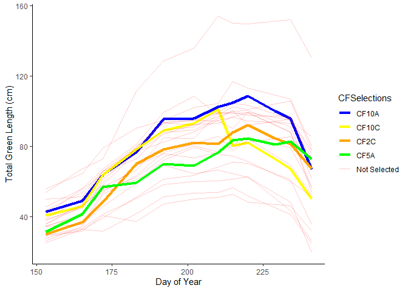

Graph to help in selecting tussocks for harvest
================
Bjorn Larson
2022-07-12

Reading in data

``` r
green_data <- read.csv("Total Green Length.csv")%>%
  mutate(across(1:9, as.factor))
```

Adding in some factors like “happiness” and selections of tussocks

``` r
selections <- green_data%>%
  filter(Loc == "TL")%>%
  mutate(Tussock = paste0(Plot, Ind),
         Selected = as.factor(if_else(Tussock %in% c("SG2C", "SG3A", "SG14B"), "Yes", "No")),
         Happy = as.factor(if_else(Tussock %in% c("SG3C", "SG3A", "SG8C", "SG8B", "SG10A", "SG10C", "SG11A", "SG11B", "SG11C", "SG14A", "SG14B"), "Happy", "Sad")),
         SGSelections = as.factor(if_else(Tussock %in% c("SG3A", "SG3c", "SG11A", "SG11B", "SG11C", "SG14A", "SG14B", "SG10A", "SG10C", "SG8B", "SG8C"), Tussock, "Not Selected")),
         TLSelections = as.factor(if_else(Tussock %in% c("TL5A", "TL2A", "TL2B", "TL8A", "TL8C", "TL17A", "TL17C", "TL19A", "TL19C"), Tussock, "Not Selected")),
         CFSelections = as.factor(if_else(Tussock %in% c("CF10A", "CF10C", "CF2C", "CF5A"), Tussock, "Not Selected")))
```

Graphing the selected tussocks

``` r
CF_selections <- selections%>%
  filter(Src == "CF")%>%
  filter(OTC == 0)

ggplot(CF_selections)+
  geom_line(aes(x = DoY, y = tot_Gr, group = Tussock, color = CFSelections, size = CFSelections, alpha = CFSelections))+
  scale_color_manual(values = c("Blue", "Yellow", "orange", "Green", "Red"))+
  scale_size_manual(values = c(1.5, 1.5, 1.5, 1.5, 0.4))+
  scale_alpha_manual(values = c(1, 1, 1,1, 0.2))+
  theme_classic()+
  labs(x = "Day of Year", y= "Total Green Length (cm)")
```

<!-- -->
